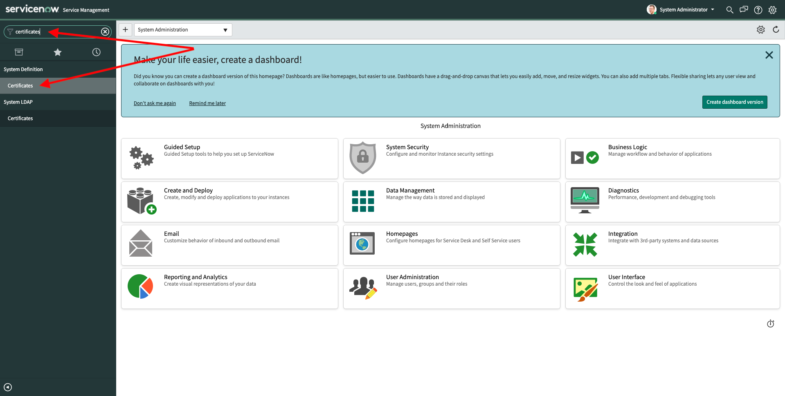
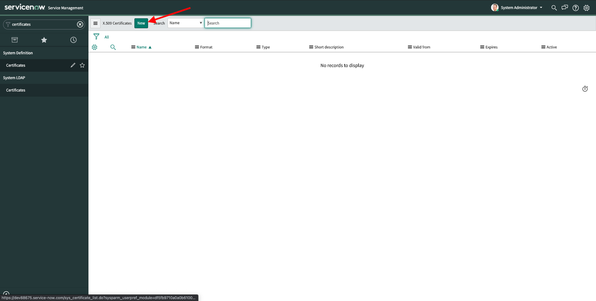
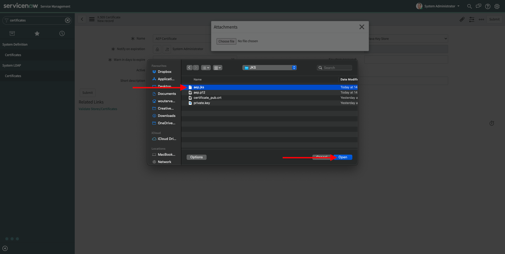
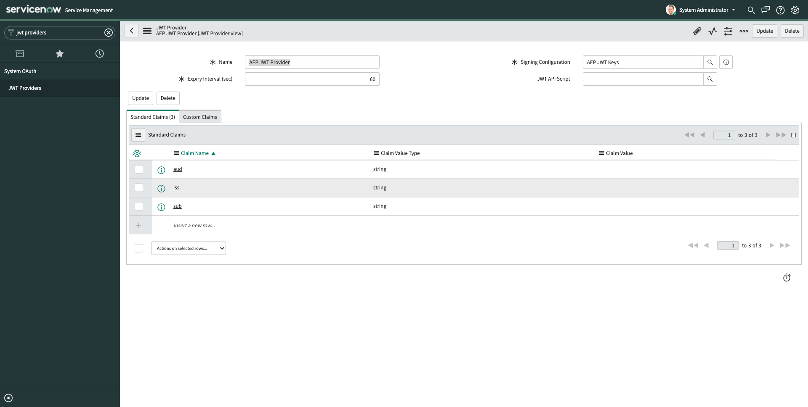

# 19.3 Setup your ServiceNow environment

>[!NOTE] 
>
>The below implementation steps are inspired by the documentation that is available on the ServiceNow portal. You can find that documentation [here](https://docs.servicenow.com/bundle/orlando-servicenow-platform/page/administer/integrationhub-store-spokes/task/setup-aep-spoke.html). However, please follow the below steps instead.

First of all, make sure you're successfully logged in to your ServiceNow instance.

## 19.3.1 Certificates

In this step, you need to attach a valid Java Key Store. You created this Java Key Store in the previous exercise, the name of the Java Key Store file you created is **aep.jks**.

In ServiceNow, in the Filter Navigator, enter the search term **Certificates**. Click **Certificates** under **System Definition**.

You'l then see this. Click **New**.

You'll then see an empty form. Fill out the form fields as follows:

- Name: **AEP Certificate**
- Format: **PEM**
- Type: open the dropdown and select **Java Key Store**.

(for the other fields, keep the default selection)

After selecting **Java Key Store**, you'll then see this. Click the **attachment** icon in the top right side of your screen.

In the popup, click **Choose file**.

In the popup, navigate to the folder **JKS** on your desktop and select the file **aep.jks**. Click **Open**.

You'll then see this, click the **X** to close the popup.

Next, enter the Java Key Store password in the field **Key Store Password**.

Next, click **Validate Stores/Certificates**.

You should then see the message **Valid key_store**.

The Java Key Store certificate is now attached to your ServiceNow instance.

## 19.3.2 JWT Keys

You'll now create a JSON Web Token (JWT) signing key to assign to your Java Key Store certificate.

In ServiceNow, in the Filter Navigator, enter the search term **JWT Keys**. Click **JWT Keys**.

You'll then see this. Click **New**.

You'll then see an empty form. 

Fill out the form fields as follows:

- Name: **AEP JWT Keys**
- Signing Keystore: select the certificate that you attached in the previous step, named **AEP Certificate**
- Signing Key Password: enter the Java Key Store password that you entered when creating the Java Key Store in exercise 19.2

(for the other fields, keep the default selection)

You should now have this:

Click **Submit**. You'll be redirected to the **JWT Keys** overview.

Your JWT key is created and assigned to your JKS certificate.

## 19.3.3 JWT Providers

You'll now add a JSON Web Token (JWT) provider to your ServiceNow instance.

In ServiceNow, in the Filter Navigator, enter the search term **JWT Providers**. Click **JWT Providers**.

You'll then see this. Click **New**.

You'll then see an empty form. 

Fill out the form fields as follows:

- Name: **AEP JWT Provider**
- Signing Configuration: select the JWT Key you created in the previous step, which was named **AEP JWT Keys**

(for the other fields, keep the default selection)

Next, right-click on the form header as indicated in the screenshot. Click **Save**.

You'll then see this.

You now need to update the values for **iss**, **sub** and **aud**. You can find these in your Adobe I/O project.

Go to your Adobe I/O project, which should still be open in another browser tab, and click **Generate JWT**.

You'll then see this. In the **JWT Payload**, you'll find the values you need to enter in ServiceNow.

Enter those values into the ServiceNow JWT Provider screen, as indicated below.

- aud: **https://ims-na1.adobelogin.com/c/f2bea01fc9414913bae8e0564e6c81cd** (this URL is used to authenticate to Adobe I/O and references your Client ID)

- iss: **A71C5A0C536804740A490D44@AdobeOrg** (this is your IMS Org ID)

- sub: **CF2377955F96EBC90A495E88@techacct.adobe.com** (this is the Technical Account ID of your Adobe I/O project)

You should now have this.

Next, right-click on the form header as indicated in the screenshot. Click **Save**.

After saving, click **Custom Claims** as indicated in the above screenshot. You'll then see this.

Double-click in every column on the row that has the text **Insert a new row...**.

Enter the following values:

- Claim Name: **https://ims-na1.adobelogin.com/s/ent_dataservices_sdk**
- Claim Value Type: **true|false**
- Claim Value: **true**

You should now have this. Click **Update** to save your changes.

The JWT provider is added to your ServiceNow instance.

## 19.3.4 OAuth Provider

You'll now register Adobe Experience Platform as an OAuth provider and allow the instance to request OAuth 2.0 tokens.

In ServiceNow, in the Filter Navigator, enter the search term **Application Registry**. Click **Application Registry**.

You'll then see this. Click **New**.

Click **Connect to a third party OAuth Provider**.

You'll then see an empty form. 

Fill out the form fields as follows:

- Name: enter **AEP OAuth**
- Client ID: copy/paste the **Client ID** from your Adobe I/O project
- Client Secret: copy/paste the **Client Secret** from your Adobe I/O project

  FYI: you can find your Client ID and Client Secret here, in your Adobe I/O project.

  

- OAuth API Script: select **OAuthUtilAEP**
- Default Grant type: select **JWT Bearer**
- Token URL: enter **https://ims-na1.adobelogin.com/ims/exchange/jwt/** (FYI, to change the Token URL, you need to unlock the field Token URL first by clicking the lock-icon on the right side of the field, as indicated in the above screenshot
- Send Credentials: **In Request Body (Form URL-encoded)**

(for the other fields, keep the default selection)

You should now have this. 

Next, right-click on the form header as indicated in the screenshot. Click **Save**.

After clicking **Save**, you'll see this error message:

**Your configuration has missing JWT provider records in one or more entity profiles : AEP OAuth default_profile. A JWT provider record must be mapped to the entity profile record when grant type is JWT Bearer.**

That's normal, and you'll update the configuration now to fix that.

Scroll down and click the field **AEP OAuth default_profile** as indicated below.

You'll then see this.

In the field **JWT Provider**, select the JWT Provider you created before, which is named **AEP JWT Provider**. Then, click **Update**.

After clicking **Update**, you'll be back on the OAuth Provider screen, and the error message that was there is now gone. Click **Update** to save your changes.

Your ServiceNow instance can now request OAuth 2.0 tokens for the spoke.

## 19.3.5 Credential Records

In ServiceNow, in the Filter Navigator, enter the search term **Credentials**. Click **Credentials**.

You'll then see this. You now need to create two credential records, one for **Data Inlet** and another one for **Data Ingestion**.

### AEP_Ingestion

Click **New**.

Click **OAuth 2.0 Credentials**.

You'll then see an empty form. 

Fill out the form fields as follows:

- Name: **AEP_Ingestion**
- OAuth Entity Profile: select **AEP OAuth default_profile**

(for the other fields, keep the default selection)

You should now have this.

Next, right-click on the form header as indicated in the screenshot. Click **Save**.

You'll then see this. The error message is expected. To fi the error message, click **Get OAuth Token**.

You'll then see this popup which should have the message **OAuth token flow completed successfully**.

### AEP

Click **New**.

Click **OAuth 2.0 Credentials**.

You'll then see an empty form. 

Fill out the form fields as follows:

- Name: **AEP**
- OAuth Entity Profile: select **AEP OAuth default_profile**

(for the other fields, keep the default selection)

You should now have this.

Next, right-click on the form header as indicated in the screenshot. Click **Save**.

You'll then see this. The error message is expected. To fix the error message, click **Get OAuth Token**.

You'll then see this popup which should have the message **OAuth token flow completed successfully**.

The credential records for the Adobe Experience Platform spoke are now created in your ServiceNow instance, and ServiceNow is now able to successfully authenticate against Adobe I/O and can now interact with Adobe Experience Platform.

## 19.3.6 Connection Records

In ServiceNow, in the Filter Navigator, enter the search term **Connection & Credential Aliases**. Click **Connection & Credential Aliases**.

You'll then see this. You'll see two existing connection records already, **AEP** and **AEP_Ingestion**.

Next, open the connection record named **AEP** by clicking it.

You'll then see this. 

In the **Connections** tab, click **New**. You'll then see a blank **HTTP(s) Connection** form.

Fill out the form fields as follows:

- Name: **AEP Platform**
- Credential: select **AEP**
- Connection URL: enter **https://platform.adobe.io/** 
- **Attributes** Sandbox: enter the name of your Adobe Experience Platform (do not enter the ID of your sandbox). Your sandbox is `--aepSandboxId--`.
- **Attributes** API Key: paste your Adobe I/O integration's API Key, in this case: **f2bea01fc9414913bae8e0564e6c81cd**
- **Attributes** Organization ID: enter the IMS Org ID of your Adobe Experience Platform instance, in this example: **A71C5A0C536804740A490D44@AdobeOrg**

>[!NOTE] 
>
>For the field **Connection URL**, you might need to fill out another value if your Adobe Experience Platform instance is hosted in a specific datacenter. If your instance is hosted in the datacenter in The Netherlands, the Connection URL should be set to **https://platform-nld2.adobe.io/**. If your instance is hosted in the datacenter in Australia, the Connection URL should be set to **https://platform-aus5.adobe.io/**.

Your HTTP(s) Connection form should now look like this:

Right-click the form header and then, click **Save**.

Click the **back** button.

You'll then see that your HTTP(s) Connection is added to the Connection form. Click the **back** button.

You'll then be back here:

Next, open the connection record named **AEP_Ingestion** by clicking it.

You'll then see this. 

In the **Connections** tab, click **New**. You'll then see a blank **HTTP(s) Connection** form.

Fill out the form fields as follows:

- Name: **AEP dcs**
- Credential: select **AEP_Ingestion**
- Connection URL: enter **https://dcs.adobedc.net** 
- **Attributes** Sandbox: enter the name of your Adobe Experience Platform (do not enter the ID of your sandbox). Your sandbox is `--aepSandboxId--`.
- **Attributes** Organization ID: enter the IMS Org ID of your Adobe Experience Platform instance, in this example: **A71C5A0C536804740A490D44@AdobeOrg**

Your HTTP(s) Connection form should now look like this:

Right-click the form header and then, click **Save**.

Click the **back** button.

You'll then see that your HTTP(s) Connection is added to the Connection form. Click the **back** button.

You've now finished setting up the integration between Adobe Experience Platform and ServiceNow.

Next Step: [19.4 Setup your ServiceNow UI](./ex4.md)

[Go Back to Module 19](./call-center-servicenow.md)

[Go Back to All Modules](./../../overview.md)
