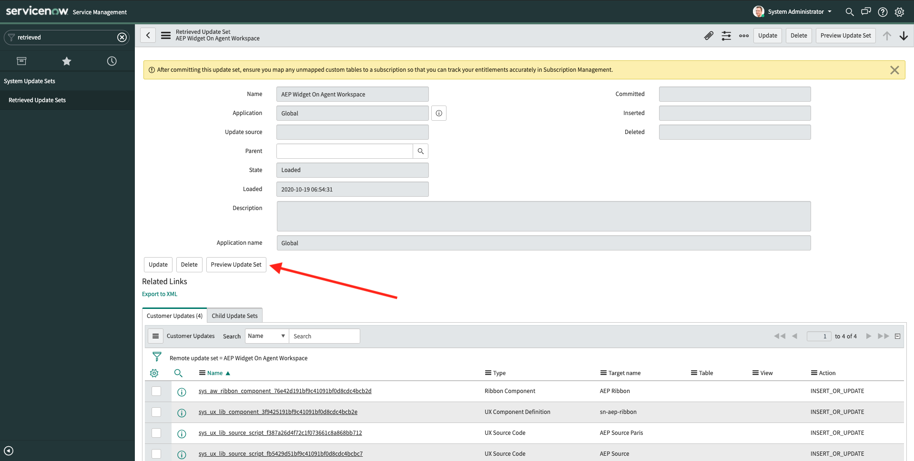
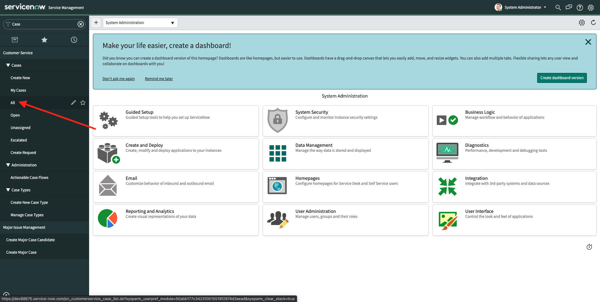
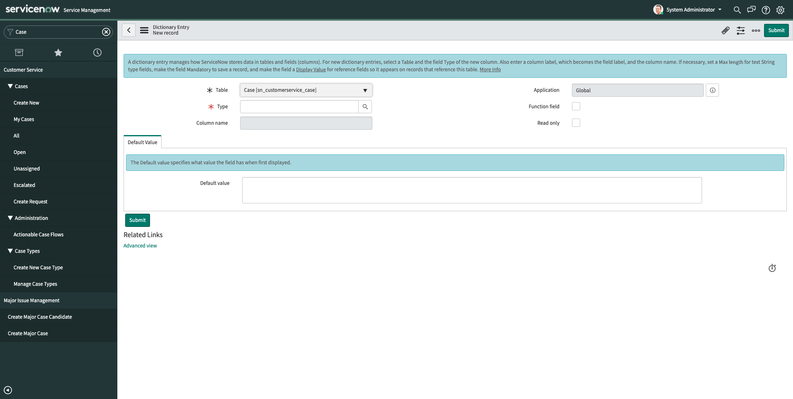
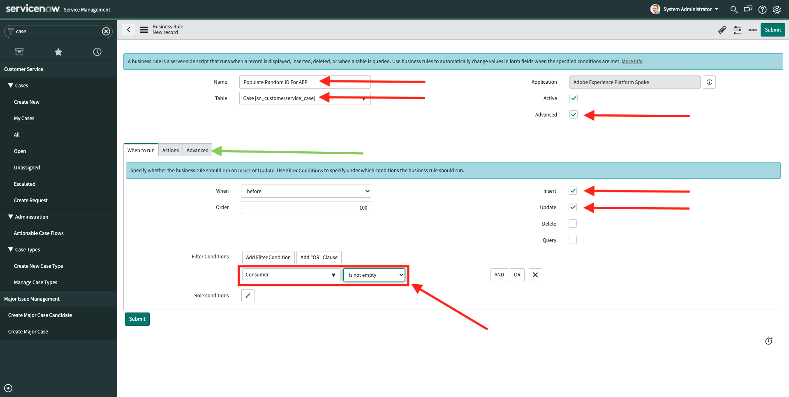

# 19.4 Setup your ServiceNow UI

## 19.4.1 Import XML templates

You'll now import two predefined XML templates which will help speed up the implementation process in ServiceNow by loading a number of predefined settings.

First of all, download the required XML templates which you can find [here](./../../assets/servicenow/AEP-ServiceNow-Integration.zip) to the desktop of your computer and unzip it.


In that directory, you'll now have two XML template files:

- AEPWidget.xml
- CSM-AEP-E2E-Flow.xml

These two files need to be imported in ServiceNow.

In ServiceNow, in the Filter Navigator, enter the search term **Retrieved Update Sets**. Click **Retrieved Update Sets**.


You'l then see this. Click **Import Update Set from XML**.


You'll then see this. Click **Choose File**.


In the popup, navigate to the folder on your desktop and select the file **AEPWidget.xml**. Click **Open**.


Next, click **Upload**.


You'll then see this. Click **Import Update Set from XML** again.


You'll then see this. Click **Choose File**.


In the popup, navigate to the folder on your desktop and select the file **CSM-AEP-E2E-Flow.xml**. Click **Open**.


Next, click **Upload**.


You'll then see this. You've now imported both XML files.


## 19.4.2 Preview and Commit Update Sets

Next, you need to preview and commit the XML Update Sets that you just uploaded.


Click the Update Set **AEP Widget on Agent Workspace** to open it. 

You'll then see this. Click **Preview Update Set**.



You'll then see a similar popup after a couple of seconds. The error message is expected. Click **Close**.


Click **Accept remote update**.


You'll then see this. Click **Commit Update Set**.


You'll then see another popup. Wait until it completes and then, click **Close**.


You'll then be back on the overview screen of your Retrieved Update Set. Click the **back** button to go back to all Retrieved Update Sets.


You'll then see this. Click the Update Set **E2E CSM+AEP Integration** to open it.


You'll then see this. Click **Preview Update Set**.


You'll then see a similar popup after a couple of seconds. Click **Close**.

You might get an error message. In that case, be sure to click **Accept remote update** on every error, just like you did in the previous exercise.


You'll then see this. Click **Commit Update Set**.


You'll then see another popup. Wait until it completes and then, click **Close**.


You'll then be back on the overview screen of your Retrieved Update Set. Click the **back** button to go back to all Retrieved Update Sets.


## 19.4.3 Create Adobe-specific fields in ServiceNow Case table

In ServiceNow, in the Filter Navigator, enter the search term **Case**. Click **All**.



You'l then see this. 


Right-click on the Table header as indicated. Go to **Configure** > **Table**.


You'll then see this. Click **New**.


You'll then see an empty form.



Fill out the form fields as follows:

- Type: **String**
- Column label: **Timestamp for AEP**
- Column name: **u_timestamp_for_aep**
- Max Length: 100

When the above form fields are filled out, right-click on the form header and click **Save**.


Next, click the **back** button as indicated below.


You'll then see this. Click **New**.


You'll then see an empty form.


Fill out the form fields as follows:

- Type: **String**
- Column label: **ID for AEP**
- Column name: **u_id_for_aep**
- Max Length: 100

When the above form fields are filled out, right-click on the form header and click **Save**.


Next, click the **back** button as indicated below.


Your form fields are now defined, you can now continue with setting up the business rules needed to populate those fields.

## 19.4.4 Create Adobe-specific business rules in ServiceNow Case table

In ServiceNow, in the Filter Navigator, enter the search term **Case**. Click **All**.


Right-click on the table headers. You'll then see a menu appear. Navigate to **Configure** > **Business Rules**.


You'll then see this. Click **New**.


You'll then see this.


Fill out the form fields as follows:

- Name: **Populate Random ID For AEP**
- Table: **Case [sn_customerservice_case]**
- Check the checkbox for **Advanced**
- In **When to run**, make sure to:
  - Check the checkbox for **INSERT**
  - Check the checkbox for **UPDATE** 
  - Set the Filter Condition to **Consumer** is not empty

You should now have this. Go to **Advanced** (green arrow).



In the **Script** form, enter the following code:

```javascript
(function executeRule(current, previous /*null when async*/) {

  var randNumber = (Math.floor(Math.random() * 100000000000) + 1).toString();
    current.u_id_for_aep = randNumber;

})(current, previous);
```

Click **Submit**.


You'll then be back here. Click **New** again.


You'll then see this.


Fill out the form fields as follows:

- Name: **Populate Timestamp For AEP**
- Table: **Case [sn_customerservice_case]**
- Check the checkbox for **Advanced**
- In **When to run**, make sure to:
  - Check the checkbox for **INSERT**
  - Check the checkbox for **UPDATE** 
  - Set the Filter Condition to **Consumer** is not empty

You should now have this. Go to **Advanced** (green arrow).


In the **Script** form, enter the following code:

```javascript
(function executeRule(current, previous /*null when async*/) {

  current.u_timestamp_for_aep =  new Date().toISOString();

})(current, previous);
```

Click **Submit**.


## 19.4.5 Enable Adobe Experience Platform Ribbon on Consumer Overview

You now need to run a script to ensure that a specific component will be shown on the Consumer Case Overview.

In ServiceNow, in the Filter Navigator, enter the search term **Scripts - Background**. Click **Scripts - Background**.


You'l then see this.


Copy the below code and paste it in the **Run Script** input form.

```javascript
var grSULSS = new GlideRecord('sys_ux_lib_source_script');
if (grSULSS.get('5acc97d956dc670d624ef4a31f70b919')) {
  grSULSS.inner_components = "223be0881a4988fcbe7112c23bf93c75,38a40eb364f0ac980c697fa64444f1e8,c817fad3b052fbd2443137d58b9b5024,3f9425191bf9c41091bf0d8cdc4bcb2e";
  grSULSS.update();
}
```


Click **Run script**. You'll then see this.


You've now defined all the required components to visualize Adobe Experience Platform data in the ServiceNow User Interface, and in the other direction, to send case data from ServiceNow into Adobe Experience Platform.

Next Step: [19.5 Setup your ServiceNow Flow](./ex5.md)

[Go Back to Module 19](./call-center-servicenow.md)

[Go Back to All Modules](./../../overview.md)
