# 19.6 Prepare End-to-end Demo

For the end-to-end demo in the next exercise, you'll be using the demo website from the URL [https://public.aepdemo.net](https://public.aepdemo.net).

On that website, you'll create your account as part of the demo script and when that happens, that same account needs to be created in ServiceNow. To do that, the website will use the [ServiceNow REST API](https://docs.servicenow.com/bundle/paris-application-development/page/integrate/inbound-rest/concept/consumer-api.html#consumer-api). To make that possible, you need to enable a CORS rule in ServiceNow to allow communication from the URL [https://public.aepdemo.net](https://public.aepdemo.net), and you'll have to update your Configuration ID with your ServiceNow connection variables.

## 19.6.1 ServiceNow CORS setup 

In ServiceNow, in the Filter Navigator, enter the search term **Cors**. Click **CORS Rules**. 

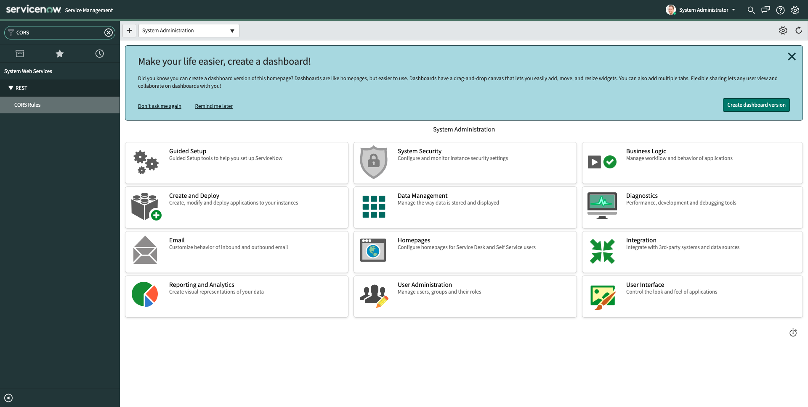

You'll then see this. Click **New**.

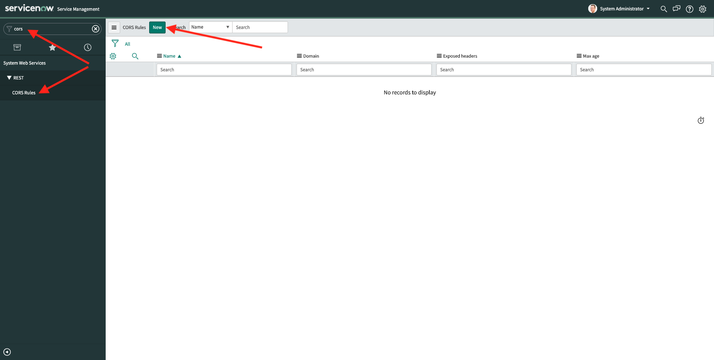

You'll then see an empty CORS Rule form. 

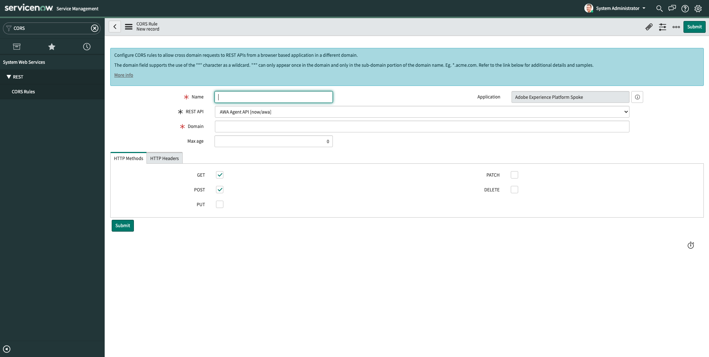

Fill out the fields as follows:

- Name: **public.aepdemo.net**
- REST API: **Consumer [now/consumer]**
- Domain: https://public.aepdemo.net
- Enable the checkboxes for **GET** and **POST**

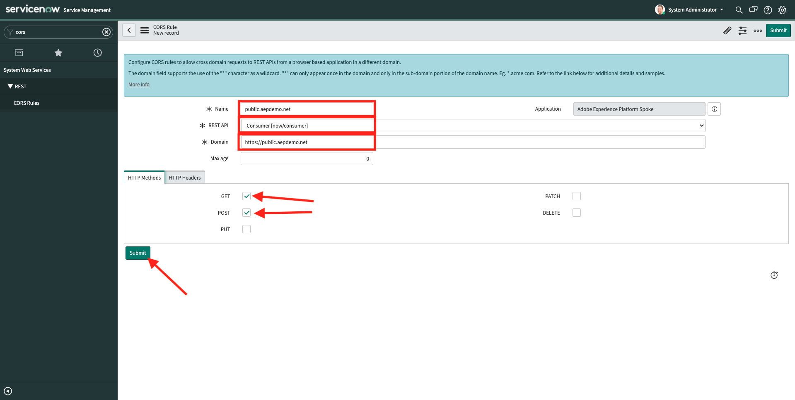

Click **Submit** to save your changes.

## 19.6.2 Update your Configuration ID

Before you can test your end-to-end demonstration, you'll need to update your Configuration ID settings and update the fields for **ServiceNow Instance URL**, **ServiceNow Username** and **ServiceNow Password** on the **Update Configuration ID** page of the AEP Demo website Admin pages.

Go to [https://public.aepdemo.net/admin_configuration_update.html](https://public.aepdemo.net/admin_configuration_update.html).

You'll then see this:

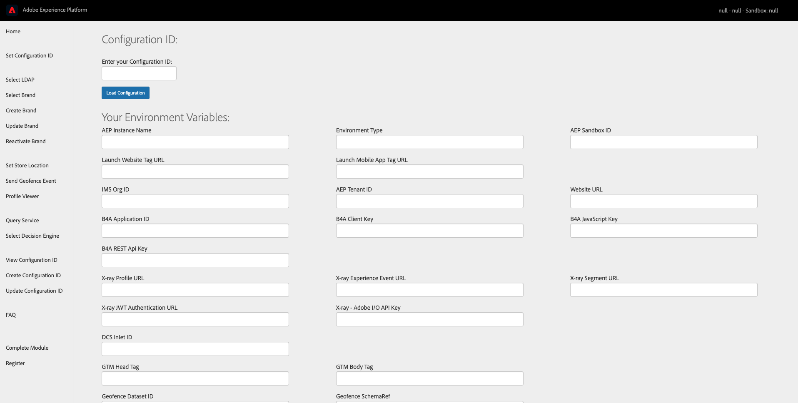

Enter your Configuration ID and then click **Load Configuration**. You'll see your Configuration ID values being loaded.

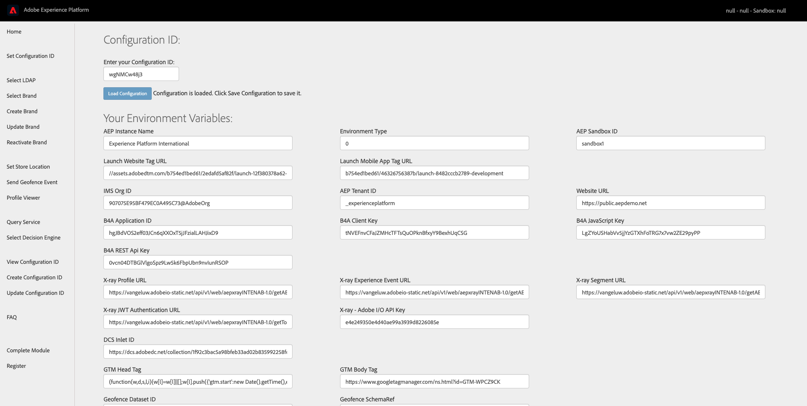

Scroll down until you see the fields **ServiceNow Instance URL**, **ServiceNow Username** and **ServiceNow Password**.

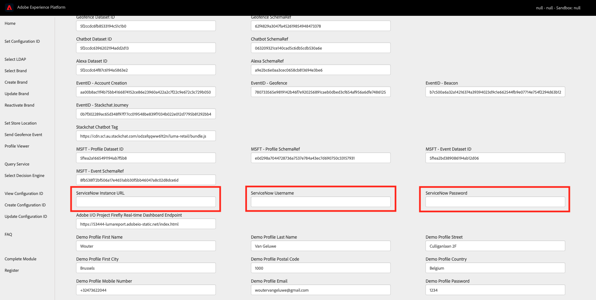

You now need to enter the values for these three fields.

- **ServiceNow Instance URL** can be found in the URL of your browser. The URL looks like this: **https://devXXXXX.service-now.com**.

  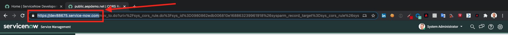

  Copy the ServiceNow Instance URL and paste it in the corresponding field on your Configuration ID update page. Add this to the URL: **/api/now/consumer**.

  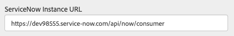

- **ServiceNow Username** should be **admin**. Enter **admin** in the corresponding field on your Configuration ID update page.

  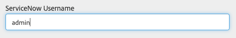

- **ServiceNow Password** is the password you entered in [Exercise 19.1.1](./ex1.md) when creating your ServiceNow developer instance. It was sent to you by email:

  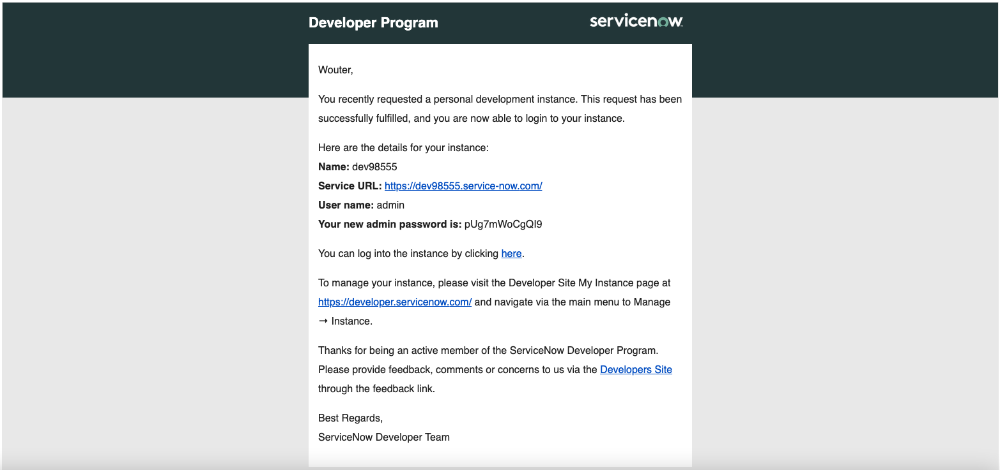
  
  Enter your admin password in the corresponding field on your Configuration ID update page.
  
  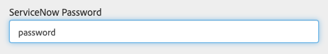
  
>[!NOTE]
>
>If you forgot your admin password, you can reset it by going to [https://developer.servicenow.com/dev.do#!/home](https://developer.servicenow.com/dev.do#!/home), click Manage on **Your Instance** and select **Reset admin password**.

  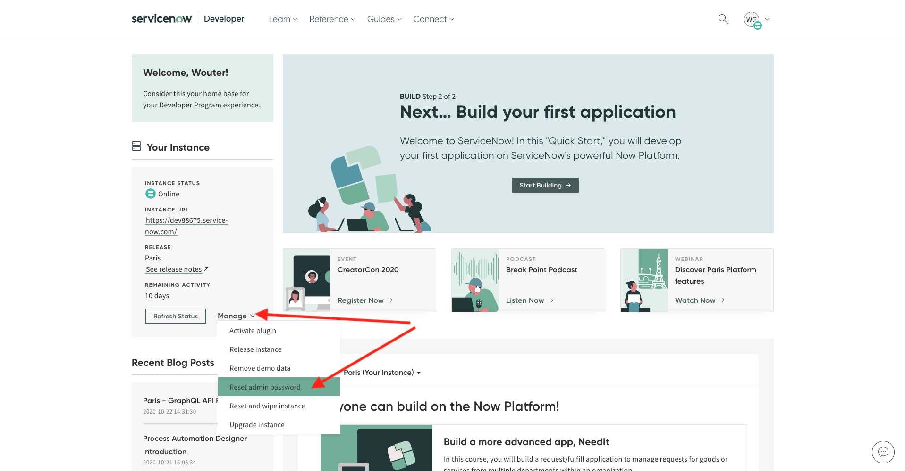

Next, on the Update Configuration ID page, scroll down and click **Update Configuration ID**.

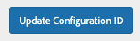

After this change, your Configuration ID is ready for the end-to-end demonstration!

Next Step: [19.7 End-to-end Demo](./ex7.md)

[Go Back to Module 19](./call-center-servicenow.md)

[Go Back to All Modules](./../../overview.md)
