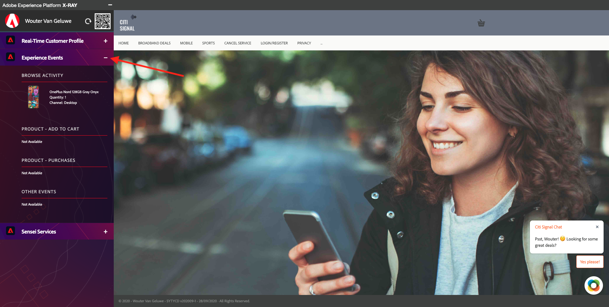

# 19.7 End-to-end Demo

## 19.7.1 Load website and brand

Open a new, clean incognito browser window and go to [https://public.aepdemo.net](https://public.aepdemo.net). 

You'll then see this. 

Enter your Configuration ID and click **Load Configuration**. Your configuration is then loaded.

Scroll down and click **Save Configuration**.

You'll then be redirected to the Admin homepage. Go to **Select LDAP**.

Select your LDAP and click **Save**.

You'll then be redirected to the Admin homepage. Go to **Select Brand**.

Select the brand **Citi Signal** and click **Save**.

You'll then be redirected to the Admin homepage. Click the **Citi Signal** logo.

## 19.7.2 Customer browses the website

You'll then see the Citi Signal homepage. Open the Xray panel.

Have a look at your Real-time Customer Profile, which is currently empty.

Have a look at your Experience Events, which are currently empty.

Scroll down on the website and click any product.

You'll then see the product page of the product you selected. Next, click **Home**.

On the homepage, open your Xray panel and have a look at your Experience Events. You can see that the product view was collected in real-time and is part of your Customer Profile in real-time.

On the homepage, go to **LOGIN/REGISTER**.

Fill out the form below. Make sure to use a unique email address and mobile phone number. Click **CREATE ACCOUNT**.

Back on the homepage, have a look at your Real-time Customer Profile, which is now populated with the data you just ingested.

Have a look at your Experience Events, which currently displays your product page view.

Next, go to the **Cancel Service** page.

Open your Xray panel again, and have a look at Sensei Services. You'll see an increased Churn Score.

## 19.7.3 Customer calls the call center

This customer now calls the call center, which is managed by ServiceNow. The Service Agent creates a new case at the start of the conversation with the customer.

Log in to your ServiceNow instance.

In ServiceNow, in the Filter Navigator, enter the search term **Agent Workspace**. Click **Agent Workspace Home**. 

You'll then see this. Click the **Lists** - icon.

You'll then see this. Click **New** to create a new case for the customer that is calling you.

You'll then see a new, empty case form.

First of all, you need to select the customer that's calling you. Enter the email address you used on the website in the previous step in the **Consumer** field. You'll see that this customer is available in ServiceNow already. Select this customer.

Fill out the case details as follows:

- Channel: **Phone**
- Call Feeling: make a choice (Positive - Neutral - Negative)
- Short Description: provide a short description of the reason of the call
- Priority: make a choice (1-2-3-4)

Finally, click **Save**.

You'll then see this. Please note the component **Customer Insights from AEP** which showcases the available customer churn score that was calculated in Adobe Experience Platform inside the ServiceNow user interface.

## 19.7.4 Verify data ingestion

Go back to your website. Open your Xray panel and have a look at your Experience Events. You should now see an Experience Event in **Other Events** that show the case details of the case you entered in ServiceNow.

Next Step: [Summary and benefits](./summary.md)

[Go Back to Module 19](./call-center-servicenow.md)

[Go Back to All Modules](./../../overview.md)
