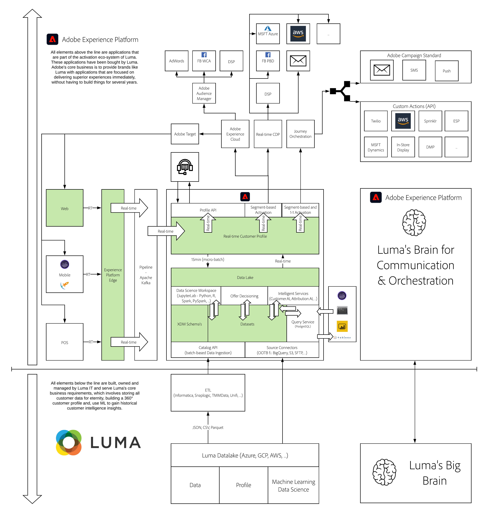

# 2. Foundation - Data Ingestion

**Author: [Wouter Van Geluwe](https://www.linkedin.com/in/woutervangeluwe/)**

In this module, the goal is to learn all about data ingestion. You'll learn about data ingestion in Streaming and Batch. You'll implement Streaming Data Ingestion by using Launch, so that the customer behavior on the Hands-On Lab website is streamed to Adobe Experience Platform in real-time. You'll learn about Batch Data Ingestion by using an Adobe Experience Platform Workflow to take a CSV-file, map it against an XDM-schema and then ingest it into Adobe Experience Platform. 

## Learning Objectives

- Learn how to create an XDM Schema in Adobe Experience Platform
- Learn how to create Datasets in Adobe Experience Platform
- Learn how to create a streaming endpoint and configure the Adobe Experience Platform extension in Launch
- Learn how to create Rules in Launch to stream data to Adobe Experience Platform
- Learn how to integrate Adobe Experience Platform Launch onto a webpage
- Learn how to use an Adobe Experience Platform Workflow to ingest a CSV-file into Adobe Experience Platform

## Prerequisites

- Access to Adobe Experience Platform: [https://experience.adobe.com/platform](https://experience.adobe.com/platform)
- Access to Adobe Experience Platform Launch: [https://experience.adobe.com/#/data-collection/](https://experience.adobe.com/#/data-collection/)
- Access to [https://public.aepdemo.net](https://public.aepdemo.net)
- Access to Postman

>[!IMPORTANT]
>
>This tutorial was created to facilitate a particular workshop format. It uses specific systems and accounts to which you might not have access. Even without access, we think you can still learn a lot by reading through this very detailed content. If you're a participant in one of the workshops and need your access credentials, please contact your Adobe representative who will provide you with the required information.

## Architecture Overview

Have a look at the below architecture, which highlights the components that will be discussed and used in this module.

## Sandbox to use

For this module, please use this sandbox: `--module2sandbox--`.

>[!NOTE]
>
>Don't forget to install, configure and use the Chrome Extension as referenced in [0.6 - Install the Chrome extension for the Experience League documentation](../module0/ex6.md)

## Exercises

[2.1 Explore the website](./ex1.md)

In this exercise, you'll explore the website that you'll use as part of this enablement.

[2.2 Configure Schemas and Set Identifiers](./ex2.md)

In this exercise, you'll configure the required XDM schema's to capture profile information and customer behavior. In every XDM schema, you'll also have to configure a primary identifier to link all the information to.

[2.3 Configure Datasets](./ex3.md)

In this exercise, you'll retrieve the required datasets to capture and store profile information and customer behavior.

[2.4 Data Ingestion from Offline Sources](./ex4.md)

In this exercise, you'll go on the website and mobile app and behave like a customer, streaming data to Platform.

[Summary and benefits](./summary.md)

Summary of this module and overview of the benefits.

>[!NOTE]
>
>Thank you for investing your time in learning all there is to know about Adobe Experience Platform. If you have questions, want to share general feedback of have suggestions on future content, please contact Wouter Van Geluwe directly, by sending an email to **vangeluw@adobe.com**.

[Go Back to All Modules](../../overview.md)
