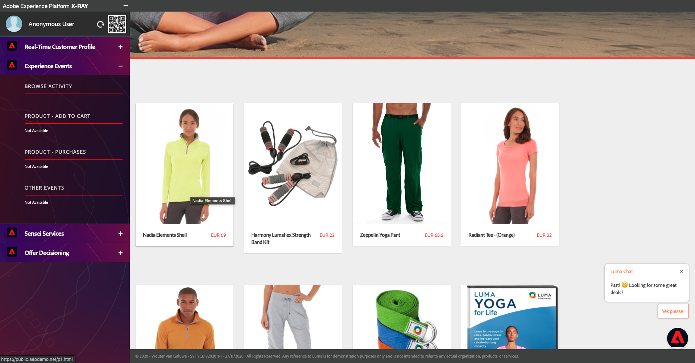
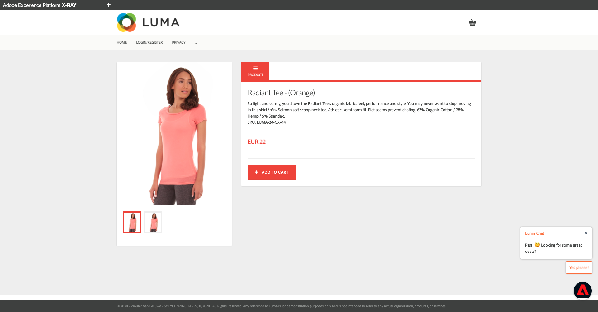
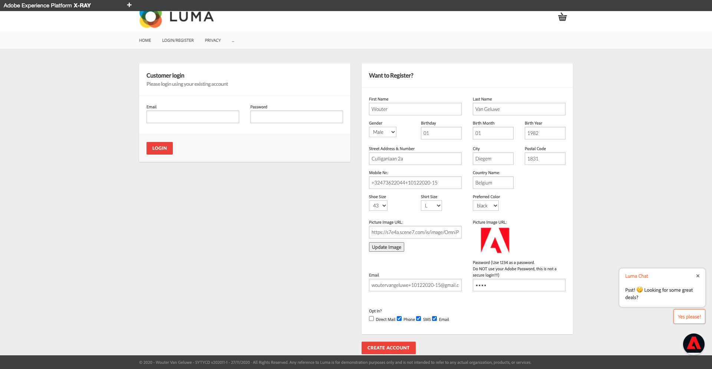

# 2.1 - From unknown to known on the website

## Context

The journey from unknown to known is one of the most important topics amongst brands these days, as is the customer journey from acquisition to retention. 

Adobe Experience Platform plays a huge role in this journey. Platform is the brains for communication, the experience system of record.

Platform is an environment in which the word **customer** is broader than just the **known**-customers. This is a very important thing to mention when speaking to brands: an unknown visitor on the website is also a customer from Platform's perspective and as such, all of the behavior as an unknown visitor is also sent to Platform. Thanks to that approach, when this customer eventually becomes a known customer, a brand can visualize what happened before that moment as well. This helps from an attribution and experience optimization perspective.

## What are you going to do

You will now ingest data into Adobe Experience Platform and that data will be linked to identifiers like ECIDs and email-addresses. The goal of this is to understand the business context of what you're about to do from a configuration perspective. In the next exercise, you'll start configuring everything you need to make all that data ingestion possible in your own sandbox environment.

### Customer Journey flow

For every demonstration, you'll need to use a fresh, incognito browser window. After opening a fresh, incognito browser window, go to [https://public.aepdemo.net/](https://public.aepdemo.net/).

* You'll be redirected to this page:

* Enter the Configuration ID you created in the previous step. Click **Load Configuration**.

* You'll then see this:

* Scroll down so you can see the **Save Configuration** button. Click **Save Configuration**.

* After a couple of seconds you'll be redirected to the Admin homepage and you'll see this:

* Go to **Select LDAP** in the left side menu, select your LDAP in the list and click **Save**.

* Go to **Select Brand** in the left side menu, select a brand of choice and click **Save**.

* You'll now see a similar Admin homepage. Click the brand logo to go to the demo website.

  
* Click the **Luma**-logo to go to the demo website. You'll then see this:
  

  
* Have a look at the X-ray panel and the Real-time Customer Profile:
  * **ECID** as the internal Adobe identifier
      

* You'll also see Experience Events

  
* Scroll down on the page until you see the products, click on the product **Nadia Elements Shell**.
  

  
* Have a look at the product. An Experience Event of type **Product View** has been sent by to Adobe Experience Platform. 
  

  
* Next, open the X-ray panel and have a look at your **Experience Events**.
  

  
* Go back to the **Home** page, and click another product. Another Experience Event has been sent to Adobe Experience Platform. 
  

  
* Open the X-ray panel. You'll now see 2 Experience Events of type **Product View**. While the behavior is anonymous, we're able to track every click and store it in in Adobe Experience Platform. Once the anonymous customer becomes known, we'll be able to merge all anonymous behavior automatically to the know profile.
  

* Go to the Register/Login page. Fill out your registration details and click **CREATE ACCOUNT**.
  

  
* After clicking **Create Account**, you'll be redirected to the homepage. Open the X-ray panel and go to Real-time Customer Profile. On the X-ray panel, you should see all of your personal data displayed.
  

* On the X-ray panel, go to Experience Events. You should see the 2 products that you viewed before on the X-ray panel.

  
You've now ingested data into Adobe Experience Platform and you've linked that data to identifiers like ECIDs and email-addresses. The goal of this is to understand the business context of what you're about to do. In the next exercise, you'll start configuring everything you need to make all that data ingestion possible.

Next Step: [2.2 Configure Schemas and Set Identifiers](./ex2.md)

[Go Back to Module 2](./data-ingestion.md)

[Go Back to All Modules](../../overview.md)
