# 2.2 Configure Schemas and Set Identifiers

In this exercise, you'll configure the required XDM schemas to classify profile information and customer behavior. In every XDM schema, you'll also have to configure a primary identifier to link all the information to.

The URL to login to Adobe Experience Platform is: [https://experience.adobe.com/platform](https://experience.adobe.com/platform)
 
## Story

Before you start configuring XDM Schema's and setting Primary Identifiers, we need to think about the business context of what we're trying to do: 

- You want data
- You want to link data to a customer
- You want to build a progressive, Real-time Customer Profile

There are 2 types of data that we want to capture:

- Who is this customer?
- What does this customer do?

However, the question **Who is this customer?** is a very open question that has many answers. When your company wants to see this question answered, you're looking for demographic information like First Name, Last Name and Address. But also for contact information like an Email Address or a Mobile Phone Number. And also for information linked to Language, OptIn/OptOut and maybe even Profile Pictures. And finally, what you really need to know, is how we'll be identifying this customer in the various systems that your company uses.

The same thing goes for the question **What does this customer do?**. It's a very open question with many answers. When your company wants to see this question answered, you're looking for any interaction a customer has has had with any of your online and offline properties. Which pages or products have been visited? Has this customer added a product to his cart or even purchased an item? What device and browser has been used to browse the website? What kind of information is this customer looking for and how can we use that to configure and deliver a delightful experience to this customer? And finally, what we really need to know, is how we'll be identifying this customer in the various systems that your company will use.

## 2.1.1 - Who is this customer

Capturing the answer to **Who is this customer?** for your company is done through the Login/Registration-page.

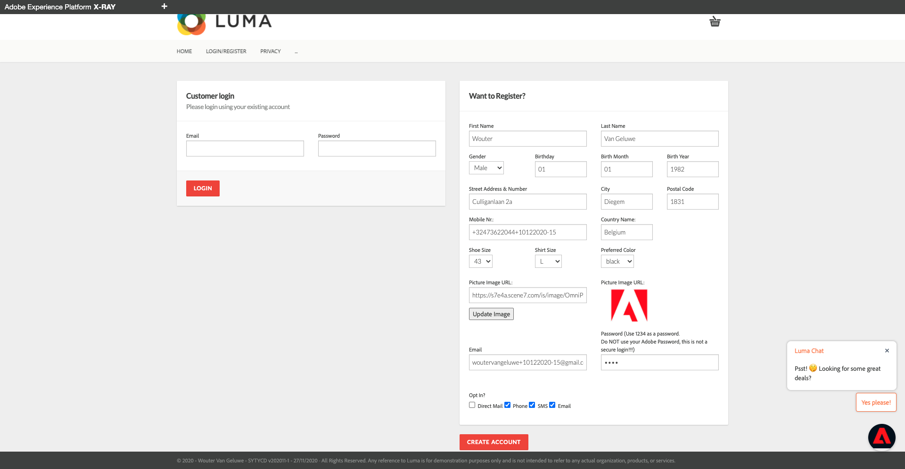

From a Schema perspective, we look at this as a **Class**. The question: **Who is this customer?** is something that we define in the Class **[!UICONTROL XDM Individual Profile]**.

So when you create an XDM Schema to capture the answer to **Who is this customer?**, first of all, you'll need to create and define 1 schema that references the class **[!UICONTROL XDM Individual Profile]**.

To specify what kind of answers can be given to that question, you'll need to define [!UICONTROL Field Groups]. [!UICONTROL Field Groups] are extensions of the Profile-class, and have very specific configurations. For instance, demographic information like First Name, Last Name, Gender and Birthday are part of the [!UICONTROL Field Group]: **[!UICONTROL Demographic Details]**.

Secondly, your company needs to decide how to identify this customer. In the case of your company, the main identifier for a known customer might be a specific customer ID, like for instance an email address. But technically, there are other ways of identifying a customer at your company, like using a mobile phone number.
In this lab, we'll define the email address as the primary identifier and the phone number as a secondary identifier.

Lastly, it's important to distinguish the channel on which data was captured. In this case, we'll be talking about Website Registrations and the schema that needs to be defined needs to reflect **where** the registration data was captured. The channel will also have an important role in influencing what data is captured. As such, it's a best practice to define schema's for every combination of channel, primary identifier and type of data collected.

Based on the above, you'll need to configure a Schema in Adobe Experience Platform.

Log in to Adobe Experience Platform by going to this URL: [https://experience.adobe.com/platform](https://experience.adobe.com/platform).

After logging in, you'll land on the homepage of Adobe Experience Platform.

Before you continue, you need to select a **sandbox**. The sandbox to select is named ``--module2sandbox--``. You can do this by clicking the text **[!UICONTROL Production Prod]** in the blue line on top of your screen.

After selecting the appropriate sandbox, you'll see the screen change and now you're in your dedicated sandbox.

In Adobe Experience Platform, click on **[!UICONTROL Schemas]** in the menu on the left side of your screen.

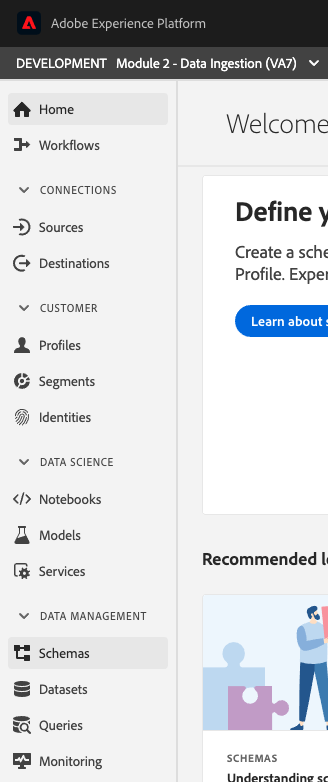

You'll see the list of available [!UICONTROL Schemas]. 

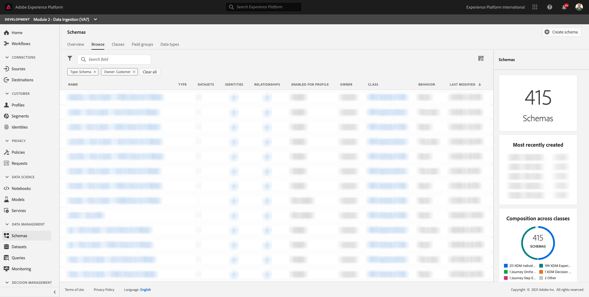

You should create a new schema. To create a new schema, click on the button **[!UICONTROL + Create Schema]** and select **[!UICONTROL XDM Individual Profile]**.

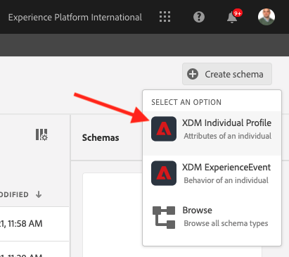

After clicking the **[!UICONTROL + Create Schema]** button, a new schema is created and you'll be prompted to select or create **field groups**. 

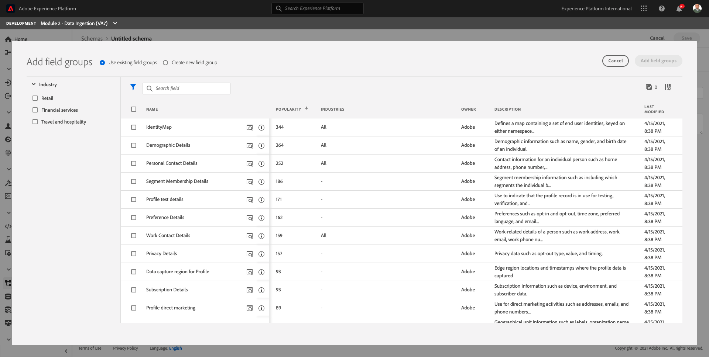

Now you need to define what an answer to the question **Who is this customer?** should look like.
In the introduction of this lab, we noted the need for following attributes to define a customer:

- Demographic information like First Name, Last Name and Address
- Contact information like a Home Address, Email Address or a Mobile Phone Number
- Other Information linked to Language, OptIn/OptOut and maybe even Profile Pictures. 
- Primary Identifier for a customer

To make that information part of your schema, you need to add the following [!UICONTROL Field Groups] to your schema:

- Demographic Details (Demographic Information)
- Personal Contact Details (Contact Information)
- Preference Details (Other Information)
- your company's custom Profile Identification Field Group (Primary and Secondary Identifiers)

In the **[!UICONTROL Add Field Group]** screen, select the [!UICONTROL Field Group] **[!UICONTROL Demographic Details]**, **[!UICONTROL Personal Contact Details]** and **[!UICONTROL Preference Details]**.

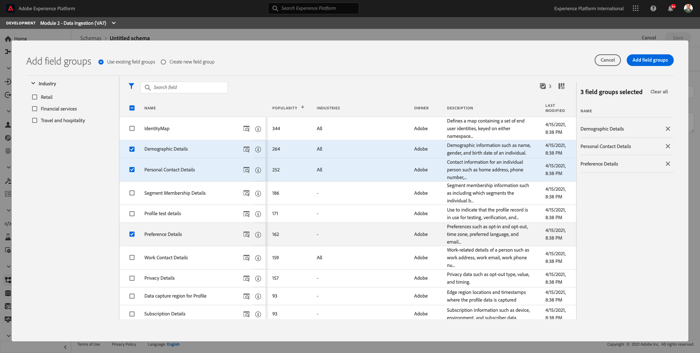

Click the **[!UICONTROL Add Field Groups]** button to add the [!UICONTROL Field Group] to your schema.

You'll now have this:

Next, you need a new [!UICONTROL Field Group] to capture the **[!UICONTROL Identifier]** used for data collection. As you've seen in the previous exercise, there's a concept of Primary and Secondary Identifiers. A Primary Identifier is the most important one, as all collected data will be linked to this Identifier.

You will now create your own custom [!UICONTROL Field Group] and as such, you'll be extending the [!UICONTROL XDM Schema] to meet your own company's requirements.

Click the **[!UICONTROL + Add]** button to start adding a [!UICONTROL Field Group].

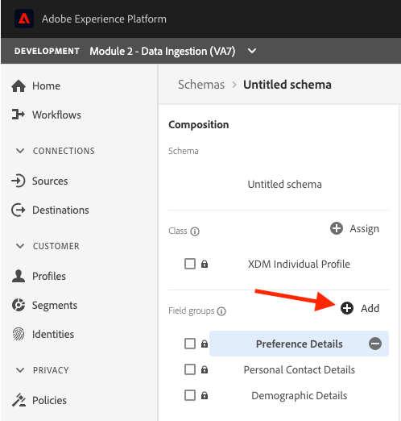

Instead of reusing an existing [!UICONTROL Field Group], you'll now create your own [!UICONTROL Field Group]. You can do that by selecting **[!UICONTROL Create New Field Group]**.

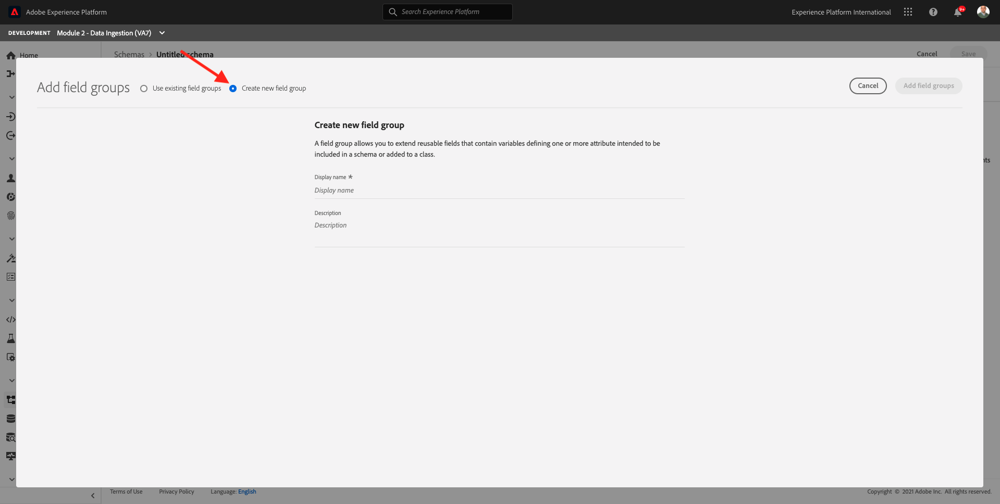

You now need to provide a **[!UICONTROL Display Name]** and **[!UICONTROL Description]** for your new [!UICONTROL Field Group]. 

As the name for our schema, we'll use this:

**[!UICONTROL ldap - Profile Identification Field Group]**

Replace **[!UICONTROL ldap]** by your specific ldap. As an example, for ldap **[!UICONTROL vangeluw]**, this should be the name of the schema:

**[!UICONTROL vangeluw - Profile Identification Field Group]**

That should give you something like this:

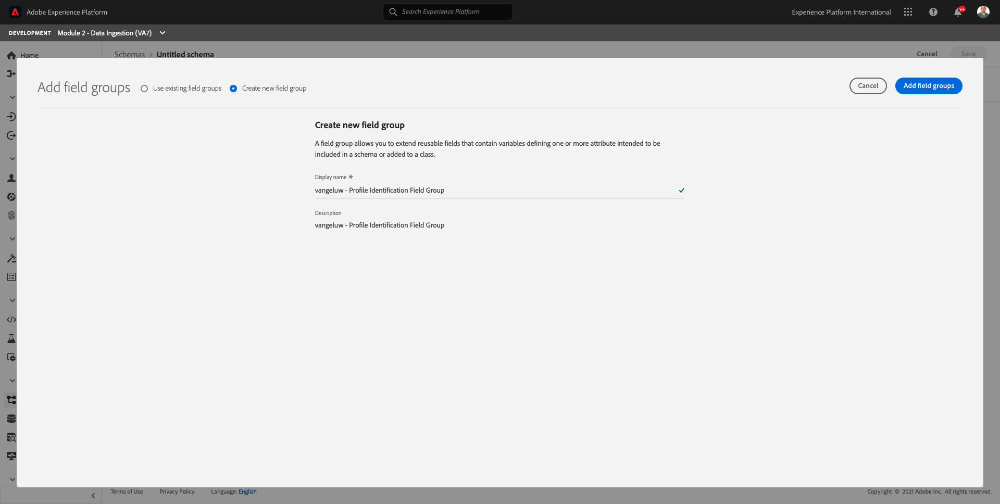

Click the **[!UICONTROL Add Field Groups]** button to add the newly created [!UICONTROL Field Group] to your schema.

You should now have this schema structure in place.

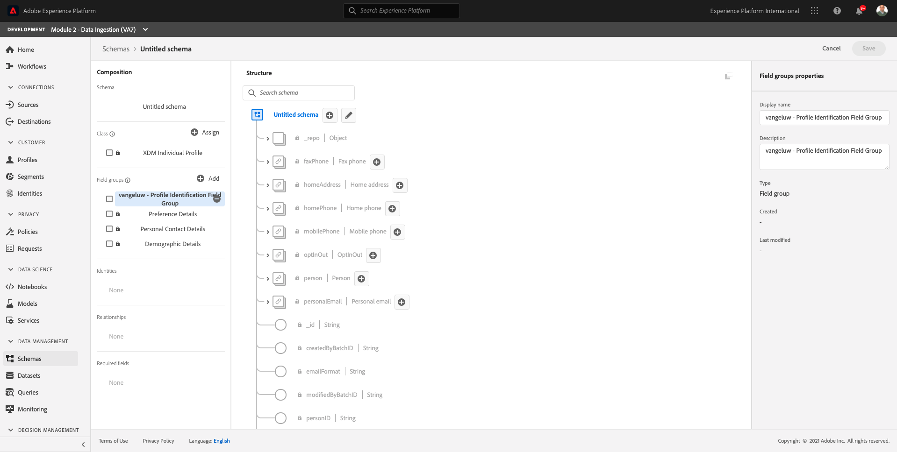

Your new [!UICONTROL Field Group] is still empty, so now you'll have to add fields to that [!UICONTROL Field Group].
In the [!UICONTROL Field Group]-list, click your custom [!UICONTROL Field Group].

You now see a number of new buttons appear.

On the top-level of your Schema, click the **[!UICONTROL + Add Field]** button.

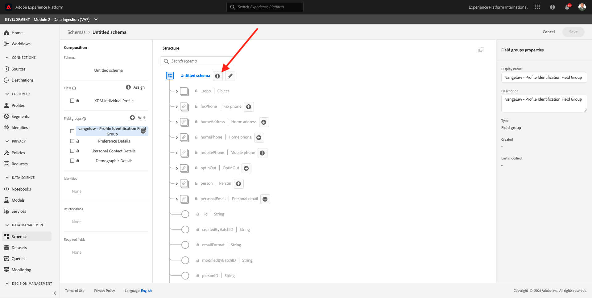

After clicking the **[!UICONTROL + Add Field]** button, you now see a new **[!UICONTROL object]** in your schema. This object represents a custom **[!UICONTROL object]** in your Schema and is named after your Adobe Experience Platform Tenant ID. Your Adobe Experience Platform tenant id is `--aepTenantId--`.

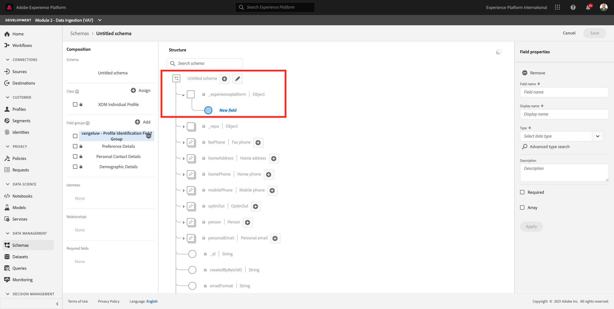

You'll now add a new object under that tenant. To do that, click the field **[!UICONTROL New Field]** under the tenant-object.

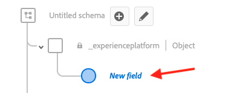

Use these object-definitions:

- Field name: **[!UICONTROL identification]**
- Display name:  **[!UICONTROL identification]**
- Type: **[!UICONTROL Object]**

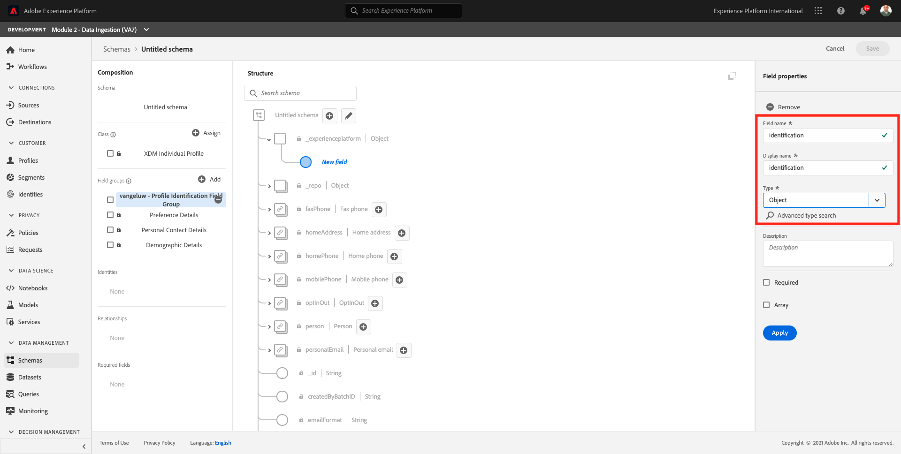

Click **[!UICONTROL Apply]** to save your changes.

After clicking **[!UICONTROL Apply]**, you now see your **[!UICONTROL identification]** object in the Schema.

You'll now add 3 new fields under the  **[!UICONTROL identification]** object:

- ecid:
  - Field name: **[!UICONTROL ecid]**
  - Display name:  **[!UICONTROL ecid]**
  - Type: **[!UICONTROL String]**

- emailId
  - Field name: **[!UICONTROL emailId]**
  - Display name:  **[!UICONTROL emailId]**
  - Type: **[!UICONTROL String]**
  
- mobilenr
  - Field name: **[!UICONTROL mobilenr]**
  - Display name:  **[!UICONTROL mobilenr]**
  - Type: **[!UICONTROL String]**

Each field will be defined as type **[!UICONTROL String]** and we'll configure these fields as **[!UICONTROL Identities]**. For the Schema **[!UICONTROL Website Registration Schema]**, we assume that a customer will always be identified by their email-address, which means that you have to configure the field **[!UICONTROL emailId]** as a **[!UICONTROL primary]** identifier, and the other fields as **[!UICONTROL secondary]** identifiers.

To add the fields, click the **[!UICONTROL +]** button next to the **[!UICONTROL identification]** object.

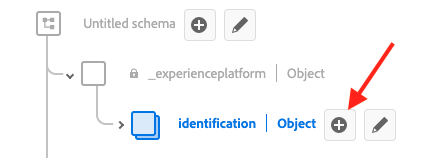

You now have an empty field. You need to configure the above 3 fields as indicated.

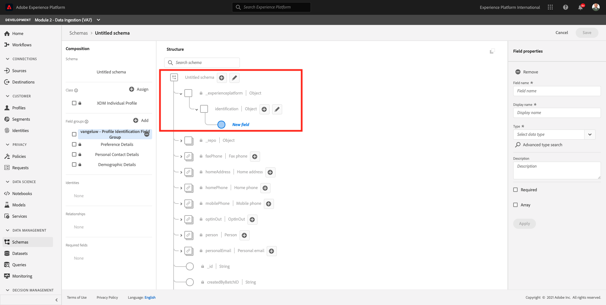

This is how each field should look after your initial field configuration.

Click the **[!UICONTROL +]** button next to the **[!UICONTROL identification]** object to create a new field and fill out the fields as indicated.

- ecid

To save your field, scroll down in the **[!UICONTROL Field Properties]** until you see the button **[!UICONTROL Apply]**. Click the **[!UICONTROL Apply]** button.

Click the **[!UICONTROL +]** button next to the **[!UICONTROL identification]** object to create a new field and fill out the fields as indicated.

- emailId

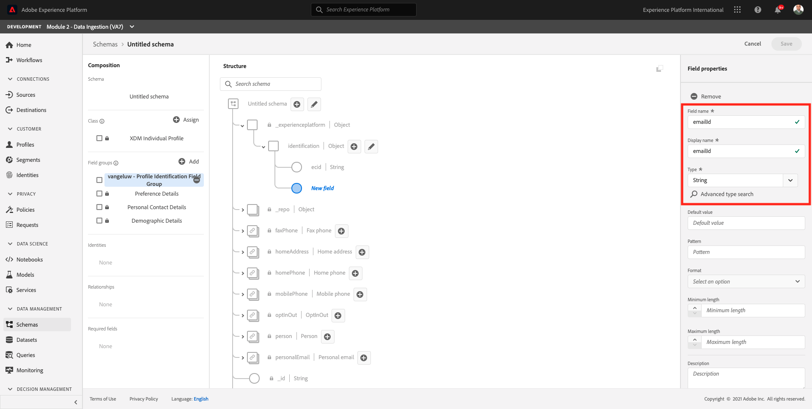

To save your field, scroll down in the **[!UICONTROL Field Properties]** until you see the button **[!UICONTROL Apply]**. Click the **[!UICONTROL Apply]** button.

Click the **[!UICONTROL +]** button next to the **[!UICONTROL identification]** object to create a new field and fill out the fields as indicated.

- mobilenr

To save your field, scroll down in the **[!UICONTROL Field Properties]** until you see the button **[!UICONTROL Apply]**. Click the **[!UICONTROL Apply]** button.

You now have 3 fields, but these fields haven't been defined as **[!UICONTROL Identity]**-fields yet.

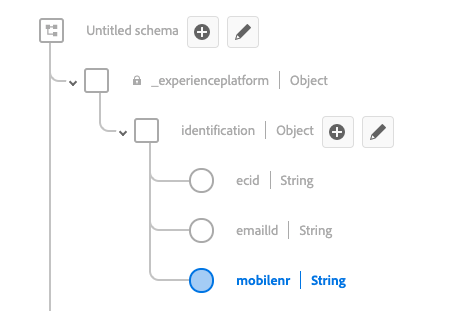

To start defining these fields as **[!UICONTROL Identity]**-fields, follow these steps:

- Select the field **[!UICONTROL emailId]**.
- On the right side, in the field properties, scroll down until you see **[!UICONTROL Identity]**. Check the checkbox for **[!UICONTROL Identity]**. 

  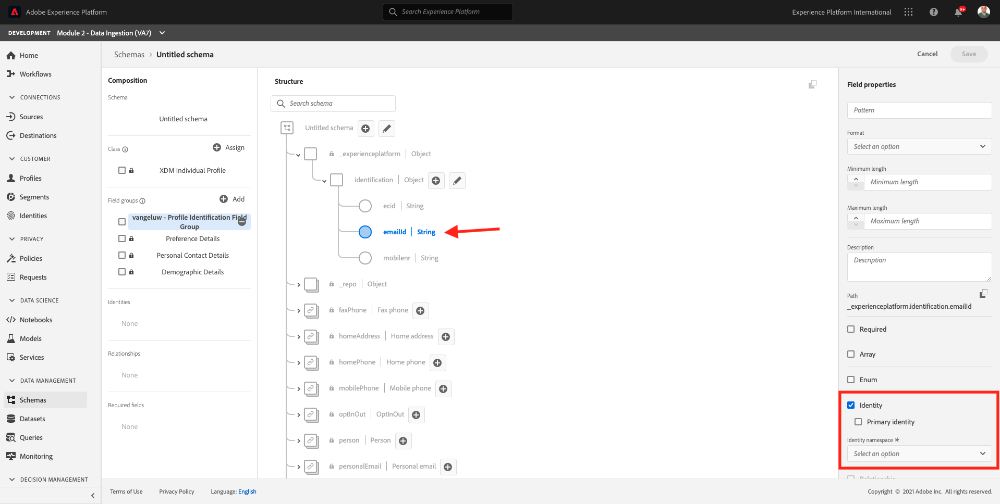

- Now check the checkbox for **[!UICONTROL Primary Identity]**.

  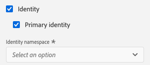
  
- Lastly, select the namespace **[!UICONTROL Email]** from the list of **[!UICONTROL Namespaces]**. A Namespace is used by the Identity Graph in Adobe Experience Platform to classify identifiers in namespaces and define the relationship between those namespaces.

  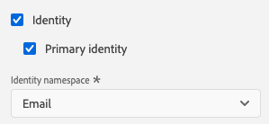

- Finally, click **[!UICONTROL Apply]** to save your changes.

  
  
Next, you have to define the other fields for **[!UICONTROL ecid]** and **[!UICONTROL mobilenr]** as secondary identifiers.

- Select the field **[!UICONTROL ecid]**.
- On the right side, in the field properties, scroll down until you see **[!UICONTROL Identity]**. Check the checkbox for **[!UICONTROL Identity]**. 

  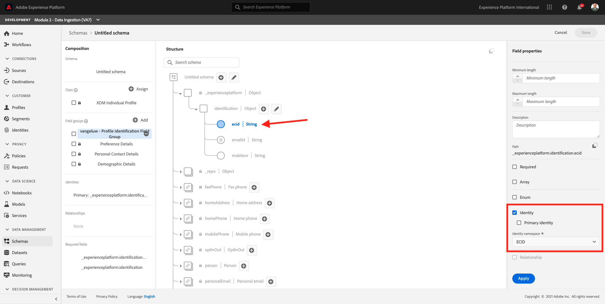

- Next, select the namespace **[!UICONTROL ECID]** from the list of **[!UICONTROL Namespaces]**. A [!UICONTROL Namespace] is used by the Identity Graph in Adobe Experience Platform to classify identifiers in namespaces and define the relationship between those namespaces.

  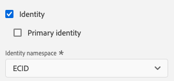

- Click **[!UICONTROL Apply]** to save your changes.

  

- Select the field **[!UICONTROL mobilenr]**.
- On the right side, in the field properties, scroll down until you see **[!UICONTROL Identity]**. Check the checkbox for **[!UICONTROL Identity]**. 

  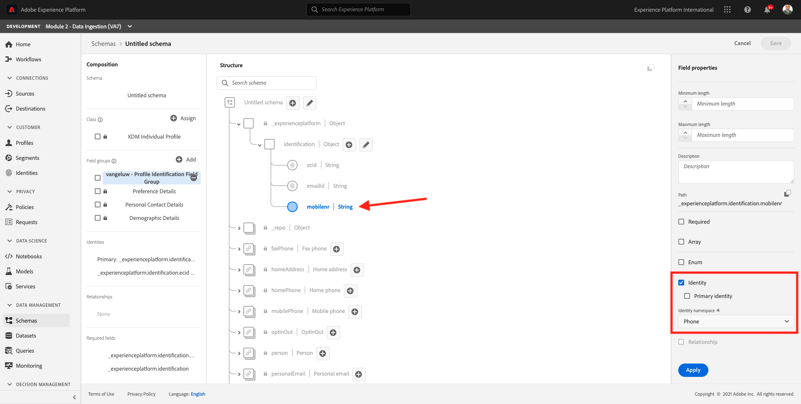

- Make sure to select the namespace **[!UICONTROL Phone]** from the list of **[!UICONTROL Namespaces]**. A Namespace is used by the Identity Graph in Adobe Experience Platform to classify identifiers in namespaces and define the relationship between those namespaces.

  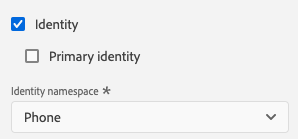

- Click **[!UICONTROL Apply]** to save your changes.

  

The **[!UICONTROL identification]** object should now look like this, with the 3 id-fields now also showing a **[!UICONTROL fingerprint]** icon to show that they have been defined as identifiers.

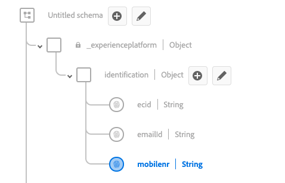

Let's now give your schema a name. Select the field **Untitled schema**.

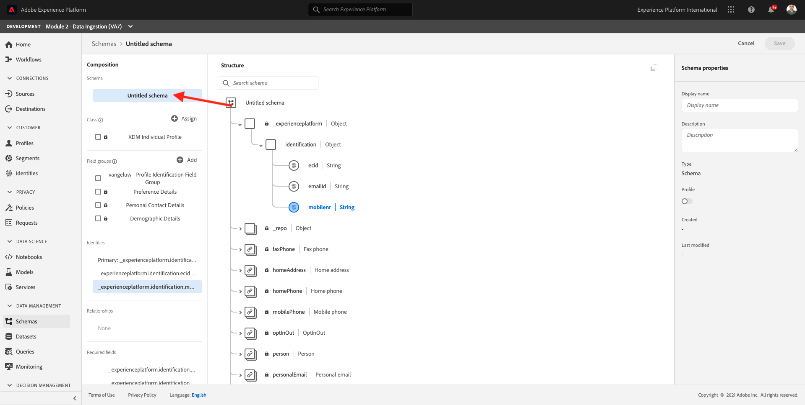

As the name for our schema, you'll use this:

**[!UICONTROL ldap - Demo System - Profile Schema for Website]**

Replace **[!UICONTROL ldap]** by your specific ldap. As an example, for ldap **[!UICONTROL vangeluw]**, this should be the name of the schema:

**[!UICONTROL vangeluw - Demo System - Profile Schema for Website]**

That should give you something like this:

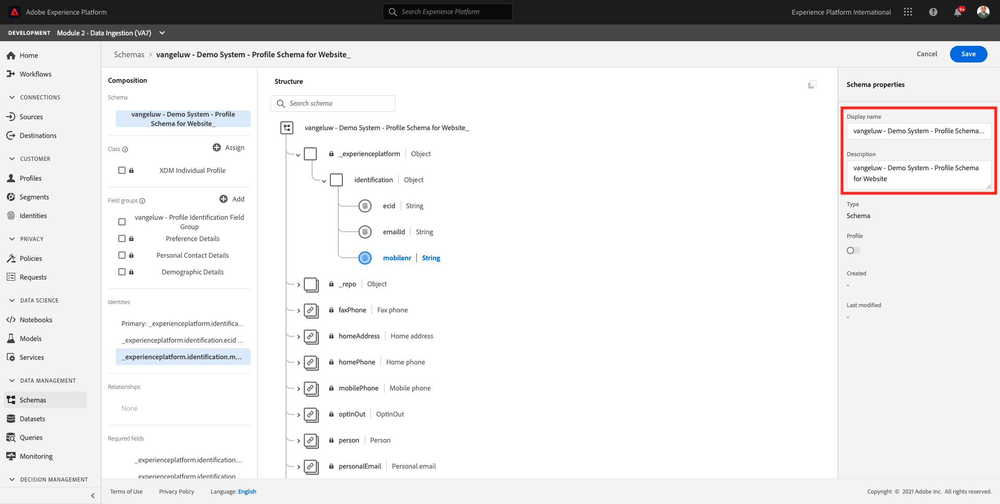

You have now defined a Schema, linked existing and newly created [!UICONTROL Field Groups] and have defined identifiers.

Click **[!UICONTROL Save]** to save your changes.

The last thing to do here, is to activate the Schema to be linked to the **[!UICONTROL Profile]**.
By enabling your schema for Profile, you're making sure that all data sent to Adobe Experience Platform against this schema will be part of the Real-time Customer Profile environment, which makes sure that all that data can be used in real-time for querying, segmentation and activation.

To do this, let's select the name of your schema.

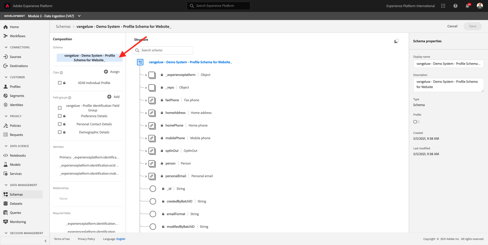

In the right tab of your schema, you'll see a **[!UICONTROL Profile toggle]**, which is currently deactivated.

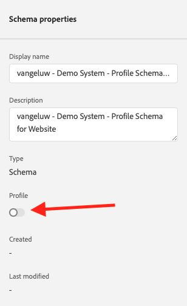

Activate the [!UICONTROL Profile] - switch by clicking it.

You'll see this message:

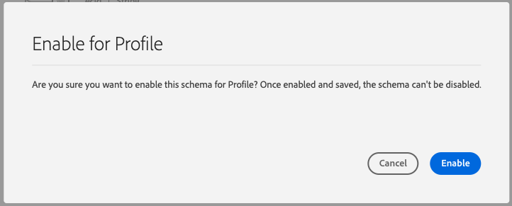

Click **[!UICONTROL Enable]** to enable this schema for Profile.

Your Schema is now configured to be part of the [!UICONTROL Real-time Customer Profile].

Finally, click **[!UICONTROL Save]** to save your schema.

### 2.1.2 - What does this customer do

Capturing the answer to the question **What does this customer do?** for your company is done through for instance a product view on a product page.

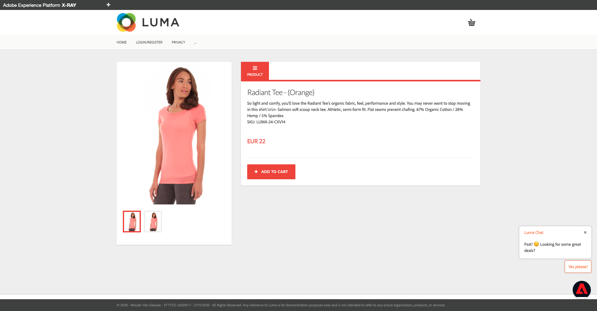

From a schema perspective, we look at this as a **[!UICONTROL Class]**. The question: **What does this customer do?**is something that we've defined in the class **[!UICONTROL ExperienceEvent]**.

So when you create an [!UICONTROL XDM Schema] to capture the answer to **Who is this customer?**, first of all, you'll need to create and define 1 schema that references the class **[!UICONTROL ExperienceEvent]**.

To specify what kind of answers can be given to that question, you'll need to define [!UICONTROL Field Group]. [!UICONTROL Field Groups] are extensions of the [!UICONTROL ExperienceEvent]-class, and have very specific configurations. For instance, information about what kind of products a customer viewed or added to their cart is part of the [!UICONTROL Field Group] **Commerce Details**.

Secondly, your company needs to decide how you'll identify the behavior of this customer. Since we're talking about interactions on a website, it's possible that your company knows the customer but it's equally possible that an unknown, anonymous visitor is active on the website. So we can't use an identifier like email-address. In this case, your company will probably decide to use the [!UICONTROL Experience Cloud ID (ECID)] as the primary identifier.

Lastly, it's important to distinguish the channel on which data was captured. In this case, we'll be talking about Website Interactions and the schema that needs to be defined needs to reflect **where** the interaction data was captured. The channel will also have an important role in influencing what data is captured. As such, it's a best practice to define schema's for every combination of channel, primary identifier and type of data collected.

Based on the above, you'll need to configure a schema in Adobe Experience Platform.

After logging in, you'll land on the homepage of Adobe Experience Platform.

Before you continue, you need to select a **[!UICONTROL sandbox]**. The [!UICONTROL sandbox] to select is named ``--module2sandbox--``. You can do this by clicking the text **[!UICONTROL Production Prod]** in the blue line on top of your screen.

From the list of available sandboxes, select the sandbox that matches the number you've been assigned.

After selecting the appropriate sandbox, you'll see the screen change and now you're in your dedicated sandbox.

In Adobe Experience Platform, click on **[!UICONTROL Schemas]** in the menu on the left side of your screen.

In [!UICONTROL Schemas], you'll see all existing schemas. 

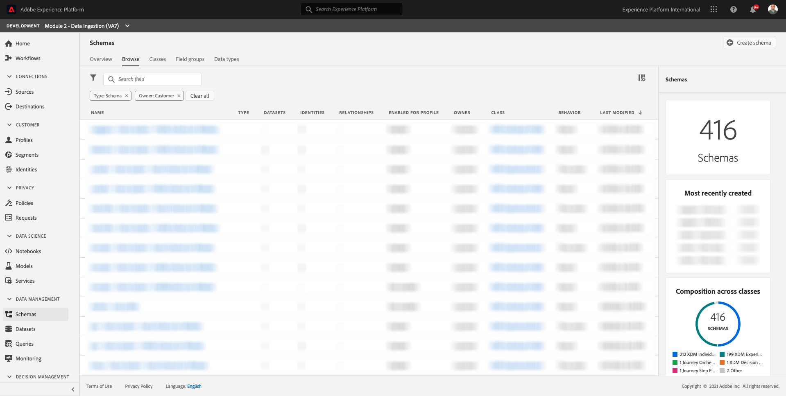

You should create a new schema. To create a new schema, click on the button **[!UICONTROL + Create Schema]** and select **[!UICONTROL XDM ExperienceEvent]**.

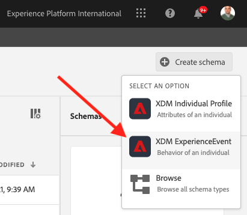

After clicking the **[!UICONTROL + Create Schema]** button, a new schema is created and you'll be prompted to select or create **field groups**.

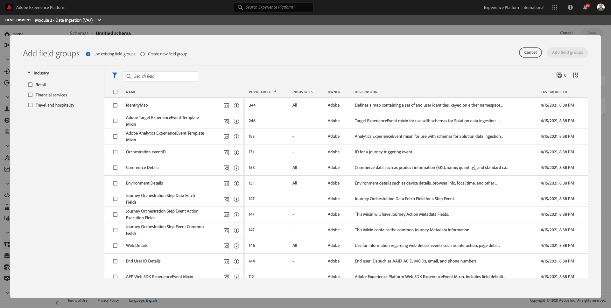

Now you need to define what an answer to the question **What does this customer do?** should look like.
In the introduction of this lab, we noted the need for following attributes to define what a customer does:

- Which pages or products have been visited? 
- Has this customer added a product to his cart or even purchased an item? 
- What device and browser has been used to browse the website? 
- What kind of information is this customer looking for and how can we use that to configure and deliver a delightful experience to this customer?
- Primary Identifier for a customer

To make that information part of your schema, you need to add the following [!UICONTROL Field Group] to your schema:

- Web Details
- Commerce Details
- Environment Details
- your company's custom Profile Identification [!UICONTROL Field Group] (Primary and Secondary Identifiers)

In the **[!UICONTROL Add Field Group]** screen, select the [!UICONTROL Field Groups] **[!UICONTROL Web Details]**, **[!UICONTROL Commerce Details]** and **[!UICONTROL Environment Details]**.

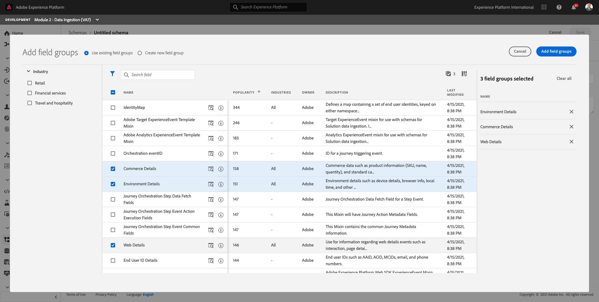

Click the **[!UICONTROL Add Field Groups]** button to add the Field Group to your schema.

You'll then have this:

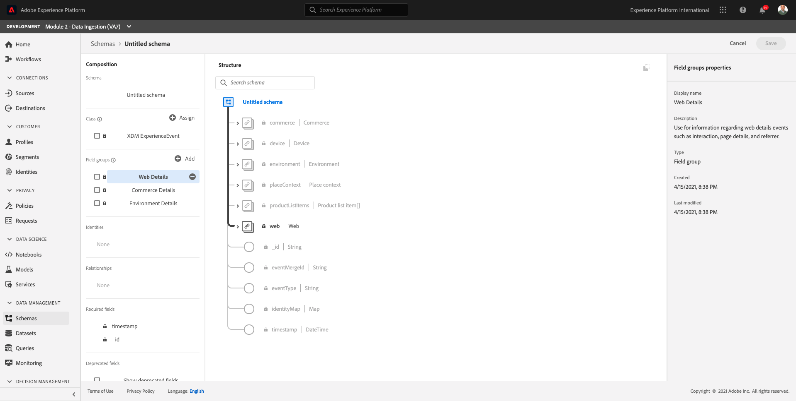

Next, you need to create a new [!UICONTROL Field Group] to capture the **[!UICONTROL Identifier]** used for data collection. As you've seen in the previous exercise, there's a concept of Primary and Secondary Identifiers. A Primary Identifier is the most important one, as all collected data will be linked to this Identifier.

You will now create your own custom [!UICONTROL Field Group] and as such, you'll be extending the [!UICONTROL XDM Schema] to meet your own company's requirements.

A [!UICONTROL Field Group] is linked to a [!UICONTROL Class], so that means that you can't simply reuse the previously created [!UICONTROL Field Group].

Click the **[!UICONTROL + Add]** button to start adding a [!UICONTROL Field Group].

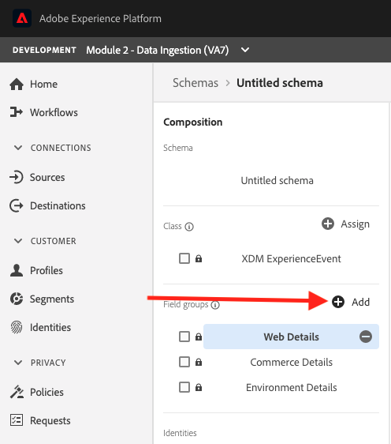

Instead of reusing an existing [!UICONTROL Field Group], you'll now create your own [!UICONTROL Field Group]. You can do that by selecting **[!UICONTROL Create New Field Group]**.

You now need to provide a **[!UICONTROL Display Name]** and **[!UICONTROL Description]** for your new Field Group. 

As the name for your Field Group, use this:

**[!UICONTROL ldap - ExperienceEvent Identification Field Group]**

Replace **[!UICONTROL ldap]** by your specific ldap. As an example, for ldap **[!UICONTROL vangeluw]**, this should be the name of the schema:

**[!UICONTROL vangeluw - ExperienceEvent Identification Field Group]**

That should give you something like this:

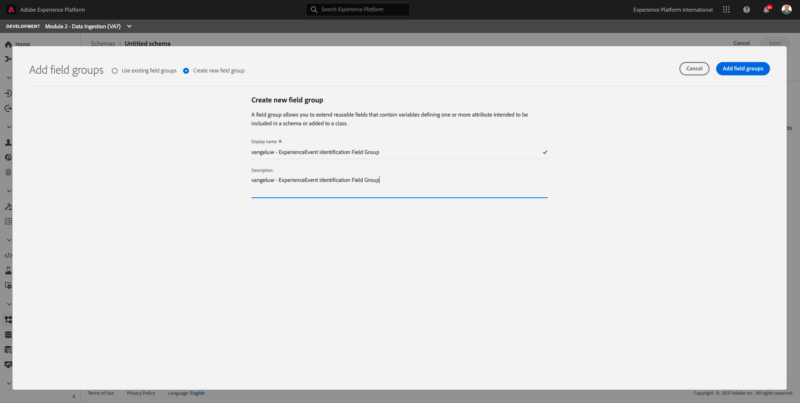

Click the **[!UICONTROL Add Field Group]** button to add the newly created [!UICONTROL Field Group] to your schema.

You should now have this [!UICONTROL Schema] structure in place.

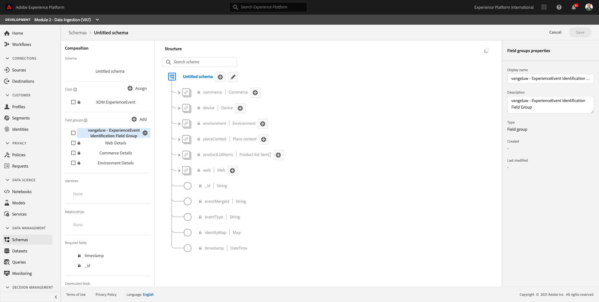

Your new [!UICONTROL Field Group] is still empty, so now you'll have to add fields to that Field Group.
In the [!UICONTROL Field Group]-list, click your custom [!UICONTROL Field Group].

You now see a number of new buttons appear. 

On the top-level of your Schema, next to your Schema - name, click the **[!UICONTROL +]** button.

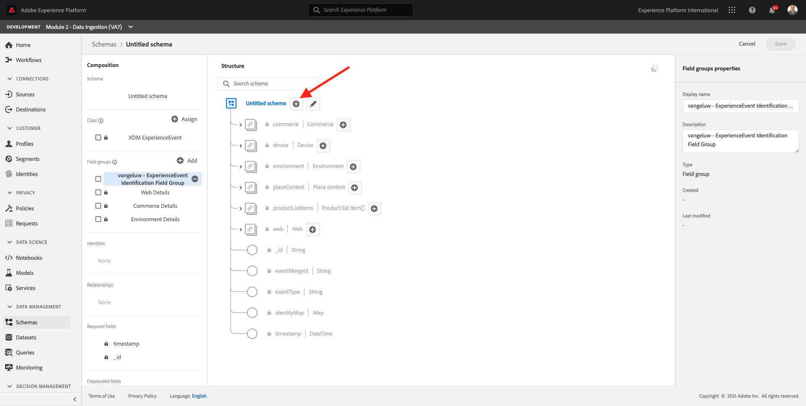

After clicking the **[!UICONTROL +]** button, you now see a new **[!UICONTROL object]** in your schema. This object represents a custom **[!UICONTROL object]** in your [!UICONTROL Schema] and is named after your Adobe Experience Platform Tenant ID. Your Adobe Experience Platform tenant id is `--aepTenantId--`.

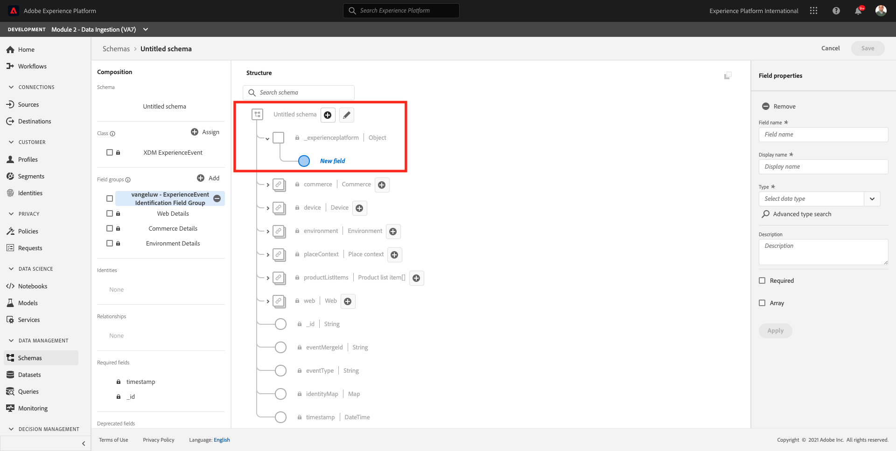

You'll now add a new object under that tenant. To do that, click the field **[!UICONTROL New Field]** under the tenant-object.

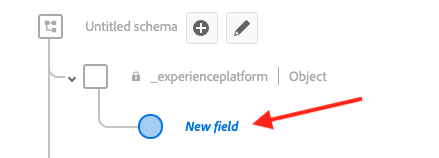

Use these object-definitions:

- Field name: **[!UICONTROL identification]**
- Display name:  **[!UICONTROL identification]**
- Type: **[!UICONTROL Object]**

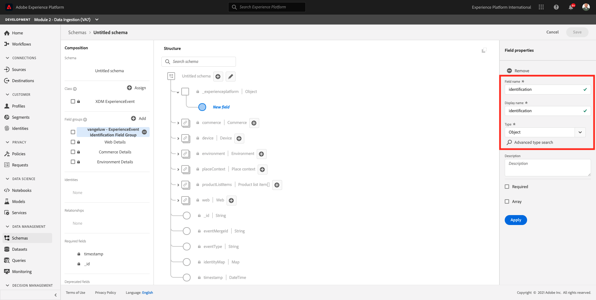

Click **[!UICONTROL Apply]** to save your changes.

After clicking **[!UICONTROL Apply]**, you now see your **[!UICONTROL identification]** object in the Schema.

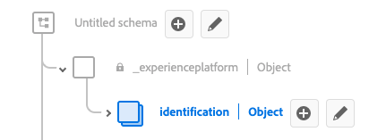

You'll now add 1 new field under the  **[!UICONTROL identification]** object.

Click the **[!UICONTROL +]** button next to the **[!UICONTROL identification]** object to create a new field.

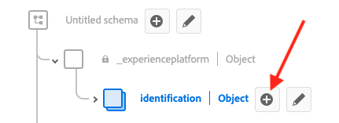

The ECID-field will be defined as type **[!UICONTROL String]** and you'll configure this field as an **[!UICONTROL Identity]**. For the Schema **[!UICONTROL Demo System - Event Schema for Website]**, we assume that a customer will always be identified by their [!UICONTROL ECID], which means that you have to configure the field **[!UICONTROL ECID]** as a **primary** identifier

You now have an empty field. You need to configure the above field as indicated.

- ecid:

  - Field name: **[!UICONTROL ecid]**
  - Display name:  **[!UICONTROL ecid]**
  - Type: **[!UICONTROL String]**

This is how the [!UICONTROL ecid]-field should look after your initial field configuration:

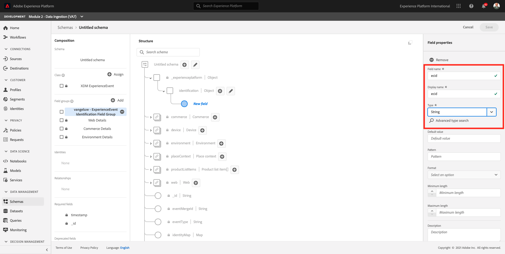

Scroll down and click **[!UICONTROL Apply]**.

You now have a new field, but this field hasn't been defined as an **[!UICONTROL Identity]**-field yet.

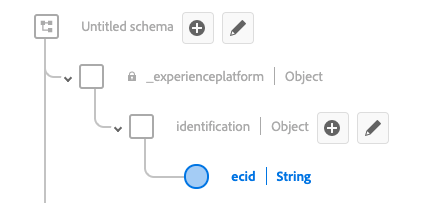

To start defining these fields as **[!UICONTROL Identity]**-fields, follow these steps:

- Select the field **[!UICONTROL ecid]**.
- On the right side, in the field properties, scroll down until you see **[!UICONTROL Identity]**. Check the checkbox for **[!UICONTROL Identity]**. 

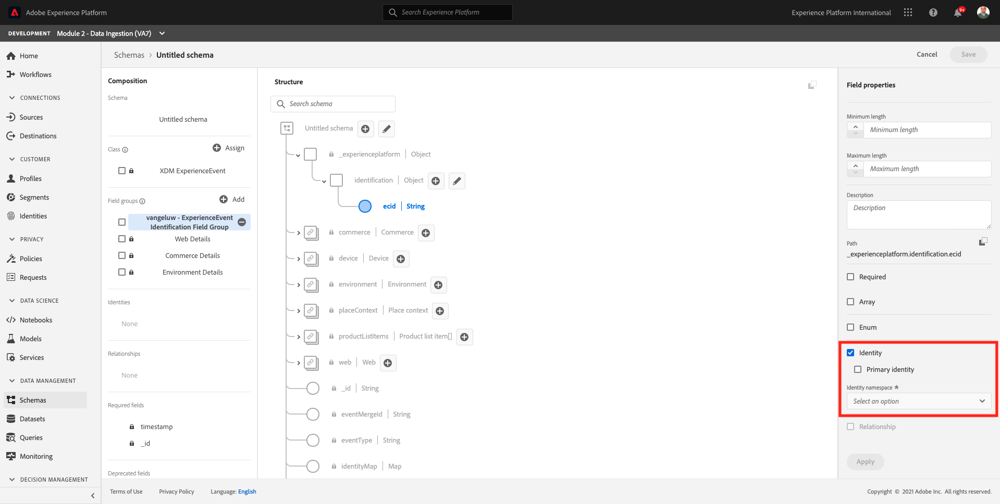

- Now check the checkbox for **[!UICONTROL Primary Identity]**.

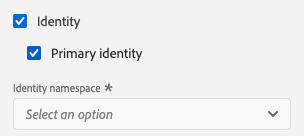
  
- Lastly, select the namespace **[!UICONTROL ECID]** from the list of **[!UICONTROL Namespaces]**. A [!UICONTROL Namespace] is used by the [!UICONTROL Identity Graph] in Adobe Experience Platform to classify identifiers in namespaces and define the relationship between those namespaces.

  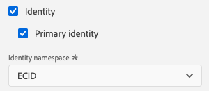

- Finally, click **[!UICONTROL Apply]** to save your changes.

  

The **[!UICONTROL identification]** object should now look like this, with the ecid-field now also showing a **fingerprint** icon to show that they have been defined as identifiers.

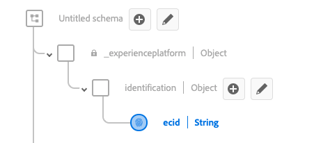

Let's now give your schema a name. Select the field **Untitled schema**.

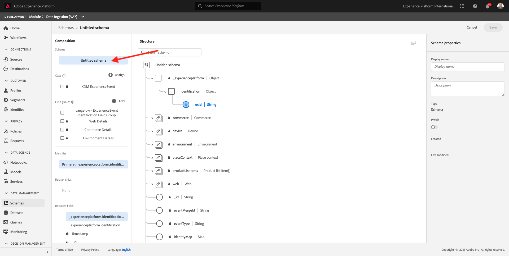

As the name for our schema, we'll use this:
**[!UICONTROL ldap - Demo System - Event Schema for Website]**

Replace **[!UICONTROL ldap]** by your specific ldap. As an example, for ldap **[!UICONTROL vangeluw]**, this should be the name of the schema:

**[!UICONTROL vangeluw - Demo System - Event Schema for Website]**

That should give you something like this:

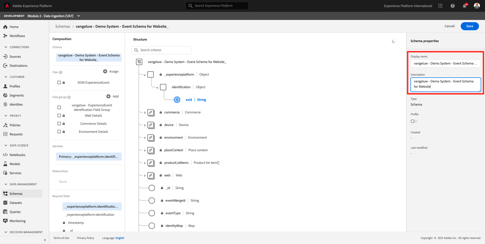

Click **[!UICONTROL Save]** to save your changes.

It's important to note that when eventually ingesting data against this schema, that some fields are required.
For instance, the fields **[!UICONTROL _id]** and **[!UICONTROL timestamp]** are required fields.

- _id needs to contain a unique id for a specific data ingestion
- timestamp needs to be the timestamp of this hit, in the format **[!UICONTROL "YYYY-MM-DDTHH:MM:SSSZ"]**, like for instance: **[!UICONTROL "2019-04-08T07:20:000Z"]**

You have now defined a schema, linked existing and newly created [!UICONTROL Field Groups] and have defined identifiers.

The last thing to do here, is to activate the Schema to be linked to the **[!UICONTROL Profile]**.
By enabling your schema for [!UICONTROL Profile], you're making sure that all data sent to Adobe Experience Platform against this schema will be part of the Real-time Customer Profile, which makes sure that all that data can be used in real-time for querying, segmentation and activation.

To do this, let's select the name of your schema.

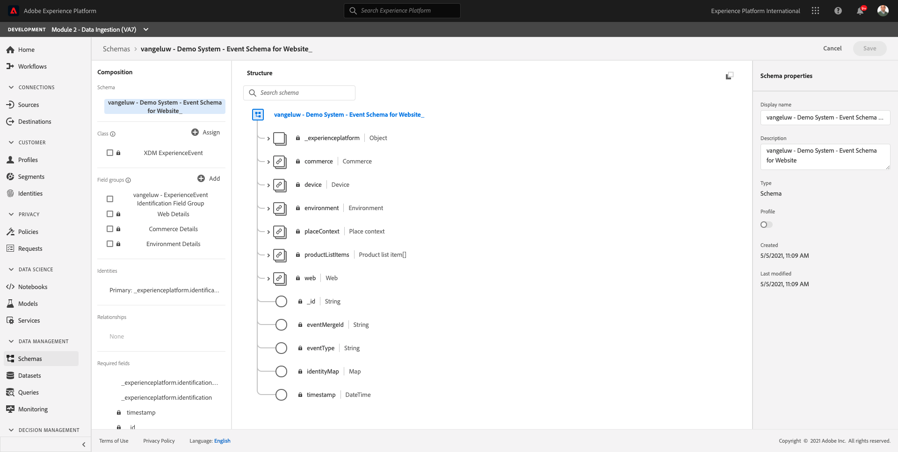

In the right tab of your schema, you'll see a **[!UICONTROL Profile] toggle**, which is currently deactivated.

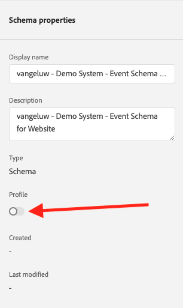

Activate the [!UICONTROL Profile] - switch by clicking it.

You'll see this message:

Click **[!UICONTROL Enable]** to enable this schema for Profile.

Your schema is now configured to be part of the Real-time Customer Profile.

Finally, click **[!UICONTROL Save]** to save your schema.

You've now finished building schemas that are activated to be used in the Real-time Customer Profile.

Let's have a look at datasets in the next exercise.

Next Step: [2.3 Configure Datasets](./ex3.md)

[Go Back to Module 2](./data-ingestion.md)

[Go Back to All Modules](../../overview.md)
