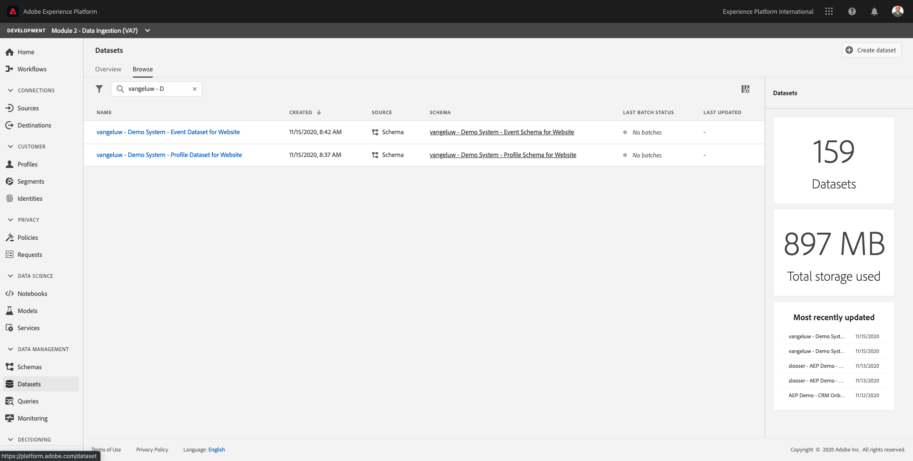

# 2.3 Configure Datasets

In this exercise, you'll configure the required datasets to capture and store profile information and customer behavior. Every dataset that you create in this will use one of the schemas that you built in the previous step.

## Story

After defining what the answer to the questions **Who is this customer?** and **What does this customer do?** should look like, you now need to create a bucket that uses that information, to receive and validate data that was sent to Adobe Experience Platform.

## 2.3.1 - Create Datasets

You now need to create 2 datasets:

* 1 dataset to capture the information that answers the **Who is this customer?** - question.
* 1 dataset to capture the information that answers the **What does this customer do?** - question.

Log in to Adobe Experience Platform by going to this URL: [https://experience.adobe.com/platform](https://experience.adobe.com/platform).

After logging in, you'll land on the homepage of Adobe Experience Platform.

Before you continue, you need to select a **[!UICONTROL sandbox]**. The sandbox to select is named ``--module2sandbox--``. You can do this by clicking the text **[!UICONTROL Production Prod]** in the blue line on top of your screen.

From the list of available [!UICONTROL sandboxes], select the [!UICONTROL sandbox] that matches the number you've been assigned.

After selecting the appropriate [!UICONTROL sandbox], you'll see the screen change and now you're in your dedicated [!UICONTROL sandbox].

In Adobe Experience Platform, click on **[!UICONTROL Datasets]** in the menu on the left side of your screen.

In [!UICONTROL Datasets], you'll see something like this: 

Let's start by creating the dataset to capture the website registration information.

You should create a new dataset. To create a new dataset, click on the button **[!UICONTROL + Create Dataset]**.

After clicking the **[!UICONTROL + Create Dataset]** button, you'll see the following screen. 

You have to define a dataset from the schema that you defined in the previous step. Click the **[!UICONTROL Create Dataset from Schema]** - option.

In the next screen, you have to select the schema that you created in 1, **[!UICONTROL ldap - Demo System - Profile Schema for Website]**.

After selecting the schema, click **[!UICONTROL Next]** to continue.

Let's give a name to your dataset. 

As the name for our dataset, use this:

**[!UICONTROL ldap - Demo System - Profile Dataset for Website]**

Replace **[!UICONTROL ldap]** by your specific ldap. As an example, for ldap **[!UICONTROL vangeluw]**, this should be the name of the schema:

**[!UICONTROL vangeluw - Demo System - Profile Dataset for Website]**
  
That should give you something like this:

Click **[!UICONTROL Finish]** to finish your dataset configuration.

You'll now see this:

Go back to the [!UICONTROL Datasets] overview. You'll now see the dataset you created pop up in the overview.

Next, you'll configure a second dataset to capture website interactions.

You should create a new dataset. To create a new dataset, click on the button **[!UICONTROL + Create Dataset]**.

After clicking the **[!UICONTROL + Create Dataset]** button, you'll see the following screen. 

You have to define a dataset from the schema that you defined in the previous step. Click the **[!UICONTROL Create Dataset from Schema]** - option.

In the next screen, you have to select the schema that you created in 2.2, **[!UICONTROL ldap - Demo System - Event Schema for Website]**.

After selecting the schema, click **[!UICONTROL Next]** to continue.

Let's give a name to your dataset. 

As the name for our dataset, we'll use this:

**[!UICONTROL ldap - Demo System - Event Dataset for Website]**

Replace **[!UICONTROL ldap]** by your specific ldap. As an example, for ldap **[!UICONTROL vangeluw]**, this should be the name of the schema:

**[!UICONTROL vangeluw - Demo System - Event Dataset for Website]**
  
That should give you something like this:

Click **[!UICONTROL Finish]** to finish your dataset configuration.

You'll then see this:

Go back to the [!UICONTROL Datasets] overview screen.

You now have to enable your datasets to be part of Adobe Experience Platform's Real-time Customer Profile.

Open you dataset **[!UICONTROL ldap - Demo System - Profile Dataset for Website]** by clicking it.

Locate the [!UICONTROL Profile] toggle icon on the right side of the screen.

Click the [!UICONTROL Profile] toggle to enable this dataset for [!UICONTROL Profile].

Click the **[!UICONTROL Enable]**.

Your dataset is now enabled for [!UICONTROL Profile].

Go back to the datasets overview and open your dataset **[!UICONTROL ldap - Demo System - Event Dataset for Website]** by clicking it.

Locate the [!UICONTROL Profile] toggle icon on the right side of the screen.

Click the [!UICONTROL Profile] toggle to enable [!UICONTROL Profile].

Click **[!UICONTROL Enable]**.

Your dataset is now enabled for [!UICONTROL Profile].

Next Step: [2.4 Data Ingestion from Offline Sources](./ex4.md)

[Go Back to Module 2](./data-ingestion.md)

[Go Back to All Modules](../../overview.md)
