# 2.4 Data Ingestion from Offline Sources

In this exercise, the goal is to onboard external data like CRM Data in Platform.

## Learning Objectives

- Learn how to generate test data
- Learn how to ingest CSV
- Learn how to use the web UI for data ingestion through Workflows
- Understand the data governance features of Experience Platform

## Resources

- Mockaroo UI: [https://www.mockaroo.com/](https://www.mockaroo.com/)
- Experience Platform UI: [https://experience.adobe.com/platform/](https://experience.adobe.com/platform/)

## Tasks

- Create a CSV file with demo date. Ingest the CSV file in Adobe Experience Platform by making use of the available workflows.
- Understand data governance options in Adobe Experience Platform

## 2.4.1 Create your CRM Dataset through a data generator tool

For this you need 1000 sample lines of CRM Data.

Open the Mockaroo Template by going to [https://www.mockaroo.com/12674210](https://www.mockaroo.com/12674210).

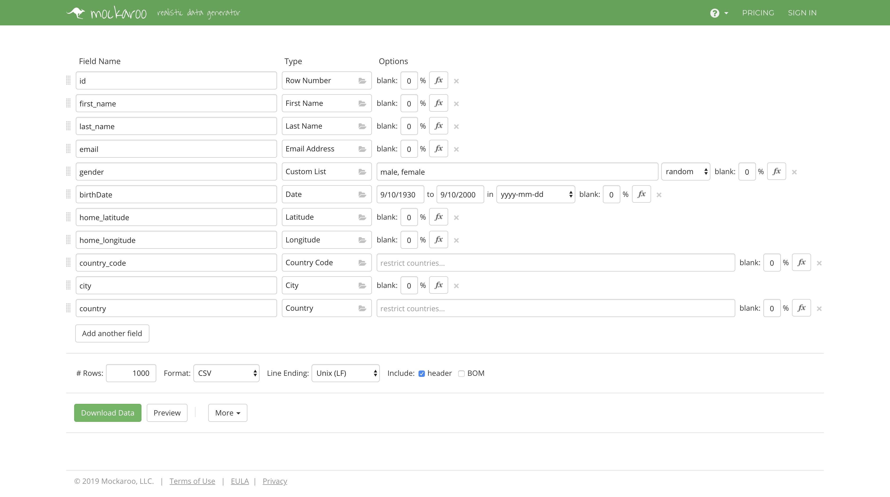

On the template, you'll notice the following fields:

- id
- first_name
- last_name
- email
- gender
- birthDate
- home_latitude
- home_longitude
- country_code
- city
- country

All these fields have been defined to produce data that is compatible with Platform. 

To generate your CSV-file, click the **[!UICONTROL Download Data]** button which will give you a CSV-file with 1000 lines of demo-data. 

Open your CSV-file in Microsoft Excel to visualize its contents.

With your CSV-file ready, you can proceed with mapping it against XDM.

### 2.4.2 Verify the CRM Onboarding Dataset in Adobe Experience Platform

Open [Adobe Experience Platform](https://experience.adobe.com/platform) and go to **[!UICONTROL Datasets]**. 

Before you continue, you need to select a **[!UICONTROL sandbox]**. The sandbox to select is named ``--module2sandbox--``. You can do this by clicking the text **[!UICONTROL Production Prod]** in the blue line on top of your screen.

From the list of available [!UICONTROL sandboxes], select the [!UICONTROL sandbox] that matches the number you've been assigned.

After selecting the appropriate [!UICONTROL sandbox], you'll see the screen change and now you're in your dedicated [!UICONTROL sandbox].

In Adobe Experience Platform, click on **[!UICONTROL Datasets]** in the menu on the left side of your screen.

You're going to use a shared dataset based in this enablement. The shared dataset has been created already and is called **[!UICONTROL Demo System - Profile Dataset for CRM (Global v1.1)]**. 

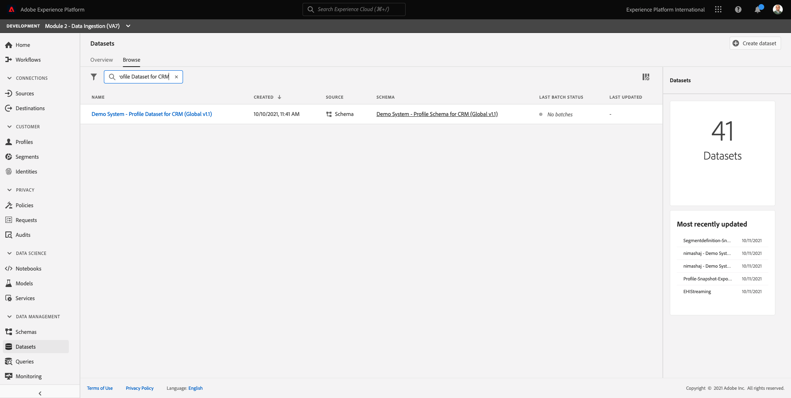

Open the dataset **[!UICONTROL Demo System - Profile Dataset for CRM (Global v1.1)]**.

On the overview screen, you can see 3 main pieces of information.

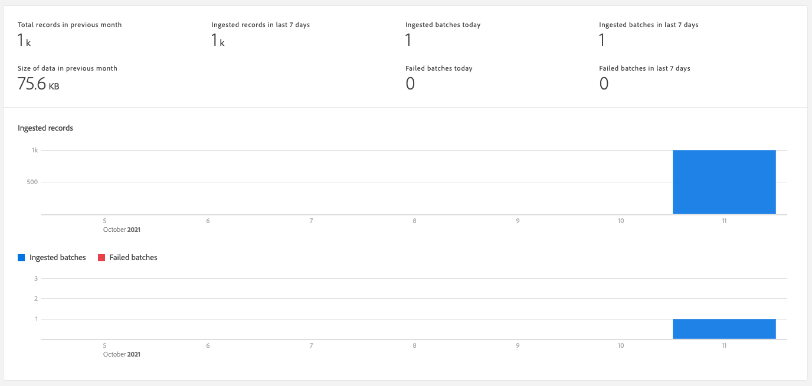

First of all, the [!UICONTROL Dataset Activity] dashboard shows the total number of CRM records in the dataset and the ingested batches and their status

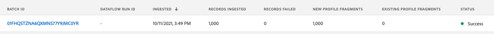

Second, by scrolling down on the page you can check when batches of data were ingested, how many records were onboarded and also, whether or not the batch was successfully onboarded. The **[!UICONTROL Batch ID]** is the identifier for a specific batch job, and the **[!UICONTROL Batch ID]** is important as it can be used for troubleshooting why a specific batch was not successfully onboarded. 

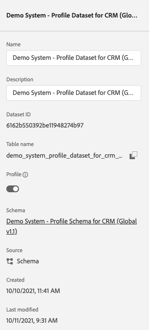

Lastly, the [!UICONTROL Dataset Info] tab shows important information like the [!UICONTROL Dataset ID] (again, important from a troubleshooting perspective), the Dataset's Name and whether the dataset was enabled for Profile. 

The most important setting here is the link between the dataset and the Schema. The Schema defines what data can be ingested and how that data should look like. 

In this case, we're using the **[!UICONTROL Demo System - Profile Schema for CRM (Global v1.1)]**, which is mapped against the class of **[!UICONTROL Profile]** and has implemented extensions, also called field groups. 

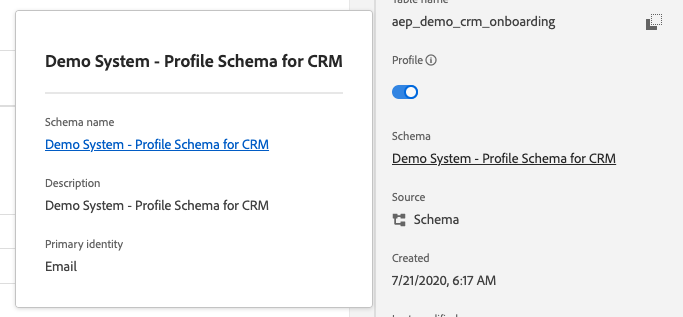

By clicking on the name of the schema, you're taken to the [!UICONTROL Schema] overview were you can see all the fields that have been activated for this schema.

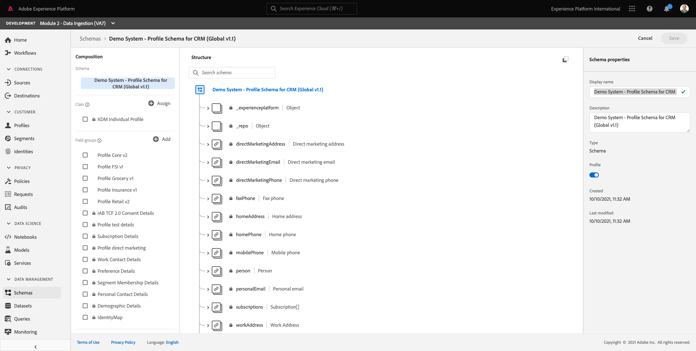

Every schema needs to have a custom, primary descriptor defined. In the case of our CRM dataset, the schema has defined that the field **[!UICONTROL crmId]** should be the primary identifier. If you want to create a schema and link it to the [!UICONTROL Real-time Customer Profile], you need to define a custom [!UICONTROL Field Group] that refers to your primary descriptor.

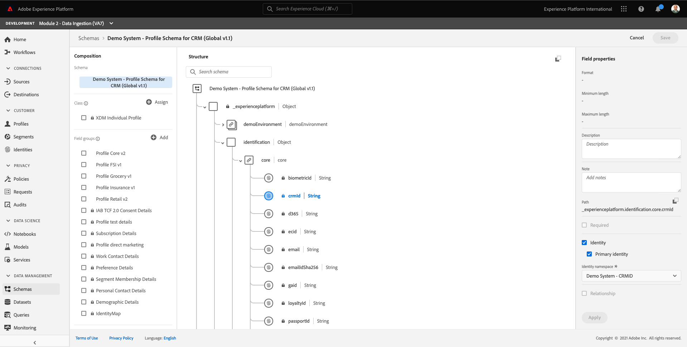

In the above screenshot, you can see that our descriptor is located in `--aepTenantId--.identification.core.crmId`, which is set as the [!UICONTROL Primary Identifier], linked to the [!UICONTROL namespace] of **[!UICONTROL Demo System - CRMID]**.

Every schema and as such, every dataset that should be used in the [!UICONTROL Real-time Customer Profile] should have one [!UICONTROL Primary identifier]. This [!UICONTROL Primary Identifier] is the identifier user by the brand for a customer in that dataset. In the case of a CRM dataset it might be the email-address or the CRM ID, in the case of a Call Center dataset it might be the mobile number of a customer.

It is best practice to create a separate, specific schema for every dataset and to set the descriptor for every dataset specifically to match how the current solutions used by the brand operate.

### 2.4.3 Using a workflow to map a CSV file to an XDM Schema

The goal of this is to onboard CRM data in Platform. All the data that is ingested in Platform should be mapped against the specific XDM Schema. What you currently have is a CSV dataset with 1000 lines on the one side, and a dataset that is linked to a schema on the other side. To load that CSV file in that dataset, a mapping needs to take place. To facilitate this mapping exercise, we have **[!UICONTROL Workflows]** available in Adobe Experience Platform.

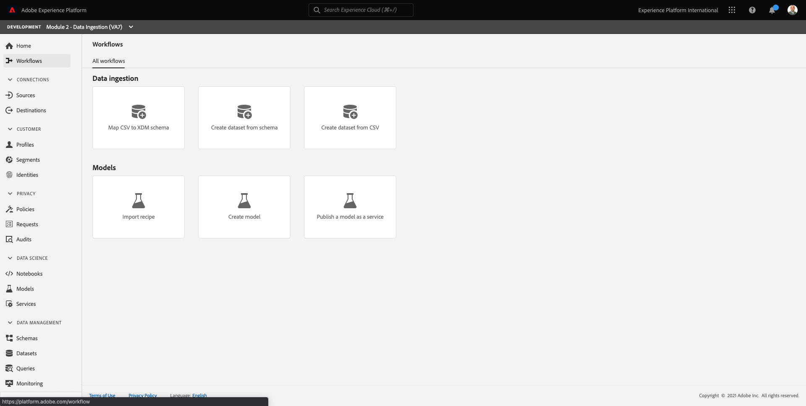

The [!UICONTROL workflow] that we'll use here, is the [!UICONTROL workflow] named **[!UICONTROL Map CSV to XDM Schema]** in the [!UICONTROL Data Ingestion] menu.

Click the **[!UICONTROL Map CSV to XDM Schema]** button.

Click **[!UICONTROL Launch]** to start the process.

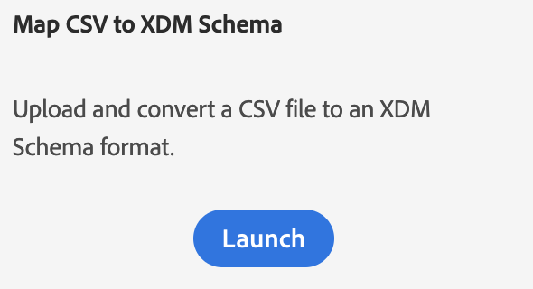

On the next screen, you need to select a dataset to ingest your file in. You have the choice between selecting an already existing dataset or creating a new one. For this exercise, we'll reuse an existing one: please select **[!UICONTROL Demo System - Profile Dataset for CRM (Global v1.1)]** as indicated below and leave the other settings set to default.

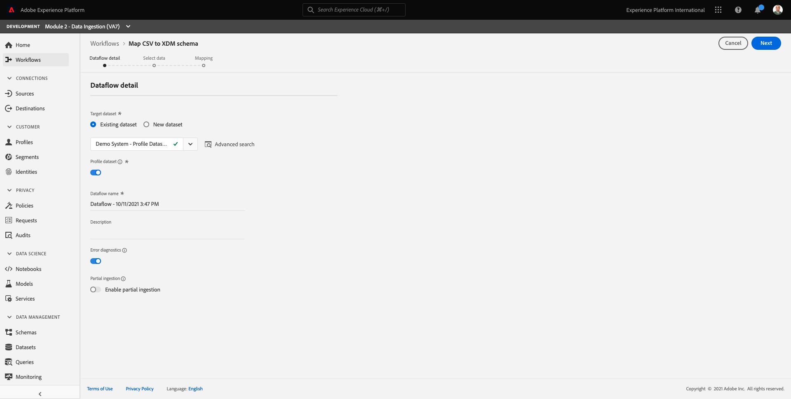

Click **[!UICONTROL Next]** to go to the next step.

Drag & Drop your CSV-file or click **[!UICONTROL Browse]** and navigate on your computer to your desktop and select your CSV-file.

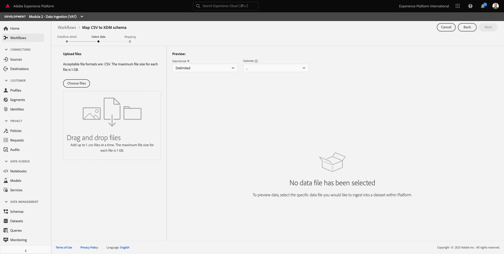

After selecting your CSV-file it will upload immediately and you will see a preview of your file within seconds.

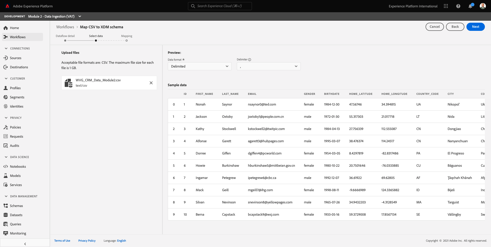

Click **[!UICONTROL Next]** to go to the next step. It can take a few seconds while the file is processed completely.

It's now time to map your CSV Column Headers with an XDM-property in your **[!UICONTROL Demo System - Profile Dataset for CRM]**.

Adobe Experience Platform has already done some guessing for you, by trying to link the [!UICONTROL Source Attributes] with the [!UICONTROL Target Schema Fields].

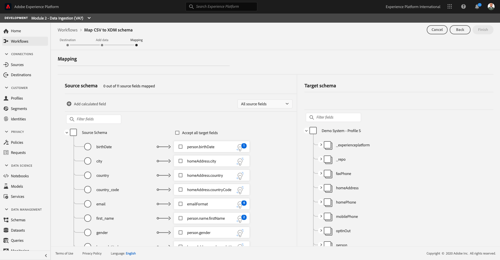

For the [!UICONTROL Schema Mappings], Adobe Experience Platform has tried to link fields together already. However, not all proposals of mapping are correct. You now need to **Accept target fields** one-by-one.

#### birthDate

The Source Schema field **birthDate** should be linked to the target field **person.birthDate**. Check the checkbox. 

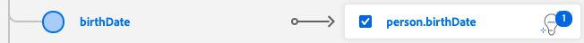

#### city

The Source Schema field **city** should be linked to the target field **homeAddress.city**. Check the checkbox. 

#### country

The Source Schema field **country** should be linked to the target field **homeAddress.country**. Check the checkbox. 

#### country_code

The Source Schema field **country_code** should be linked to the target field **homeAddress.countryCode**. Check the checkbox. 

#### email

The Source Schema field **email** should be linked to the target field **`--aepTenantId--`.identification.core.crmId**. Hover over the line **email** and click the **+** icon.

You'll then see this:

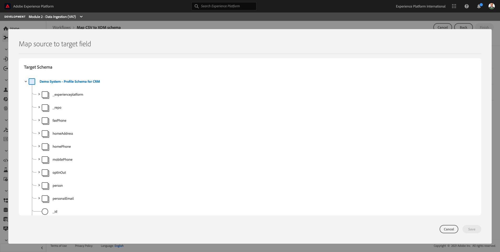

Navigate to and select the field **`--aepTenantId--`.identification.core.crmId**. Click **Save**.

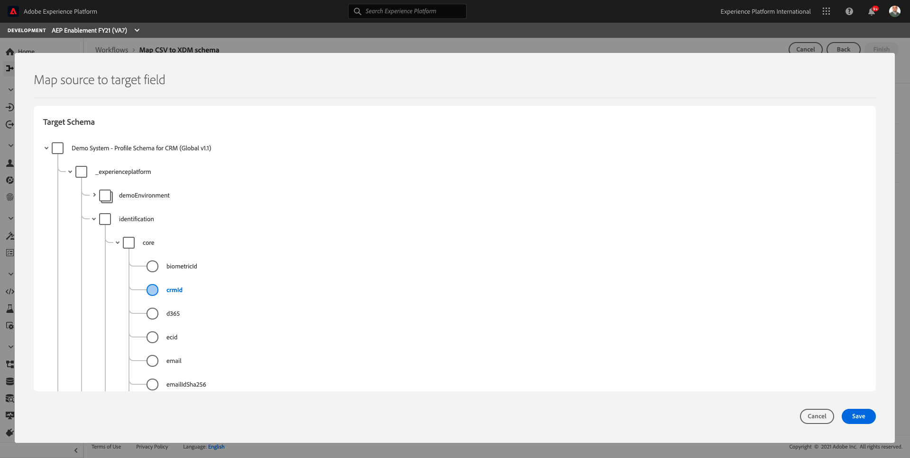

You'll then see this:

#### first_name

The Source Schema field **first_name** should be linked to the target field **person.name.firstName**. Check the checkbox. 

#### gender

The Source Schema field **gender** should be linked to the target field **person.gender**. Check the checkbox. 

#### home_latitude

The Source Schema field **home_latitude** should be linked to the target field **homeAddress._schema.latitude**. Check the checkbox. 

#### home_longitude

The Source Schema field **home_longitude** should be linked to the target field **homeAddress._schema.longitude**. Check the checkbox. 

#### id

The Source Schema field **id** should be linked to the target field **_id**. Hover over the line **id** and click the **+** icon.

You'll then see this:

Navigate to and select the field **_id**. Click **Save**.

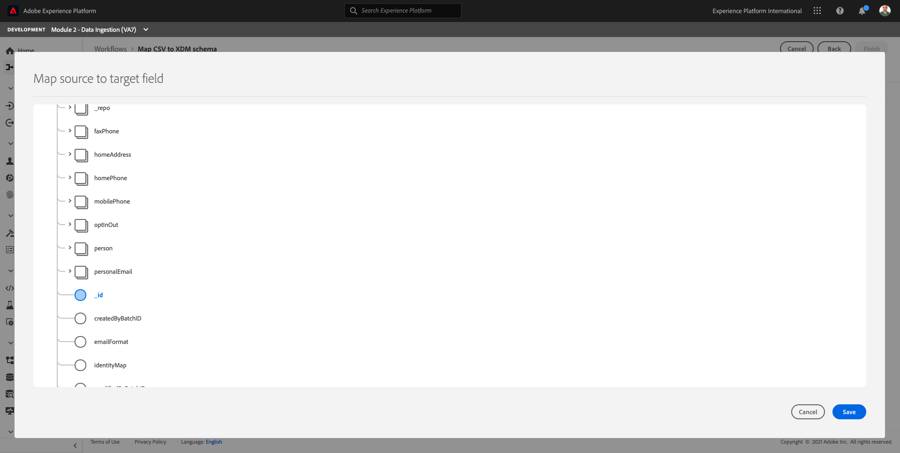

You'll then see this:

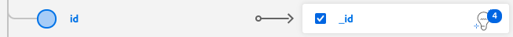

#### last_name

The Source Schema field **last_name** should be linked to the target field **person.name.lastName**. Check the checkbox. 

You should now have this:

Click the **[!UICONTROL Finish]** button to finish the workflow.

After clicking **[!UICONTROL Finish]**, you'll then see the **Dataflow** overview, and after a couple of minutes you can refresh your screen to see if your workflow completed successfully. Click your **Target dataset name**. 

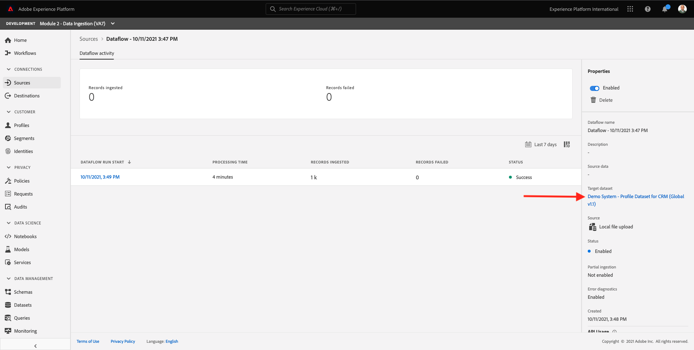

You'll then see the dataset where your ingestion has processed.

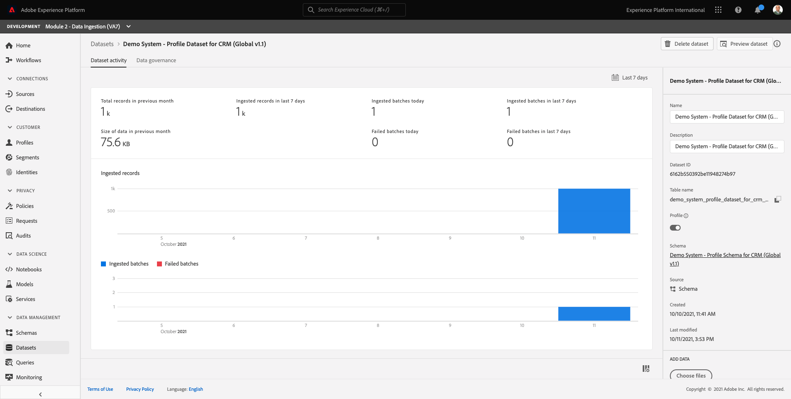

On the dataset, you'll see a [!UICONTROL Batch ID] that has been ingested just now, with 1000 records ingested and a status of **[!UICONTROL Success]**.

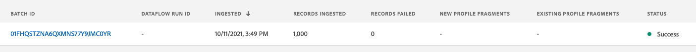

Click on the **[!UICONTROL Preview Dataset]**- button to get a quick view of a small sample of the dataset to ensure that the loaded data is correct.

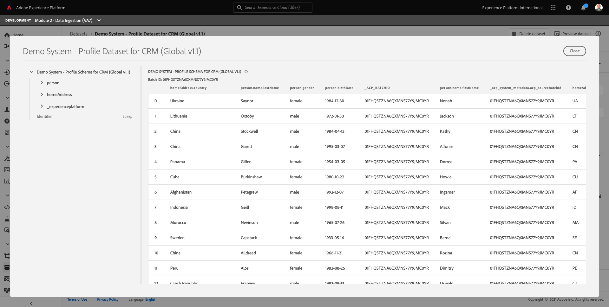

Once data is loaded, you can define the correct data governance approach for our dataset.
   
### 2.5.4 Adding data governance to your dataset 

Now that your customer data is ingested, you need to make sure that this dataset is properly governed for usage and export control. Click on the **[!UICONTROL Data Governance]** tab and observe that you can set three types of restrictions: Contractual, Identity, and Sensitive Data.

You can find more info on the different labels and how they will be enforced in the future through the policy framework on this link: [https://www.adobe.io/apis/experienceplatform/home/dule/duleservices.html](https://www.adobe.io/apis/experienceplatform/home/dule/duleservices.html) 
 
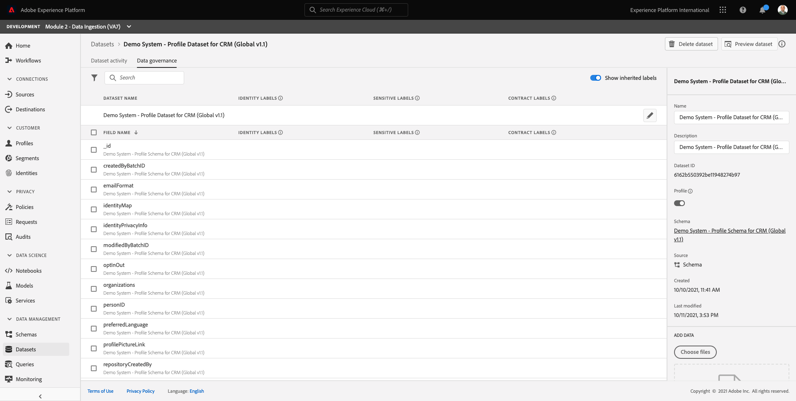

Let's restrict identity data for the entire dataset. Hover over your dataset name, and click the Pencil icon to edit the settings. 

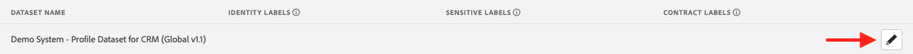

Go to **[!UICONTROL Identity Data]** and you'll see that the **[!UICONTROL I2]** option is checked - this will assume that all pieces of information in this dataset are at least indirectly identifiable to the person.

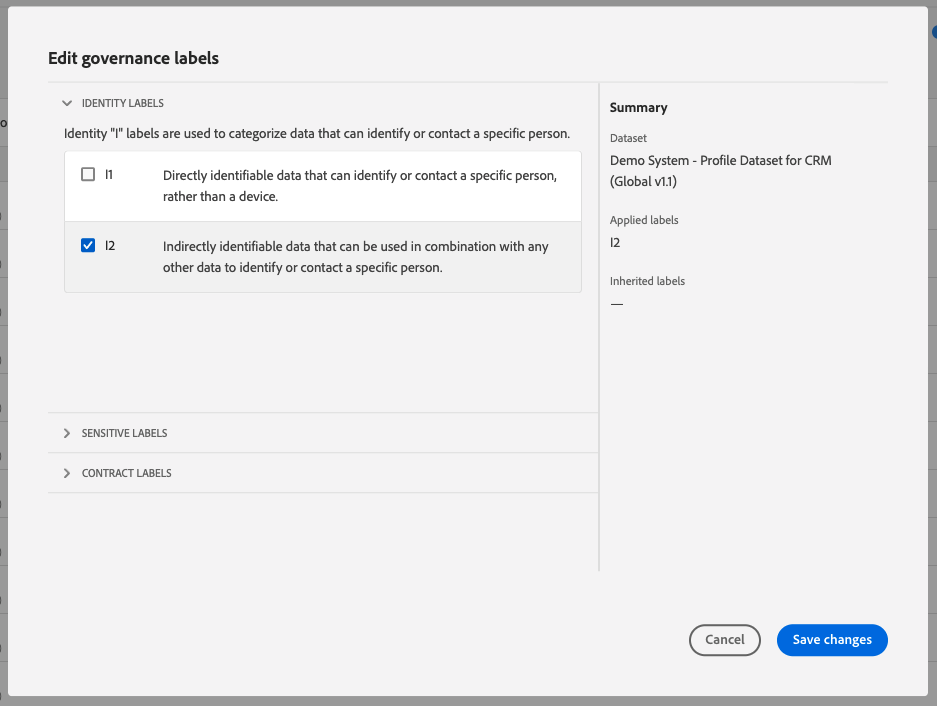

Click **[!UICONTROL Save Changes]** and observe that **[!UICONTROL I2]** is now set for all data fields in the dataset. 

You can also set these flags for individual data fields - for example, the **[!UICONTROL firstName]** field is likely to be classified as an **[!UICONTROL I1]** level for directly identifiable information.

Select the field **[!UICONTROL firstName]** by checking the checkbox and click on **[!UICONTROL Edit Governance Labels]** in the upper right corner of your screen.

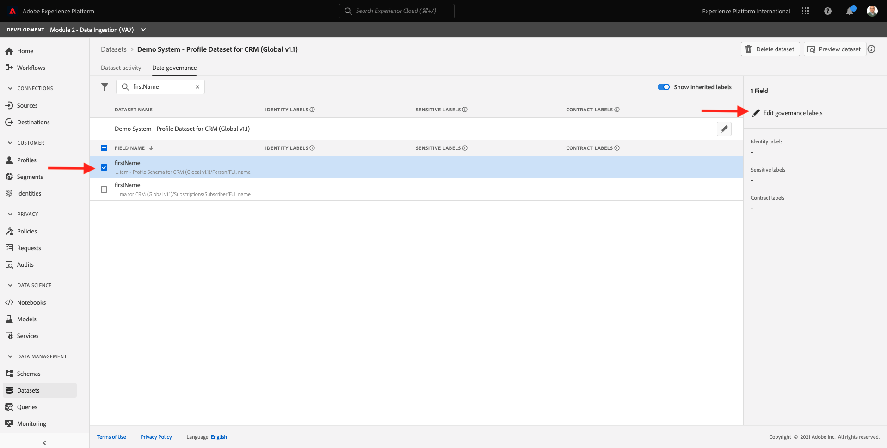

Go to **[!UICONTROL Identity Data]** and you'll see that the **[!UICONTROL I2]** option is already checked (inherited from the dataset). The field firstName also has a field-specific configuration and is set as **[!UICONTROL I1 - Directly Identifiable Data]**.

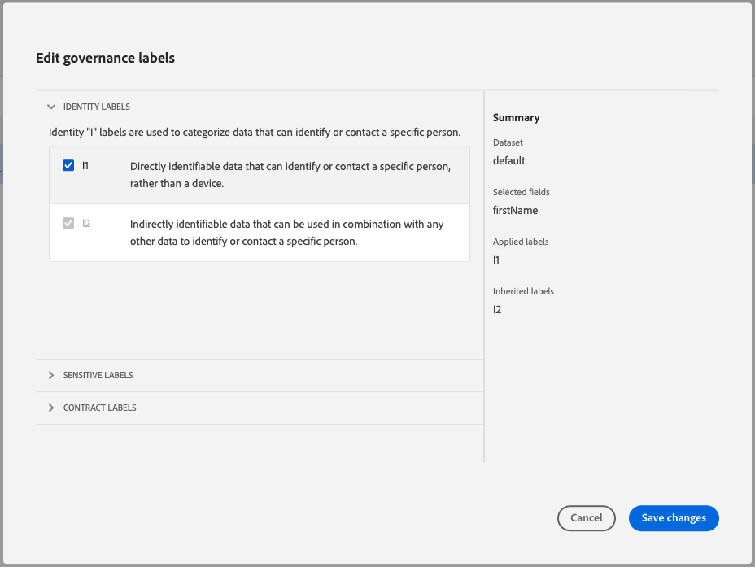

With this, you've now successfully ingested and classified CRM Data in Adobe Experience Platform.

Next Step: [Summary and benefits](./summary.md)

[Go Back to Module 2](./data-ingestion.md)

[Go Back to All Modules](../../overview.md)
