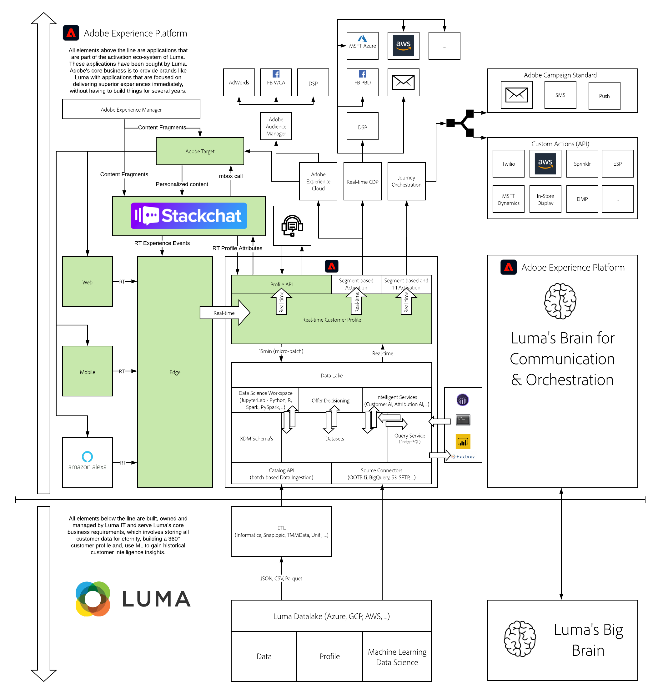

# 20. AI-Driven Chat Apps & Live Chat powered by Stackchat

**Authors: [Marcus Robinson](https://www.linkedin.com/in/marcus1robinson/), [Ian Dejong](https://www.linkedin.com/in/ian-dejong-5408b57/), [Wouter Van Geluwe](https://www.linkedin.com/in/woutervangeluwe/)**

In this module, you'll build your own Luma chatbot using Stackchat. This module will take you through how to...

- Setup your Stackchat account
- Create your first Stackchat chatbot
- Build automated conversations & live chat
- Integrate your chatbot with the Luma website using  the Web Messenger
- Configure social channels so you can interact with your chatbot via Facebook and WeChat
- Integrate your chatbot with Adobe Experience Platform and other Experience Cloud products

As part of this module you'll setup a bi-direction integration between Stackchat and Adobe Experience Platform, allowing your chatbot to both send interaction data to Adobe Experience Platform and also, have Stackchat consume the Real-time Customer Profile via Adobe Experience Platform API's to help inform and personalize the conversation across web and social. To illustrate the end result, please check out the following video:

>[!VIDEO](https://video.tv.adobe.com/v/35846?quality=12&learn=on)

## An introduction to Stackchat

Customers have high expectations when it comes to brand interactions. They want instant answers to questions and they want to communicate on their terms across social and owned channels. Email forms and call centers no longer cut it on their own and brands who fail to offer real-time omni-channel chat as a communication channel cannot remain competitive in the customer experience space. [Stackchat](https://stackchat.com/enterprise) helps solve these needs by providing an enterprise grade, all-in-one conversational marketing platform to build, manage and optimize chat apps for your business using NLP AI & Live Chat capability through team collaboration, content pipelines and developer workflows.

## Learning Objectives

- Become familiar with the Stackchat UI
- Send Stackchat Event data to Adobe Experience Platform
- Consume the Real-time Customer Profile from Stackchat to drive contextual conversations
- Test & Demo your chatbot using Web, Facebook and WeChat.
- Understand the architecture behind the Stackchat - Adobe Experience Platform integration.

## Prerequisites

- Access to Adobe Experience Platform and Stackchat
- Understanding of Adobe Experience Platform datasets and XDM
- Understanding of Adobe Experience Platform API's
- Access to Facebook and / or WeChat account
- Latest version of [Node.js](https://nodejs.org/en/download/) installed. Please make sure you’re running Node v12 or above.

>[!IMPORTANT] 
>
>This tutorial was created to facilitate a particular workshop format. It uses specific systems and accounts to which you might not have access. Even without access, we think you can still learn a lot by reading through this very detailed content. If you're a participant in one of the workshops and need your access credentials, please contact your Adobe representative who will provide you with the required information.

## Architecture Overview

Have a look at the below architecture, which highlights the components that will be discussed and used in this module.

## Sandbox to use

For this module, please use this sandbox: `--aepSandboxId--`.

>[!NOTE]
>
>Don't forget to install, configure and use the Chrome Extension as referenced in [0.6 - Install the Chrome extension for the Experience League documentation](../module0/ex6.md)

## Exercises

[20.1 Onboard to Stackchat](./ex1.md)

In this exercise, you'll create your Stackchat account.

[20.2 Build your Luma Bot](./ex2.md)

In this exercise, you'll learn how to create your first chatbot in Stackchat.

[20.3 Build your Luma Bot - Cloud Functions](./ex3.md)

In this exercise, you'll learn how to create your first chatbot in Stackchat.

[20.4 Use Journey Orchestration to trigger an email follow up after interacting with your chatbot](./ex4.md)

In this exercise, you'll learn how to configure the integration from Stackchat to Adobe Experience Platform, familiarize yourself with the streaming end point set up for real-time chat bot interactions, datasets & XDM schemas that capture the streaming data.

[20.5 Configure the integration between Stackchat and Adobe Experience Platform](./ex5.md)

In this exercise, you'll set up a journey which will email customers after they engage with your chatbot.

[20.6 Test your chatbot on the demo website](./ex6.md)

In this exercise, you'll test your chatbot by implementing it on the website.

[20.7 Connect your chatbot to Facebook Messenger](./ex7.md)

In this exercise, you'll learn how to set up a Facebook Page to then test and demo the Stackchat/Facebook-integration and show how a chatbot-conversation impacts on-site personalization.

[20.8 Test the WeChat Integration (Optional)](./ex8.md)

In this exercise, you'll learn how to test and demo a pre-built Stackchat/WeChat-integration and show how a chatbot-conversation impacts on-site personalization.

[Summary and benefits](./summary.md)

Summary of this module and overview of the benefits.

>[!NOTE]
>
>Thank you for investing your time in learning all there is to know about Adobe Experience Platform. If you have questions, want to share general feedback of have suggestions on future content, please contact Wouter Van Geluwe directly, by sending an email to **vangeluw@adobe.com**.

[Go Back to All Modules](../../overview.md)
