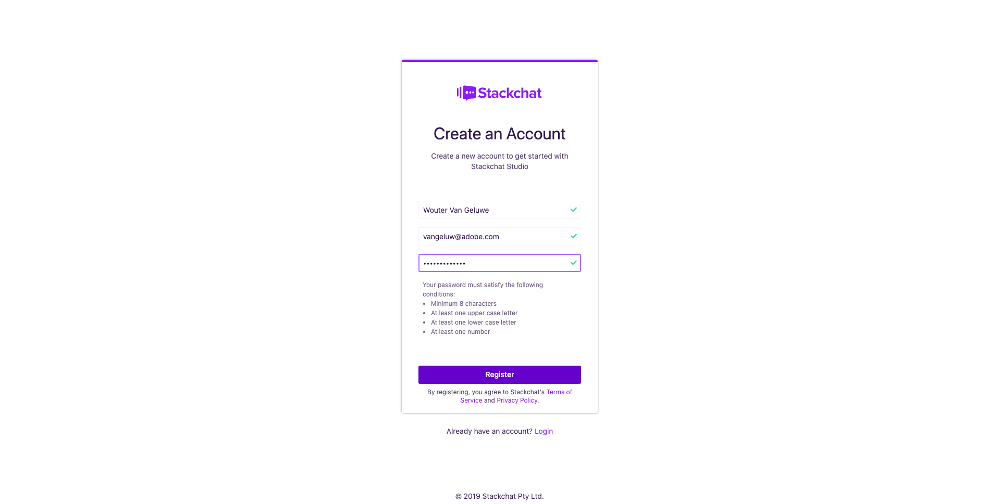

# 20.1 Onboard to Stackchat

## 20.1.1 - Create Your Stackchat Account

Go to [https://stackchat.com](https://stackchat.com).

Click **Sign Up Free**.

On the next page, create your account. Use any email address of choice.

You'll then see this:

Go into your inbox and open the email sent by Stackchat. Click **Confirm Email**.

On the next page, click **Verify Account**.

You'll then get confirmation that your account is verified. Click **Login to Stackchat Studio**.

Enter your email-address and password. Click **Login**.

You're now on the Stackchat Studio home screen - let's learn about the platform's capabilities.

## 20.1.2 - Explore the Stackchat Studio UI

Before we build your Luma bot, you need to understand the basics of conversation design in Stackchat Studio.

Complete the home screen tutorials up to and including "Get Ready to Chat" and then continue with the next step.

Next Step: [20.2 Build your Luma Bot](./ex2.md)

[Go Back to Module 20](./ai-driven-chat-apps-stackchat.md)

[Go Back to All Modules](./../../overview.md)
