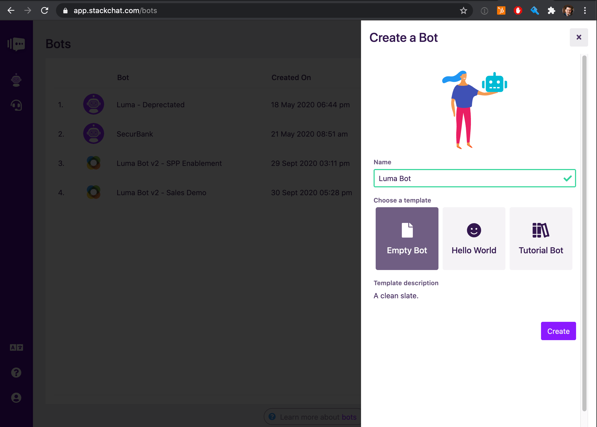
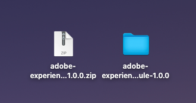

# 20.2 Build your Luma Bot

## 20.2.1 Create a new bot

Open the Bots page by clicking the bot icon in the global menu.


Create a new bot by selecting the **Create Bot** button


Name your new bot **Luma Bot**, select the **Empty Bot** template and click **Create**.



## 20.2.2 Create Slots to Capture Data

**Slots** are used to capture data from users, so you'll need to create a slot for each field you'd like to capture. Click the **Slots** button in the bot menu to bring up the Slots Screen.


Your Luma Bot will ask the user for their details, such as name and email address. This will allow you to help with them with their order, remember what products they've viewed and will allow them to provide feedback on their experience with Luma. Each slot in the below table enables you to capture one of these data points from the user.

Go ahead and create a slot for each entry in the table below:

| Slot Name       | Slot Type       |
|-----------------|-----------------|
| FirstName       | Text            |
| Email           | Email Address   |
| OrderId         | Text            |
| NpsScore        | Multiple Choice |
| NpsFeedback     | Multiple Choice |
| NPSFeedbackText | Text            |
| viewed_products | Text            |

Your screen should now look like this:


>[!NOTE]
>
>Note that the final **viewed_products** uses a different naming convention to the other slots. This is because the **viewed_products** slot is only used by cloud functions to store internal state. It's never directly used in conversation with the user, so it uses snake case instead of camel case as a convention to differentiate it from the other slots.

## 20.2.3 Learn CDML Basics

CDML stands for Conversation Design Markup Language. Just like HTML is markup that renders into webpages, CDML is markup that renders into conversations. To see how CDML works, let's create a simple flow and message thread.

Open the Bot Builder screen from the bot menu.


Hit the **Create Flow** button and give your flow any name you like. As an example, use **Test Flow**.


Click on your flow to open it up and view its children. We just created this flow, so it's empty, but let's change that! Hit the **Create Element** button and choose **Message Thread**.


Click on your message thread and add a **Text** message by hitting the **+** button in the flyout menu.


Add some words to your test message.


Listen up, I'm going to let you in on a little secret. While you were busy creating this message thread, Stackchat Studio was actually storing the underlying conversation data in the form of a CDML file which you can directly view and edit! It sounds like magic and that's because it is - let's take a look!

Your text will be saved automatically, so close the message thread menu and then click the **Edit CDML** button in the top right of the bot builder screen.


You will now see that the entire conversation you just created is represented by something that looks a bit like this:

```ruby
bot:
  format: chat
  flows:
    - name: Test Flow
      entry_flow: true
      flow_elements:
        - message_thread:
            name: My Test Message Thread
            entry_element: true
            messages:
              - text:
                  text: Is what I'm writing really going to be represented as CDML?

```

Try re-writing some of your text message and renaming your flow or message thread, then close the CDML editor and you'll see that your changes are represented in the Stackchat Studio UI.

Having a CDML representation of your bot provides the following advantages:

- Portability: easily export/import bots and share them with others
- Auditability: store a history of your bot's content in.version-control to know exactly what state your bot was in at a given point in time.
- Debugging: often times it's much easier to track down and fix issues in your bot using the CDML editor.

## 20.2.4 Import Luma Bot CDML

Lucky for you, we've already created the Luma Bot content and can share it with you as CDML. 

First, download [the latest release of the Stackchat assets here, as a zip file](https://github.com/stackchat-ai/adobe-experience-league-module/releases) to your local desktop and unzip it. 


After unzipping it you'll have this:



Open the folder **adobe-experience-league-module-X.X.X**. 


Next, open the folder **cdml**.


In there, you'll find a file named **luma-bot.cdml**. Open it using any Text Editor of choice.


Open the CDML editor of your Luma Bot, delete all the existing CDML and replace it with the content of **luma-bot.cdml**.

Your bot will now have a few errors, but don't worry! Stackchat Studio's validation engine has kicked in and is just telling you that your bot is referencing cloud functions that don't exist yet. You'll fix this in the next step.


Click the **back** button in the editor and you'll see that your bot builder is now filled with lots of Luma Bot flows. The size of the flow indicates how many children the flow contains. Feel free to explore the various flows and elements to understand how the conversation flows work.


Next, let's continue to improve your bot with Cloud Functions...

Next Step: [20.3 Build your Luma Bot - Cloud Functions](./ex3.md)

[Go Back to Module 20](./ai-driven-chat-apps-stackchat.md)

[Go Back to All Modules](./../../overview.md)
