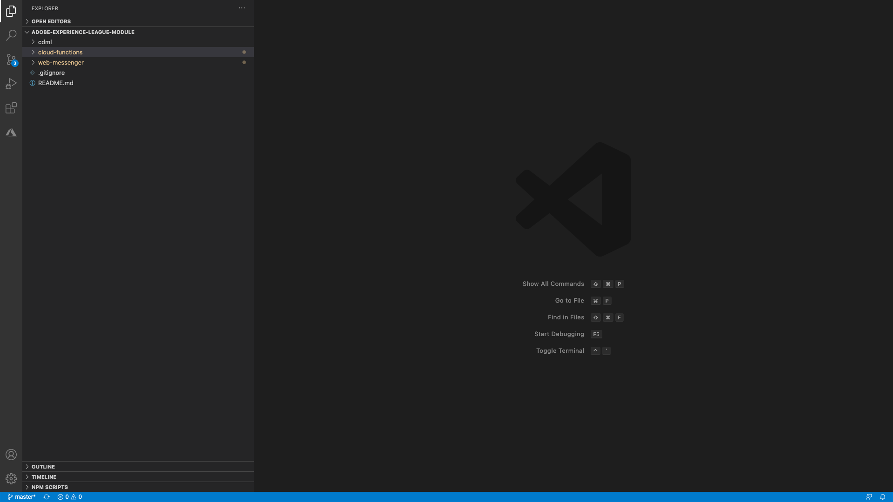
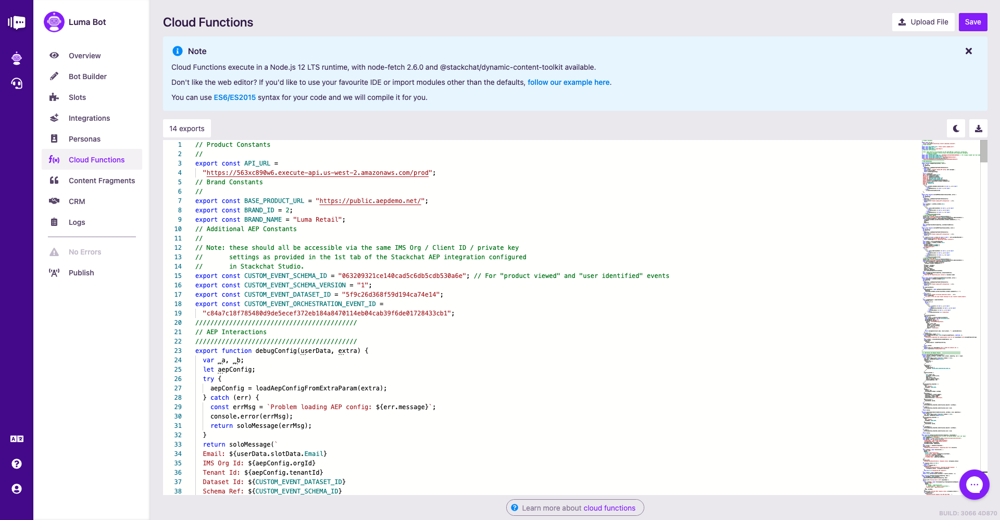

# 20.3 Build your Luma Bot - Cloud Functions

Cloud Functions allow your bot to execute custom [Node.js](https://nodejs.org/) code at runtime, giving your bot the power to display dynamic chat content. Let's add some cloud functions to your Luma Bot that will, among other things, display Luma product data that we fetch from an API.

## Prerequisites

- Latest version of [Node.js](https://nodejs.org/en/download/) installed. Please make sure you’re running Node v12 or above
- Latest version of [Github for Desktop](https://desktop.github.com/)

## 20.3.1 Set Up Placeholder Cloud Functions

Click on the **Cloud Functions** button from the bot menu to bring up the editor. There are two approaches to creating cloud functions - you can develop the code locally using your favorite Integrate Development Environment (IDE), such as [Visual Studio Code (VS Code)](https://code.visualstudio.com/), and upload your code, or you can write code directly in Stackchat Studio's cloud function editor, which is what we'll do. Select the **Start from scratch** option.


There are errors preventing us from publishing Luma Bot, which all correspond to missing cloud functions. Click on the **Errors** bot menu item to see a lit of the issues that you're about to fix.

The following is a list of the missing cloud functions:

- getProducts
- getRecentlyViewedProducts
- notifyAEPOfUserIdentified
- extractMetadaAndPopulateSlots

We'll put in our final cloud functions a little later, but for now let's create some place holder functions to appease the angry bot validator. Close the **Validation Errors** panel, copy the below code and paste it into the bot editor by replacing what's there, and then hit the **Save** button in the top right. These will help us capture logs when we interact with our Luma Bot.

```node
export function getProducts(userData) {
  console.info(`getProducts called :: userdata:\n ${ JSON.stringify(userData) }`);
}

export function getRecentlyViewedProducts(userData) {
  console.info(`getRecentlyViewedProducts called :: userdata:\n ${ JSON.stringify(userData) }`);
}

export function notifyAEPOfUserIdentified(userData) {
  console.info(`notifyAEPOfUserIdentified called :: userdata:\n ${ JSON.stringify(userData) }`);
}

export function extractMetadaAndPopulateSlots(userData) {
  console.info(`extractMetadaAndPopulateSlots called :: userdata:\n ${ JSON.stringify(userData) }`);
}
```

Now your bot doesn't have any errors and the validator is no longer angry! Click on the **4 exports** button to see a list of all the functions that Stackchat Studio has detected.


## 20.3.2 Publish and Test Your Luma Bot

Now that there are no errors, go ahead and publish your bot by hitting the **Publish** button in the bot menu.


Once the bot has finished publishing (it may take a couple minutes), you will see that the chat badge is no longer disabled. Click the chat badge and say **hi** to your Luma Bot to kick off the conversation.


Give your name, then select the **I need ideas** menu item.

>[!NOTE]
>
>If at any point, you get lost, you can always say **/reset** to the bot. This has been configured as a **keyword** on the Reset flow, which clears all your slots and restarts the chat session. Check out the Rest Flow in the CDML if you're interested to see how it works!


You'll then see this. Click **Yes**. 


Next, provide your email address and click **Yes**.


You'll then notice how your Luma Bot doesn't display any products for you. This is because our cloud functions are empty, save for a lone **console.info** call.


Before you say anything else, let's take a look at your bot logs to get an idea of what's happening inside of Luma Bot. Click the **Logs** button from the bot menu and wait a moment for the logs to load.


The **console.info** invocations we made in our place holder cloud functions show up here in the logs. You should be able to see the logged output from our **getProducts** method - click on it to expand the output and see what the data your cloud function has available to it via the **userData** argument. You should see your name and email was captured.


Pretty nifty, but Luma Bot isn't very useful with a bunch of cloud functions that only create log entries. We need to fill these functions with real logic and lucky for you, we've prepared these functions for you already.

## 20.3.3 Set Up the Cloud Functions Project in VSCode

In one of the previous exercises, you downloaded [the latest release of the Stackchat assets here, as a zip file](https://github.com/stackchat-ai/adobe-experience-league-module/releases), to your local desktop where you unzipped it. You have this folder on your desktop:


Next, open the folder **adobe-experience-league-module-X.X.X** in Visual Studio Code by dragging and dropping it in the Visual Studio Code UI.



Once open, navigate to the **./cloud-functions** folder.


Now open Terminal (**View -> Terminal**).


This will open a panel at the bottom of your VS Code window. Next you need to install some project dependencies.

>[!NOTE]
>
> When running commands in terminal, you may need to ensure several things;
> 
> - You have an up to date version of Node installed. Please make sure you’re running Node v12. visit [Node.js](https://nodejs.org/en/download/) to download and install the latest version. Alternatively, you can install or upgrade to v12 directly within Terminal, but it’s recommended that you use **nvm** to manage your node versions, to make it easy to change versions as required. More information can be found [here](https://github.com/nvm-sh/nvm/blob/master/README.md).
> 
> - 
> 
> - You have the correct permissions to write to the directory we will be working in. If you do not, you may see such errors as **Missing write access to /usr/local/lib/node_modules/npm/node_modules...** if this is the case, [here's](https://flaviocopes.com/npm-fix-missing-write-access-error/) a great blog to explain the issue and possible solution.
> 
> - You're working in the correct directory. For the following steps we will need to work within the **/cloud-functions** directory. To confirm this type **pwd** (print work directory) within the terminal and press enter. If the path that is printed ends with **/cloud-functions** then you're all set, if not try running **cd cloud-functions** to set the correct directory. Now, re-run **pwd**, you should now see the path end with **/cloud-functions**.


You need to have an up to date version of Node Package Manager (npm) installed. Before checking if you have that installed, you need to verify you have the correct permissions to use and write to the directory in which Node Package Manager (npm) is installed.

In the terminal window, execute this command: **sudo chown -R $USER /usr/local/lib/node_modules**. A password is requested, which is the password of the user that's currently logged on on your computer.


Next, you need to verify if you have an up-to-date version of npm installed. To do that, enter the command **npm i -g npm** in the Terminal window.


Next, navigate to the folder cloud-functions by typing the command **cd cloud-functions** in the Terminal window.


Next, you need to install the project's dependencies using Node Package Manager (npm). To do this type **npm i** (Node Package Manager install) within the terminal window and hit **enter**. You should see npm begin to install the project's dependencies.


Next, open the file **./src/_constants.ts** and take note of these two lines:

```node
export const CUSTOM_EVENT_SCHEMA_ID = 'XXXX';
...
export const CUSTOM_EVENT_DATASET_ID = 'XXXX';
```


Your Adobe Experience Platform integration won't work correctly just yet, because you haven't configured these fields yet, but we'll come back to this and fix this in a minute. For now, you can get the rest of the chatbot functionality working.

Once your NPM install is complete, let's build the project by running **npm run build** within terminal. To do this, type **npm run build** within the terminal window and press enter.


This will generate a folder called **./dist** which will contain a single file called **cloud-functions.js**.


Open the file **cloud-functions.js** and copy everything.

Go back to Stackchat Studio, into Cloud Functions. 


Now replace what you currently have by the code you copied from Visual Studio Code, from the file **cloud-functions.js** by pasting that code into your cloud function editor in Stackchat Studio.

Click **Save**.



Next, hit the **Publish** button at the bottom of the left hand navigation.


After the bot has finished publishing, open the chat widget and send the message **/reset** to clear your chat session and start over. 


You'll then see this. Give your name and click **Send**. 


Next, select the **I need ideas** menu item.


You'll then see this. Click **Yes**. 


Next, provide your email address.


Confirm your email address by clicking **Yes**.


You'll then see that Luma products are displayed inside the chatbot.


Your Luma bot is taking shape! You'll soon look into integrating Adobe Experience Platform to enhance the experience and help stitch conversations across channels, but first you'll set up a journey using Journey Orchestration that will be triggered when a customer likes a product as part of the chatbot flow.

Next Step: [20.4 Use Journey Orchestration to trigger an email follow up after interacting with chat bot](./ex4.md)

[Go Back to Module 20](./ai-driven-chat-apps-stackchat.md)

[Go Back to All Modules](./../../overview.md)
