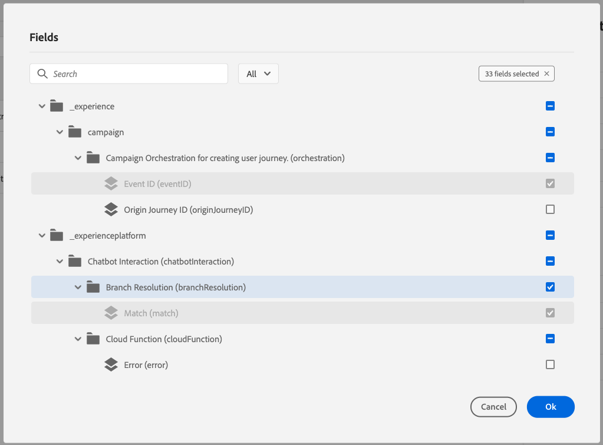
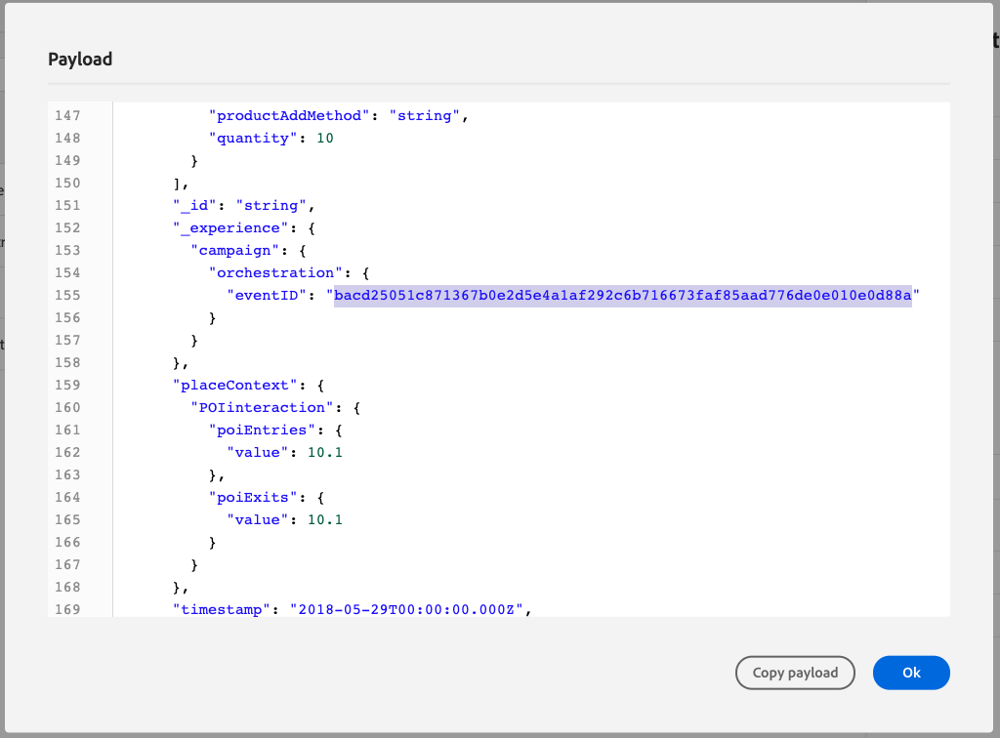
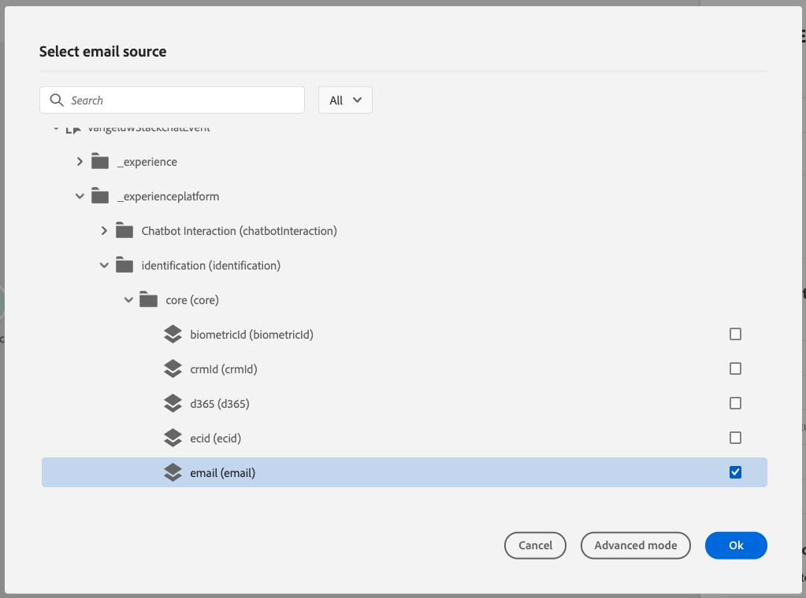
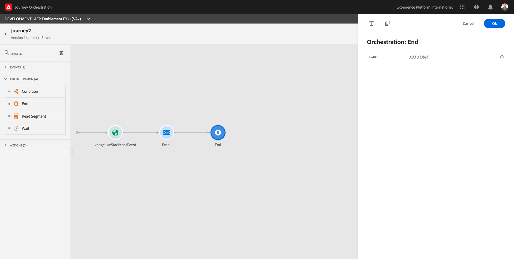

# 20.4 Use Journey Orchestration to trigger an email follow up after interacting with your chatbot

In this exercise, you'll configure the event and the journey that needs to be triggered when someone likes a product as part of the chatbot flow.

## 20.4.1 Create a new event in Journey Orchestration

Login to Journey Orchestration by going to [Adobe Experience Cloud](https://experience.adobe.com).

Click on **Journey Orchestration**.

You'll be redirected to the **Journeys**  view in Journey Orchestration.

First, make sure you're using the correct sandbox. The sandbox to use is called `--aepSandboxId--`. To change from one sandbox to another, click on **PRODUCTION Prod (VA7)** and select the sandbox from the list. In this example, the sandbox is named **AEP Enablement FY21**.

You'll then be in the **Home** view of your sandbox `--aepSandboxId--`.

In the menu, click **Events**.

On the **Events** screen, you'll see a view similar to this. Click the **Add** button.

You'll then see an empty event configuration.

First of all, give your Event a Name like this: **ldapStackchatEvent** and replace **ldap** with your ldap and add a description like this **Stackchat Interaction**.

Next is the **Event ID Type** selection. Select **System Generated**

Next is the Schema selection. A schema was prepared for this exercise. Please use the schema **Demo System - Event Schema for Stackchat Chatbot (Global v1.1) v.1**.

After selecting the Schema, you'll see a number of fields being selected in the **Payload** section. You should now hover over the **Payload** section and you'll see 3 icons popup. Click on the **Edit** icon.

You'll see a **Fields** window popup, in which you need to select the fields that we need to personalize the email.

Scroll down to the object `--aepTenantId--.identification.core`, please make sure to select all fields.

Scroll down to the object `productListItems`, please make sure to select all fields. Click **Ok**.

Click **Save** to save your changes.

Your Event is now configured and saved.

Click on your event again to open up the **Edit Event** screen again.

Hover over the **Payload** field again to see the 3 icons again. 
Click on the **View** icon. You'll now see an example of the expected payload.

Your Event has a unique orchestration eventID, which you can find by scrolling down in that payload until you see **_experience.campaign.orchestration.eventID**.

The event ID is what needs to be sent to Adobe Experience Platform in order to trigger the Journey that you'll build next. Remember this eventID, as you'll need it in one of the next exercises.
**"eventID": "bacd25051c871367b0e2d5e4a1af292c6b716673faf85aad776de0e010e0d88a"**

Click **Ok** and click **Save** to close your event popup.

## 20.4.2 Create a new journey in Journey Orchestration

In the menu, click **Home**.

Let's create a new journey by clicking the **Create** button.

You'll then see an empty Journey screen.

In the previous exercise, you created a new **Event**. You named it like this **ldapStackchatEvent** and replaced **ldap** with your ldap. This was the result of the Event creation:

You now need to take this event as the start of this Journey. You can do this by going to the left side of your screen and searching for your event in the list of events.

Select your event, drag and drop it on the Journey  canvas. Your Journey now looks like this:

As the second step in the journey, you need to add an **Email** action. Go to the left side of your screen to **Actions** and clear the search filter. Next, select the **Email** action, then drag and drop it on the second node in your journey.

Your journey now looks like this:

On the right side of your screen, you now need to configure the email.

Go to **Message** and open the dropdown list. In that list, you need to select the template with the name **vangeluw - Stackchat Interaction - Luma Retail**.

Selecting this message automatically opens up a number of additional fields. These are the fields that. have been configured to be dynamic field in the email template. You now need to link each of the expected dynamic fields to a field coming from the Payload that is sent to Platform.

Let's start with the **EMAIL** field.

Click on the **Edit** icon.

 

You'll then see a window to select a source field to use as Email Source.

Click on the name of the event you created, which is named **ldapStackchatEvent**, to open it.

Navigate to `--aepTenantId--.identification.core.email` and select it. Click **OK** to save your configuration.

Next, let's configure the field **BRANDLOGO**. 

Click on the **Edit** icon.

You'll then see this. Click **Advanced Mode**.

In the **Advanced** window, paste the below link to the logo of the brand Luma.

**"https://parsefiles.back4app.com/hgJBdVOS2eff03JCn6qXXOxT5jJFzialLAHJixD9/d632e769791f0a4dbe0b84058d282d45_logo.png"** (make sure to include the quotes " ").

Click **OK** to save your configuration.

Next, let's configure the **BRANDNAME** field. 

Click on the **Edit** icon.

You'll then see this. Click **Advanced Mode**.

In the **Advanced** window, enter the text **"Luma"** (make sure to include the quotes " ").

Click **OK** to save your configuration.

Next, let's configure the field **FIRSTNAME**.

Click on the **Edit** icon.

Navigate to `--aepTenantIdSchema--.profile.person.name.firstName` and select it. Click **OK** to save your configuration.

Next, let's configure the field **PRODUCTIMAGEURL**. Personalization may also require the usage of Last Name.

Click on the **Edit** icon.

Click on the name of the event you created, which is named **ldapStackchatEvent**, to open it. Click **Advanced Mode**.

In the **Advanced** window, enter the text **@{ldapStackchatEvent.productListItems.at(0).--aepTenantId--.core.imageURL}** (replace ldap by your LDAP).

Click **OK** to save your configuration.

Next, let's configure the field **PRODUCTNAME**. Personalization may also require the usage of Last Name.

Click on the **Edit** icon.

Click on the name of the event you created, which is named **ldapStackchatEvent**, to open it. Click **Advanced Mode**.

In the **Advanced** window, enter the text **@{ldapStackchatEvent.productListItems.at(0).name}** (replace ldap by your LDAP).

Click **OK** to save your configuration.

Finally, let's configure the field **PRODUCTPAGE**. Personalization may also require the usage of Last Name.

Click on the **Edit** icon.

Click on the name of the event you created, which is named **ldapStackchatEvent**, to open it.Click **Advanced Mode**.

In the **Advanced** window, enter the text **@{ldapStackchatEvent.productListItems.at(0).--aepTenantId--.core.productURL}** (replace ldap by your LDAP).

Click **OK** to save your configuration.

Your configuration now looks like this. Click **OK** again to save your configuration.

For this exercise, our Journey is fine like it is now.

Let's add an Orchestration Event to **End** the Journey. In the left side of the screen, go to **Orchestration** and select **End**. Drag and Drop this onto the 3rd step of the Journey.

Your Journey now looks like this.

You still need to give your Journey a Name. You can do that by clicking the **Edit** icon in the top right side of your screen.

You can then enter the Journey's name here. Please use **ldap - Stackchat Interaction Journey** as a naming convention and replace **ldap** with your LDAP.
  

Click **OK** to save your changes.

You now have this. You can now publish your journey by clicking **Publish**.

Click **Publish** again.

You'll then see a green confirmation bar saying that your Journey is now Publish.

You've now finished this exercise.

Next Step: [20.5 Configure the integration between Stackchat and Adobe Experience Platform](./ex5.md)

[Go Back to Module 20](./ai-driven-chat-apps-stackchat.md)

[Go Back to All Modules](./../../overview.md)
