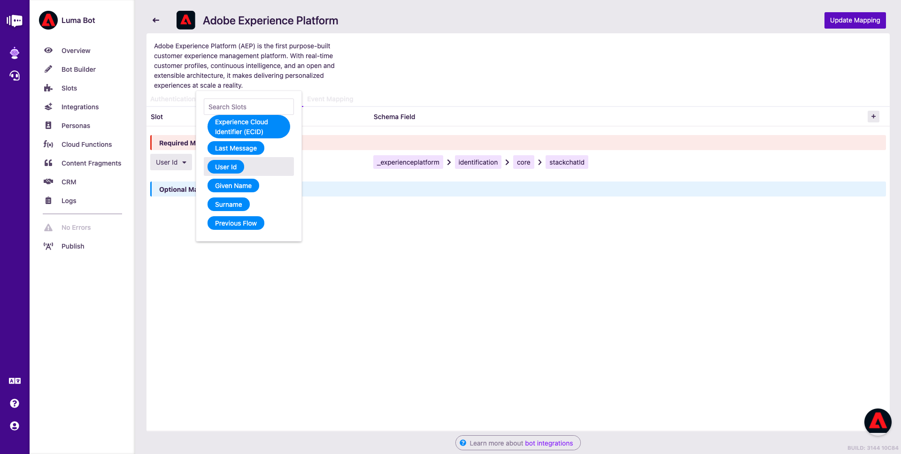

# 20.5 Configure the integration between Stackchat and Adobe Experience Platform

In order for Stackchat to send and receive events from Adobe Experience Platform, you need to create and configure an integration in Stackchat Studio. Before setting up the integration in Stackchat Studio, you need to have created an Adobe I/O project that allows you to interact with the Adobe Experience Platform APIs.

## 20.5.1 Your existing Adobe I/O Project

In module 3, during exercise [3.3.2 - Setup your Adobe I/O Project](./../module3/ex3.md), you created your own Adobe I/O project. When you created that Adobe I/O project, a certificate pair was created. You will need to use that certificate pair during this exercise. If you don't have it anymore, follow the steps outlined in exercise [3.3.2 - Setup your Adobe I/O Project](./../module3/ex3.md) to create either a new project, or simply to generate a new certificate pair.

Either way, before you continue you need to have these files ready:

- private.key
- certificate_pub.crt

These were generated during the setup of your Adobe I/O project, and they were automatically downloaded to your computer in a zip-file that is named **config.zip**.

Additionally, you'll need to open your Adobe I/O project to retrieve other important information of your **Service Account (JWT)** like Client ID, Client Secret and more.

To do so, go to [https://console.adobe.io/projects](https://console.adobe.io/projects). You'll then see this.


Go to **Projects** in the top navigation. Search for and then open you project, which should be named **Platform API ldap**.


After opening your project, you'll have a similar view. Click **Service Account (JWT)** to view the credentials of your Adobe I/O project.


You'll then see this. Keep this screen open during the next 2 steps as you'll need to enter these credentials in the Stackchat Studio user interface while setting up the integration.


## 20.5.2 Add your Adobe IO Credentials in Stackchat

In Stackchat Studio, click **Integrations** in your bot menu, then **Add Integration** in the top right and 


Next, choose **Adobe Experience Platform** from the modal window:


You'll now see the empty Adobe Experience Platform integration screen.


You now need to enter values for all the fields in the Authentication tab.

### JWT Service Account fields

The Client ID, Client Secret, Technical Account ID and IMS Org ID fields can all be populated by copying/pasting the JWT Service Account values from this page:


After filling out these values, you should now have this:


### Private Key

The **Private Key** field must contain the entire contents of the **private.key** file you generated as part of the setup of your Adobe I/O Project. Open **private.key** in a text editor and copy/paste the entire contents into the Private Key text input.


After pasting your private.key into Stackchat Studio, you should now have this:


### Connection ID

The Connection ID is the last portion of the DCS Inlet ID, which is already saved in your configuration ID [here](https://public.aepdemo.net/admin_configuration.html). But to save you the click, your DCS Inlet ID is as follows:

`--dcsInletId--`

You now just need to copy every character after the final **/** in the URL and paste the value into the **Connection ID** field in Stackchat Studio, in this example: **92b2eb1267c8fc7ee8b41a760a7d616714ca380b449d2d83e68adf692a0a28b1**.

Next, click **Verify Credentials**.


>[!NOTE]
>
>If you get an **Invalid AEP Credentials** error, double check that you've correctly copy/pasted everything.

## 20.5.3 Configure Sandbox, Schemas and Datasets

Stackchat sends two types of events to Adobe Experience Platform: user profile events, and behavioral interaction events. Each type of event needs a dedicated schema and dataset defined in Adobe Experience Platform. In this step, you'll tell Stackchat where it should send profile and interaction data in your Adobe Experience Platform sandbox.

If your credentials in the previous step are correct, you'll be automatically switched to the **Data Routing** tab. Click **Fetch sandboxes**.


After the sandboxes have been fetched, search for your sandbox name and select it. Your sandbox to use is `--aepSandboxId--`. In this example, the sandbox is called **AEP Enablement FY21**.


Wait a few seconds while your schemas and datasets are loaded. Once the UI has loaded, select the following values:

- **Profile Schema**: **Demo System - Profile Schema for Stackchat Chatbot (Global v1.1)**
- **Event Schema**: **Demo System - Event Schema for Stackchat Chatbot (Global v1.1)**
- **Profile Dataset**: **Demo System - Profile Dataset for Stackchat Chatbot (Global v1.1)**
- **Event Dataset**: **Demo System - Event Dataset for Stackchat Chatbot (Global v1.1)**

Now hit **Save configuration** so you can move to the next step.


## 20.5.4 Profile Mapping

In this next tab, you will map your Stackchat slots to properties defined in your Adobe Experience Platform schema. You'll see this:


The first mapping to do is the required mapping for the Stackchat ID. From the **Choose a Slot** menu, select **User Id**.



Next, you need to add several optional mappings. Here's a table of what to map additionally:

| Slot Name       | Schema Mapping  |
|-----------------|-----------------|
| ECID            | ``--aepTenantId--``.identification.core.ecid |
| Email           | ``--aepTenantId--``.identification.core.email |
| FirstName       | person.name.firstName |
| NpsScore        | ``--aepTenantId--``.customerSatisfactionScore.score |
| NpsFeedback     | ``--aepTenantId--``.customerSatisfactionScore.feedback |
| NPSFeedbackText | ``--aepTenantId--``.customerSatisfactionScore.detailedFeedback |

For each of the mappings, click the **+** button to add a new mapping.


As an example, let's start by mapping the user's Experience Cloud Id. Select ECID from the **Choose a Slot** menu.


You're doing great! Now just repeat this process for the following slots you created in [exercise 20.2.2](./ex2.md). They will all have corresponding schema properties set up for you.

Your final mapping should look like this:


Once these are all mapped, hit **Update Mapping** in the top right.

## 20.5.5 Event Mapping

In this tab, you'll map Stackchat slots to the behavioral events that Stackchat sends to Adobe Experience Platform. The Schema you selected in step 20.5.2 (**Demo System - Event Schema for Stackchat Chatbot (Global v1.1)**) has a `--aepTenantId--.chatbotInteraction` mixin that will be automatically populated by Stackchat with information like which conversation flow the user is in, or when a cloud function gets executed. Your only job here is to map the identification slots so that Adobe Experience Platform can attribute this behavior to the correct user.

Add the following mappings in your Event Mapping tab.

| Slot Name       | Schema Mapping  |
|-----------------|-----------------|
| User Id         | ``--aepTenantId--``.identification.core.stackchatId |
| ECID            | ``--aepTenantId--``.identification.core.ecid |
| Email           | ``--aepTenantId--``.identification.core.email |

Your final mapping should look like this:


Once these are all mapped, hit **Update Mapping** in the top right.

## 20.5.5 Sending Product View Events to Adobe Experience Platform

There will be situations where you want to send events to Adobe Experience Platform in addition to the user profile and behavioral events that Stackchat automatically sends. When this situation arises, you can send these special-case events to Adobe Experience Platform via a Stackchat Cloud Function.

In this section, we'll configure your Luma Bot to send Adobe Experience Platform **User Identified** events when we capture an email address and **Product View** events when the user hits the ❤️ button of a given product card.


The ❤️ button is already configured as a [postback button](https://docs.stackchat.com/Cloud-Functions/Reference-and-Examples/Dynamic-Content-SDK/Messages.html#postback-button) which means that it will invoke a cloud function when the user clicks it. The ❤️ button is configured to invoke the **notifyAEPOfProductView** cloud function and it passes in a payload that looks like this:

```node
{
  name: result.name,
  imageUrl: result.image1.url,
  price: result.finalPrice,
  sku: result.SKU,
  pageUrl: BASE_PRODUCT_URL + result.productUrl
}
```

The **notifyAEPOfProductView** method is already set up to construct an Adobe Experience Platform Product View event from this payload, but it needs to know the id of the Product View / User Identified Schema from your Adobe Experience Platform sandbox. 

Go back to your Visual Studio Code environment and open the file **_constants.ts**.


You now need to update these three lines of code:

```node
export const CUSTOM_EVENT_SCHEMA_ID = 'XXXX';   // For "product viewed" and "user identified" events
...
export const CUSTOM_EVENT_DATASET_ID = 'XXXX';
export const CUSTOM_EVENT_ORCHESTRATION_EVENT_ID = 'XXXX';
```

### CUSTOM_EVENT_SCHEMA_ID

You can obtain the CUSTOM_EVENT_SCHEMA_ID id by opening up the Adobe Experience Platform user interface, going the **Schemas** page and searching for **Demo System - Event Schema for Stackchat Chatbot (Global v1.1)** and click to open the schema. 


To get the schema id, copy the it from the URL - it's the long number at the end of the query string, e.g **fa8b21f33509e8ab9d5139b53652b61ec2b18dcea1388411**.


Copy the schema id and paste it into this field in the **_constants.ts** file:

```node
export const CUSTOM_EVENT_SCHEMA_ID = 'fa8b21f33509e8ab9d5139b53652b61ec2b18dcea1388411';
```

Your file **_constants.ts** should now look like this:


### CUSTOM_EVENT_DATASET_ID

Now let's do the same for the dataset. Bring up the Adobe Experience Platform user interface, open the **Datasets** page and search for **Demo System - Event Dataset for Stackchat Chatbot (Global v1.1)** and click on the resulting dataset result.

Copy the dataset id from the label on the right and paste it into this field in the **_constants.ts** file:


```node
export const CUSTOM_EVENT_DATASET_ID = 'paste-your-value-here';
```

Your file **_constants.ts** should now look like this:


### CUSTOM_EVENT_ORCHESTRATION_EVENT_ID

One last item remaining: your Journey Orchestration Id from the previous step! In [20.4 Use Journey Orchestration to trigger an email follow up after interacting with your chatbot](./ex4.md) you created your own event in Journey Orchestration. Copy the orchestration eventID you created and paste it into this field in the **_constants.ts** file. 

You can find the orchestration eventID here: 


In this example, the orchestration eventID is **bacd25051c871367b0e2d5e4a1af292c6b716673faf85aad776de0e010e0d88a**

```node
export const CUSTOM_EVENT_ORCHESTRATION_EVENT_ID = 'XXXX';
```

Your file **_constants.ts** should now look like this. Save your changes in the file **_constants.ts**


You're all set! Now we just need to compile your code and update your cloud functions in Stackchat Studio.

First, open a terminal (**View -> Terminal**).

 

This will open a panel at the bottom of your VS Code window.

>[!NOTE]
>
>Make sure you're working in the correct directory. For the following steps we will need to work within the **/cloud-functions** directory. To confirm this type **pwd** (print work directory) within the terminal and press enter. If the path that is printed ends with **/cloud-functions** then you're all set, if not try running **cd cloud-functions** to set the correct directory. Now, re-run **pwd**, you should now see the path end with **/cloud-functions**.

Build your cloud functions by running the following command in terminal: **npm run build** and press enter.


This will generate a folder called **./dist** which will contain a single file called **cloud-functions.js**.


Open the file **cloud-functions.js**, copy everything and paste it into your cloud function editor in Stackchat Studio, replacing the current code, and hit the **Save** button.


Great job, you're nearly there! Hit the **Publish** button at the bottom of the left hand navigation and hum a nostalgic tune while you wait for your Luma Bot to publish.


After the bot has finished publishing, open the chat widget and send the message **/reset** to clear your chat session and start over. 


You'll then see this. Give your name and click **Send**. 


Next, select the **I need ideas** menu item.


You'll then see this. Click **Yes**. 


Next, provide your email address.


Confirm your email address by clicking **Yes**.


You'll then see that Luma products are displayed inside the chatbot.


Next, hit the ❤️ button on a few products to generate product viewed events and to trigger your journey in Journey Orchestration.

A couple of seconds later, you should receive an email from Adobe Experience Platform and Journey Orchestration with a promotion for the item you just liked.


>[!NOTE]
>
>You'll notice that if you now repeat the **I need ideas** flow, Luma Bot will remember the products you previously liked and display them as a recommendation. It does this by fetching the user's **product viewed** events from Adobe Experience Platform.

The next question in the chatbot is if you would mind giving feedback on your chat experience. Click **Sure**.


Make your choice, in this case the choice is **Great**.


Click **Happy to!**


Give your additional detailed feedback and click **Send**.


Let's verify data ingestion in Adobe Experience Platform's Real-time Customer Profile now.

Go to [https://platform.adobe.com](https://platform.adobe.com) and navigate to **Profile**. Click the **+ Browse** button. You'll then see this:


Select the **Identity Namespace** - **Email** and enter the email address you submitted in the Stackchat chat conversation. Click **View** and then click the **Profile ID** of your profile.


You'll then see a basic overview of your customer profile in Adobe Experience Platform. Go to **Attributes**.


In **Attributes**, you'll see things like your NPS score and detailed feedback. Go to **Events**.


In **Events**, you'll see all the interactions that have taken place. If you click the **View JSON** button, you can see even more detail, like in this case, all the details around the product view event on the Nadia Elements Shell product.


If you received your email and were able to visualize your profile in Adobe Experience Platform, your integration with Stackchat is now working fine and you can continue with the next exercise.

Next Step: [20.6 Test your chatbot on the demo website](./ex6.md)

[Go Back to Module 20](./ai-driven-chat-apps-stackchat.md)

[Go Back to All Modules](./../../overview.md)
