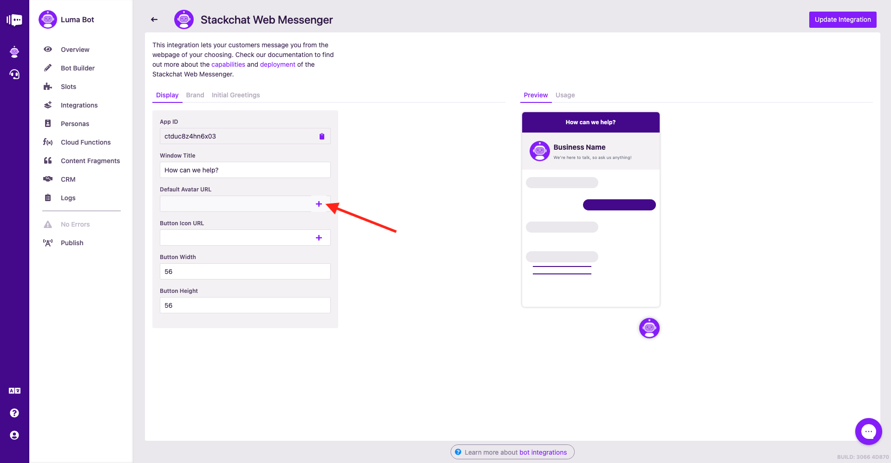
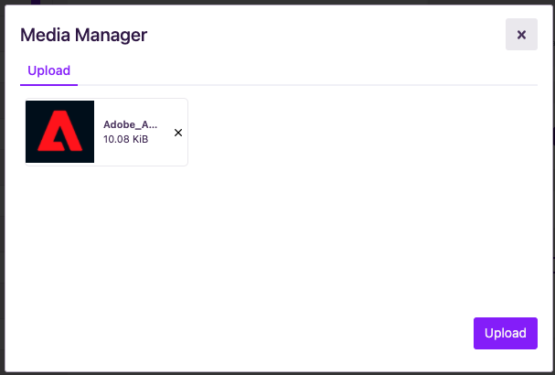
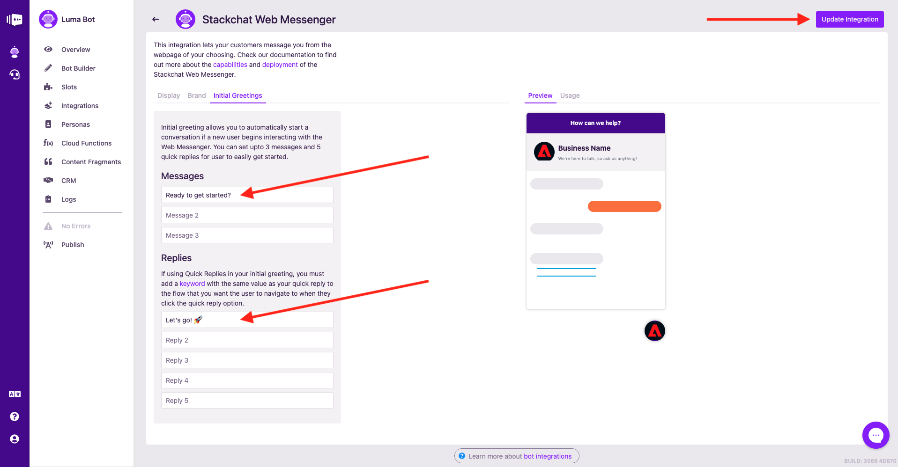
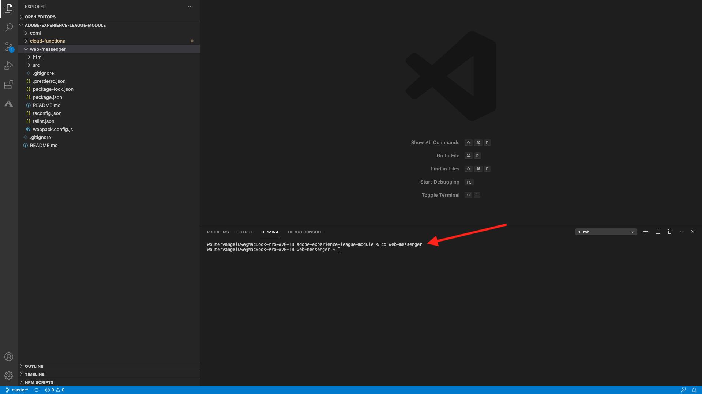
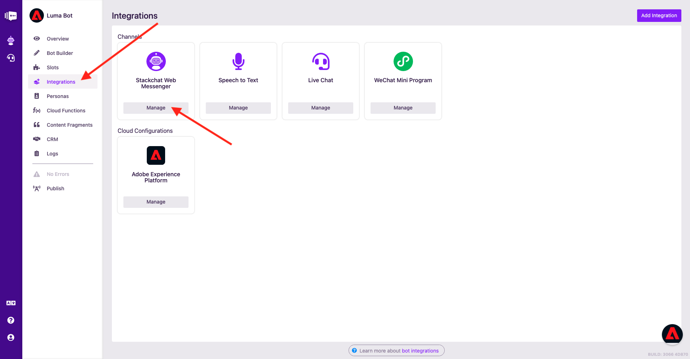
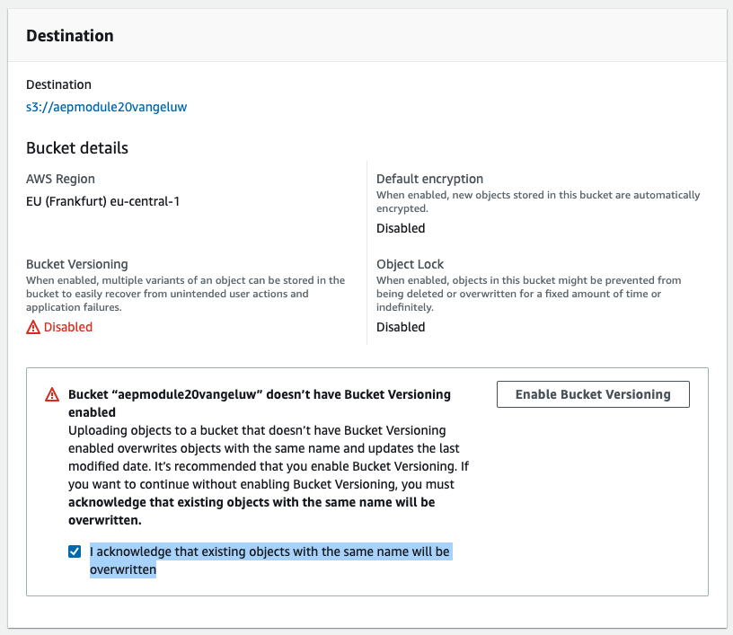
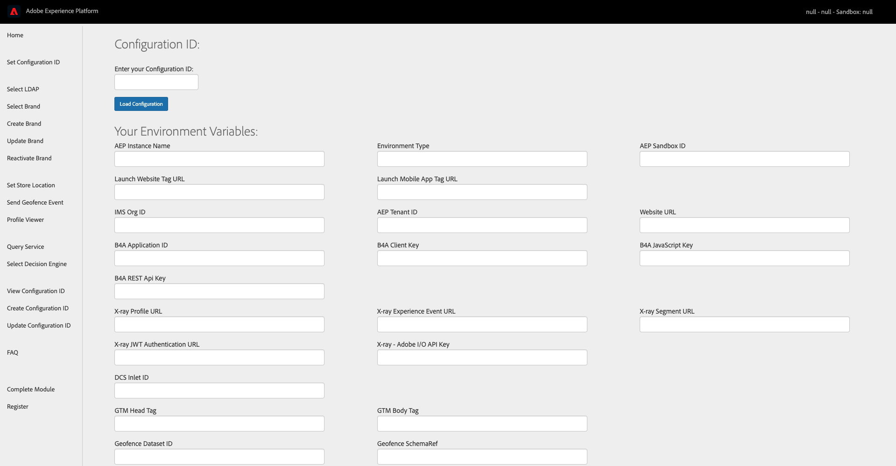

# 20.6 Test your chatbot on the demo website

Stackchat's [web messenger widget](https://www.npmjs.com/package/@stackchat/web-messenger) allows you to add your Luma bot to your Luma demo site. In this section, you'll configure the integration in Stackchat Studio, build the website project and then add the JavaScript to your Luma demo site to enable real-time web chat.

- Latest version of [Node.js](https://nodejs.org/en/download/) installed. Please make sure you’re running Node v12 or above
- Latest version of [Github for Desktop](https://desktop.github.com/) (or feel free to use the Git command line tool if you'd prefer)
- AWS S3 account (or another hosting solution of your choice) to host your Luma Bot javascript

## 20.6.1 Configure your web messenger

Once logged in to [Stackchat](https://app.stackchat.com/bots), navigate to Bots in the left hand menu, select your Luma Bot and then hit the **Integrations** button on your bot menu. Now click the **Manage** button for the Stackchat Web Messenger.


You'll then see this. Hit the **+** button next to the input on the **Default Avatar URL** field.



First download the below image to your computer:


Then upload it in the popup window in Stackchat Studio:


Finally, click **Upload**.



Now do the same for the Button Icon URL field (or just copy and paste the new URL from the previous field). Leave the other fields alone.


Select the **Brand** tab and upload the same image for the Business Icon URL field (or just copy and paste the URL from the previous field).

For the Brand Color and Conversation Color fields, use the value **F3793B**. For the Action Color field, use the value **26A9E0**.

You should now have this:


Select the **Initial Greetings** tab and add this text to the first message field:

**Ready to get started?**

Then add this text to the first Quick Reply field:
**Let's go! 🚀**

If you're curious, open the bot builder, edit your CDML and perform a search for the term **Let's go! 🚀**. You will see that it has been configured as a keyword on the **Welcome** flow. This is where Luma Bot will navigate users if they choose this quick reply.

Click **Update Integration** to save your changes.



After the save is complete, open the web messenger widget and preview the Luma branding that is now displayed!


However, you'll see that the quick reply you configured in the **Initial Greetings** tab isn't displayed. This is because it will only be seen by new users. 

To test it out, click the **Overview** button from your bot menu then click the **Share** button in the top right.


Click the **Copy Link** button. 


Then open a new incognito window and paste the URL you copied.


You should now see your quick reply initial greeting appear. Click it and see how your Luma Bot takes you to your **Welcome** flow.


Your web messenger is now ready to be embedded on your Luma demo site!

## 20.6.2 Add the Web Messenger to your demo site

Go back to your Visual Studio Code editor.

Once open, navigate to the **./web-messenger** folder.


Open a terminal (**View -> Terminal**).


Enter the command **cd web-messenger** and hit **enter**.



Run the command **npm i** to install the project dependencies.


Take a moment to explore the **src** folder of the project. Here is a breakdown of the two folders:

- **luma-api**: logic to fetch Luma brand info from the demo API
- **messenger**: logic to instantiate the web messenger and customize it


Before we build and test the project, the config needs to be updated with your bot's App Id. 

Go to [Stackchat Studio](https://app.stackchat.com/bots), navigate to your Luma Bot and click **Integrations** on the bot menu. Click on the **Manage** button for Web Messenger.



In the Web Messenger screen, copy the App ID:


Now go back to Visual Studio Code, open the config file: **src/messenger/config.ts** and add your App ID value to the config object on line 4, making sure it's a **string**, i.e in quotations:

```node
appId: null, // Replace this null value with your Luma bot's App Id! e.g "k9s9xxxxxx"
```

In this example, the App ID is **"ctduc8z4hn6x03"**, so the updated line 4 should now look like this:

```node
appId: "ctduc8z4hn6x03", // Replace this null value with your Luma bot's App Id! e.g "k9s9xxxxxx"
```


Save your changes in the config file. Now you're ready to build and test your project. Bring up your terminal (**View -> Terminal**) and run the build command:

**npm run build**

This command executes Webpack, which has been configured to compile your TypeScript project into a single JavaScript file that is compatible with browsers.
The build should complete successfully:


Your project will now have a **dist** folder that has been generated by Webpack. It will contain a file called **bundle.js**. You'll need to host this file in the next step so that it can be accessed by the demo website.

## 20.6.3 Host your JavaScript file

In order to get your Luma Bot on the demo site, you need to host your **bundle.js** file somewhere and make it publicly accessible. In [Exercise 5.1 - Setup an AWS S3 bucket](./../../modules/module5/ex1.md) you've already set up an AWS bucket that we can leverage.

Log in to your to your AWS S3 account: [https://console.aws.amazon.com/s3](https://console.aws.amazon.com/s3). Since you need this file to be publicly available, let's create a new Bucket. Click **Create Bucket**.


Name the bucket **aepmodule20LDAP**, for example **aepmodule20vangeluw** and choose the region applicable to you.


Scroll down until you see **Bucket settings for Block Public Access**. 

- Uncheck the checkbox for **Block all public access**
- Check the checkbox for **I acknowledge that the current settings...** 

You should have a similar view now:


- Click **Next** again keeping the **Name and Region** settings as they are.
- In the **Configure Options** section, untick **Block all public access**. This will bring up a acknowledgement statement confirming anything in this bucket may be publicly accessible. Tick the box to acknowledge, then click **Next**


Scroll down and click **Create Bucket**.

Now your new Bucket is created, click it to open it.


You'll then see this.


Click **Upload**. You'll then see this:


Click **Add Files**, navigate to and then select your **bundle.js** file.


You now see this. Scroll down a but onto the **Destination** field and check the checkbox for **I acknowledge that existing objects with the same name will be overwritten**.



Scroll down and click **Upload**.


You'll then see this. Click the filename **bundle.js**.


You should now be able to view the file's overview details, including an **Object URL**. Copy this URL as you'll need this in the next step. Click the **Make Public** button.


You've now successfully hosted your **bundle.js** file. In the next step, you'll have to paste the **Object URL** in the **Update Configuration ID** screen.

## 20.6.4 Update your demo site configuration ID

To ensure the demo site loads your Luma chatbot, you'll need to update your demo website configuration ID to include:

- Stackchat **bundle.js** JavaScript URL that you just created via your S3 bucket
- Journey Orchestration Event ID to trigger the journey you set up in [Exercise 20.4](./ex4.md).

Go to [https://public.aepdemo.net/admin_configuration_update.html](https://public.aepdemo.net/admin_configuration_update.html) page in a fresh, clean incognito window. You'll then see this:



Enter your configuration ID and hit the **Load Configuration** button. You'll then have this:


Scroll down until you see the fields **EventID - Stackchat Journey** and **Stackchat Chatbot Tag**. 


Replace the **EventID - Stackchat Journey** value (which is empty) with your orchestration EventID that you created in [Exercise 20.4.1](./ex4.md) and replace the current **Stackchat Chatbot Tag** value with the Object URL of your hosted file **bundle.js**, which is the AWS S3 Object URL you created in the previous step.


Scroll down and click the **Update Configuration ID** button. You're now ready to test!


## 20.6.5 Run through a demo scenario

Go to [https://public.aepdemo.net/](https://public.aepdemo.net/). Enter your Configuration ID and click Load Configuration. Then, select your LDAP and then select your brand. Select the brand **Luma**.

When you then reach the Luma homepage, you'll see your chatbot being loaded and the icon will display in the bottom right part of the screen.


First, go to **LOGIN/REGISTER**, fill out your personal information and create a new account.


You'll then see that the chatbot is using your first name in the call to action:


This can be achieved this by attaching user information to message metadata in the **beforeSend** delegate in the file helper.ts, so that the chatbot doesn't have to ask for info we already know. You can learn more about [message metadata here](https://docs.stackchat.com/Cloud-Functions/Reference-and-Examples/Filtering-and-Transforming-Messages-with-Metadata.html).

Open the chat widget and click **Let's go!**. 


You'll then see this. Next, select the **I need ideas** menu item.


You'll then see that Luma products are displayed inside the chatbot.


Next, hit the ❤️ button on a few products to generate product viewed events and to trigger your journey in Journey Orchestration.


A couple of seconds later, you should receive an email from Adobe Experience Platform and Journey Orchestration with a promotion for the item you just liked.


The next question in the chatbot is if you would mind giving feedback on your chat experience. Click **Sure**.


Make your choice, in this case the choice is **Great**.


Click **Happy to!**


Give your additional detailed feedback and click **Send**.


Finally, open your X-ray panel and click the refresh button. You'll then see your product view appear in the X-ray panel.


Your web messenger chatbot is now working fine. Let's now connect your chatbot to Facebook Messenger. 

Next Step: [20.7 Connect your chatbot to Facebook Messenger](./ex7.md)

[Go Back to Module 20](./ai-driven-chat-apps-stackchat.md)

[Go Back to All Modules](./../../overview.md)
