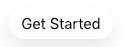

# 20.7 Connect your chatbot to Facebook Messenger

In this exercise you'll be using the Facebook desktop site to connect your chatbot to Facebook Messenger, so you will need access to a Facebook account.

## 20.7.1 Create a Facebook Page

Once logged into your Facebook account select the **+** icon in the top right of the screen.

This will display a **Create** drop down with a variety of options.

Select **Page**.

You will now be given option to start filling in your Page information, such as Page name, category, description etc. Please fill these fields in as you see fit, but in this example we have used the following:

| Requested Information     | Explanation | Example Answer    |
|:-------------:| :---------------:| :---------------:|
| Page Name | ldap-fb-page | **idejong-fb-page** |
| Category [industry] | industry or business type | **Retail Company** |
| Description | description of the Page | **My facebook page for chat bot testing** |

Once complete click **Create Page**.

You will now be given the option to add a profile picture and cover photo in the left hand options. Feel free to do so, but this is optional.

Once you're happy with the Page details, click **Save**.

You will now be shown your finished Facebook page. Feel free to continue to update & edit your new Facebook page as you see fit, but for the purposes of this tutorial we will progress to setting up the chat bot...

## 20.7.2 Configure Advanced Messaging within Facebook Page

On the homepage of your newly created Facebook Page you will see a list of options on the left hand side of the screen.

Select **Page Settings** at the bottom of the options.

Here you can spend a great deal of time configuring your Facebook Page as you see fit, but for the purposes of the tutorial we will progress to setting up the chat bot.

Select **Advanced Messaging**.

Scroll to **General Settings** > **Connected Apps**. you will see no apps are connected. This is where Stackchat will be listed once we connect our chatbot vis the Stackchat UI.

## 20.7.3 Connect Stackchat to Facebook Messenger

Now that your Facebook page has been created, we now need to give Stackchat permission to manage the messages that get sent to the page. Bring up your Luma Bot in Stackchat Studio and click the **Integrations** button from the bot menu.

Click the **Add Integration** button in the top right and select Facebook Messenger.

Click the **Manage Facebook Permissions** button.

You should see a Facebook login modal appear. If you don't, your browser may have blocked the modal popup. Check to see if there are any warnings and give permission for Stackchat to launch popups. Log in to your Facebook account.

Select all the pages that you want to connect a chatbot to. Stackchat will remember these pages and give you the option to select them from from a list. Hit the **Next** button when you've selected your pages.

Leave these permissions unchanged. Just hit the **Done** button, then the **Ok** button.

The modal will close and you can now select the Facebook page that you want to connect your chatbot to.

Hit the **Add Integration** button and you're done!

## 20.7.4 Test the integration

To begin the demo, login to [Facebook](https://www.facebook.com) and navigate to the Facebook Page you created in the previous steps. For this tutorial we will be using our [Luma Retail](https://www.facebook.com/lumachat) demo page.

Since you are Admin of this page, press the **View as Visitor** button.

This will change the view and present the page as if you were a customer

Press the **Send Message** button, located top right

This will open the chatbot, which is now powered by Stackchat. The first time you open the chat bot it will inform you that once you select **Get Started** Luma Retail will see your public info

Select **Get Started**.

Once the chatbot initiates you'll see a welcome message. Step through the "I need ideas" flow, like we did on the Web Messenger in the previous section, to test that the conversation displays correctly.

Next you will see Luma Bot shares the link to its policies and asks for consent. CLick **Yes** to continue.

Submit your demo email, either the one used while testing the Web Messenger or a new one to see what the experience is like if Facebook was the first touch point with Luma.

Luma Bot will now display a carousel of products. Browse through the products click the heart icon to like a product of your choice. I've always fancied some Parachute Pants...

>[!NOTE]
>
>Hot Tip! The following commands have been secretly 'baked in' to our chat bot:
>
>- **/debug** - this confirms which AEP instance the chat bot is currently connected to
>- **/reset** - This allows you to start the conversation again from scratch
>
>So at any point you can confirm the integration or reset the conversation, respectively. If you're curious, see if you can find these keyword configurations in the Studio UI or the CDML editor - they are configured using regular expressions!

Now that we've 'liked' the Cora Parachute Pants product we can check our email inbox to confirm our Journey set up in [Exercise 20.4](./ex4.md) was trigger and delivered successfully. 

Next we will see how we can continue the 'conversation' onsite. Now let's imagine the Facebook Messenger chat we just had with Luma bot was our first interaction with Luma retail and we want to see what the experience it like for a first time web site visitor after having interacted with the Luma Bot on Facebook. Navigate to the [Luma website](https://public.aepdemo.net/admin.html) in **incognito mode**. Because this is a new incognito window you'll need to set your ldap, brand (Luma) as usual. Once you have your new incognito Luma website open, check the X-Ray panel to confirm you're a new user, i.e no profile attributes or Experience Events.

Navigate to the **LOGIN/REGISTER** page and sign up with the same email you submitted used within the Facebook Messenger chat. Once signed in, navigate back to the homepage and open the X-Ray panel. You should now see your Facebook interaction under the Experience Events.

With the Web site and Web Messenger now being aware of your initial Facebook interaction, we can continue the 'conversation' and personalize the users next interactions as we see fit. You have just extended the conversation from a social channel as opposed to what would have been an uninformed incognito experience.

That's it! You've now completed the Facebook integration and have tested across Facebook Messenger and Web Messenger.

Next, let's take a brief look at another social channel, [WeChat](https://www.wechat.com/en/)...

Next Step: [20.8 Test the WeChat Integration](./ex8.md)

[Go Back to Module 20](./ai-driven-chat-apps-stackchat.md)

[Go Back to All Modules](./../../overview.md)
