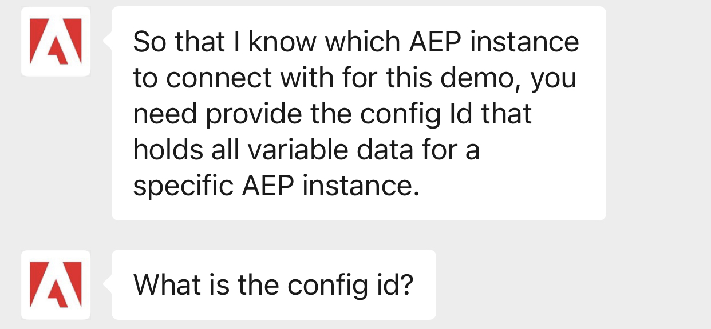
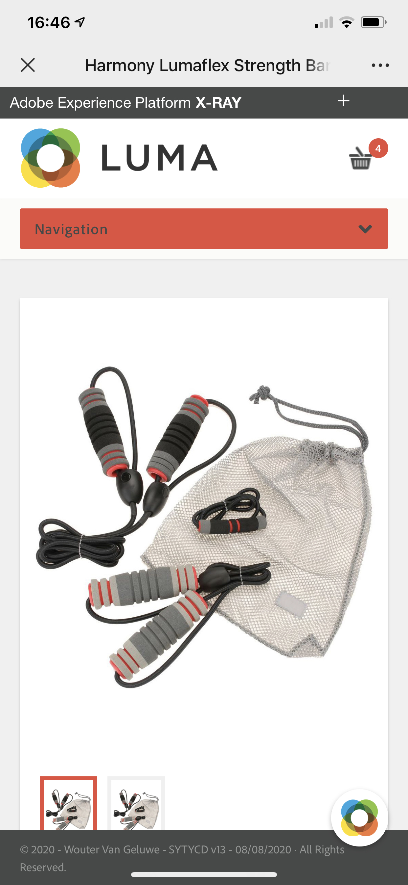

# 20.8 Test the WeChat Integration (Optional)

In this exercise we will be walking through the WeChat Mobile App, so you will need access to the app and a WeChat account.

## Notes

- The creation and configuration of WeChat Official Accounts to host the chatbot can be time consuming and require specific approval processes, so for the purposes of this tutorial we will only be looking at a pre-built version of the chat bot with minimal interactions built in.
- Unlike the Web experience, which picks up our configuration ID automatically, including the **brandID**, we will need to submit them at the beginning of the chatbot experience when prompted.

>[!NOTE]
>
>Hot Tip! The following commands have been secretly 'baked in' to our chat bot:
>
>- **/debug** - this confirms which AEP instance the chat bot is currently connected to
>- **/reset** - This allows you to start the conversation again from scratch
>
>So at any point you can confirm the integration or reset the conversation, respectively. If you're curious, see if you can find these keyword configurations in the Studio UI or the CDML editor - they are configured using regular expressions!

## 20.8.1 Add Adobe's WeChat Official Account to your contacts

Open your WeChat mobile app to the contacts page

Add a new contact by selecting the icon in the top right of the screen

On the **Add Contacts** screen, select the **Scan QR Code** option

Select the **Scan QR Code** option

If you haven't already done so, allow the app access to your camera. You should now have the ability to scan the following QR code

Once you scan, you should now see the following screen. Select **Follow** to add the Adobe Official Account

You should now the the following screen.

Now you have added the Adobe Official Account you will be able to find it at any time via your **Contact** page. Try it yourself by navigating back to your **Contact** page and selecting **Official Accounts**

Select **Official Accounts**

You should now see a list of Official Accounts you have added.

Select the Adobe Official Account

## 20.8.2 Interact with the chatbot within WeChat

To initiate the chat bot, on the Adobe Official account page, press the following icon, located centre bottom of the screen

This will open the chat bot for which you will see an automated greeting asking you to submit your configID

Next submit your brand ID, this can be found in your configuration [admin page](https://public.aepdemo.net/admin.html), once you have selected your brand. 

For this tutorial we will remain with Luma Retail, which is brand ID = 2. enter **2** and submit. You will see our Luma Bot load, presenting us with several options. Within WeChat we are unable to tap the options, so instead will submit the option number into the chat. 

enter **1** for 'I need ideas' and submit. Before showing you the product options, Luma bot will present a link to the policies and ask for confirmation you are ok to share you email. This is just one example of how we can introduce things like consent management and customer satisfaction checks into our chat app experiences. submit **1** to accept, continue to submit your email and confirm submission by submitting **1** again.

Now we've given consent and provided our email, Luma bot will list all the product cards available for Luma Retail. Here you may tap any product, which will take you to the Luma web site to begin your onsite experience. You'll notice there's not as many options or interactions as we found within the web and/or Facebook experience, but this may change in future.

Tap on any product and you will be taken to the product page of the Luma website

>[!NOTE]
>
>The first time you do this you will be taken to your demo admin page and asked for your configuration ID, ldap & brand before proceeding. Your settings will be remembered for any subsequent product taps within the WeChat chatbot.

Congratulations! You've now completed the module and have explored the wonderful world of Chat Apps! We highly recommend you now read through the [Summary & benefits](./summary.md) pages where we will run through some more sample use cases and benefits chat apps can deliver to your business.

Next Step: [Summary and benefits](./summary.md)

[Go Back to Module 20](./ai-driven-chat-apps-stackchat.md)

[Go Back to All Modules](./../../overview.md)
