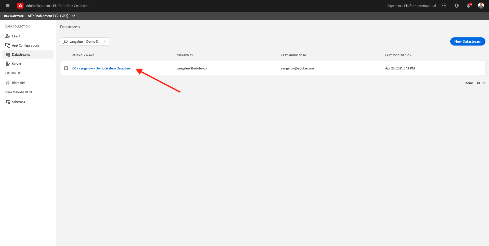
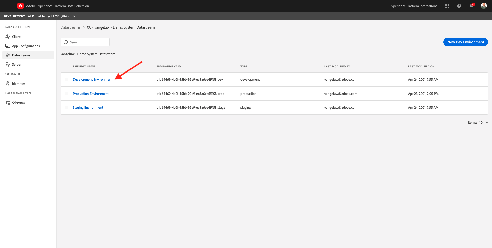
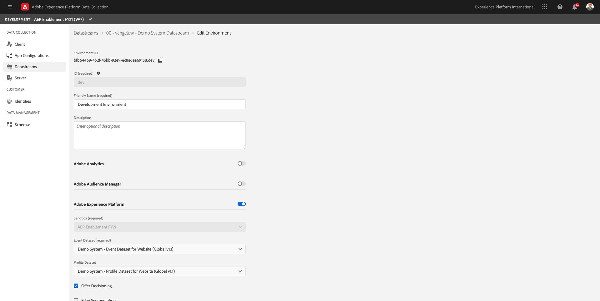
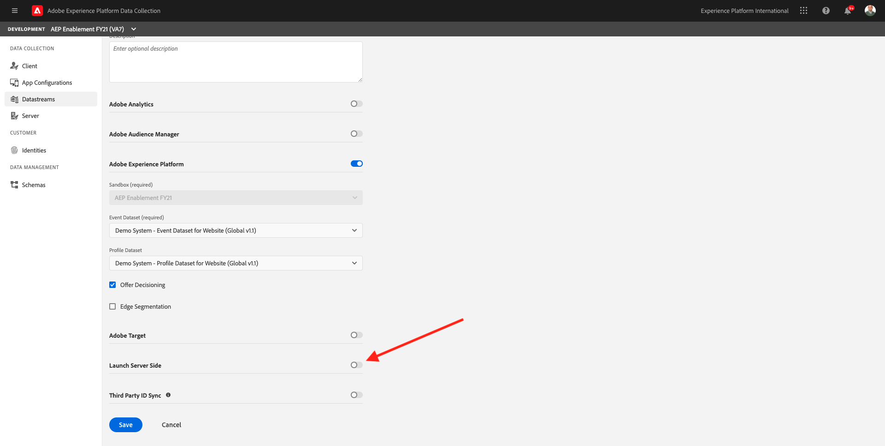
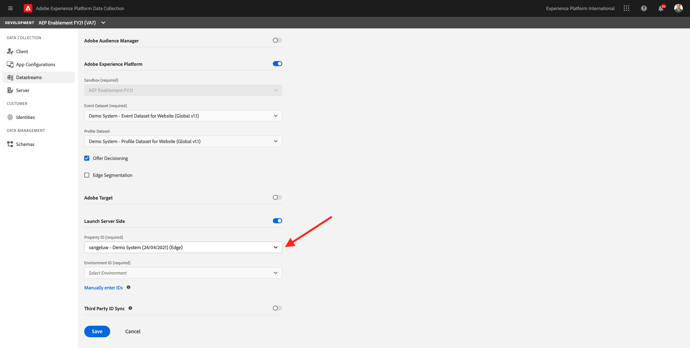
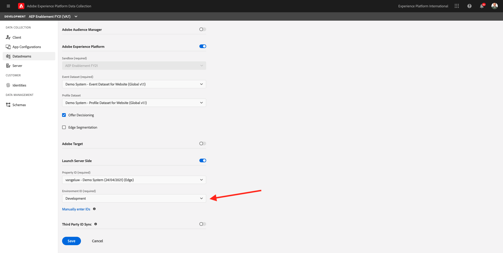
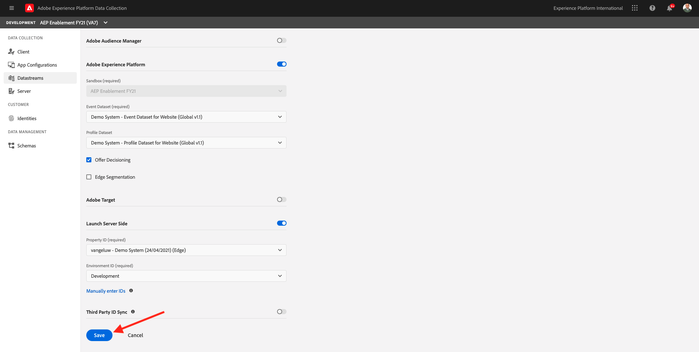
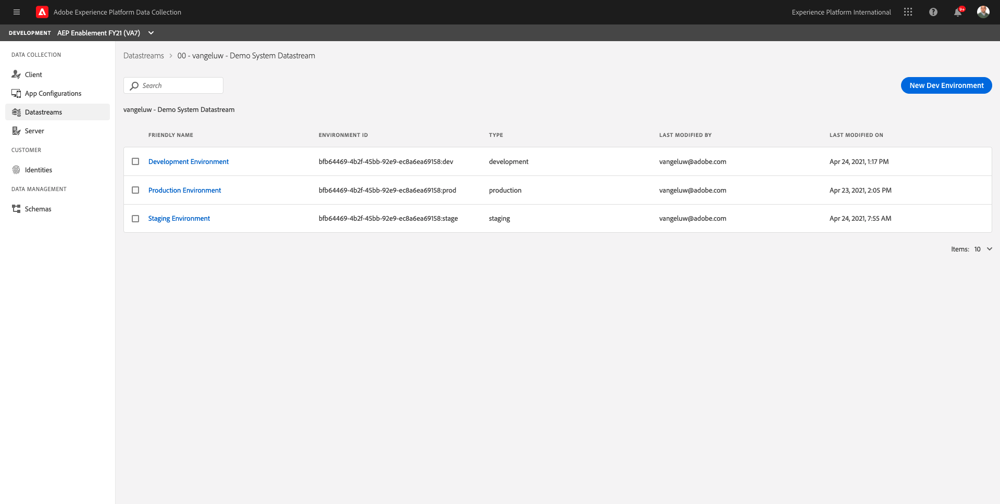
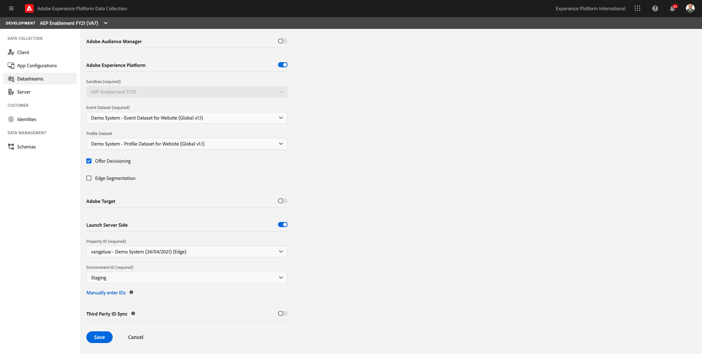
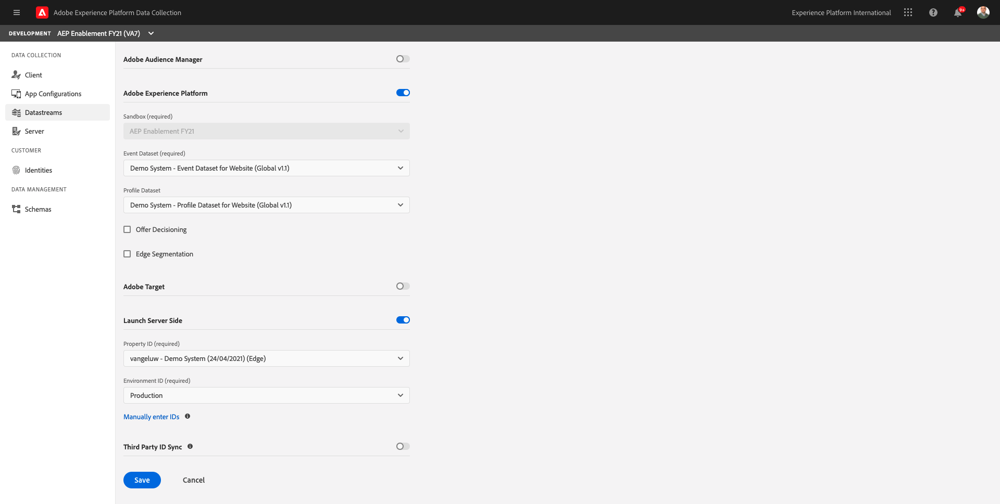

# 21.2 Update your Datastream to make data available to your Adobe Experience Platform Data Collection Server property

## 21.2.1 Update your Datastream

In [Exercise 0.2](./../../modules/module0/ex2.md), you created your own **[!UICONTROL Datastream]**. You then used the name **ldap - Demo System Datastream** and replaced **ldap** with your ldap.

In this exercise, you need to configure that **[!UICONTROL Datastream]** to work with your **[!DNL Adobe Experience Platform Data Collection Server property]**.

To do that, go to [https://experience.adobe.com/#/data-collection/](https://experience.adobe.com/#/data-collection/). You'll then see this. In the left menu, click **[!UICONTROL Datastreams]**.

Search for your **[!UICONTROL Datastream]**. Click your **[!UICONTROL Datastream]** to open it.

You'll then see this. Click **[!UICONTROL Development Environment]**.

In the **[!UICONTROL Development Environment]**, you'll see your Adobe Experience Platform configuration. 

Scroll down to **[!DNL Launch Server Side]** and toggle the button to turn [!DNL Launch Server Side] on.

You can then select your **[!DNL Launch Server Side Property ID]** from the dropdown list. Search and select the **[!DNL Launch Server Side property]** you created in the previous step.

After selecting the **[!DNL Launch Server Side property]**, you need to select the Environment ID. Select **[!DNL Development]**.

Click **[!DNL Save]**.

You'll then be back here.

Next, repeat the above steps for the other environments.

This should be your configuration for the **[!DNL Staging Environment]**.

And this should be your configuration for the **[!DNL Production Environment]**.

Your Datastream is now ready to work with your **[!DNL Launch Server Side property]**.

Next Step: [21.3 Create and configure a custom webhook](./ex3.md)

[Go Back to Module 21](./aep-data-collection-ssf.md)

[Go Back to All Modules](./../../overview.md)
