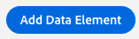
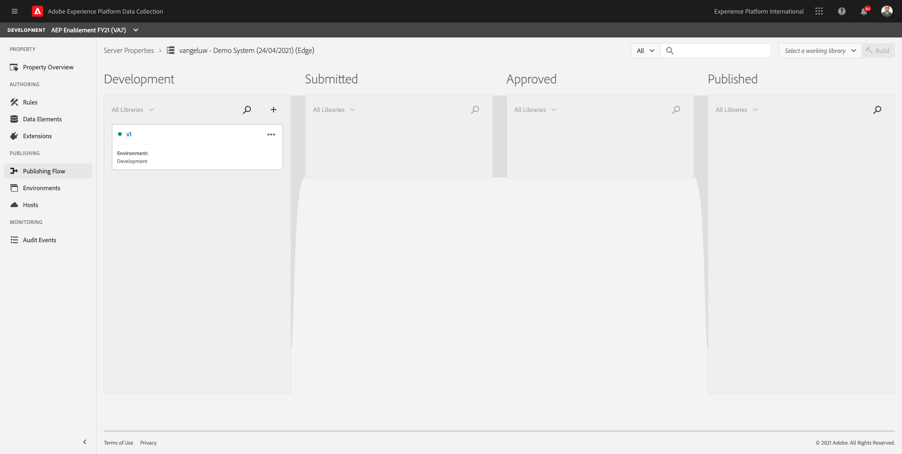
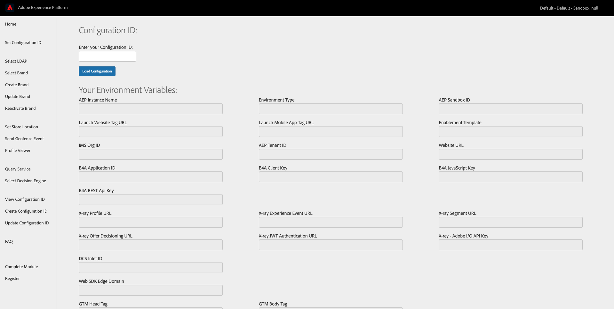
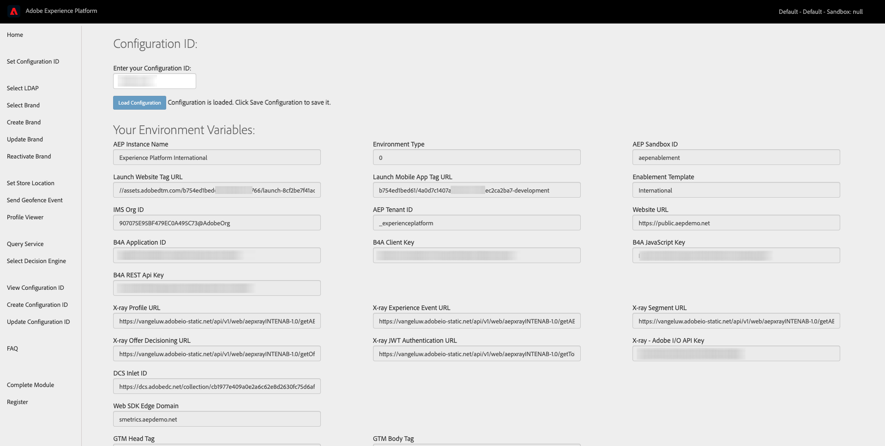
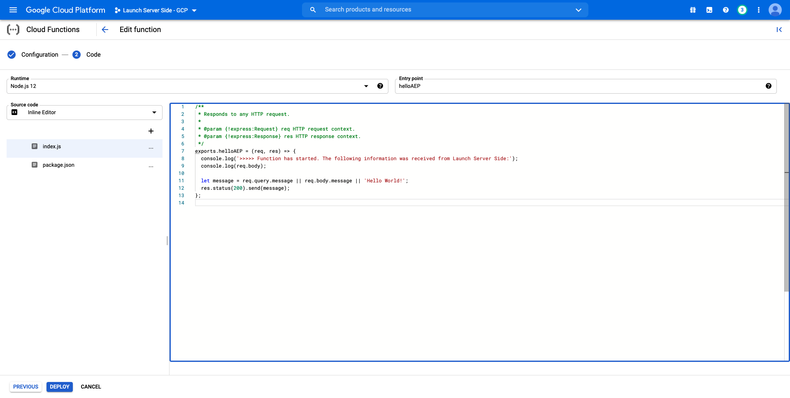

# 21.4 Create and configure a Google Cloud Function

## 21.4.1 Create your Google Cloud Function

Go to [https://console.cloud.google.com/](https://console.cloud.google.com/). Go to **Cloud Functions**.


You'll then see this. Click **Create Project**.


As a **Project Name**, use **Launch Server Side - GCP**. 
As **Location**, make a choice where to store your project.

Click **CREATE**.


Your project will then be created.


You can then create a Cloud Function. Click **CREATE FUNCTION**.


You'll then see this.


Make the following choices:

- **Function name**: ldap-launch-ssf (replace ldap by your ldap)
- **Region**: select any region
- **Trigger Type**: select **HTTP**
- **Authentication**: select **Allow unauthenticated invocations**

You should now have this. Click **SAVE**.


Click **NEXT**.


You'll then see this:


Make the following choices:

- **Runtime**: select **Node.js 12**
- **Entry point**: enter **helloAEP**


Click **ENABLE API** to enable **Cloud Build API**. You'll then see a new window. In that new window, click **ENABLE** again.


Once **Cloud Build API** has been enabled, you'll see this.


Go back to your **Cloud Function**.


In your Cloud Function Inline Editor, make sure you have the following code there:

```javascript
/**
 * Responds to any HTTP request.
 *
 * @param {!express:Request} req HTTP request context.
 * @param {!express:Response} res HTTP response context.
 */
exports.helloAEP = (req, res) => {
  let message = req.query.message || req.body.message || 'Hello World!';
  res.status(200).send(message);
};
```

Next, click **DEPLOY**.

You'll then see this. Your Cloud Function is now being created. This may take a couple of minutes.


Once your function is created and running, you'll see this. Click on your function's name to open it.


You'll then see this. Go to **TRIGGER**. You'll then see the **Trigger URL** which is what you'll use to define the endpoint in Launch Server Side.


Copy the Trigger URL, which looks like this: **https://us-central1-launch-server-side-gcp.cloudfunctions.net/vangeluw-launch-ssf**.

In the next steps, you'll configure Adobe Experience Platform Data Collection Server to stream specific information about **Page Views** to your Google Cloud Function. Instead of just forwarding the full payload as-is, you'll only send things like **ECID**, **timestamp** and **Page Name** to your Google Cloud Function.

Here's an example of a payload that you'll need to parse to filter out the above mentioned variables:

```json
{
  "events": [
    {
      "xdm": {
		  "eventType": "web.webpagedetails.pageViews",
		  "web": {
		    "webPageDetails": {
		      "URL": "https://public.aepdemo.net/index.html",
		      "name": "Luma Home"
		    },
		    "webReferrer": {
		      "URL": "https://public.aepdemo.net/admin.html"
		    }
		  },
		  "device": {
		    "screenHeight": 1080,
		    "screenWidth": 1920,
		    "screenOrientation": "landscape"
		  },
		  "environment": {
		    "type": "browser",
		    "browserDetails": {
		      "viewportWidth": 1920,
		      "viewportHeight": 507,
		      "userAgent": "Mozilla/5.0 (Macintosh; Intel Mac OS X 11_1_0) AppleWebKit/537.36 (KHTML, like Gecko) Chrome/88.0.4324.96 Safari/537.36",
		      "acceptLanguage": "en"
		    }
		  },
		  "placeContext": {
		    "localTime": "2021-01-29T15:45:26.815+01:00",
		    "localTimezoneOffset": -60
		  },
		  "timestamp": "2021-01-29T14:45:26.815Z",
		  "implementationDetails": {
		    "name": "https://ns.adobe.com/experience/alloy/reactor",
		    "version": "2.3.0+2.2.0",
		    "environment": "browser"
		  },
		  "_experienceplatform": {
		    "identification": {
		      "core": {
		        "ecid": "83249052138816938582105724584714316131"
		      }
		    },
		    "demoEnvironment": {
		      "tms": "Launch",
		      "ldap": "vangeluw",
		      "brandLogo": "https://parsefiles.back4app.com/hgJBdVOS2eff03JCn6qXXOxT5jJFzialLAHJixD9/d632e769791f0a4dbe0b84058d282d45_logo.png",
		      "brandName": "Luma",
		      "brandIndustry": "retail"
		    }
		  }
		}
```

These are the fields that contain the information that needs to be parsed out:

- ECID: **events.xdm._experienceplatform.identification.core.ecid**
- timestamp: **timestamp**
- Page Name: **events.xdm.web.webPageDetails.name**

Let's go to Adobe Experience Platform Data Collection Server now, to configure the data elements to make that possible.

## 21.4.2 Update your Adobe Experience Platform Data Collection Server property: Data Elements

Go to [https://experience.adobe.com/#/data-collection/](https://experience.adobe.com/#/data-collection/).


In the top left corned, click **Client Side** and in the dropdown menu, click **Server Side**. You'll then see an overview of all available Adobe Experience Platform Data Collection Server properties. Click to open the property you created in [exercise 21.1](./ex1.md).


In the left menu, go to **Data Elements**. Click **Add Data Element**.


You'll then see a new data element to configure.


Make the following selection:

- As the **Name**, enter **customerECID**.
- As the **Extension**, select **Core**.
- As the **Data Element Type**, select **Path**.
- As the **Path**, enter `arc.event.xdm.--aepTenantId--.identification.core.ecid`. By entering this path, you'll be filtering out the field **ecid** from the event payload that is sent by the website or mobile app into the Adobe Edge.

>[!NOTE]
>
>In the above and below paths, a reference is made to **arc**. **arc** stands for Adobe Resource Context and **arc** always stands for the highest available object that is available in the Server Side context. Enrichments and transformations may be added to that **arc** object using Adobe Experience Platform Data Collection Server functions.
>
>In the above and below paths, a reference is made to **event**. **event** stands for a unique event and Adobe Experience Platform Data Collection Server will always evaluate every event individually. Sometimes, you may see a reference to **events** in the payload sent by Web SDK Client Side, but in Adobe Experience Platform Data Collection Server, every event is evaluated individually.

You'll now have this. Click **Save**.


Click **Add Data Element**.



You'll then see a new data element to configure.


Make the following selection:

- As the **Name**, enter **eventTimestamp**.
- As the **Extension**, select **Core**.
- As the **Data Element Type**, select **Path**.
- As the **Path**, enter **arc.event.xdm.timestamp**. By entering this path, you'll be filtering out the field **timestamp** from the event payload that is sent by the website or mobile app into the Adobe Edge.

You'll now have this. Click **Save**.


Click **Add Data Element**.


You'll then see a new data element to configure.


Make the following selection:

- As the **Name**, enter **pageName**.
- As the **Extension**, select **Core**.
- As the **Data Element Type**, select **Path**.
- As the **Path**, enter **arc.event.xdm.web.webPageDetails.name**. By entering this path, you'll be filtering out the field **name** from the event payload that is sent by the website or mobile app into the Adobe Edge.

You'll now have this. Click **Save**.


You now have these data elements created:


## 21.4.3 Update your Adobe Experience Platform Data Collection Server property: Update a Rule

In the left menu, go to **Rules**. In the previous exercise, you created the rule **All Pages**. Click that rule to open it.


You'll then this. Click the **+** icon under **Actions** to add a new action. 


You'll then see this.


Make the following selection:

- Select the **Extension**: **Adobe Cloud Connector**.
- Select the **Action Type**: **Make Fetch Call**.

That should give you this **Name**: **Adobe Cloud Connector - Make Fetch Call**. You should now see this:


Next, configure the following:

- Change the request protocol from GET to **POST**
- Enter the URL of the Google Cloud Function you created in one of the previous steps which looks like this: **https://us-central1-launch-server-side-gcp.cloudfunctions.net/vangeluw-launch-ssf**

You should now have this. Next, go to **Body**.


You'll then see this. Click the radio button for **JSON**.


Configure the **Body** as follows:

| KEY | VALUE | 
|--- |--- |
|customerECID|{{customerECID}}|
|pageName|{{pageName}}|
|eventTimestamp|{{eventTimestamp}}|

You'll then see this. Click **Keep Changes**.


You'll then see this. Click **Save**.


You've now update your existing rule in a Adobe Experience Platform Data Collection Server property. Go to **Publishing Flow** to publish your changes. Open your Development library **v1** by clicking **Edit** as indicated.


Click the **Add All Changed Resources** button, after which you'll see your Rule and Data Element appear in this library. Next, click **Save & Build for Development**. Your changes are now being deployed.


After a couple of minutes, you'll see that the deployment is done and ready to be tested.



## 21.3.4 Test your configuration

Open a new, clean incognito browser window and go to [https://public.aepdemo.net](https://public.aepdemo.net). 

You'll then see this. 



Enter your Configuration ID and click **Load Configuration**. Your configuration is then loaded.



Scroll down and click **Save Configuration**.


You'll then be redirected to the Admin homepage. Go to **Select LDAP**. Select your LDAP and click **Save**.


You'll then be redirected to the Admin homepage. Go to **Select Brand** and select the brand **Luma**, click **Save**.


You'll then be redirected to the Admin homepage. Click the **Luma** logo.


You'll then see the Luma homepage.


When you open up your browser Developer View, you can inspect Network requests as indicated below. When you use the filter **interact**, you'll see the network requests that are sent by Adobe Experience Platform Data Collection Client to the Adobe Edge.


Switch your view to your Google Cloud Function and go to **LOGS**. You should now have a view similar to this one, with a number of log entries being shown. Every time you see **Function execution started**, it means that incoming traffic was received in your Google Cloud Function.


Let's update your function a bit to work with the incoming data, and display the information that was received from Adobe Experience Platform Data Collection Server. Go to **SOURCE** and click **EDIT**.


In the next screen, click **NEXT**.


Update your code like this:

```javascript
/**
 * Responds to any HTTP request.
 *
 * @param {!express:Request} req HTTP request context.
 * @param {!express:Response} res HTTP response context.
 */
exports.helloAEP = (req, res) => {
  console.log('>>>>> Function has started. The following information was received from Launch Server Side:');
  console.log(req.body);

  let message = req.query.message || req.body.message || 'Hello World!';
  res.status(200).send(message);
};
```

You'll then have this. Click **DEPLOY**.



After a couple of minutes, your function will be deployed again. Click your function name to open it.


On your demo website, navigate to a product, like for instance **Nadia Elements Shell**.


Switch your view to your Google Cloud Function and go to **LOGS**. You should now have a view similar to this one, with a number of log entries being shown.

For every page view on your demo website, you should now see a new log entry pop up in your Google Cloud Function's logs, which shows the received information.


You've now successfully sent data that was collected by Adobe Experience Platform Data Collection, in real-time, to a Google Cloud Function endpoint. From there, that data can be used by any Google Cloud Platform application, such as BigQuery for storage and reporting or for Machine Learning use cases.

Next Step: [21.5 Create and configure a Microsoft Azure Function](./ex5.md)

[Go Back to Module 21](./aep-data-collection-ssf.md)

[Go Back to All Modules](./../../overview.md)
