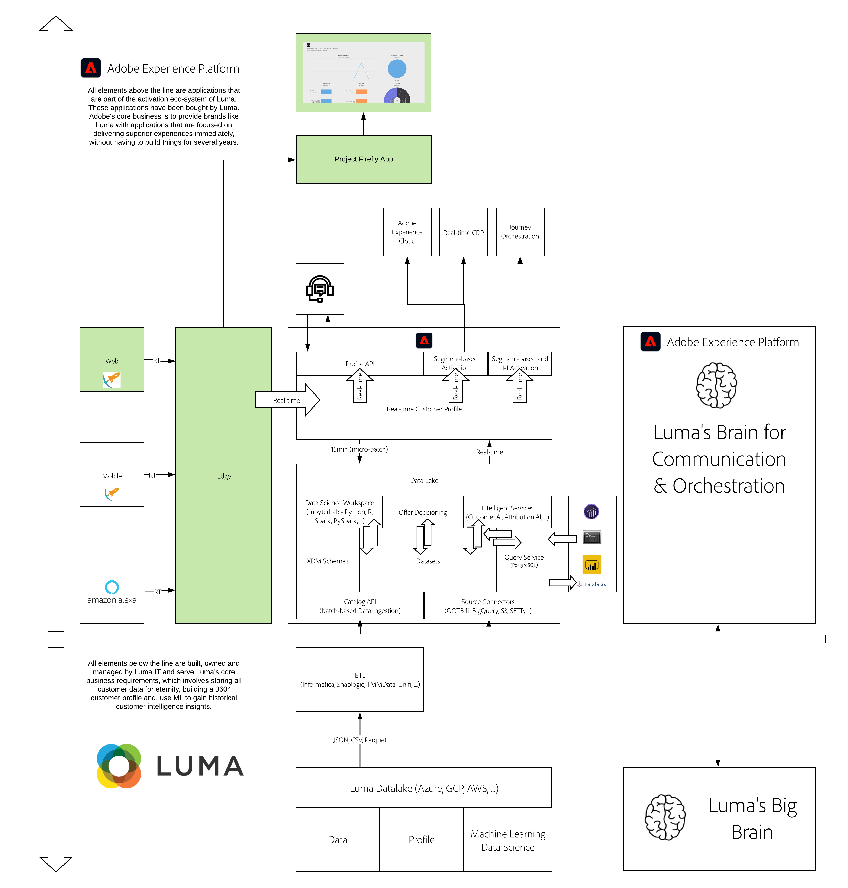

# 22. Build your own real-time dashboard using Adobe I/O - Project Firefly and Adobe Experience Platform

**Authors: [Rob In der Maur](https://www.linkedin.com/in/ridmaur/), [Wouter Van Geluwe](https://www.linkedin.com/in/woutervangeluwe/)**

In this module, you'll use Adobe I/O - Project Firefly to build your own real-time dashboard that consumes data from Adobe Experience Platform in real-time. 

Project Firefly is a complete framework that enables enterprise developers to build and deploy custom web applications that extend Adobe Experience Cloud solutions and run on Adobe infrastructure. It leverages modern technologies (JAM stack, serverless computing, Node, and React) and ensures best practices when building applications (event-driven architecture, micro-services, continuous integration, and delivery).
You can read a lot more details on what Project Firefly is [here](https://www.adobe.io/apis/experienceplatform/project-firefly/docs.html#!AdobeDocs/project-firefly/master/overview/what_is.md). 

In this tutorial, you'll learn how to build your first Project Firefly application. You'll closely follow the official Project Firefly documentation, and you'll ensure your setup is specific to our Adobe Experience Platform instance.

You'll then use code developed for the purpose of this tutorial to demonstrate a Project Firefly app that provides a real-time content consumption dashboard for EXP News, a fictitious media company.

## Learning Objectives

- Become familiar with Adobe I/O Runtime
- Become familiar with Project Firefly
- Understand how to build cloud native applications within Adobe's ecosystem
- Understand how to use Project Firefly to build real-time dashboards using data from Adobe Experience Platform

## Prerequisites

- Access to Adobe Experience Platform and Adobe I/O Runtime
- Understanding of Adobe Experience Platform datasets and XDM
- Familiarity with the command line on macOS or Windows is recommended

## Architecture Overview

Have a look at the below architecture, which highlights the components that will be discussed and used in this module.

## Sandbox to use

For this module, please use this sandbox: `--aepSandboxId--`.

>[!NOTE]
>
>Don't forget to install, configure and use the Chrome Extension as referenced in [0.6 - Install the Chrome extension for the Experience League documentation](../module0/ex6.md)

## Exercises

[22.1 Set up your environment](./ex1.md)

In order to work with Project Firefly, you need to have certain tools installed on your local machine.

[22.2 Introduction to Project Firefly](./ex2.md)

In this exercise, you'll learn how to set up a sample project with Project Firefly.

[22.3 Build your EXP News real-time dashboard](./ex3.md)

In this exercise, you'll create and configure a custom webhook and you'll start forwarding data that is collected by Web SDK to that custom webhook.

[22.4 Connect EXP News data collection to your EXP News real-time dashboard](./ex4.md)

In this exercise, you'll create and configure a Google Cloud Function and you'll start forwarding data that is collected by Web SDK to Google.

[Summary and benefits](./summary.md)

Summary of this module and overview of the benefits.

>[!NOTE]
>
>Thank you for investing your time in learning all there is to know about Adobe Experience Platform. If you have questions, want to share general feedback of have suggestions on future content, please contact Wouter Van Geluwe directly, by sending an email to **vangeluw@adobe.com**.

[Go Back to All Modules](../../overview.md)
