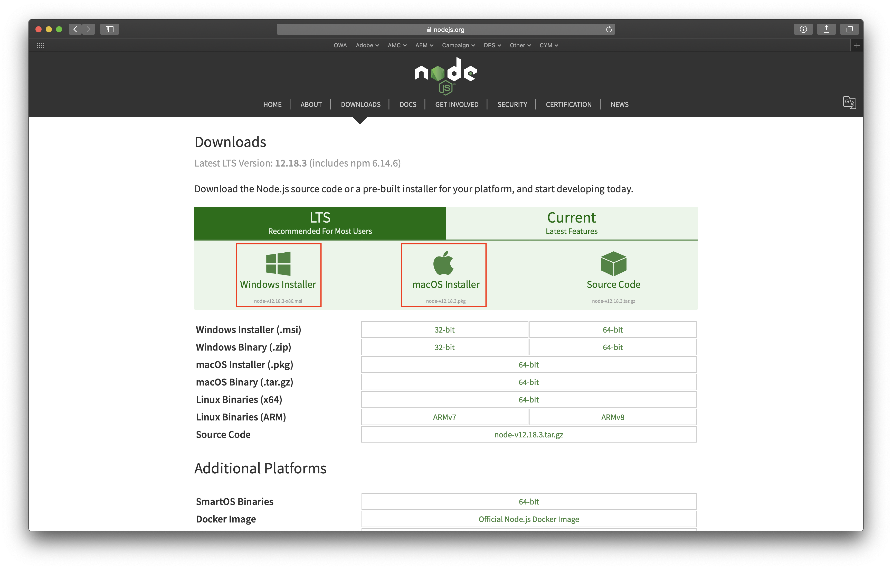
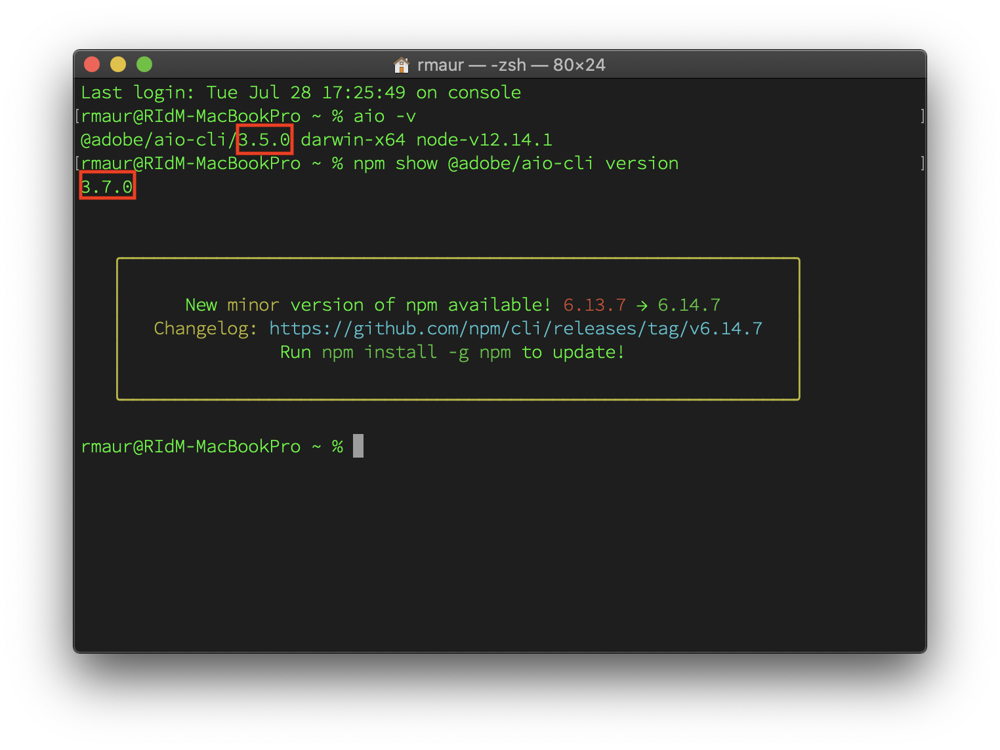
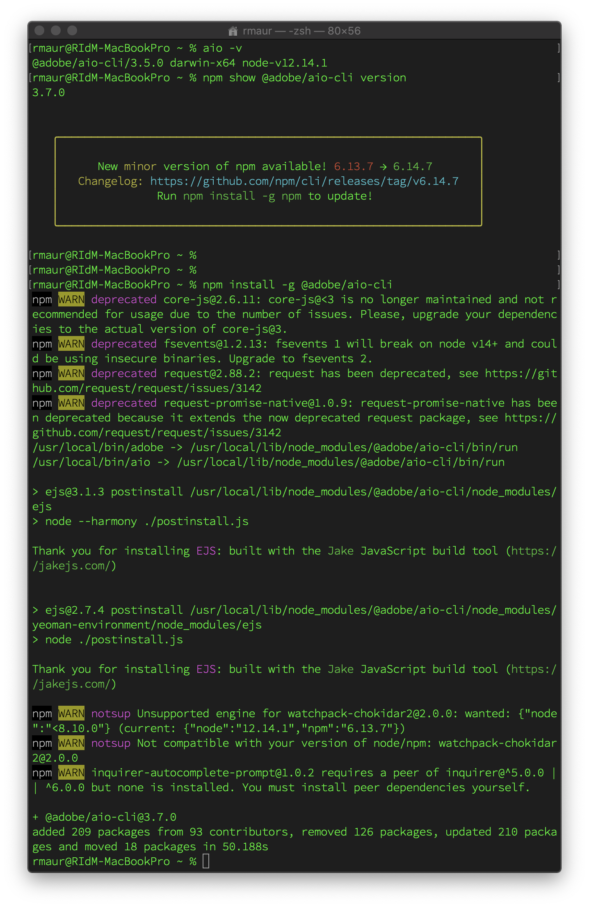
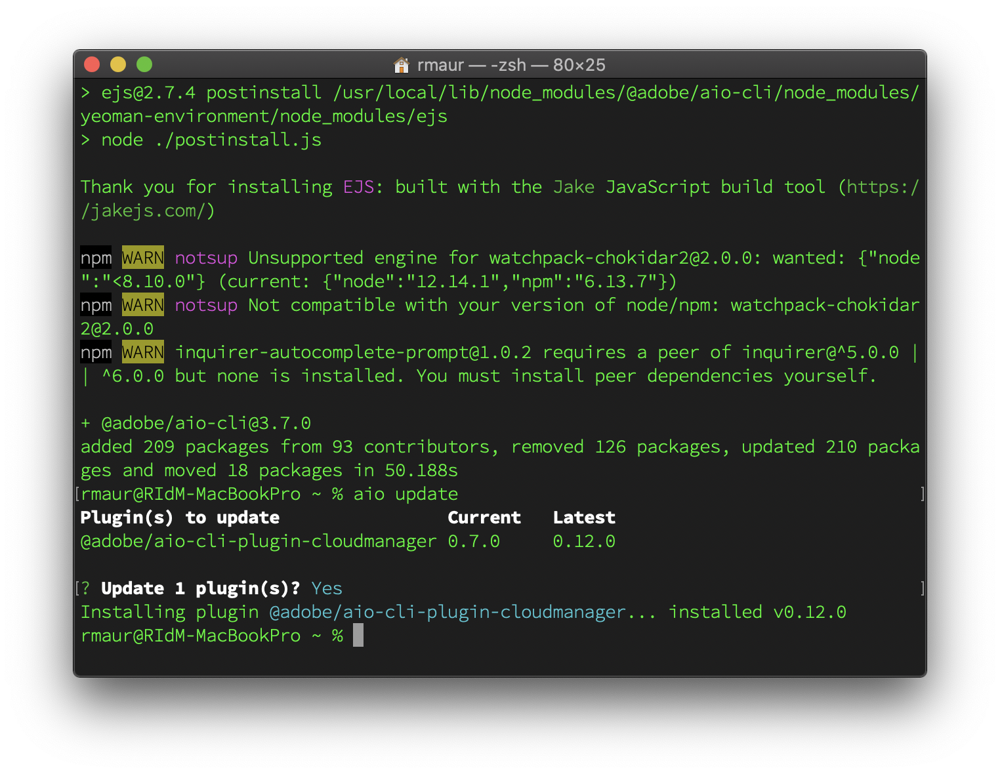

# 22.1 Set up your environment

## Objectives

In order to work with Project Firefly, you need to have certain tools installed on your local machine.

## Required Tools

- **NodeJS** (at least v10). It should also install `npm` together. We recommend using [nvm](https://github.com/nvm-sh/nvm/blob/master/README.md) to manage NodeJS installation and versions on your machine.

- **Adobe I/O CLI**.

### Install NodeJS

- Go to https://nodejs.org.
- Use your OS based out-of-the-box installer to install NodeJS on your machine.



### Install Adobe I/O CLI

#### New installation

To install the **Adobe I/O CLI** 

- Open a command-line or terminal window on your OS:
- Execute `% npm install -g @adobe/aio-cli`

This will install Adobe I/O CLI on your machine.

#### Update existing installation

If you already have Adobe I/O CLI on your local machine:

- Please ensure you have the latest version of Adobe I/O CLI installed.
For the Adobe I/O CLI, you can check the version through
`% aio -v`

and compare it with 
`% npm show @adobe/aio-cli version`



In the example above, the reported version of Adobe I/O is 3.5.0, while `npm` shows that there is an updated version (3.7.0) available. The current version, at the time of writing this enablement module, is 5.0.1, but ensure you check the latest version per the instructions above.

- If your Adobe I/O CLI is outdated, update it by running
`% npm install -g @adobe/aio-cli`

You will see output like below.



- To ensure all your core plugins are updates as well, run 
`% aio update`

You might be prompted whether you want to update plugins. Respond with `y` or `Y` to do so.



You have now finished setting up Adobe I/O CLI and underlying NodeJS on your machine.

**Note**
Other than the checking the version on your Adobe I/O CLI, whenever a new version of Adobe I/O CLI is updated, you will see a message like below. This message lasts for 7 days after a new release.

```javascript
› Warning: @adobe/aio-cli update available from 3.3.0 to 3.4.1.
›   Run npm install -g @adobe/aio-cli to update.
```

You have finished this exercise.

Next Step: [22.2 Introduction to Project Firefly](./ex2.md)

[Go Back to Module 22](./adobe-io-firefly.md)

[Go Back to All Modules](../../overview.md)
