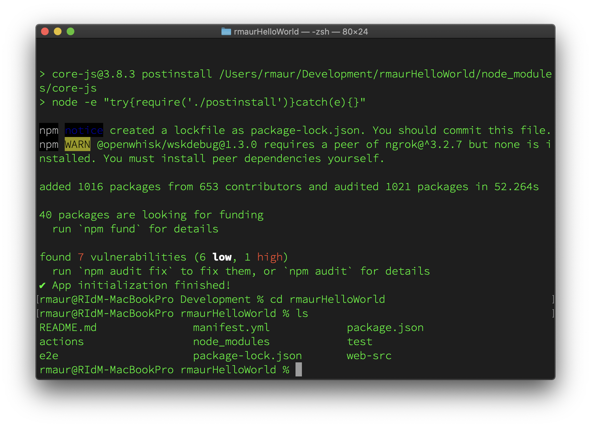

# 22.2 Introduction to Project Firefly

## Objectives

- Understand Project Firefly.
- Learn how to set up a sample project with Project Firefly.

## Prerequisites

Before you start this exercise, ensure you have installed and setup NodeJS and Adobe I/O CLI on your machine. See [Exercise 22.1 - Set up your environment](./ex1.md) for details.

## 22.2.1 Setup your personal project

To get started with Project Firefly, we will use Adobe I/O's Console to set up our personal project.

Log in to [Adobe Developer Console](https://console.adobe.io) using your Adobe ID.

If you're welcomed with a new **Welcome to the new Adobe Developer Console** wizard, click **Skip** or click **Next** to step through it. 


Ensure you select the correct organization at the top right: `--envName--`.


Click on **Create project from template**.

In **Browse templates** wizard screen, select **Project Firefly**.


In the **Set up templated project** wizard screen provide following details:


- **Project title**: `[ldapname] Realtime Dashboard for EXP News` where you replace `[ldapname]` with your own Adobe LDAP name, e.g. `rmaur Realtime Dashboard for EXP News`.
- **App name**: `[ldapname]EXPNews` where you replace `[ldapname]` with your own Adobe LDAP name, e.g. `rmaurEXPNews`.
- Ensure **Include Runtime with each workspace** is selected.

Click on **+ Add Workspace** to add an additional workspace.

Provide the following details for the workspace:

- **Workspace name**: `Development`.

- **Workspace description**: `Development workspace for EXP News RT Dashboard`.


Click **Save** to save the new workspace.

Click **Save** to save your project.

Your project will be created and after a while you will see it in the overview screen.


Click on **Development** in the Development tile to see more details about the specific runtime environment created for your Project Firefly application.


You can see the runtime namespace environment created as part of the application; in the example it is `133309-rmaurexpnews-development`

We have now finished creating our Adobe I/O runtime environment, which we need for our Project Firefly application.

## 22.2.2 Sign in from Adobe I/O CLI

To build a sample Project Firefly application, we have to use the command line in either Windows or Mac OS. The screenshots used below are based on Mac OS X but the commands executed are the same.

Open Terminal on Mac OS or a command prompt on Windows

Go to the specific location on your drive where you want to create your first project. E.g. Development

```javascript
% cd Development
```

Login, using

```javascript
% aio login
```


A browser window should open, asking you to sign in with your Adobe ID. If the window did not automatically open, you can also copy paste the URL printed in your browser to log in. 

```javascript
% aio login
Visit this url to log in: 
https://aio-login.adobeioruntime.net/api/v1/web/default/applogin?xxxxxxxx
```


Once you've logged in, you can close the browser window and go back to your Terminal. You would see a string printed in the terminal. This is your user token. It is automatically stored in your config, allowing the Project Firefly to use the token to talk to [Adobe Developer Console](https://console.adobe.io/).


## 22.2.3 Bootstrap a new app from Adobe I/O CLI

In Terminal on Mac OS or a command prompt on Windows, start creating a new app, which you will name `[ldap]HelloWorld`. 

E.g.:

```javascript
% aio app init rmaurHelloWorld
```

You will be prompted with a few questions about how you want your app to be bootstrapped and configured:

- **Select Org**. To quickly search for the org `--envName--` type the first characters behind **Select Org**. Then select `--envName--` from the resulting list.  


- **Select Project**. To quickly search for your project, type your LDAP name, and then select the project you created in Exercise 22.2.1. E.g. search for `rmaur` and then select `rmaur Realtime Dashboard for EXP News` from the resulting list.


**Select Workspace**. Select the `Development` workspace you created as part of Exercise 22.2.1.


**Which Adobe I/O App features do you want to enable for this project?**

**Select components to include**. Select `Actions: Deploy Runtime actions`.


**Which type of sample actions do you want to create?**

**Select type of actions to generate**. Select `Generic`.


**Which type of UI do you want to add to your project?**

**Select template to generate**. Select `React Spectrum 3`. This indicates we will use [Adobe Spectrum](https://spectrum.adobe.com), our design system, to build the app.

   

**We are about to create a new sample action that showcases how to access an external API.**

**How would you like to name this action?**. Press Return to accept the default `(generic)`.


**We are about to create a new sample action that creates messages in cloud events format and publishes to Adobe I/O Events.**

**How would you like to name this action?**. Press Return to accept the default `(publish-events)`.


The wizard will now generate the necessary code for your application and should indicate successful completion with `✔ App initialization finished!`.


Go into your newly created app directory `[ladp]HelloWorld` and list the generated files.
`% cd rmaurHelloWorld`
`% ls` (Mac OS) or 
`> dir` (Windows)



## 21.2.4 Building and deploying the app

There are numerous ways to build / test / deploy the application but for this enablement we keep it simple and will deploy the app straight away using the Experience Cloud Shell. 

To build and deploy the app:

In Terminal in Mac OS or command prompt in Windows, ensure you are in the directory created as part of your app (`[ldap]rmaurHelloWorld`), and then type:
`% aio app deploy`


The output can differ in your case and with the changes happening in Project Firefly, but it is important you first see the message **Build success, your app is ready to be deployed 👌** which is followed after a while with the final message **Well done, your app is now online 🏄**.

Once your app is deployed, you do have 2 URL's to view your final app. 

Copy the URL that is using the Experience Cloud Shell, indicated by **To view your deployed application in  the Experience Cloud shell:...**. The URL will use your Adobe I/O Development workspace name as unique identifier.

Open a new incognito browser and browse to https://experience.adobe.com. After logging in, ensure you select the right organization at the top right: `--envName--`.

Paste the URL from step 2 in the browser. If all is ok, you will see the following screen appear.


Select **Your App Actions** from the left rail. In the **Run your application backend actions** 

- Select **Generic** from the **Actions (required)** dropdown list.
- Click on **Invoke**
- You will see the results of this invocation in the **results** box. You can enlarge it to see more content. 


You have now successfully deployed your first Project Firefly app and have finished this exercise.

Next Step: [22.3 Build your EXP News real-time dashboard](./ex3.md)

[Go Back to Module 22](./adobe-io-firefly.md)

[Go Back to All Modules](../../overview.md)
