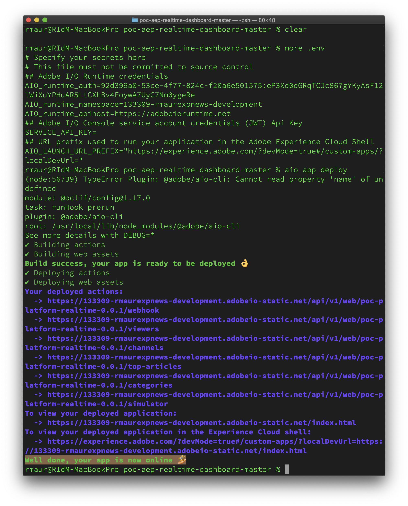

# 22.3 Build your EXP News real-time dashboard

## Objectives

- Understand how Project Firefly can deliver an custom real-time dashboard showing information from AEP.
- Learn how to build and run this sample dashboard.

## Prerequisites

Before you start this exercise, ensure you have installed and setup NodeJS and Adobe I/O CLI on your machine. See [Exercise 21.1 - Setting up your environment](./ex1.md) for details.

## 22.3.1 Download the source code

The source code for this project is available internally on https://git.corp.adobe.com/IODevEnablement/poc-aep-realtime-dashboard and developed by Duy Nguyen from the Adobe I/O team.
However, to avoid having everyone to understand how to clone or download code from a github repository, we've made the code available as a ZIP file directly from this enablement module. If you are comfortable using github, you can also clone the code from there.

To get hold of the source code from within this enablement module:

- Download it from [here](./source/poc-aep-realtime-dashboard-master.zip).
- Extract the ZIP file to a location on your computer.

## 22.3.2 Build the realtime dashboard

To build the realtime dashboard Firefly app:

Go to the directory where you extracted the ZIP file in exercise 22.3.1., e.g. `poc-aep-realtime-dashboard-master`.

In the directory, run `npm install` to install all required packages for the application.

Copy the `.env` environment file (containing all configuration for your Adobe I/O runtime environment) from your `[ldap]HelloWorld` project you created and deployed in exercise 22.2. 

E.g.: `cp <rmaurHelloWorld directory>/.env .` for Mac OS 
or `copy <rmaurHellowWorld directory>\.env .` for Windows.  

Note that the environment file is a so-called hidden file and you might not see the file in Finder / Explorer, so it is better to copy the file using the command line.

You can inspect the `.env` environment file using your favorite text editor or command. It should define your Adobe I/O namespace and authentication code

Deploy the app using `aio app deploy`. Again, the output you see might differ from screenshot below, but wait until you see **Well done, your app is now online 🏄**.

Your final dashboard app is now available on the URL mentioned as the last one in the output from the `aio app deploy` command; e.g. https://experience.adobe.com/?devMode=true#/custom-apps/?localDevUrl=https://133309-rmaurexpnews-development.adobeio-static.net/index.html

- Copy the URL.
- Open a **new incognito** browser window and log in to https://experience.adobe.com.
- Ensure you are in the right organization (check top right corner): `--envName--`.
- Paste the URL. The dashboard app will become available.

   
The Project Firefly EXP News Realtime Dashboard app will not provide any information yet, because we have not told it where to receive its information from. This is where the previous enablement module, on Adobe Launch Server Side Forwarding, becomes relevant, so on to the next exercise.

You have now finished this exercise. 

Next Step: [22.4 Connect EXP News data collection to your EXP News real-time dashboard](./ex4.md)

[Go Back to Module 22](./adobe-io-firefly.md)

[Go Back to All Modules](../../overview.md)
