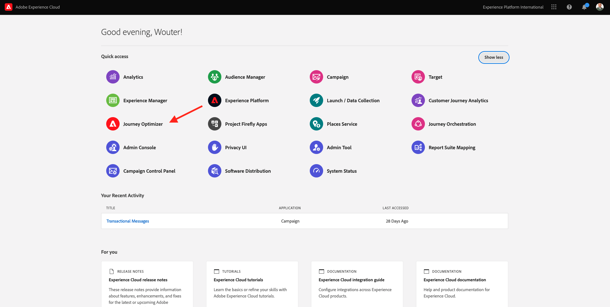
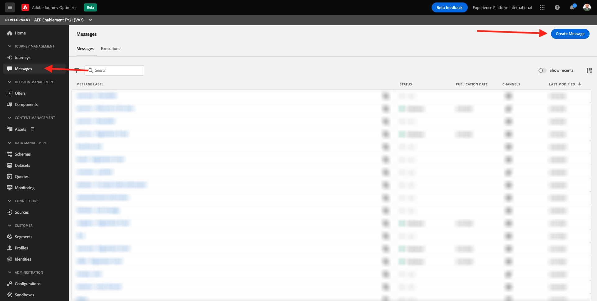
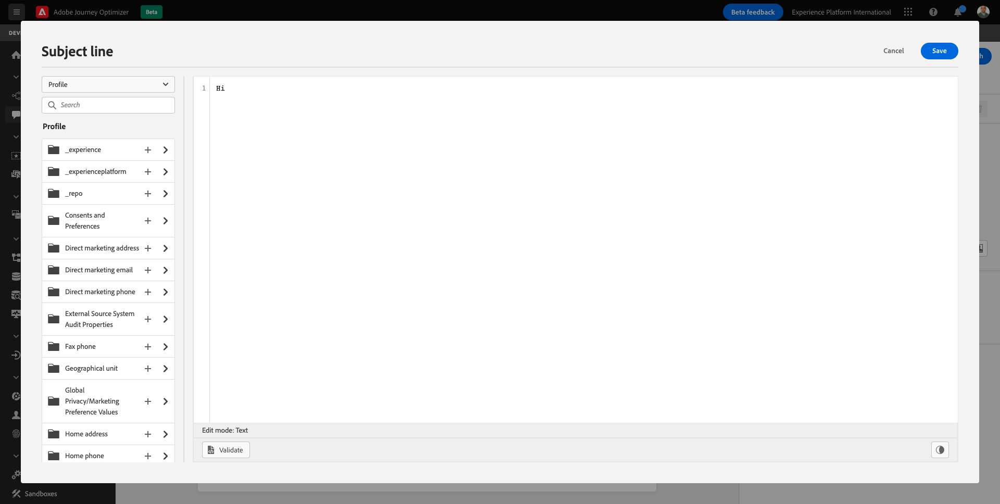
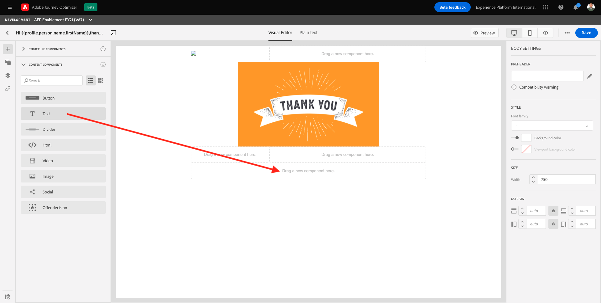
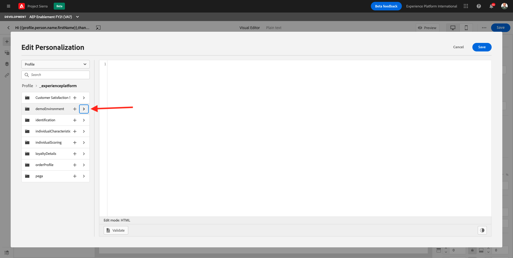
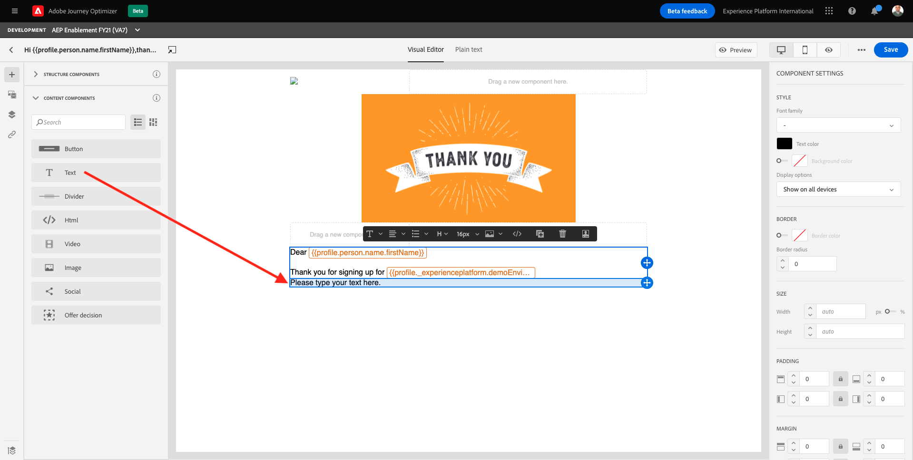
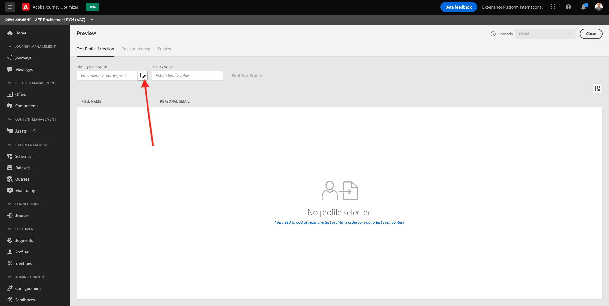
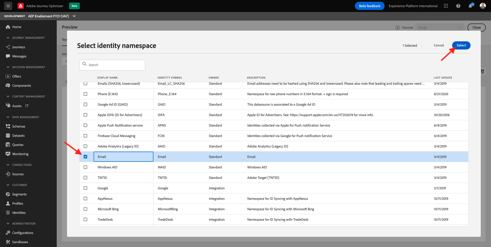
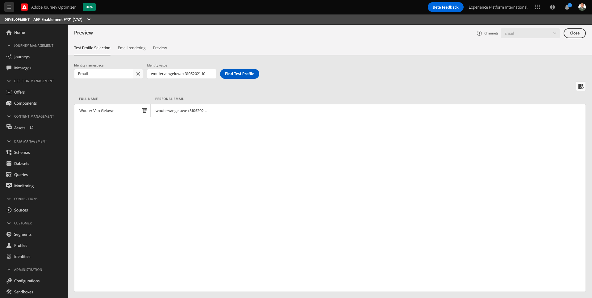

# 23.1 Introduction to Adobe Journey Optimizer: build an email message

Login to Adobe Experience Cloud by going to [Adobe Experience Cloud](https://experience.adobe.com). Click **Adobe Journey Optimizer**.

You'll be redirected to the **Home** view in Journey Optimizer.

Before you continue, you need to select a **sandbox**. The sandbox to select is named ``--aepSandboxId--``. You can do this by clicking the text **[!UICONTROL Production Prod]** in the blue line on top of your screen.

The top of the home page shows the recent objects you have been working on so you can quickly go back to a particular one. 

The left-hand side shows the navigation menu which will bring you to different places in Journey Optimizer.

- **Home**: The page you are currently on.
- **Journeys**: Overview of existing journeys, create new journeys
- **Messages**: Overview of existing messages (email, push,...), create new messages and find an overview of message execution in the last 24 hours.
- **Assets**: Redirects you to Adobe Experience Manager Assets Essentials where files like images can be uploaded to be used in messages.
- **Segments**: Access and create segments.
- **Datasets & Schemas**: Provides you an overview of all schemas and datasets.
- **Configurations**: Manage custom events, external data sources and actions to be used in the journeys.

In the menu, click **Messages**. 

On the Messages screen, you’ll see a view similar to this. Click **Create Message**.

Give your Message a title following this naming convention **ldap - Registration Email** and replace **ldap** by your own ldap, select the **CJM Alpha Preset** and enable the **Email** channel. 

Click on the **Create** button to create your Registration Email message.

The next screen is the message dashboard, from there you will be able to see the email thumbnail when the content will be provided

On the right-hand side are the Email properties:

- **From email**: the email address from whom the recipient will receive email message. Note that this value is specified by the **preset** given in the previous step and is read-only.
- **From name**: the sender name  from whom the recipient will receive email message. Note that this value is specified by the **preset** given in the previous step and is read-only.
- **Subject line**: the mandatory subject of the message which will be edited in the next step. 
- **Body**: a button brings you to the Email Designer to create and edit the email content.
- **Optional features**: these two checkboxes allow to disable the tracking of the email's opens and email's clicks and therefore, prevent the message from measuring metrics like open rate, click-through rate,...

First, make sure that the 2 checkboxes under **Optional features** are checked. If not, please **make sure they are both activated**. 

Click the **Subject line** text field.

In the text area start writing **Hi**

The subject line is not done yet. Next you need to bring in the personalization token for the field **First name** which is stored under `profile.person.name.firstName`. In the left menu, scroll down to find the **Person** element and click on the arrow to go a level deeper.

Now find the **Full name** element and click on the arrow to go a level deeper.

Finally, find the **First name** field and click on the **+** sign next to it. You'll then see the personalization token appear in the text field.

Next, add the text **,thank you for signing up!**. Click **Save**.

You'll then be back here. Click **Email Designer** to create the email's content. 

In the next screen you will be prompted with 3 different methods to provide the email's content:

- **Design from scratch**: Start with a blank canvas and use the WYSIWYG-editor to drag and drop structure and content components to visually build up the email's content.
- **Code your own**: Create your own email template by coding it using HTML
- **Import HTML**: Import an existing HTML template, which you'll be able to edit.

Click **Design from scratch**.

In the left menu, you'll find the structure components that you can use to define the structure of the email (rows and columns).

Drag and drop a **1:2 column Left** from the menu into the canvas. This will be the placeholder for the logo image.

Drag and drop a **1:1 column** underneath the previous component. This will be the banner block.

Drag and drop a **1:2 column Left** underneath the previous component. This will be the actual content with an image on the left side and text on the right side.

Next, drag and drop a **1:1 column** underneath the previous component. This will be email's footer. Your canvas should now look like this:

Now let's use Content Components to add content inside these blocks. Click on the **Content Components** menu item

Drag and drop an **HTML** component in the first cell on the first row. 

Click the HTML component and then click **Show the source code**.

You'll then see this:

Paste this code there: ``.

Then put the cursor, as indicated in the screenshot:

Next, navigate to the field `--aepTenantId--.demoEnvironment.brandLogo`. Click the **+** icon to insert the personalization token. Next, click **Save**.

You've now configured this HTML component to dynamically take the image URL from a field within Adobe Experience Platform's Real-time Customer Profile.

You're now back here:

Go to **Content Components** and drag and drop an **Image** component in the first cell on the first row. 

Click **Browse**.

*

In the **Assets** pop-up, double-click the **module-23** folder. In this folder, you'll find all assets previously prepared and uploaded by the creative team.

Select **module23-thankyou-new.png** and click **Select**. 

You'll then have this:

Select your image and in the right menu, scroll down until you see the **Size** width slider component.

Use the slider to change the width to f.i. **60%**.

Next, go to **Content Components** and drag and drop a **Text** component in the structure component on the fourth row. 

You'll then see this:

Select the default text **Please type your text here.** as you would do with any text editor. Write **Dear** instead. Notice the text toolbar displayed when you are in text mode.

In the toolbar click the **Add personalization** icon.

Next, you need to bring the **First name** personalization token which is stored under `profile.person.name.firstName`. In the menu, find the **Person** element, drill down to the **Full Name** element, and then click the **+** icon to add the First Name field onto to expression editor.

Click **Save**.

You'll now notice how the personalization field has been added to your text. 

In the same text field, hit **Enter** twice to add two lines and write **Thank you for signing up for**.

Click **Add personalization** again.

Next, you need to bring in the **Brand Name** personalization token which is stored under `--aepTenantId--.demoEnvironment.brandName`. In the left hand-side list find the `--aepTenantId--` element and click on the arrow to go a level deeper.

Next, find the **demoEnvironment** element and click the arrow to go a level deeper.

Finally, find the field **brandName** and click on the **+** sign next to it. You'll then see the personalization token appear in the text field. Click **Save**.

You'll now notice how the personalization field has been added to your text. 

In the left menu, go back to **Structure Components**.

Drag and drop a **1:1 column** underneath the previous component. This will be the banner block.

Next, go to **Content Components** and drag and drop a **Text** component in the fifth row.

Replace the default text by **Not interested anymore? Unsubscribe instantly.**

Now select the word **Unsubscribe** and click on the **Insert link** icon in the toolbar.

In the Link type dropdown select **Unsubscription link** and put the following url inside the Unsubscription page URL textfield **https://www.optout.adobe.com**. Click **Save**.

The registration confirmation email now has content, for deliverability (best practices around email sending to ensure they land in the recipient's mailbox instead of the Spam folder) purposes it is also important that this email has a text version.

Click the **Plain text** button at the top of the Email Designer to see how Journey Optimizer has automatically synchronized the HTML with the text version, so you don't have to write the text one more time.

The final check to perform to ensure your email is ready is to preview it, click on the **Preview** button.

Start by identifying which profile you want to use for the preview. Select the **email** namespace by clicking on the icon next to **Enter identity namespace** field.

In the list of identity namespaces, select the **Email** namespace. Click **Select**.

In the **Identity value** field, enter the email address of a previous demo profile that is already stored in the Real-time Customer Profile. For example **woutervangeluwe+31052021-10@gmail.com** and click on the **Find Test Profile** button

Once your profile shows up in the table, click on the **Preview** tab to access the preview screen.

When the preview is ready, validate that the personalization is correct in the subject line, the body text as well as the unsubscription link is highlighted as an hyperlink.

Click **Close** to close the preview.

Click **Save** to save your message.

Go back to the message dashboard by clicking the **arrow** next to the subject line text in the top-left corner.

You've now completed the draft version of your registration email. Click **Publish** to publish your message so you can use it in a journey.

Click **Publish** again.

Wait until you see a green confirmation pop-up at the bottom of the screen indicating that the message is published. 

You have finished this exercise.

Next Step: [23.2 Configure a trigger-based journey - Account Creation](./ex2.md)

[Go Back to Module 23](./journeyoptimizer.md)

[Go Back to All Modules](../../overview.md)
