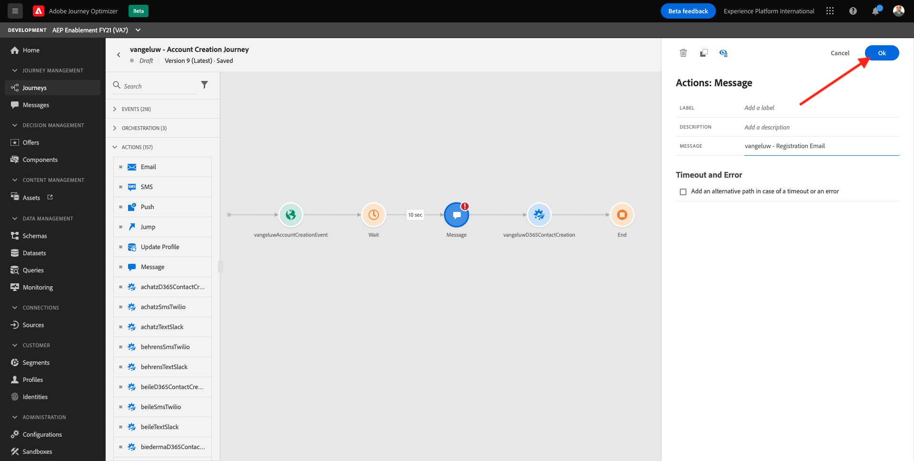

# 23.2 Configure a trigger-based journey - Account Creation

Login to Adobe Experience Cloud by going to [Adobe Experience Cloud](https://experience.adobe.com). Click **Adobe Journey Optimizer**.

You'll be redirected to the **Home** view in Journey Optimizer.

Before you continue, you need to select a **sandbox**. The sandbox to select is named ``--aepSandboxId--``. You can do this by clicking the text **[!UICONTROL Production Prod]** in the blue line on top of your screen.

## 23.2.1 Configure your trigger-based journey

Go to **Journeys**.

Search for your **ldap**.

Search and find the Account Creation Journey that you created in [Module 6 - Journey Orchestration](../module6/journey-orchestration-create-account.md) and which you updated in [Module 17 - Adobe Experience Platform and Microsoft Dynamics 365](../module17/adobe-experience-platform-microsoft-dynamics-365.md). It should be named **ldap - Account Creation Journey**. Click the journey name to open it.

In the top-right corner, find the **Duplicate** button and click on the arrow next to it. Click **Create a new version**.

Click on the **Create a new version** button in the pop-up window. Your journey will now be editable. 

Select the **Email** action in your journey, this will display a menu on the right side of the screen. This **Email** action relies on Adobe Campaign Standard to send out emails. In this exercise, that now needs to change to use Journey Optimizer for sending email messages.

Click **Delete**.

Confirm the Delete action by clicking a second time on that button.

You now need to replace this action by a **Message** action. In the left menu, find the **Actions** section and drag and drop a **Message** action in the circle which is now empty in your journey.

Link the rest of your journey to the outbound transition of the **Message** activity that you just drag and drop. 

Click on the **Message** activity to display the menu on the right side. Click **Select a message**.

Enter your **ldap** to see your messages.

Select the new message you created in the previous exercise, which is named **ldap - Registration Email**. Click **Select**.

You'll then see this. Click **Ok**.

Your updated Account Creation Journey is now ready to be published. Click **Publish**.

Click **Publish** again.

Your Account Creation Journey has now been successfully updated and from now on will deliver the account registration email using a Journey Optimizer message.

## 23.2.2 Configure/Verify Test Profile creation

In the next exercise, you'll test your trigger-based journey and to do so, you'll create a new profile in Adobe Experience Platform.
In order to test and preview messages built in Journey Optimizer, you need to mark that profile as a **Test Profile**. As you can see, marking a profile as Test Profile has been facilitated by adding a checkbox on the **Create Account** screen of the demo website. When you check that checkbox, Adobe Experience Platform will mark a profile as Test Profile.

To make this work, you need to verify the setup of your Adobe Experience Platform Data Collection Client property, and more specifically, the **All Authenticated Pages** rule. Click **Custom Code**.

You'll see this. Click **Open Editor**.

You'll then see this.

Scroll down to line 24, you should have this line of code there. If you don't have it, copy the below line of code and paste it on line 24 as indicated.

`"testProfile": Boolean(localStorage.getItem("testProfile")),`

Scroll down to line 59, you should have this line of code there. If you don't have it, copy the below line of code and paste it on line 59 as indicated.

`"brandLogo": _satellite.getVar('brandLogo'),`

Click **Save** followed by clicking **Keep Changes** and then click **Save** again.

Don't forget to publish the changes by going to **Publishing Flow**, adding the changes to your **Development** library and then click **Save & Build to Development**.

## 23.2.3 Test your trigger-based journey

Let's test the updated journey by creating a new account on the demo website.

Open a new, clean incognito browser window and go to [https://public.aepdemo.net](https://public.aepdemo.net). 

You'll then see this. 

Enter your Configuration ID and click **Load Configuration**. Your configuration is then loaded.

Scroll down and click **Save Configuration**.

You'll then be redirected to the Admin homepage. Go to **Select LDAP**. Select your LDAP and click **Save**.

You'll then be redirected to the Admin homepage. Go to **Select Brand** and select the brand **Luma**, click **Save**.

You'll then be redirected to the Admin homepage. Click the **Luma** logo.

You'll then see the Luma homepage.

Go to **Login/Register**. Fill out the form and click **Create Account**. Don't forget to check the checkbox for **Test Profile**.

Within a few seconds you'll receive the new Account Creation email served by Journey Optimizer in your inbox.

You'll also notice that when you change brands on the demo website, that the brand logo and brand name in the email will also dynamically change:

You have finished this exercise.

Next Step: [23.3 Configure a trigger-based journey - Order Confirmation](./ex3.md)

[Go Back to Module 23](./journeyoptimizer.md)

[Go Back to All Modules](../../overview.md)
