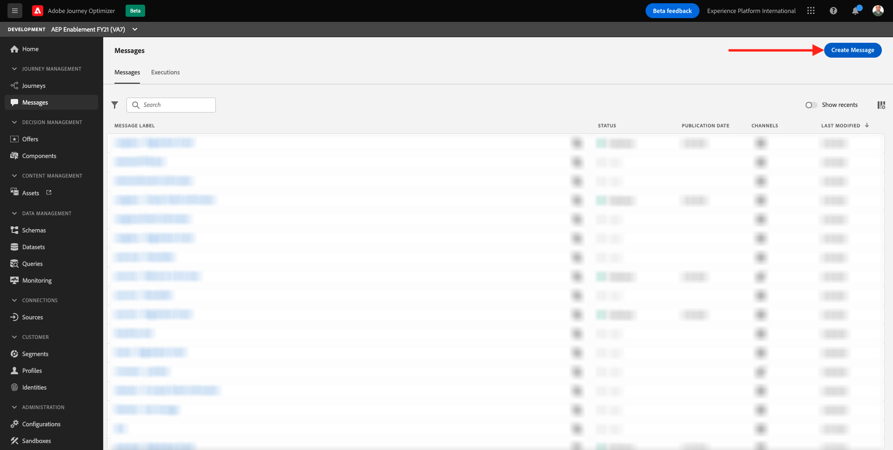
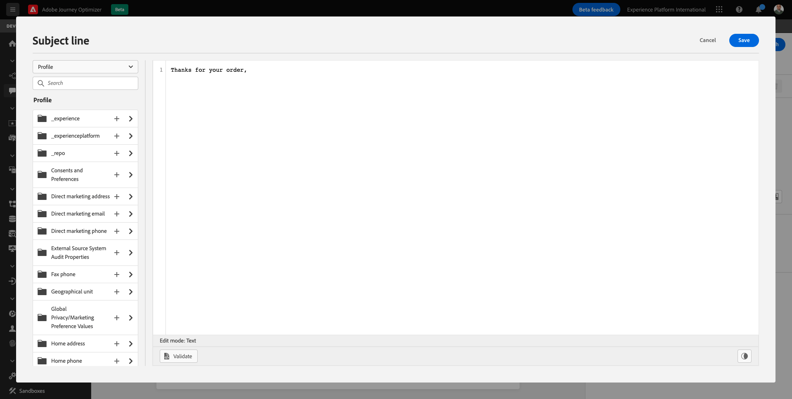
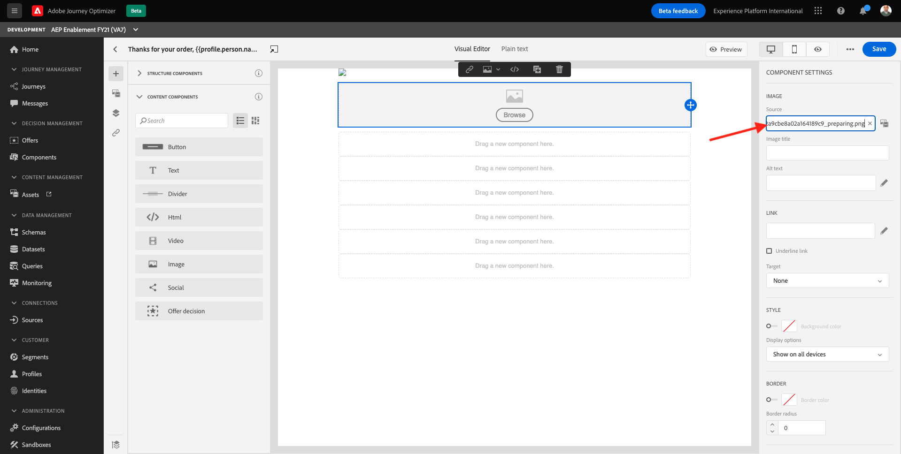
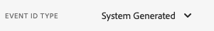
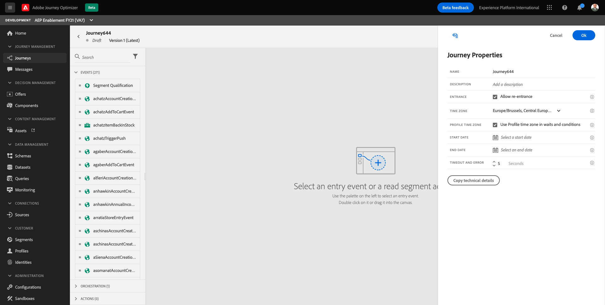
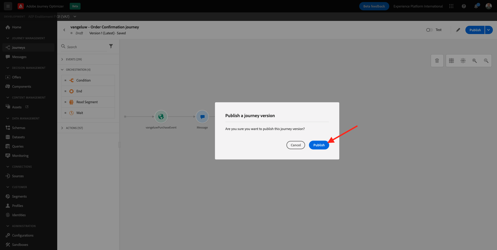
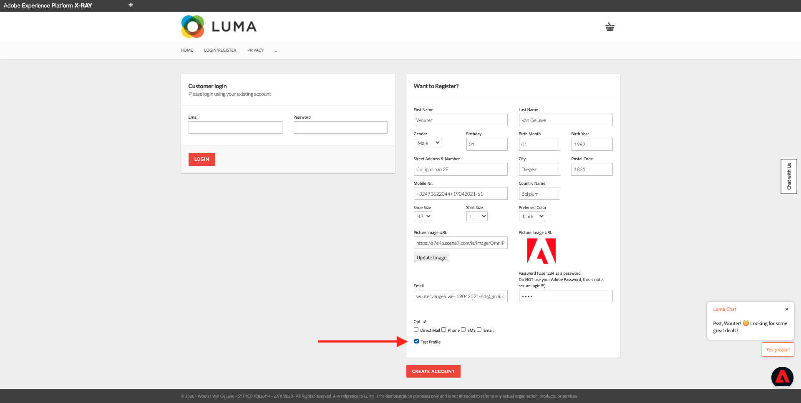
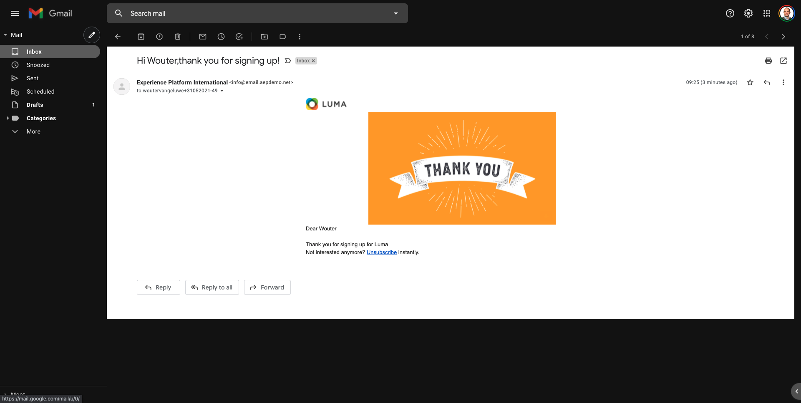

# 23.3 Configure a trigger-based journey - Order Confirmation

Login to Adobe Experience Cloud by going to [Adobe Experience Cloud](https://experience.adobe.com). Click **Adobe Journey Optimizer**.


You'll be redirected to the **Home** view in Journey Optimizer.


Before you continue, you need to select a **sandbox**. The sandbox to select is named ``--aepSandboxId--``. You can do this by clicking the text **[!UICONTROL Production Prod]** in the blue line on top of your screen.


## 23.3.1 Create your order confirmation message

In the menu, click **Messages**. 

On the Messages screen, you’ll see a view similar to this. Click **Create Message**.



Give your Message a title following this naming convention **ldap  - Order Confirmation Email** and replace **ldap** by your own ldap, select the **CJM Alpha Preset** and enable the **Email** channel. 


Click **Create** to create your Order Confirmation Email message.

The next screen is the message dashboard. On the right-hand side are the Email properties, make sure that the 2 checkboxes under **Optional features** are checked. If not, please **make sure they are both activated**. 


Click the **Subject line** text field.


In the text area start writing **Thanks for your order,**



The subject line is not done yet. Next you need to bring in the personalization token for the field **First name** which is stored under `profile.person.name.firstName`. In the left menu, scroll down to find the **Person** > **Full name** >  **First name** field and click on the **+** icon to add the personalization token into the subject line. Click **Save**.


You'll then be back here. Click **Email Designer** to create the email's content. 


In the next screen, click **Design from scratch**.


In the left menu, you'll find the structure components that you can use to define the structure of the email (rows and columns).

Drag and drop 8 times a **1:1 column** on the canvas, which should give you this:


Go to **Content Components**.


Drag and drop an **HTML** component on the first row. Click the HTML component and then click **Show the source code**.


Paste this code there: ``. Click **Save**.


You're now back here:


Go to **Content Components** and drag and drop an **Image** component on the second row. Select the **Image component** but DON'T click Browse.


Paste this image URl in the field **Source**: `https://parsefiles.back4app.com/hgJBdVOS2eff03JCn6qXXOxT5jJFzialLAHJixD9/29043bedcde632a9cbe8a02a164189c9_preparing.png`. This image is hosted outside of Adobe.



When you change the scope to another field, the image will be rendered and you'll see this:


Next, go to **Content Components** and drag and drop a **Text** component on the third row. 


Select the default text in that component **Please type your text here.** and replace it by the below text:

```javascript
You’re one step closer!

Hi 

We've received your order details!

We will also send you a separate email containing your VAT Invoice.

We'll be back in touch with you as soon as we've finished packing your package. Please read carefully the Order Information detailed below.
```


Put the cursor next to the text **Hi** and click **Add Personalization**.


Navigate to the **Person** > **Full name** > **First name** field and click on the **+** icon to add the personalization token into the subject line. Click **Save**.


You'll then see this:


Next, go to **Content Components** and drag and drop a **Text** component on the fourth row. 


Select the default text in that component **Please type your text here.** and replace it by the below text:

`Order Information`

Change the font size to **26px** and center your text in this cell. You'll then have this:


Next, go to **Content Components** and drag and drop an **HTML** component on the fifth row. Click the HTML component and then click **Show the source code**.


In the **Edit HTML** popup, paste this HTML:

```<table><tbody><tr><td><b>Items purchased</b></td><td></td><td><b>Quantity</b></td><td><b>Subtotal</b></td></tr><tr><td colspan="4" width="500"><hr></td></tr></tbody></table>```

Click **Save**.


You'll then have this. Click **Save** to save your progress.


Go back to the message dashboard by clicking the **arrow** next to the subject line text in the top-left corner.


You'll then see this:


Click **Publish** twice to publish your message so you can use it in a journey.


In the next steps of creating your **Order Confirmation Email Message**, you'll need to use contextual event data. This contextual event data is provided from within the **Journey**. So before you can add that context, you'll need to setup an **Event** to trigger the journey, and build out the **Journey**. Once that's done, you'll come back to the **Message Designer** to update your message.

## 23.3.2 Create your event

In the menu, go to **Configurations** and click **Manage** under **Events**.


On the **Events** screen, you'll see a view similar to this. Click **Create Event**.


You'll then see an empty event configuration.


First of all, give your Event a Name like this: `ldapPurchaseEvent` and replace `ldap` with your ldap.


Next, add a description like this `Purchase Event`.


Next is the **Event Type** selection. Select **Unitary**.


Next is the **Event ID Type** selection. Select **System Generated**



Next is the Schema selection. A schema was prepared for this exercise. Please use the schema `Demo System - Event Schema for Website (Global v1.1) v.1`.


After selecting the Schema, you'll see a number of fields being selected in the **Payload** section. Click the **Edit/Pencil** icon to add additional fields to this event.


You'll then see this popup. You now need to check additional checkboxes in order to access additional data when this event gets triggered.


First of all, check the checkbox on the line `--aepTenantId--`.


Next, scroll down and check the checkbox on the line `productListItems`. 


Next, scroll down and check the checkbox on the line `commerce`. 


Next, click **Ok**.

You'll then see that additional fields have been added to the event. Click **Save**.


Your new event is then shared and you'll see your event in the list of available events now.

Click on your event again to open up the **Edit Event** screen again. 
Hover over the **Payload** field again to see the 3 icons again. Click on the **View Payload** icon. 


You'll now see an example of the expected payload. Your event has a unique orchestration eventID, which you can find by scrolling down in that payload until you see `_experience.campaign.orchestration.eventID`.


The event ID is what needs to be sent to Adobe Journey Optimizer in order to trigger the journey that you'll build in the next step. Write down this eventID, as you'll need it in one of the next steps.
`"eventID": "d168c11ce1b5bb96fc793421fbcc3ec54b3116fa13242b05d9a54b1251ecb94e"`

Click **Ok**, followed by **Cancel**.

Your event is now configured and ready to be used.

## 23.3.3 Create your journey

In the menu, go to **Journeys** and click **Create Journey**.


You'll then see this.



Give your journey a name. Use **ldap - Order Confirmation journey** and replace **ldap** by your ldap. Click **OK**.


First, you need to add your event as the starting point of your journey. Search for your event **ldapPurchaseEvent** and drag and drop it onto the canvas. Click **OK**.


Next, under **Actions**, search for the **Message** action.


Drag and drop the **Message** action onto the canvas and click the **edit** icon to select your message.


Select the message you created in the previous step, **ldap - Order Confirmation Email**. Click **Select**.


You then have this. Click **Ok**.


Search for the orchestration type **End** and drag and drop it onto the canvas. Click **OK**.


Click **Publish** to publish journey.


Click **Publish** again.



Go back to the Journeys overview.


Your journey is now published. Before you can use the journey, you still need to finish configuring your Order Confirmation Email message. To do that, you now need to provide the context of this journey to your message.

## 23.3.4 Use journey context in email message

From the Journeys overview, open your **ldap - Order Confirmation journey** again.


Select the **Message** action again. Hover over the **Message** field and you'll see this option. Click **Open the message**.


You'll then be redirected here. Click **Modify**.


Click **Confirm**.


Click **Email Designer**.


You'll then be back in the Email Designer.


Go to **Content Components** and drag and drop an **HTML** component on the sixth row. Click the HTML component and then click **Show the source code**.


In the **Edit HTML** popup, paste this HTML:

```{{#each xxx as |item|}}<table width="500"><tbody><tr><td></td><td><table><tbody><tr><td><b>{{item.name}}</b><br>{{item.--aepTenantId--.core.subCategory}}<br><b>{{item.priceTotal}}</b><br>&nbsp;<br>Article no: {{item.SKU}}</td></tr></tbody></table></td><td>{{item.quantity}}</td><td><b>{{item.priceTotal}}</b></td></tr></tbody></table>{{/each}}```

You'll then have this:


You now have to replace **xxx** by a reference to the productListItems object that is part of the event that triggers the journey.


First, delete **xxx** in your HTML code first.


Open the dropdown that says **Profile**. In that dropdown, select **Context**. This context is passed to the message from the journey.


You'll then see this. Click the arrow next to **Journey Orchestration** to drill deeper.


Click the arrow next to **Events** to drill deeper.


Click the arrow next to **ldapPurchaseEvent** to drill deeper.


Click the **+** icon next to **productListItems** to add it to the HTML code.


You'll then have this. You now need to remove the **ticks** around the event ID.


You'll then have this. Click **Save**.


You'll be back in the Email Designer now. Click **Save** to save your progress.


Next, go to **Content Components** and drag and drop an **HTML** component on the seventh row. Click the HTML component and then click **Show the source code**.


In the **Edit HTML** popup, paste this HTML:

```<table><tbody><tr><td><b>Subtotal</b><br>Delivery charge (included)</td><td align="right"><b>xxx</b><br><b>5</b></td></tr><tr><td colspan="2" width="500"><hr></td></tr><tr><td><b>Total including VAT</b></td><td align="right"><b>xxx</b></td></tr></tbody></table>```

There are 2 references of **xxx** in this HTML code. You now have to replace each **xxx** by a reference to the productListItems object that is part of the event that triggers the journey.


First, delete **xxx** in your HTML code on line 10.


Navigate to **Context**.


Click the arrow next to **Journey Orchestration** to drill deeper.


Drill deeper into the object **ldapPurchaseEvent**. Click the arrow next to **Commerce** to drill deeper.


Click the arrow next to **Order** to drill deeper.


Click the **+** icon next to **Price Total** to add that to the canvas.


Delete **xxx** in your HTML code on line 23. 


Click the **+** icon next to **Price Total** again to add that to the canvas.


You can also add the field **Currency** from within the **Order** object onto the canvas, as you can see here:


When you're done, click **Save** to save your changes.

You'll then be back in the Email Designer. Click **Save** again.


Go back to the message dashboard by clicking the **arrow** next to the subject line text in the top-left corner.


You'll then see this:


Click **Publish** twice to publish your message so you can use it in a journey.


After making a change to the email message, you need to republish the journey so that it picks up the new fields and changes.

To do so, go to **Journeys**. Click to open your journey **ldap - Order Confirmation journey**.


Click to open the dropdown next to **Duplicate** and select **Create a new version**.


Click **Create a new version** again.


You'll then have a new version of your journey. Click **Publish** twice.


Your journey is now published and can be triggered. Before you can trigger it though, you need to update the data element in your Adobe Experience Platform Data Collection Client property.

## 23.3.5 Update your Adobe Experience Platform Data Collection Client property

Go to [https://experience.adobe.com/#/data-collection/](https://experience.adobe.com/#/data-collection/). In the left menu, make sure you're in **Client**. Search for your Client properties, and open the property for **Web**.


Go to **Data Elements**. Search and open the data element **rulePurchaseConfirmation**.


You'll then see this. Navigate to the field **_experience.campaign.orchestration.eventID** and fill out your eventID here. The eventID to fill out here, is the eventID you created as part of exercise 23.3.2.


Save your changes in your Client property, and then publish your changes by updating your development library.


Your changes are now deployed and can be tested.

## 23.3.6 Test your order confirmation email using the demo website

Let's test the updated journey by buying a product on the demo website.

Open a new, clean incognito browser window and go to [https://public.aepdemo.net](https://public.aepdemo.net). 

You'll then see this. 


Enter your Configuration ID and click **Load Configuration**. Your configuration is then loaded.


Scroll down and click **Save Configuration**.


You'll then be redirected to the Admin homepage. Go to **Select LDAP**. Select your LDAP and click **Save**.


You'll then be redirected to the Admin homepage. Go to **Select Brand** and select the brand **Luma**, click **Save**.


You'll then be redirected to the Admin homepage. Click the **Luma** logo.


You'll then see the Luma homepage.


Go to **Login/Register**. Fill out the form and click **Create Account**. Don't forget to check the checkbox for **Test Profile**.



Within a few seconds you'll receive the new Account Creation email served by Journey Optimizer in your inbox as you configured in the previous exercise.



Go back to the homepage of the demo website and click any product.


You'll then see the product detail page. Click **Add to cart**.


Go to your cart.


Select your **payment type** and **delivery preference**, and then click **Purchase**.


You'll then receive your order confirmation email within seconds.


You have finished this exercise.

Next Step: [23.4 Configure a batch-based newsletter journey](./ex4.md)

[Go Back to Module 23](./journeyoptimizer.md)

[Go Back to All Modules](../../overview.md)
