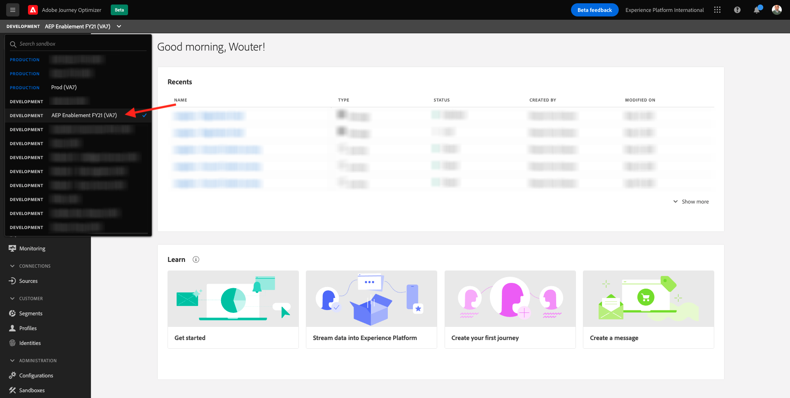
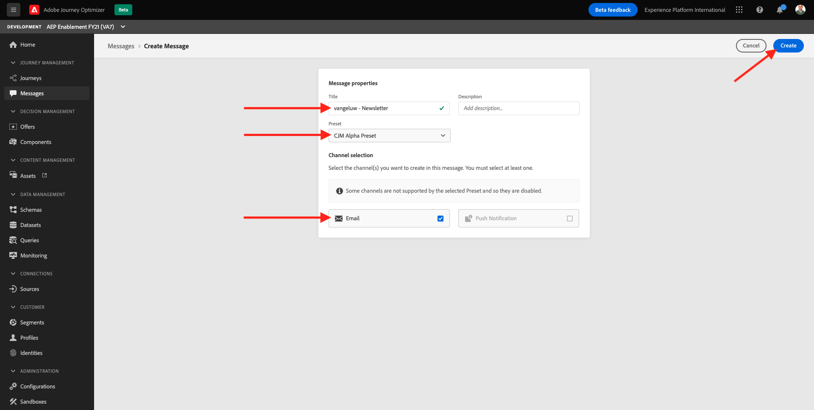
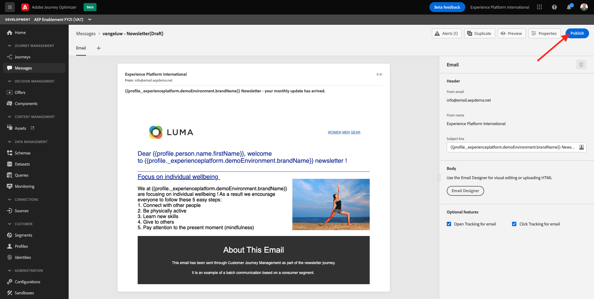
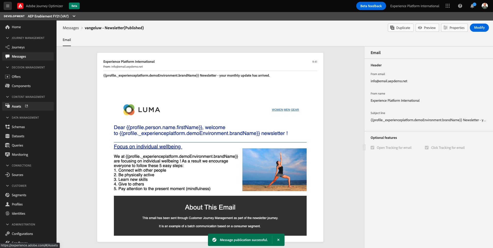
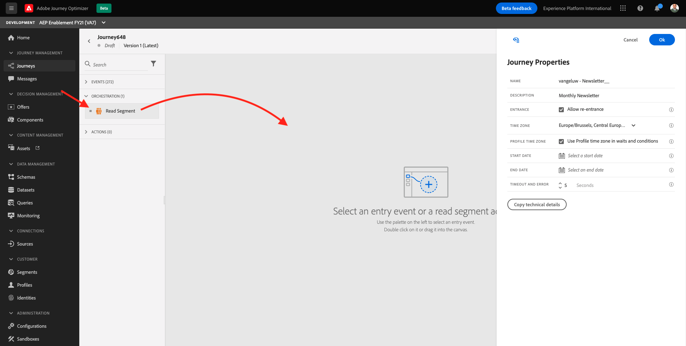
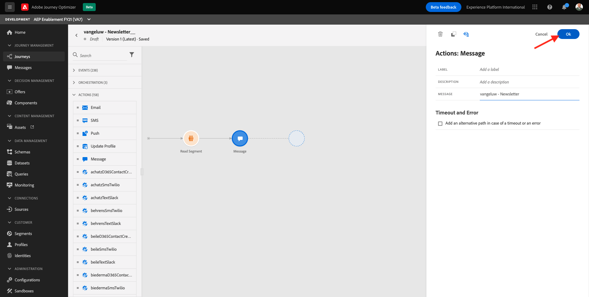
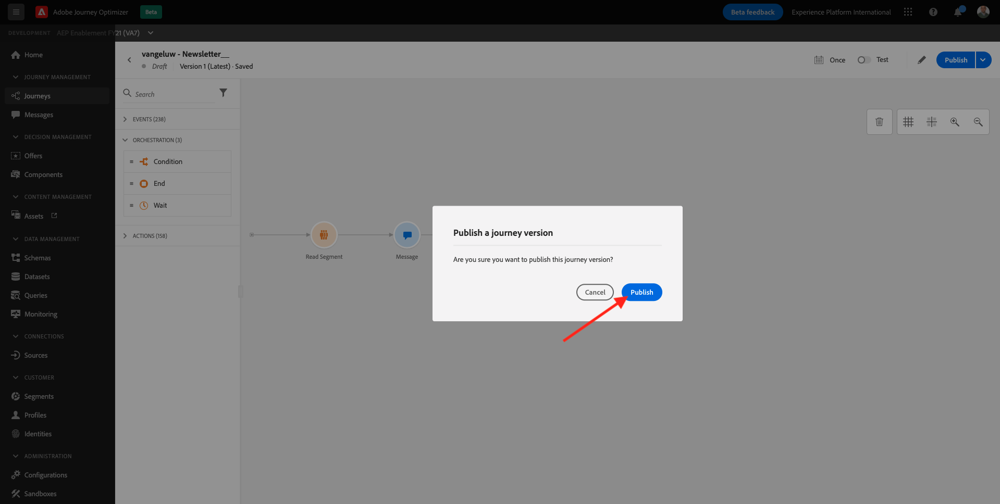

# 23.4 Configure a batch-based newsletter journey 

Login to Adobe Experience Cloud by going to [Adobe Experience Cloud](https://experience.adobe.com). Click **Adobe Journey Optimizer**.

You'll be redirected to the **Home** view in Journey Optimizer.

Before you continue, you need to select a **sandbox**. The sandbox to select is named ``--aepSandboxId--``. You can do this by clicking the text **[!UICONTROL Production Prod]** in the blue line on top of your screen.

## 23.4.1 Create Newsletter Email Message

You'll now create a new email message, to send a newsletter using a batch-based journey. The newsletter email message you'll create in this exercise will be very basic and won't include much personalization. In the next exercise, 23.4, you'll add personalization based on segment memberships and also using Offer Decisioning. For now, let's start with the basic email creation.

In the menu, click **Messages**. 

On the Messages screen, you’ll see a view similar to this. Click **Create Message**.

Name your message **ldap - Newsletter** and replace **ldap** by your own ldap, select the **CJM Alpha Preset** and select the **Email** channel. Click **Create**.

First, make sure that the 2 checkboxes under **Optional features** are checked. If not, please **make sure they are both activated**. 

Click the **Subject line** text field.

Let's start by bringing the brand name personalization which is stored under `--aepTenantId--.demoEnvironment.brandName`. In the left hand-side list find the `--aepTenantId--` element and click on the arrow to go a level deeper.

Next, find the **demoEnvironment** element and click the arrow to go a level deeper.

Finally, find the field **brandName** and click on the **+** sign next to it. You'll then see the personalization token appear in the text field.

Add this text behind the **brandName**: **Newsletter - your monthly update has arrived.** and click on the save button. 

You'll then be back here. Click **Email Designer** to start creating the email content. 

You'll then see this. Click **Import HTML**.

In the pop-up screen, you'll need to drag and drop the HTML file of the email. You can find the HTML template [here](../../assets/html/module23-newsletter.html.zip). Download the zip-file with the HTML template to your local machine and unzip in onto your desktop.

Drag and drop the file **module23-newsletter.html** to upload it in Journey Optimizer.

This email content is ready to go since it has all the expected personalization, imagery and text. Only the offer placeholder is left empty. 

You might get an error message: **Error when trying to fetch assets**. This is linked to the image in the email.

If you get this error, select the image and click the **Edit image** button.

Click the **image** icon to go back to your AEM Assets Essentials library.

You'll then see this popup. Navigate to the folder **module-23** and select the image **module23-newsletterContent.png**. Click **Select**.

Your basic newsletter email is now ready. Click **Save**.

Go back to the message dashboard by clicking the **arrow** next to the subject line text in the top-left corner.

You've now completed the draft version of your registration email. Click **Publish** to publish your message so you can use it in a journey.

Click **Publish** again.

Wait until you see a green confirmation pop-up at the bottom of the screen indicating that the message is published. 

## 23.4.2 Create newsletter journey

Next, go to **Journeys**.

You'll now create a batch-based journey. Unlike the event-based journey of the previous exercise which relies on incoming experience events or segment entries or exits to trigger a journey for 1 specific customer, batch-based journeys target a whole segment once with unique content like newsletters, one-off promotions, or generic information or periodically with similar content sent on a regular basis like for instance birthday campaigns and reminders. 

Click **Create Journey**.

On the right-hand side you will see a form where you need to specify the journey name and description. Enter the following values:

- **Name**: **ldap - Newsletter**. Replace **ldap** by your ldap. For instance: vangeluw - Newsletter.
- **Description**: Monthly Newsletter

Click **Ok**. 

Under **Orchestration**, drag and drop **Read Segment** onto the canvas. This means that, once published, the journey will start by retrieving the whole segment audience, which then becomes the target audience of the journey and message. 

Select **Read Segment**. Click **Select a segment**. 

In the **Choose a segment** popup, search for your ldap and select the segment you created in [Module 11 - Real-time CDP - Build a segment and take action](../module11/real-time-cdp-build-a-segment-take-action.md) named **ldap - Interest in Zeppelin Yoga Pant (RTCDP - ldap)**. for example: vangeluw - Interest in Zeppelin Yoga Pant (RTCDP - vangeluw). Click **Save**.

Click **Ok**.

In the left menu, find the **Actions** section and drag and drop a **Message** action onto the canvas.

Click on the **Message** activity to display the menu on the right-hand side. Click on the **Select a message** drop-down menu.

Select the message you created in the previous exercise, which is named **ldap - Newsletter**. Click **Select**.

Click **OK**.

Your newsletter journey is now ready to be published. Before you do so, notice the **Schedule** section where you can switch this journey from being a one-off to a recurring campaign. Click the **Schedule** button.

You'll then see this. Select **Once**.

Select a date and time within the next hour so you can test your journey. Click **Ok**.

>[!NOTE]
>
>Message send date and time must be within more than one hour.

In the menu, click **Orchestration** and drag and drop **End** onto the canvas. Click **Ok**.

Click **Publish**.

Click **Publish** again.

Your basic newsletter journey is now published. Your newsletter email message will be sent as you defined it in your schedule, and your journey will stop as soon as the last email has been sent.

You have finished this exercise.

Next Step: [23.5 Apply personalization in an email message](./ex5.md)

[Go Back to Module 23](./journeyoptimizer.md)

[Go Back to All Modules](../../overview.md)
