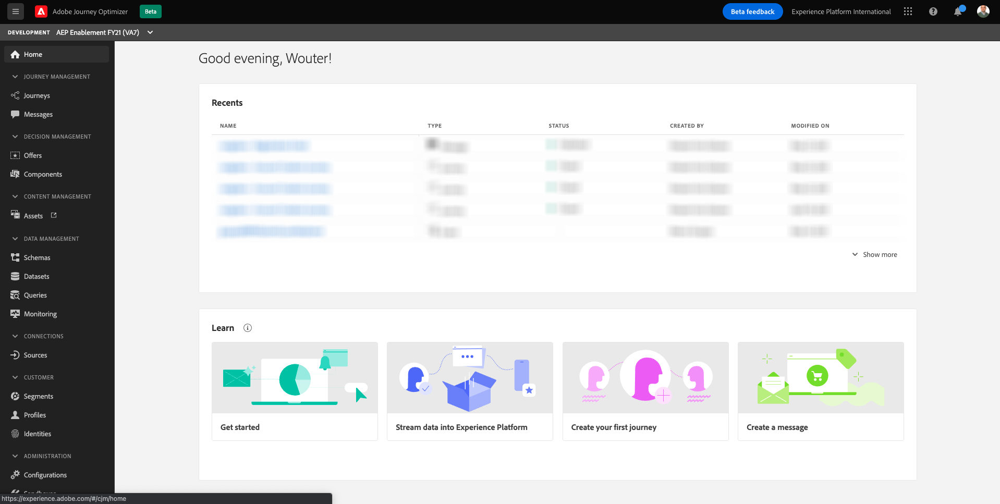
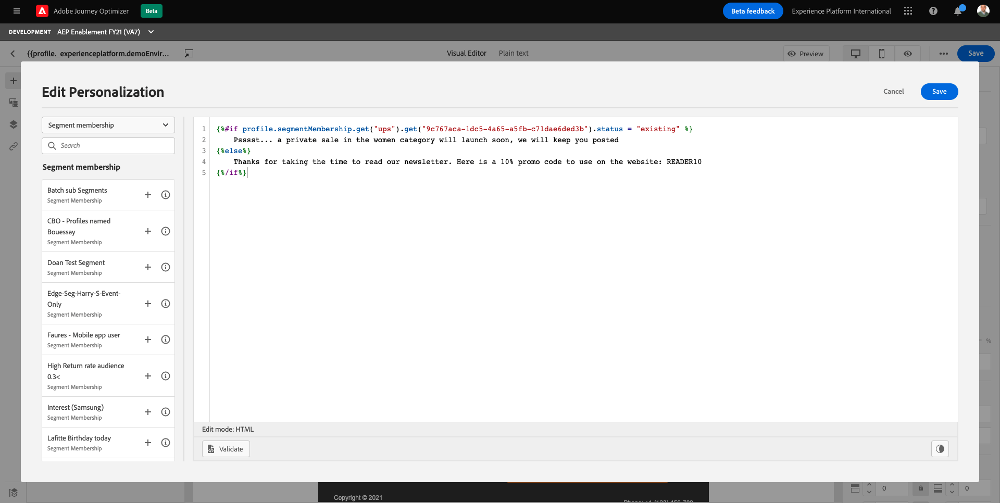

# 23.5 Apply personalization in an email message

Login to Adobe Experience Cloud by going to [Adobe Experience Cloud](https://experience.adobe.com). Click **Adobe Journey Optimizer**.

You'll be redirected to the **Home** view in Journey Optimizer.

Before you continue, you need to select a **sandbox**. The sandbox to select is named ``--aepTenantId--``. You can do this by clicking the text **[!UICONTROL Production Prod]** in the blue line on top of your screen.

## 23.5.1 Segment-based personalization

In this exercise you'll improve your newsletter email message with a personalized text based on segment membership.

Go to **Messages**. Find the newsletter email that you have created in the previous exercise. Search for **ldap - Newsletter**. Click your message to open it. 

You'll then see the message dashboard. Click **Modify**. 

Click **Confirm**.

Click **Email Designer**.

You'll then see this.

Open **Content Components** and drag a **Text** component below the current newsletter content. 

Select the whole default text and delete it. Then click on the **Add personalization** button in the toolbar.

You'll then see this:

Open the dropdown menu and select **Segment Membership**.

>[!NOTE]
>
>If you can't find your segment in this list, scroll down a bit to find instructions on how to retrieve the segment ID manually.

If you're able to see the segment named **ldap - API - All Female Customer**, which you created as part of Module 3, select it and click the **+** icon, which should look like this:

You should then leave the first line as it is, and replace line 2 and 3 by this code:

``
    Psssst... a private sale in the women category will launch soon, we will keep you posted

    Thanks for taking the time to read our newsletter. Here is a 10% promo code to use on the website: READER10

``

You'll then have this:

>[!NOTE]
>
>If you can't see your segment in the list, you'll need to retrieve the Segment ID manually. Please follow these steps:

Go to **Segments**.

Search for the segment you have created in a previous module named **ldap - API - All Female Customer** and replace **ldap** by your ldap. For instance, **vangeluw - API - All Female Customer**. Click to open the segment.

You'll find the segment ID in the **Segment summary**. Copy the value, in this example **9c767aca-1dc5-4a65-a5fb-c71dae6ded3b** and keep it handy as you will need it shortly. 

Copy the below code and paste it into the editor. This code is a basic if/else statement that uses the segmentMembership status to find out if the profile is qualified for that specific segment.

>[!NOTE]
>
>Replace **9c767aca-1dc5-4a65-a5fb-c71dae6ded3b** in the below code by the segment ID of your segment named **ldap - API - All Female Customer**, which you retrieved in the previous exercise.

``

    Psssst... a private sale in the women category will launch soon, we will keep you posted

    Thanks for taking the time to read our newsletter. Here is a 10% promo code to use on the website: READER10

``

After having either automatically or manually retrieved your segment ID and having completed the personalization code, continue with the next steps.

Click **Validate** to make sure the code is correct.

Click **Save**.

>[!NOTE]
>
>There currently is an issue with the **Preview** feature, which currently will show an error when you try to use it in this context.

You can now save this message by clicking the **Save** button in the top-right corner.

Go back to the message dashboard by clicking the **arrow** next to the subject line text in the top-left corner.

You now need to re-publish your journey. Click **Publish**. 

Click **Publish** again.

Wait until you see a green confirmation pop-up at the bottom of the screen indicating that the message is published. 

Go to **Journeys**. Find the newsletter journey you just created (you can search for **ldap - Newsletter**). The journey status could be **Live**, or **Closed** if the journey has already run. A closed journey can't be changed anymore. 

Click on the 3 dots next to your journey name and click on **Duplicate**. This will create a copy of your journey.

You'll now see your duplicated journey in the list which is named like the initial journey with a **_Copy** suffix. For example vangeluw - Newsletter_Copy. Click to open this journey.

First let's change the name of this journey. Click the **pencil** icon to edit your journey properties.

Rename your journey, use this new name: **ldap - Newsletter with segment-based personalization** and replace **ldap** by your ldap. For example: vangeluw - Newsletter with segment-based personalization. 

Change your **Schedule** to **As soon as possible**. Click **Ok**.

Click on the **Publish** button in the journey.

In the pop-up window, click on the **Publish button**

Your basic newsletter journey is now published. Your newsletter email message will be sent immediately, and your journey will stop as soon as the last email has been sent.

## 23.5.2 Offer-based personalization

In this exercise you'll improve your newsletter email message with a personalized offer based on the Offer Activity you created as part of [Module 14 - Offer Decisioning](../module14/offer-decisioning.md).

Go to **Messages**. Find the newsletter email that you have created in the previous exercise. Search for **ldap - Newsletter**. Click your message to open it. 

You'll then see the message dashboard. Click **Modify**. 

Click **Confirm**.

Click **Email Designer**.

You'll then see this.

In the menu, go to **Content Components**. Select the **Offer decision** component and drag and drop this component in the email's content offer placeholder as indicated.

Click on the **Offer decision** component that you just dragged and dropped inside the email content. You'll then see a similar menu on the right-hand side. Click **Select Offer decision**.

First, let's select the type of placement that you want to include in the email. In the **Placements** dropdown menu select **Email - Image**

Next, you'll see the list of applicable **Offer Decisions** that are available for that placement. Retrieve the Decision that you configured in [Module 14 - Offer Decisioning](../module14/offer-decisioning.md) (you can use the search box and type your ldap). Select your Decision and click **Add**.

You now see all Personalized Offers and the Fallback Offer being visualized inside the email designer. Click  **Preview** to preview the email message with a real customer profile.

Start by identifying which profile you want to use for the preview. Select the **email** namespace by clicking on the icon next to **Enter identity namespace** field.

In the list of identity namespaces, select the **Email** namespace. Click **Select**.

In the **Identity value** field, enter the email address of a previous demo profile that is already stored in the Real-time Customer Profile. For example **woutervangeluwe+19042021-22@gmail.com** and click on the **Find Test Profile** button.

Next, click **Preview**.

Once the email has been displayed and the offer is correctly displayed click on the **Close** button.

Finally, click **Save**.

You have finished this exercise.

Next Step: [23.6 Setup and use push notifications for iOS](./ex6.md)

[Go Back to Module 23](./journeyoptimizer.md)

[Go Back to All Modules](../../overview.md)
