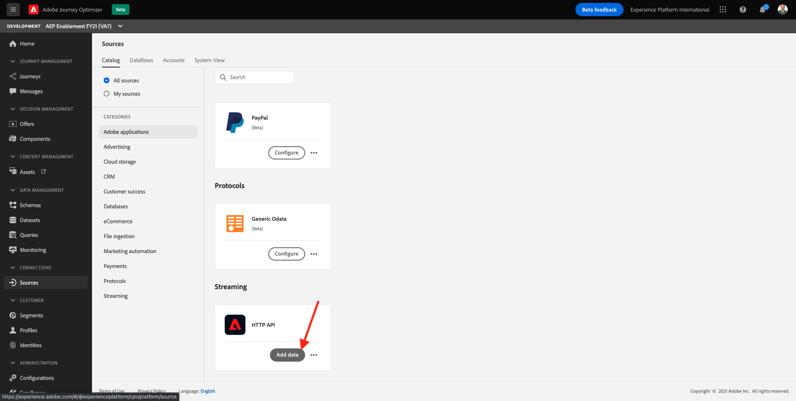
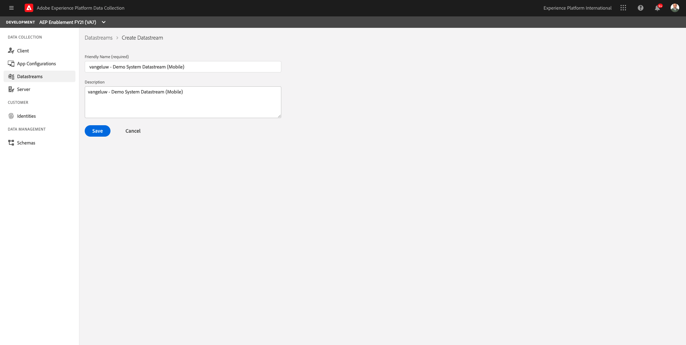
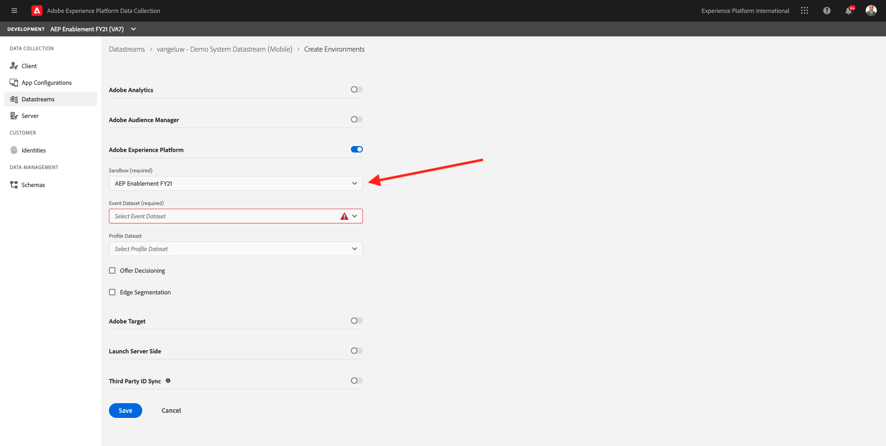
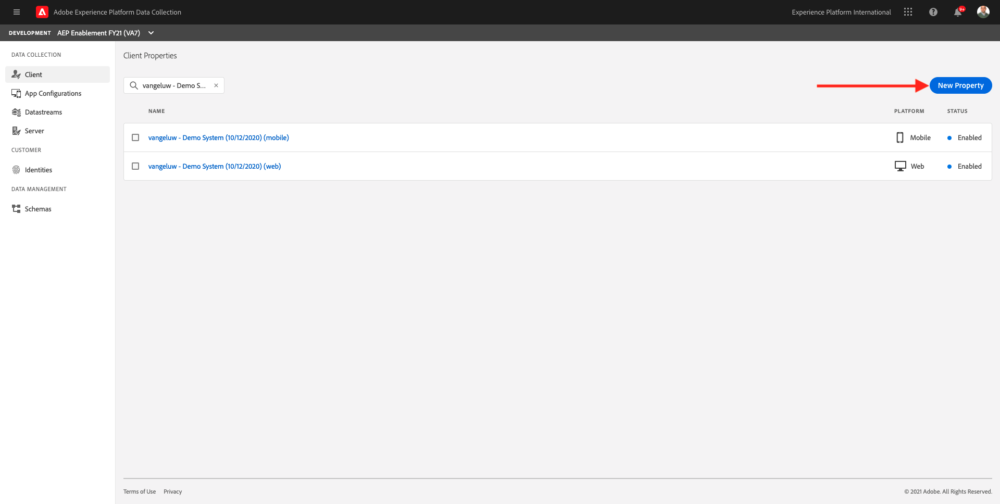

# 23.6 Setup and use push notifications for iOS

## 23.6.1 Retrieve Dataset IDs for Journey Optimizer Push Messaging

Login to Adobe Experience Cloud by going to [Adobe Experience Cloud](https://experience.adobe.com). Click **Adobe Journey Optimizer**.

You'll be redirected to the **Home** view in Journey Optimizer.

Before you continue, you need to select a **sandbox**. The sandbox to select is named ``--aepSandboxId--``. You can do this by clicking the text **[!UICONTROL Production Prod]** in the blue line on top of your screen.

In Journey Optimizer, click on **[!UICONTROL Datasets]** in the menu on the left side of your screen.

### Journey Optimizer Push Profile Dataset

Next, you need to retrieve the dataset ID of the dataset named **Journey Optimizer Push Profile Dataset**. Select that dataset in the list of datasets to see the dataset ID.

Write down the Dataset ID, as you'll need it in a next exercise. The Dataset ID for the Journey Optimizer Push Profile Dataset in this example is **601c407f82be44194a3c5c54**.

### Journey Optimizer Push Tracking Experience Event Dataset

Next, you need to retrieve the dataset ID of the dataset named **Journey Optimizer Push Tracking Experience Event Dataset**. Select that dataset in the list of datasets to see the dataset ID.

Write down the Dataset ID, as you'll need it in a next exercise. The Dataset ID for the Journey Optimizer Push Tracking Experience Event Dataset in this example is **601c407d9d7e98194b61d352**.

## 23.6.2 Create Data Inlet for Journey Optimizer Push Messaging

In Adobe Experience Platform, click on **[!UICONTROL Sources]** in the menu on the left side of your screen.

In the Sources Catalog, scroll down until you see the Source Connector for **HTTP API** and click **Add data**.

Next, select **New Account** and fill out the details as follows:

- Account Name: **ldap - HTTP API Inlet** (replace ldap by your ldap)

Check the checkbox for **XDM compatible**.

Click **Connect to source**.

You'll then quickly see a confirmation message **Connected**. Click **Next**.

Under **Target dataset**, select **Existing dataset** and browse to find the dataset **Journey Optimizer Push Profile Dataset**. You'll then have this.

Click **Next**.

Give your flow a name like this: **ldap - Journey Optimizer Push Inlet Flow**. Click **Next**.

Click **Finish**.

Your HTTP API connector is now created. You need to write down the **Streaming endpoint URL** as you'll need it in a next exercise. The URL in this example is **https://dcs.adobedc.net/collection/105495ebb6e9c98a2d010ddb51599c7f942edd4f1724deb779ec81bbcdd6fd2f**.

You can now continue setting up your Datastream and Adobe Experience Platform Data Collection Client property.

## 23.6.3 Create Datastream for Mobile

Go to [https://experience.adobe.com/#/data-collection/](https://experience.adobe.com/#/data-collection/). 

Open the dropdown menu and click **[!UICONTROL Datastream]**.

Click **[!UICONTROL New Datastream]**.

For the **[!UICONTROL Friendly Name]**, and for the optional description, enter **ldap - Demo System Datastream (Mobile)** and replace **ldap** with your ldap.
Click the **[!UICONTROL Save]** button.

You'll then see this:

Toggle on **[!UICONTROL Adobe Experience Platform]** which will expose additional fields. You'll then see this:

For **[!UICONTROL Sandbox]**, select your sandbox name.

>[!NOTE]
>
> You can find your IMS Org ID, Org Name and your Adobe Experience Platform sandbox name on your company's github repository that was set up by your Adobe contact. If you don't know which sandbox to use, verify if you can see a sandbox named **AEP Enablement FY21**. If you can see that sandbox, please select it.

For Event Dataset, select **Demo System - Event Dataset for Mobile App (Global v1.1)** and for Profile Dataset, select **Demo System - Profile Dataset for Mobile App (Global v1.1)**. Click **Save**.

You'll then see that your Datastream consists of 3 environments.

Your Datastream is now ready to be used in your Adobe Experience Platform Data Collection Client property for Mobile.

## 23.6.4 Create a new Adobe Experience Platform Data Collection Client property for Mobile

Go to [https://experience.adobe.com/#/data-collection/](https://experience.adobe.com/#/data-collection/). After completing previous modules, you already have two Adobe Experience Platform Data Collection Client properties: one for web and one for mobile.

You've been using these Adobe Experience Platform Data Collection Client properties already as part of previous modules. In this module, you'll create a new Adobe Experience Platform Data Collection Client property for Mobile which will be compatible with the new AEP SDKs for Edge, Messaging and Assurance (Griffon).

Click **New Property** to create a new Adobe Experience Platform Data Collection Client property.

As a name, use **ldap - Demo System (DD/MM/YYYY) (mobile - Edge)** and select the **Platform**: **Mobile**. Click **Save**.

Open your newly created Adobe Experience Platform Data Collection Client property.

Go to **Extensions**. You'll see that the extensions **Mobile Core** and **Profile** are already installed.

Go to **Catalog** and click **Install** on the extension **Adobe Experience Platform Edge Network**.

You'll then see this. 

Open the dropdown and select the Datastream you created in one of the previous exercises. Click **Save**.

>[!NOTE]
>
> Due to a bug in Adobe Experience Platform Data Collection, only the first 100 Datastreams are shown in the dropdown list. You'll need to rename your Datastream to start with an `A` or a `0` so that it is shown in the list.

You'll then be back back here. Go to **Catalog** again.

Search for the extension **AEP Assurance** and click **Install**.

>[!NOTE]
>
> AEP Assurance helps you inspect, proof, simulate, and validate how you collect data or serve experiences in your mobile app. You can read more about AEP Assurance and Project Griffon here [https://aep-sdks.gitbook.io/docs/beta/project-griffon](https://aep-sdks.gitbook.io/docs/beta/project-griffon).

There's nothing specific to configure in the **AEP Assurance** extension, so you'll be back at the extension view directly.

Go to **Publishing Flow** and click **Add New Library**.

Give your Library a name, select the Environment: **Development**, click **Add All Changed Resources** and then click **Save & Build to Development**.

Your library then starts building, and should be built within a couple of seconds.

Go to **Environments** and click the **Install** icon for your **Development** environment.

You'll then see this. Click the **copy** icon next to your **Environment File ID**.

Your Environment File ID looks like this: **b754ed1bed61/7712c63caf43/launch-2914570360f6-development**.

You'll need to use this in the next step, to update your iOS app.

## 23.6.5 Update your Configuration ID

Open an incognito browser window and go to [https://public.aepdemo.net/admin_configuration_update.html](https://public.aepdemo.net/admin_configuration_update.html).

You'll see the **Update Configuration ID** page. Enter your personal Configuration ID and click **Load Configuration**.

You now see your own personal Configuration ID and its current settings. The goal of this exercise is to update the **Launch Mobile App Tag URL** by the **Environment File ID** you created in the previous exercise.

Replace the current value by the new value.

Scroll down until you see the fields for **Messaging Inlet ID**, **Messaging Use APNSSandbox**, **Messaging Profile Dataset ID**, **Messaging Event Dataset ID**.

You need to update these fields using the variables you collected in the previous exercises.

- **Messaging Inlet ID** is the URL of the HTTP API Source Connector you created in exercise 23.5.2, which looks like this: **https://dcs.adobedc.net/collection/cfd54050618a515dc1f7320ae39afd082ec8e8bf0e94abd9ac3ea805fdb07378**
- **Messaging Use APNSSandbox** should be set to **false**
- **Messaging Profile Dataset ID** is the dataset ID of the dataset named **Journey Optimizer Push Profile Dataset**, which you retrieved in exercise 23.5.1
- **Messaging Event Dataset ID** is the dataset ID of the dataset named **Journey Optimizer Push Tracking Experience Event Dataset**, which you retrieved in exercise 23.5.1

Scroll down and click **Update Configuration ID**.

Your Configuration ID has now been updated.

Whichever option you choose, once you've made the change, you can test your setup with the iOS app.

## 23.6.6 Configure your iOS app

The mobile application that is used in the context of this demo and enablement environment is only available for **iOS**.

Take your **iOS** device, open the **AppStore** and search for **Platform - Edge**. Click the **DOWNLOAD/INSTALL** button.

Next, click **OPEN**.

You'll now see this screen. You can either manually enter the **Configuration ID** you created, or else, you can click the **QR code scan** icon to scan a QR code.

On the Admin homepage of your demo website, you'll find a QR code you can scan. 

After clicking the **QR code scan** in the app, you'll see this. Click **OK** to scan a QR code.

After scanning the QR code, you'll be back in this screen, with the Configuration ID filled out for you. Click **Load Configuration**.

You'll then see a confirmation of which environment you'll be loading. Click **Save Configuration**.

After a couple of seconds, you'll be presented with the **Select LDAP** screen. Select your LDAP and click **Save**.

After a couple of seconds, you'll see that the demo brand **Luma** is being loaded automatically.

And finally, you'll see the Luma homepage in the app.

Kill the app by swiping the app up, and swiping it up completely so that the app is killed.

>[!NOTE]
>
> After restarting the app, you'll be asked to accept up to 3 permission prompts. Accept those prompts by clicking **OK**, **Allow while using the app** or **Allow** as they are required by the app.

Open the app again.

On the homepage of the app, click the **...** button in the top. left corner. Then select AEP Assurance.

You'll then see this:

You now need to scan a QR code to connect your iOS device to your AEP Assurance session. 

To start an AEP Assurance session, go to [https://experience.adobe.com/#/@experienceplatform/griffon](https://experience.adobe.com/#/@experienceplatform/griffon). Click **Create Session**.

Click **Start**.

Fill out the values:

- Session Name: use **ldap - iOS & Push debugging** and replace ldap by your ldap
- Base URL: use **com.adobe.platform.edge://default**

Click **Next**.

You'll then see a QR code on your screen, which you should scan with your iOS device.

On your iOS device, click the **QR Code** icon and scan the QR code that is displayed by AEP Assurance.

After scanning the QR code, you'll see that the AEP Assurance session URL is displayed on your iOS device. Click **Start AEP Assurance**.

You'll then see a popup screen, asking you to enter the PIN-code. Copy the PIN-code from your AEP Assurance screen and click **Connect**.

You'll then be connected from your iPad or iPhone to the AEP Assurance session.

Kill the app by swiping the app up, and swiping it up completely so that the app is killed.

When the iOS app stops, it'll disconnect from the AEP Assurance session.

When the iOS app starts again, you'll see that the app connects to AEP Assurance automatically, and you'll see a list of events being loaded immediately.

>[!NOTE]
>
> If you don't see the options **Data Elements**, **Shared States**, **ConfigurationViewer**, **Push Debug** in the left menu then please add them by clicking the **Configure** button. Next, click the **+** icon as indicated below, followed by **Save**.

Go to **Push Debug**. You'll see something like this.

Some explanation:

- The first column, **Client**, shows the available identifiers on your iOS device. You'll see an ECID and a Push Token.
- The second column shows **Profile** information, with additional info on what platform the Push Token lives in (APNS or APNSSandbox). If you click the **Inspect Profile** button, you'll be taken to Adobe Experience Platform and you'll see the full Real-time Customer Profile.
- The 3rd column shows the **App Configuration**, which was set up as part of exercise **23.5.4 Create App Configuration in Launch**

To test your Push configuration setup, click the **Send Push Notification** button. 

You need to make sure that the **Platform** app isn't open at the time of clicking the  **Send Push Notification** button, because if the app is open, the Push Notification might be received in the background and wouldn't be visible.

You'll then see a Push Notification like this one appear on your iOS device.

>[!NOTE]
>
>The timestamp in the push notification that you'll receive will show the UTC/GMT time which might be different from your current time. This is normal and expected, and the difference in time will be equal to the difference in timezone between where you are, and what the current UTC/GMT time is.

If you've received the Push Notification, that means that your setup is correct and working fine.

## 23.6.7 Create a push message

To configure a Push message, go to Journey Optimizer.

Make sure to select your sandbox, which should be `--aepTenantId--`.

Go to **Messages**. Click **Create Message**.

In the **Preset** dropdown, select the Preset you'd like to use. In this case, the preset named **CJM Alpha Preset for Mobile (APNS)** is the one to select. 

Fill out the name using this convention: **ldap - Welcome to store**.

Don't forget to check the checkbox for **Push Notification**. Click **Create**.

You'll then see this. Click the **pencil** icon for the **Title** field.

You'll then see this. You can now select any Profile attribute from the Real-time Customer Profile directly.

Scroll down until you see **Person**. Click the **arrow** to go a level deeper.

Click the **arrow** next to **Full Name**.

Finally, click the **+** icon next to the field **First Name**. You'll then see the personalization token for First Name being added: **{{profile.person.name.firstName}}**.

Next, add the text **, welcome to our store!** behind **{{profile.person.name.firstName}}**.

Click **Save**.

You now have this. Click the **pencil** icon for the **Body** field.

Enter this text **Click here to get a 10% discount when you buy today!** and click **Save**.

Your Push message is now ready. Click **Publish** to publish your message.

Click **Publish** again.

Your message is now ready and can be used in a journey.

## 23.6.8 Create a new event

In the menu, go to **Journey Administration** and click **Manage** under **Events**.

On the **Events** screen, you'll see a view similar to this. Click **Create Event**.

You'll then see an empty event configuration.

First of all, give your Event a Name like this: `ldapStoreEntryEvent` and replace `ldap` with your ldap.

Next, add a description like this `Store Entry Event`.

Next is the **Event Type** selection. Select **Unitary**.

Next is the **Event ID Type** selection. Select **System Generated**

Next is the Schema selection. A schema was prepared for this exercise. Please use the schema `Demo System - Event Schema for Mobile App (Global v1.1) v.1`.

After selecting the Schema, you'll see a number of fields being selected in the **Payload** section. Your event is now fully configured.

You should then see this. Click **Save**.

Your Event is now configured and saved. Click on your event again to open up the **Edit Event** screen again.

Hover over the **Payload** field again to see the 3 icons again.

Click on the **View Payload** icon. You'll now see an example of the expected payload.

Your Event has a unique orchestration eventID, which you can find by scrolling down in that payload until you see `_experience.campaign.orchestration.eventID`.

The event ID is what needs to be sent to Adobe Experience Platform in order to trigger the Journey that you'll build in the next step. Write down this eventID, as you'll need it in the next step.
`"eventID": "ff88e8f5d9405230327afb1a81275996a6e01948059b8109c49fd19ccc01722a"`

Click **Ok**, followed by **Cancel**.

In order to use your event for the test and demo at the end of this exercise, you need to enter your Store Entry Event ID into your Configuration ID.

To do that, open an incognito browser window and go to [https://public.aepdemo.net/admin_configuration_update.html](https://public.aepdemo.net/admin_configuration_update.html).

You'll see the **Update Configuration ID** page. Enter your personal Configuration ID and click **Load Configuration**.

You now see your own personal Configuration ID and its current settings. The goal of this exercise is to update the field **EventID - Beacon** with the **Event ID** you just created. Scroll down to find the field **EventID - Beacon**.

Replace the current value by the new value.

Scroll down and click **Update Configuration ID**.

Your Configuration ID has now been updated.

## 23.6.9 Use your event and push message in a journey

In the menu, go to **Journeys** and click **Create Journey**.

You'll then see this.

Give your journey a name. Use **ldap - Store Entry journey** and replace **ldap** by your ldap. Click **OK**.

First, you need to add your event as the starting point of your journey. Search for your event **ldapStoreEntryEvent** and drag and drop it onto the canvas. CLick **OK**.

Next, under **Actions**, search for the **Message** action.

Drag and drop the **Message** action onto the canvas and click the **edit** icon to select your message.

Select the push message you created in the previous step. Click **Select**.

You then have this. Click **OK**.

Search for the orchestration type **End** and drag and drop it onto the canvas. Click **OK**.

Click **Publish** twice.

Your journey is now published.

## 23.6.10 Test your journey and push message

To test your journey using the mobile app, you first need to delete the app, reinstall it and load your configuration ID again. This is to ensure that your changes to your configuration ID will be loaded in the app.

Follow the steps described in exercise 23.5.6 to install the app again and load your Configuration ID.

Login into the app with an account you created on the website.

Make sure your profile is showing into the app.

Go back to the app's homepage.

Once you're back at the app's home screen, click the **bluetooth** icon in the upper left corner. Clicking this icon will generate an experience event to Edge and Adobe Experience Platform which contains your event's EventID. This will kick off your journey, and you should receive a push message within seconds.

Make sure to close the app immediately after clicking the **bluetooth** icon, otherwise the push message won't be shown.

After a couple of seconds, you'll see the message appear.

You have finished this exercise.

Next Step: [23.7 Create a business event journey](./ex7.md)

[Go Back to Module 23](./journeyoptimizer.md)

[Go Back to All Modules](../../overview.md)
