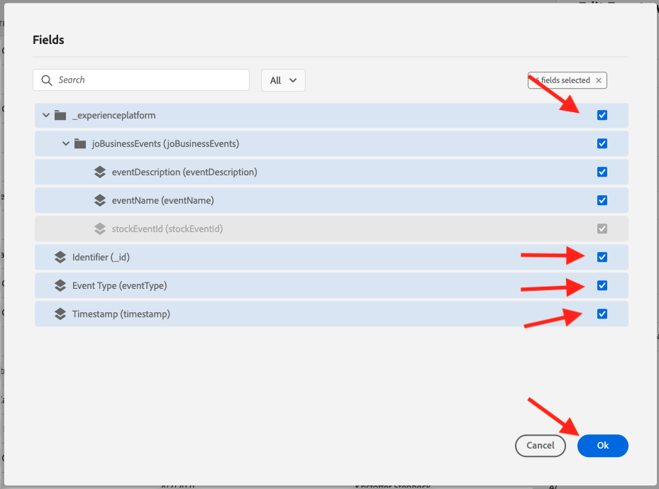
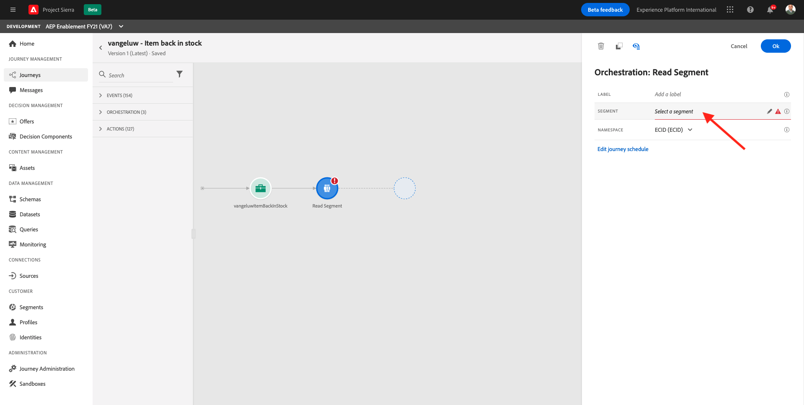

# 23.7 Create a business event journey

Login to Adobe Experience Cloud by going to [Adobe Experience Cloud](https://experience.adobe.com). Click **Adobe Journey Optimizer**.


You'll be redirected to the **Home** view in Journey Optimizer.


Before you continue, you need to select a **sandbox**. The sandbox to select is named ``--aepSandboxId--``. You can do this by clicking the text **[!UICONTROL Production Prod]** in the blue line on top of your screen.


## 23.7.1 Create a business event

In the left menu, click **Configurations**.


Click on the **Manage** button inside the **Events** card.


Business events are a new type of event you can create inside Journey Optimizer. Unlike the **Unitary** events that you have created in previous modules, the business events are not triggered by the customer but by the organization. You'll now create your business event. 

Click **Create Event**.


Enter the following values in the Event creation form:

- **Name**: **ldapItemBackInStock** and replace **ldap** by your ldap. For instance: vangeluwItemBackInStock
- **Description**: This event is triggered when a product is back in stock
- **Type**: select **Business** in the drop down


- Schema: Select **Demo System - Event Schema for JO Business Events (Global v1.1) v.1**. You now need to select the fields in the schema that you require for our use case. 

  

  Follow these steps:

  Click the **pencil** icon on the field where it says **1 field selected**.

  

  Select all available fields in the schema, then click **OK**.

  

- Condition: you need to specify which records in this schema will be triggering the business event. 
  
  Follow these steps:

  Click the **pencil** icon on the field where it says **Add a condition**.

  

  On the left-hand side, expand the `--aepTenantId--` object, expand the object **joBusinessEvents** and drag and drop the field **eventName** onto the canvas.

  

  For the field **eventName**, enter the following value: **ldapItemBackInStock** and replace **ldap** by your ldap. For instance: vangeluwItemBackInStock.
  Click **OK**.

  

  Click **OK**.

  

Finally your event creation form should look like this. Click **Save** to save your business event.


## 23.7.2 Create a business event journey

You can now leverage this business event inside a journey. Go to **Journeys**. Click **Create Journey**.


On the right-hand side you will see a form where you need to specify the journey name and description. Enter the following values:

- **Name**: **ldap - Item back in stock**. Replace **ldap** by your ldap. For instance: vangeluw - Item back in stock
- **Description**: This journey sends an SMS when an item is back in stock to visitor who have shown an interest.

Click **OK**. 


In the left menu, under **Events**, search for your ldap. You'll find the previously created business event **ldapItemBackInStock**. Drag and drop this event onto the canvas as this will be the starting point of the journey. 


As you can see, a **Read Segment** activity has automatically been added to the canvas. This is because the business events only send a trigger for the journey to read a specific segment, which will then retrieve the list of profiles for that journey.

Click the **Read Segment** activity.


The **Read Segment** configuration expects you to select the segment that you want to notify of the business event that just happened. Click the **Select a segment** field.



In the **Choose a segment** popup, search for your ldap and select the segment you created in [Module 11 - Real-time CDP - Build a segment and take action](../module11/real-time-cdp-build-a-segment-take-action.md) named **ldap - Interest in Zeppelin Yoga Pant (RTCDP - ldap)**. for example: vangeluw - Interest in Zeppelin Yoga Pant (RTCDP - vangeluw). Click **Save**.


Next, click **Ok**. 


The next step is to drag and drop the action that we want to perform in this journey. In the menu, go to **Actions** and find the action named **ldapSmsTwilio** that you created in [Module 12 - Journey Orchestration - External Weather API, SMS Action & more](../module12/journey-orchestration-external-weather-api-sms.md). 

You’ll then see a panel on the right-hand side where you can configure the action.


Navigate to the Action Parameters and click on the **pencil** icon for the Action Parameter **TEXTMESSAGE**.


In the popup you’ll see, click on **Advanced Mode**.


Select the below code, copy it and paste it in the Advanced Mode Editor.

```
'Hi ' + #{ExperiencePlatform.ProfileFieldGroup.profile.person.name.firstName} + ' the Zeppelin Yoga pant is back in stock at ' + #{ExperiencePlatform.ExperienceEventFieldGroup.experienceevent.at(0)._experienceplatform.demoEnvironment.brandName}
```

Click **Ok**.


Click on the **pencil** icon for the Action Parameter **MOBILENR**.


In the popup you’ll see, click on **Advanced Mode**.


Paste this code in the Advanced Mode Editor. Click OK.

`substr(#{ExperiencePlatform.ProfileFieldGroup.profile.mobilePhone.number}, 0, 12)`

>[!NOTE]
>
>This code is intended to work with mobile phone numbers that have 12 digits (including the +), like this one: **+32463622044**.
>Several other countries have 13-digit phone numbers. If your mobile phone number has 13 digits (including the +), you need to update this code to:

`substr(#{ExperiencePlatform.ProfileFieldGroup.profile.mobilePhone.number}, 0, 13)`

Click **Ok**.


Click **Ok**.


In the menu, click **Orchestration** and drag and drop **End** onto the canvas. Click **Ok**.


Your journey is now ready to be published. Click **Publish**.


Click **Publish** again.


Your journey is now published, you can now test it!

## 23.7.3 Test your business event journey

You'll now simulate the re-stock of a product by ingesting a new event against the **Demo System - Event Schema for JO Business Events (Global v1.1) v.1** using Postman.

In the left menu, click **Sources**.


Click on the **Accounts** tab, find the account named **Journey Optimizer Business Events** and click on the name to open it.


This account only has one dataflow, click on the dataflow name to select it.


Click **Copy schema payload** in the right menu. This option copies the entire **curl** command to insert a record against the **Demo System - Event Schema for JO Business Events (Global v1.1) v.1** to your clipboard.


Paste the Curl command inside a text editor


Let's have a closer look to this request,

- The POST request is sent to the DCS Inlet ID
- The request references the schema, the dataset and the Organization ID.
- Finally it contains the xdmEntity node which represents the data that we want to create inside the dataset. 

You now need to replace the following `xdmEntity` line...

```json
"xdmEntity": {
  "_experienceplatform": {
    "joBusinessEvents": {
      "eventDescription": "string",
      "eventName": "string",
      "stockEventId": "string"
    }
  },
  "_id": "/uri-reference",
  "eventType": "advertising.completes",
  "timestamp": "2018-11-12T20:20:39+00:00"
}
```

...by this line, make sure you replace **ldap** by your ldap as **ldap**ItemBackInStock represents the condition you have specified in your business event to trigger your journey.

```json
"xdmEntity": {
  "_experienceplatform": {
    "joBusinessEvents": {
      "eventDescription": "Product Zeppelin Yoga pant is back in stock",
      "eventName": "ldapItemBackInStock",
      "stockEventId": "1"
    }
  },
  "_id": "/uri-reference",
  "eventType": "productBackInStock",
  "timestamp": "2021-04-19T15:25:39+00:00"
}
```

The updated **curl** command should look like this:


Select all of it and copy it to your clipboard.

Open Postman. On the left-hand side of Postman, click **Import**.


Select the **Raw text** tab and paste the command previously copied here. Click **Continue**.


Click **Import**.


Postman has automatically converted the **curl** command into a REST command ready to be triggered, simply press the **Send** button to request the creation of that record inside the dataset.


Verify that your request has been successfully received. Look for a **200 OK** status in postman.


The SMS may take a couple of minutes to arrive on your mobile phone. If it does not, your **Interest in Zeppelin Yoga Pant** segment may not contain a profile with a correct mobile phone. If so, go on the Luma website, visit the **Zeppelin Yoga Pant** product and register while making sure you provide the correct mobile phone number.


You have now finished this exercise.

Next Step: [Summary and benefits](./summary.md)

[Go Back to Module 23](./journeyoptimizer.md)

[Go Back to All Modules](../../overview.md)
