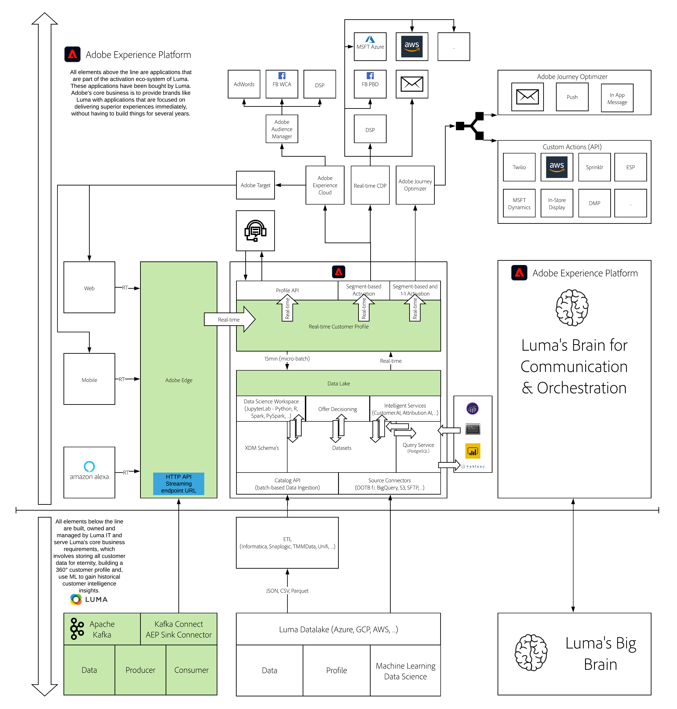

# 24. Stream data from Apache Kafka into Adobe Experience Platform

**Authors: [Vivek Tiwari](https://www.linkedin.com/in/vivek-tiwari-25092656/), [Nipun Nair](https://www.linkedin.com/in/nipunnair/), [Wouter Van Geluwe](https://www.linkedin.com/in/woutervangeluwe/)**

In this module, you'll learn how to setup your own Apache Kafka cluster, define topics, producers and consumers and stream data into Adobe Experience Platform using the Adobe Experience Platform Sink Connector through Kafka Connect.

## Learning Objectives

- Perform a basic setup of a local Kafka cluster
- Create a Kafka topic, use a Kafka producer and a Kafka consumer
- Configure Kafka Connect and the Adobe Experience Platform Sink Connector
- Manually produce events and see those events get ingested in Adobe Experience Platform
- Use an existing Twitter producer library from Kafka Connect to stream Twitter data into Adobe Experience Platform

## Prerequisites

- Java JDK11 or above needs to be installed on your computer, you can download that JDK here: [https://www.oracle.com/java/technologies/javase-jdk11-downloads.html](https://www.oracle.com/java/technologies/javase-jdk11-downloads.html)
- Access to Adobe Experience Platform

## Architecture Overview

Have a look at the below architecture, which highlights the components that will be discussed and used in this module.

## Sandbox to use

For this module, please use this sandbox: `--aepSandboxId--`.

>[!NOTE]
>
>Don't forget to install, configure and use the Chrome Extension as referenced in [0.6 - Install the Chrome extension for the Experience League documentation](../module0/ex6.md)

## Exercises

[24.1 Introduction to Apache Kafka](./ex1.md)

In this exercise, you'll learn about the basics of Apache Kafka

[24.2 Install and configure your Kafka cluster](./ex2.md)

In this exercise, you'll download, install and configure your basic Apache Kafka cluster.

[24.3 Configure HTTP API Streaming endpoint in Adobe Experience Platform](./ex3.md)

In this exercise, you'll configure an HTTP API Source Connector in Adobe Experience Platform.

[24.4 Install and configure Kafka Connect and the Adobe Experience Platform Sink Connector](./ex4.md)

In this exercise, you'll use Kafka Connect to install and use the Adobe Experience Platform Sink Connector and you'll send events into Adobe Experience Platform manually.

[Summary and benefits](./summary.md)

Summary of this module and overview of the benefits.

>[!NOTE]
>
>Thank you for investing your time in learning all there is to know about Adobe Experience Platform. If you have questions, want to share general feedback of have suggestions on future content, please contact Wouter Van Geluwe directly, by sending an email to **vangeluw@adobe.com**.

[Go Back to All Modules](../../overview.md)
