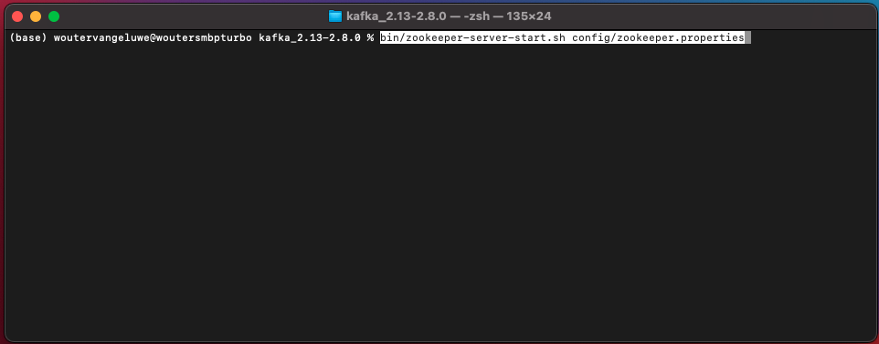

# 24.2 Install and configure your Kafka cluster

## 24.2.1 Download Apache Kafka

Go to [https://kafka.apache.org/downloads](https://kafka.apache.org/downloads) and download the latest released version. Select the latest binary release, in this case **Scala 2.13**.

You're then taken to a mirror site. Click the suggested link to download Kafka.

Create a folder on your desktop named **Kafka_AEP** and place the downloaded file in that directory.

Open a **Terminal** window by right-clicking your folder and clicking **New Terminal at Folder**.

Run this command in your Terminal window to uncompress the downloaded file:

`tar -xvf kafka_2.13-2.8.0.tgz`

You'll then see this:

After uncompressing that file, you now have a directory like this one:

And in that directory, you'll see these subdirectries:

Go back to your Terminal window. Enter the following command:

`cd kafka_2.13-2.8.0`

Next, enter the command `bin/kafka-topics.sh`. 

You should then see this response. This means that Kafka is properly installed and that Java is working fine. (Reminder: you need Java 8 JDK or Java 11 JDK installed for this to work!. You can see which Java version you have installed by using the command `java -version`.)

## 24.2.2 Start Kafka

In order to start Kafka, you'll need to start Kafka Zookeeper and Kafka, in this order.

Open a **Terminal** window by right-clicking your folder **kafka_2.13-2.8.0** and clicking **New Terminal at Folder**.

Enter this command:

`bin/zookeeper-server-start.sh config/zookeeper.properties`

You'll then see this:

Keep this window open while your going through these exercises!

Open another, new **Terminal** window by right-clicking your folder **kafka_2.13-2.8.0** and clicking **New Terminal at Folder**.

Enter this command:

`bin/kafka-server-start.sh config/server.properties`

You'll then see this:

Keep this window open while your going through these exercises!

## 24.2.3 Create a Kafka topic

Open a **Terminal** window by right-clicking your folder **kafka_2.13-2.8.0** and clicking **New Terminal at Folder**.

Enter this command to create a new Kafka topic with the name **aeptest**. This topic will be used for testing in this exercise.

`bin/kafka-topics.sh --zookeeper 127.0.0.1:2181 --topic aeptest --create --partitions 1 --replication-factor 1` 

You'll then see a similar confirmation:

Enter this command to create a new Kafka topic with the name **aep**. This topic will be used by the Adobe Experience Platform Sink Connector that you'll configure in the next exercises.

`bin/kafka-topics.sh --zookeeper 127.0.0.1:2181 --topic aep --create --partitions 1 --replication-factor 1` 

You'll then see a similar confirmation:

## 24.2.4 Produce events

Go back to the Terminal window in which you created your first Kafka topic and enter the following command:

`bin/kafka-console-producer.sh --broker-list 127.0.0.1:9092 --topic aeptest`

You'll then see this. Every new line followed by pushing the Enter button will result in a new message being sent into the topic **aeptest**.

Enter `Hello AEP` and push Enter. Your first event has now been sent into your local Kafka instance, into the topic **aeptest**.

Enter `Hello AEP again.` and push Enter.

Enter `AEP Data Collection is the best.` and push Enter.

You've now produced 3 events into the topic **aeptest**. These events can now be consumed by an application that might need that data.

On your keyboard, click `Control` and `C` at the same time to close your producer.

## 24.2.4 Consume events

In the same Terminal window that you used to produce events, enter the following command:

`bin/kafka-console-consumer.sh --bootstrap-server 127.0.0.1:9092 --topic aeptest --from-beginning`

You'll then see all messages that were produced in the previous exercise for the topic **aeptest**, appear in the consumer. This is how Apache Kafka works: a producer creates events into a pipeline, and a consumer consumes those events.

On your keyboard, click `Control` and `C` at the same time to close your producer.

In this exercise, you've gone through all the basics to set up a local Kafka cluster, create a Kafka topic, produce events and consume events.

The goal of this module is to simulate what would happen if a real organization has already implemented an Apache Kafka cluster, and wants to stream data from their Kafka cluster into Adobe Experience Platform.

To facilitate such an implementation, an Adobe Experience Platform Sink Connector was created which can be implemented using Kafka Connect. You can find the documenation of that Adobe Experience Platform Sink Connector here: [https://github.com/adobe/experience-platform-streaming-connect](https://github.com/adobe/experience-platform-streaming-connect).

In the next exercises, you'll implement everything you need to use that Adobe Experience Platform Sink Connector from within your own local Kafka cluster.

Close your terminal window.

You have finished this exercise.

Next Step: [24.3 Configure HTTP API endpoint in Adobe Experience Platform](./ex3.md)

[Go Back to Module 24](./aep-apache-kafka.md)

[Go Back to All Modules](../../overview.md)
