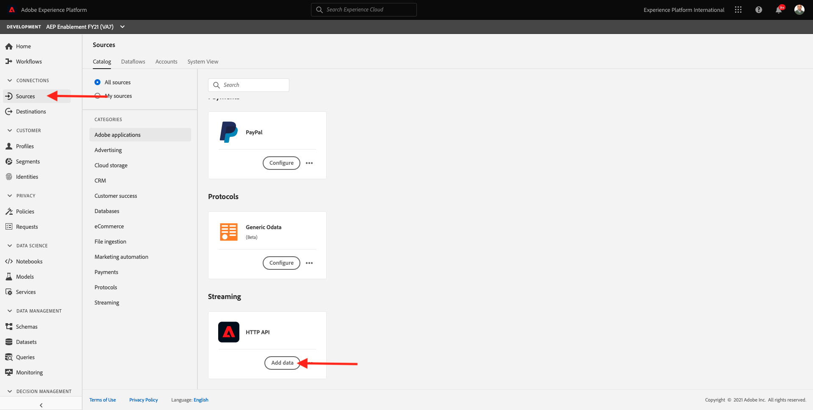
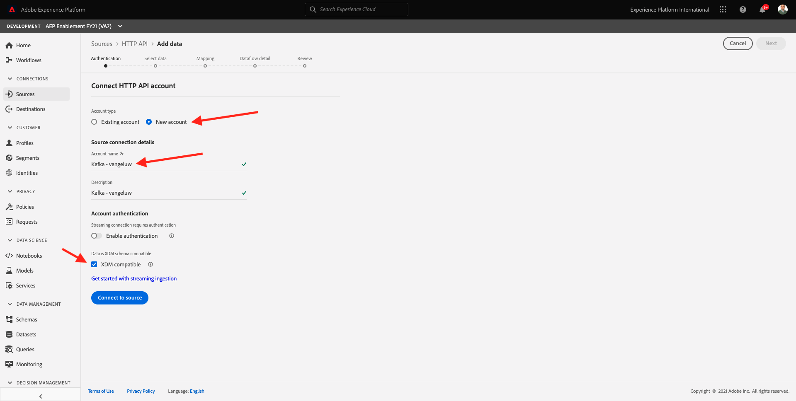
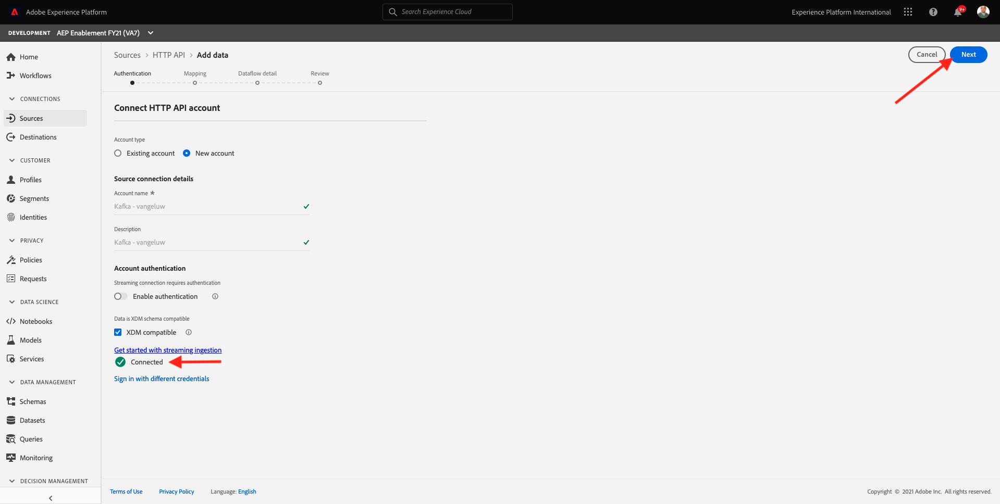
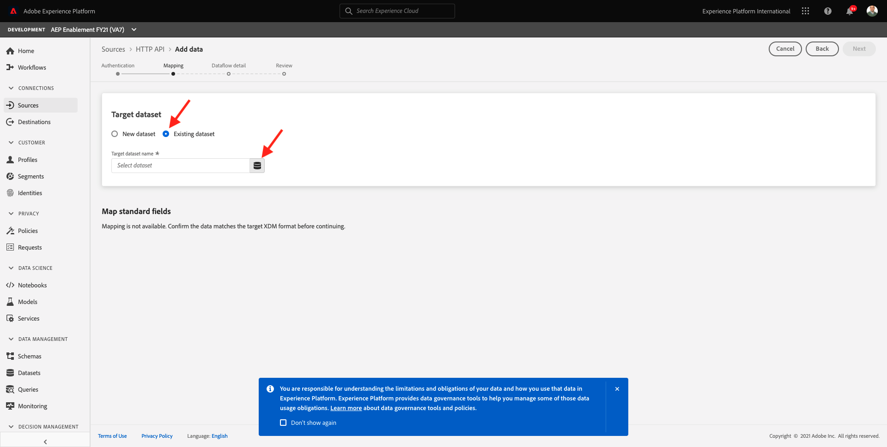
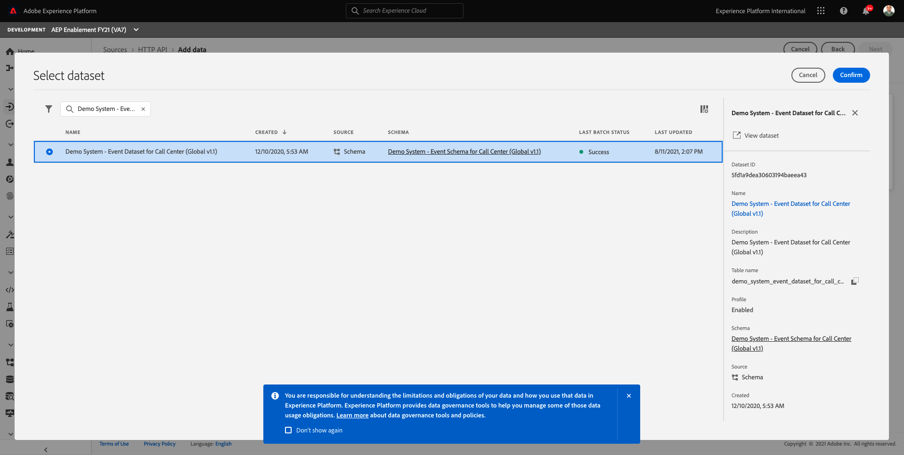
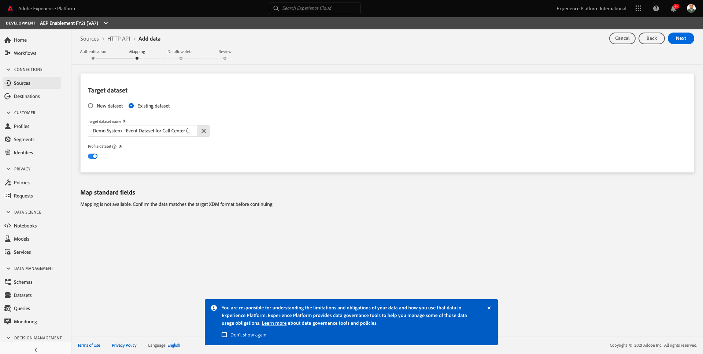
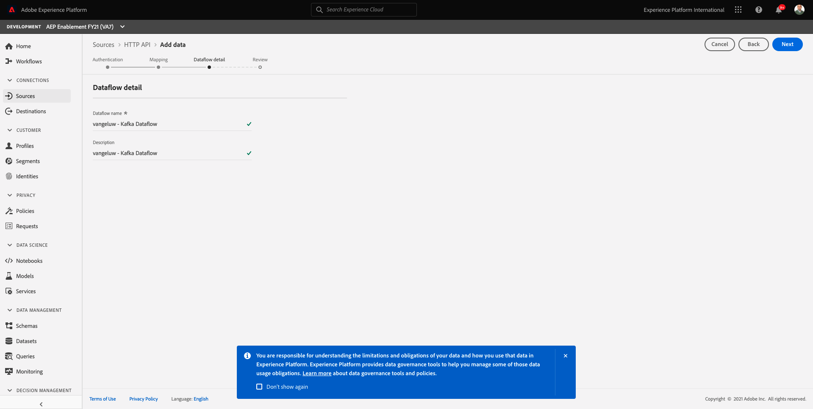
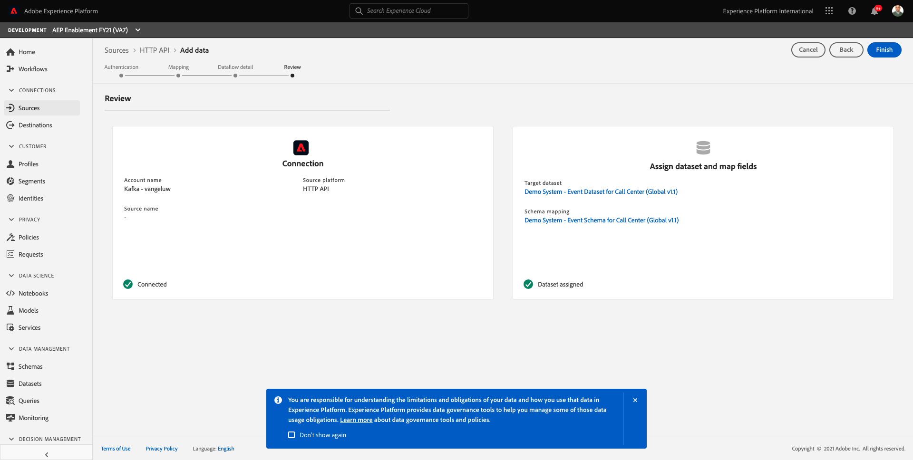
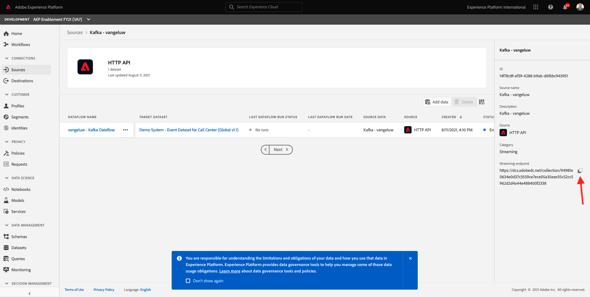

# 24.3 Configure HTTP API Streaming endpoint in Adobe Experience Platform

Before you can set up the Adobe Experience Platform Sink Connector in Kafka, you need to create an HTTP API Source Connector in Adobe Experience Platform. The HTTP API Streaming endpoint URL is required to set up the Adobe Experience Platform Sink Connector.

To create an HTTP API Source Connector, log in to Adobe Experience Platform by going to this URL: [https://experience.adobe.com/platform](https://experience.adobe.com/platform).

After logging in, you'll land on the homepage of Adobe Experience Platform.

Before you continue, you need to select a **sandbox**. The sandbox to select is named ``--aepSandboxId--``. You can do this by clicking the text **[!UICONTROL Production Prod]** in the blue line on top of your screen.

After selecting the appropriate sandbox, you'll see the screen change and now you're in your dedicated sandbox.

After selecting the appropriate sandbox, you'll see the screen change and now you're in your dedicated sandbox.

In the left menu, go to **Sources** and scroll down in the **Sources Catalog** until you see **HTTP API**. Click **Add Data**.

Click **New account**. Use **Kafka - ldap** as the name for your HTTP API connection, in this case **Kafka - vangeluw**. Click **Connect to source**.

You'll then see this, click **Next**.

Select **Existing dataset** and click the dataset icon.

Search and select the dataset **Demo System - Event Dataset for Call Center (Global v1.1)**. Click **Confirm**.

Click **Next**.

Give your dataflow a name. Use **ldap - Kafka Dataflow**, in this case **vangeluw - Kafka Dataflow**. Click **Next**.

Click **Finish**.

You'll then see an overview of the HTTP API Source Connector you just created.

You'll need to copy the **Streaming endpoint** URL, which looks like the one below, as you'll need it in the next exercise.

`https://dcs.adobedc.net/collection/94981e0634e0d37c3559ce7ece05a35eae35c52cc5962d2d4a44e488400f2338`

You have finished this exercise.

Next Step: [24.4 Install and configure Kafka Connect and the Adobe Experience Platform Sink Connector](./ex4.md)

[Go Back to Module 24](./aep-apache-kafka.md)

[Go Back to All Modules](../../overview.md)
