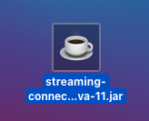
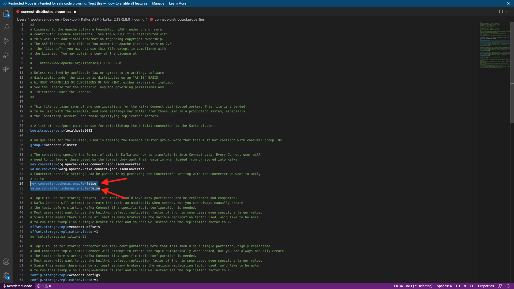
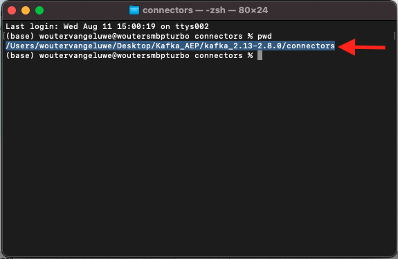
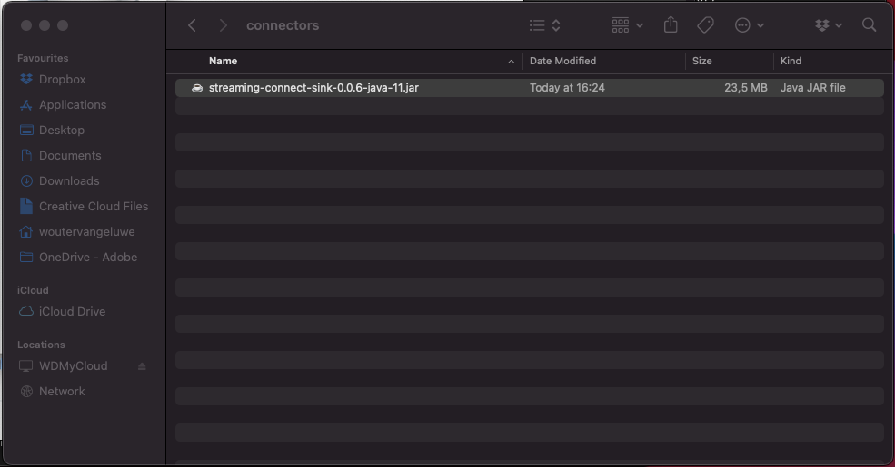
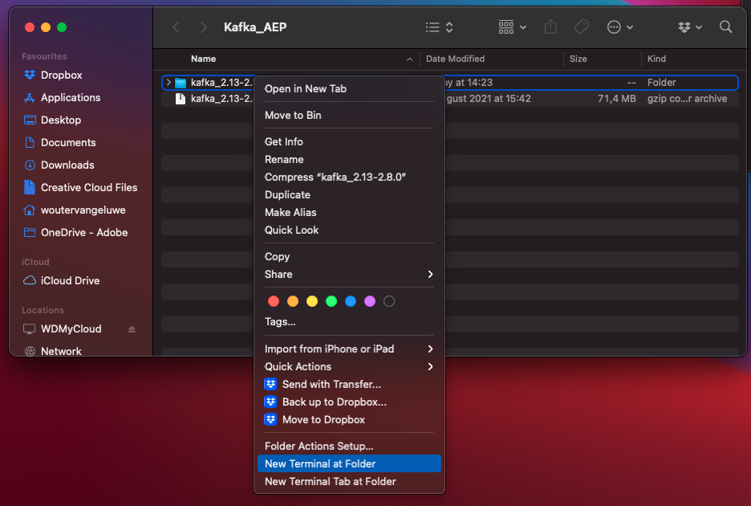
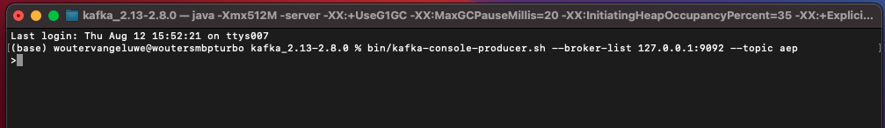
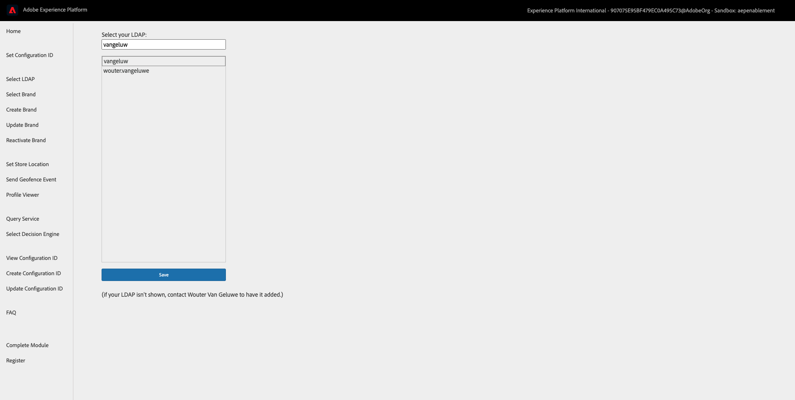

# 24.4 Install and configure Kafka Connect and the Adobe Experience Platform Sink Connector

## 24.4.1 Download the Adobe Experience Platform Sink Connector

Go to [https://github.com/adobe/experience-platform-streaming-connect/releases](https://github.com/adobe/experience-platform-streaming-connect/releases) and download the latest official release of the Adobe Experience Platform Sink Connector.


Place the download file, **streaming-connect-sink-0.0.6-java-11.jar**, onto your desktop.



## 24.4.2 Configure Kafka Connect

Go to the folder on your desktop named **Kafka_AEP** and navigate to the folder `kafka_2.13-2.8.0/config`.
In that folder, open the file **connect-distributed.properties** using any Text Editor.


In your Text Editor, go to line 34 and 35 and make sure to set the fields `key.converter.schemas.enable` and `value.converter.schemas.enable` to `false`

``json
key.converter.schemas.enable=false
value.converter.schemas.enable=false
``



Next, go back to the folder `kafka_2.13-2.8.0` and manually create a new folder, and name it `connectors`.


Right-click the folder and click **New terminal at Folder**.


You'll then see this. Enter the command `pwd` to retrieve the full path for that folder. Select the full path and copy it to your clipboard.



Go back to your Text Editor, to the file **connect-distributed.properties** and scroll down to the last line (line 86 in the screenshot). You should uncomment the line that starts with `# plugin.path=` and you should paste the full path to the folder named `connectors`. The result should look similar to this:

`plugin.path=/Users/woutervangeluwe/Desktop/Kafka_AEP/kafka_2.13-2.8.0/connectors` 

Save your changes to the file **connect-distributed.properties** and close your Text Editor.


Next, copy the latest official release of the Adobe Experience Platform Sink Connector that you downloaded into the folder named `connectors`. The file that you downloaded before is named **streaming-connect-sink-0.0.6-java-11.jar**, you can simply move it into the `connectors` folder.



Next, open a new Terminal window at the level of the **kafka_2.13-2.8.0** folder. Right-click that folder and click **New Terminal at Folder**.

In the Terminal window, paste this command: `bin/connect-distributed.sh config/connect-distributed.properties` and click **Enter**. This command will start Kafka Connect and will load the library of the Adobe Experience Platform Sink Connector.


After a couple of seconds, you'll see something like this:


## 24.4.3 Create your Adobe Experience Platform Sink Connector using Postman

You can now interact with Kafka Connect using Postman. To do so, download [this Postman Collection](../../assets/postman/postman_module24_kafka.zip) and uncompress it to your local computer on the desktop. You'll then have a file that is called `Kafka_AEP.postman_collection.json`.


You need to import this file in Postman. To do so, open Postman, click **Import**, drag and drop the file `Kafka_AEP.postman_collection.json` into the popup and click **Import**.


You'll then find this collection in the left menu of Postman. Click the first request, **GET Available Kafka Connect connectors** to open it.


You'll then see this. Click the blue **Send** button, after which you should see an empty response `[]`. The empty response is due to the fact that no Kafka Connect connectors are currently defined.


To create a connector, click to open the second request in the Kafka collection, **POST Create AEP Sink Connector**. You'll then see this. On line 11, where it says **"aep.endpoint": ""**, you need to paste in the HTTP API Streaming endpoint URL that you received at the end of exercise [24.3](./ex3.md). The HTTP API Streaming endpoint URL looks like this: `https://dcs.adobedc.net/collection/94981e0634e0d37c3559ce7ece05a35eae35c52cc5962d2d4a44e488400f2338`.


After pasting it, the body of your request should look like this. Click the blue **Send** button to create your connector. You'll get an immediate response of the creation of your connector.


Click the first request, **GET Available Kafka Connect connectors** to open it again and click the blue **Send** button again. you'll now see that a Kafka Connect connector is created.


Next, open the third request in the Kafka collection, **GET Check Kafka Connect Connector Status**. Click the blue **Send** button, you'll then get a response like the one below, stating that the connector is running.


## 24.4.4 Produce an experience event

Open a new **Terminal** window by right-clicking your folder **kafka_2.13-2.8.0** and clicking **New Terminal at Folder**.



Enter the following command:

`bin/kafka-console-producer.sh --broker-list 127.0.0.1:9092 --topic aep`


You'll then see this. Every new line followed by pushing the Enter button will result in a new message being sent into the topic **aep**.



You can now send a message, which will result in being consumed by the Adobe Experience Platform Sink Connector, and which will be ingested into Adobe Experience Platform in real-time.

Let's do a little demo to test this.

Open a new, clean incognito browser window and go to [https://public.aepdemo.net](https://public.aepdemo.net). 

You'll then see this. 


Enter your Configuration ID and click **Load Configuration**. Your configuration is then loaded.


Scroll down and click **Save Configuration**.


You'll then be redirected to the Admin homepage. Go to **Select LDAP**. Select your LDAP and click **Save**.



You'll then be redirected to the Admin homepage. Go to **Select Brand** and select the brand **Luma**, click **Save**.


You'll then be redirected to the Admin homepage. Click the **Luma** logo.


You'll then see the Luma homepage.


Go to **Login/Register**. Fill out the form and click **Create Account**. Don't forget to check the checkbox for **Test Profile**.


You'll then see your profile data on the X-ray panel.


You'll also see that no experience events have been recorded yet.


Let's change that and send in a Callcenter experience event from Kafka into Adobe Experience Platform.

Take the below sample experience event payload and copy it into a Text Editor.

```json
{
  "header": {
    "datasetId": "5fd1a9dea30603194baeea43",
    "imsOrgId": "907075E95BF479EC0A495C73@AdobeOrg",
    "source": {
      "name": "Launch"
    },
    "schemaRef": {
      "id": "https://ns.adobe.com/experienceplatform/schemas/b0190276c6e1e1e99cf56c99f4c07a6e517bf02091dcec90",
      "contentType": "application/vnd.adobe.xed-full+json;version=1"
    }
  },
  "body": {
    "xdmMeta": {
      "schemaRef": {
        "id": "https://ns.adobe.com/experienceplatform/schemas/b0190276c6e1e1e99cf56c99f4c07a6e517bf02091dcec90",
        "contentType": "application/vnd.adobe.xed-full+json;version=1"
      }
    },
    "xdmEntity": {
      "eventType": "callCenterInteractionKafka",
      "_id": "",
      "timestamp": "2021-08-12T15:04:03.630Z",
      "_experienceplatform": {
        "identification": {
          "core": {
            "phoneNumber": ""
          }
        },
        "interactionDetails": {
          "core": {
            "callCenterAgent": {
              "callID": "Support Contact - 3767767",
              "callTopic": "contract",
              "callFeeling": "negative"
            }
          }
        }
      }
    }
  }
}
```

You'll then see this. You need to manually update 2 fields:

- **_id**: please set it to your ldap, followed by a random sequence of digits, for instance: vangeluw1234
- **phoneNumber**: enter the phoneNumber of the account that was just created on the demo website. You can find it on the X-ray panel under **Identities**.

>[!NOTE]
>
>The field **_id** needs to be unique for every data ingestion. If you produce multiple events, please make sure that you update the field **_id** every time to a new, unique value.


You should then have something like this:


Next, copy your full experience event to your clipboard. The whitespace of your JSON payload needs to be stripped and we'll use an online tool to do that. Go to [http://jsonviewer.stack.hu/](http://jsonviewer.stack.hu/) to do that.


Paste your experience event into the editor and click **Remove white space**.


Next, select all of the output text and copy it to your clipboard.


Go back to your Terminal window.


Paste the new payload without whitespaces into the Terminal window and click **Enter**.


Next, go back to your demo website and refresh the page. You should now see an experience event on your profile, under **Other Events**, just like the one below:


You have finished this exercise.

Next Step: [Summary and benefits](./summary.md)

[Go Back to Module 24](./aep-apache-kafka.md)

[Go Back to All Modules](../../overview.md)
