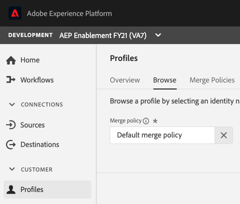
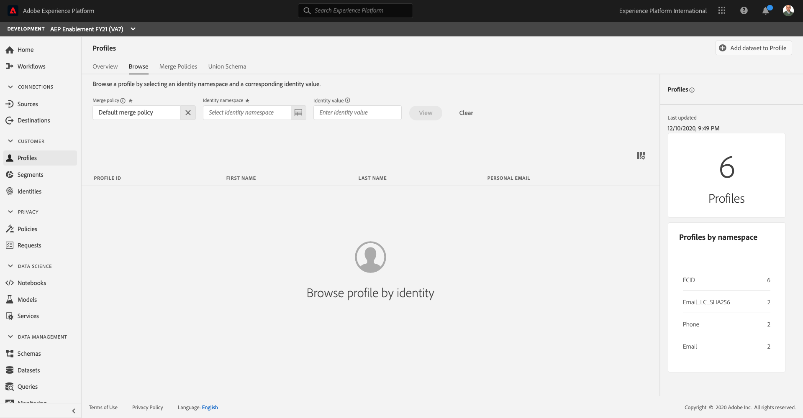
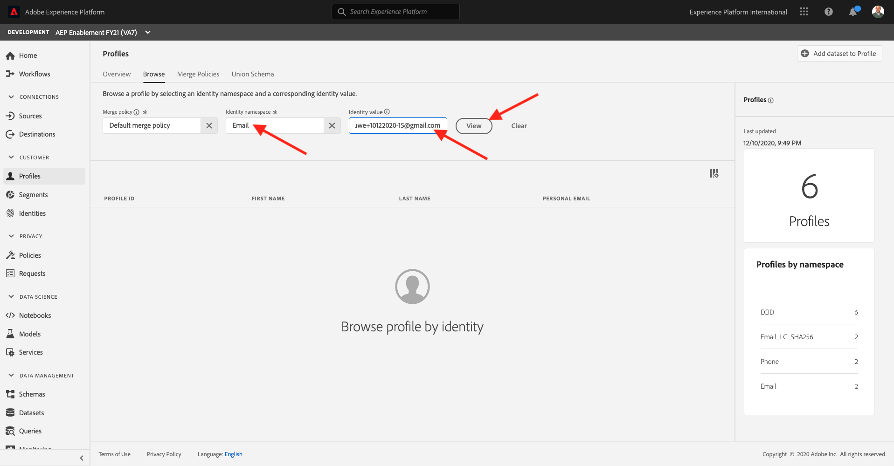
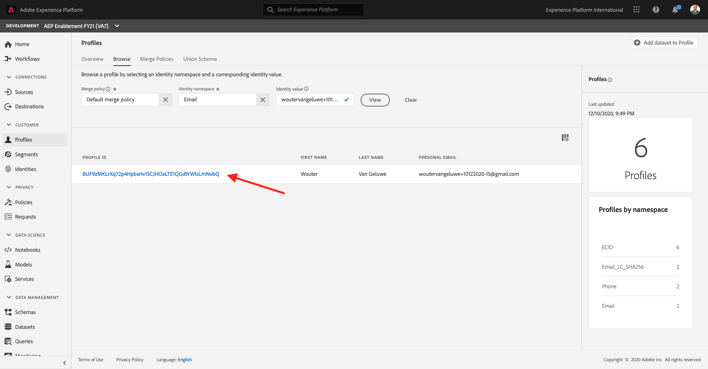
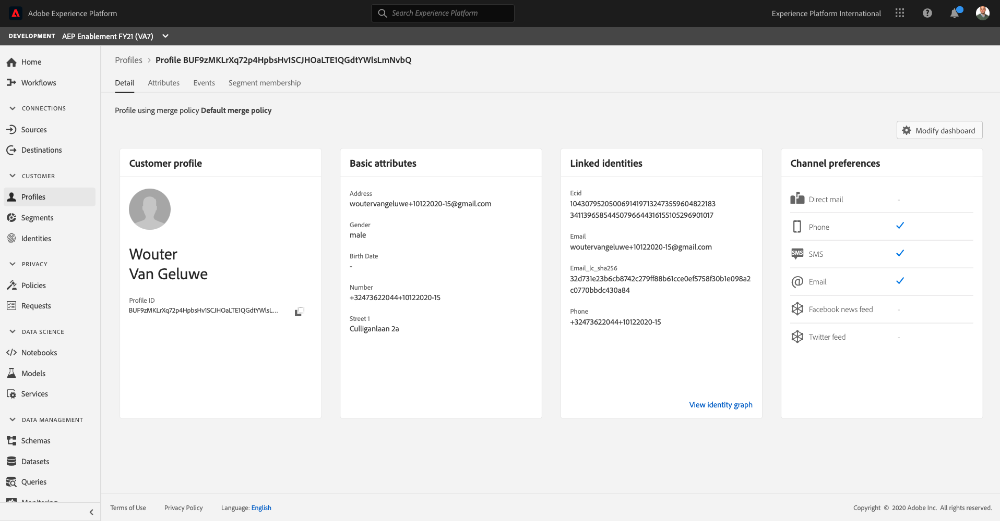
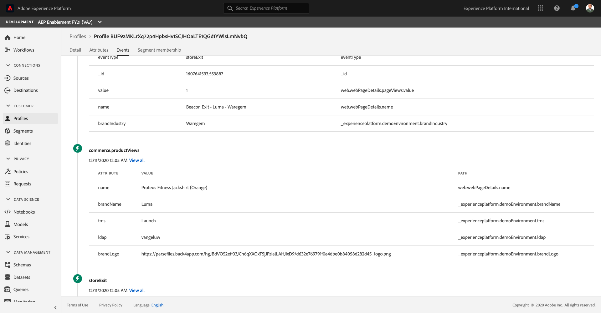

# 3.2 Visualize your own Real-time Customer Profile - UI

In this exercise, you'll login to Adobe Experience Platform and view your own Real-time Customer Profile in the UI.
 
## Story

In the Real-time Customer Profile, all profile data is shown alongside event data, as well as existing segment memberships. The data shown can come from anywhere, from Adobe applications and external solutions. This is the most powerful view in Adobe Experience Platform, the true experience system of record.

## 3.2.1 - Use the Customer Profile View in Adobe Experience Platform

Adobe Experience Platform has a feature that brands have been trying to get for years: a single view of the customer!

Log in to [Adobe Experience Platform](https://experience.adobe.com/platform).

After logging in, you'll land on the homepage of Adobe Experience Platform.

Before you continue, you need to select a **sandbox**. The sandbox to select is named ``--aepSandboxId--``. You can do this by clicking the text **[!UICONTROL Production Prod]** in the blue line on top of your screen.

After selecting the appropriate sandbox, you'll see the screen change and now you're in your dedicated sandbox.

In the menu on the left side, go to **Profiles**.

Go to **Browse**.

On the X-ray panel on your website, you can find multiple identities. Every Identity is linked to a namespace. 

On the X-ray panel, we can see 4 different combinations of IDs and Namespaces:

| Identity     | Namespace       |
|:-------------:| :---------------:|
| Experience Cloud ID (ECID)          | 34113965854450796644316155105296901017 |
| Email ID          | woutervangeluwe+10122020-15@gmail.com|
| Mobile Number ID          | +32473622044+10122020-15|

With Adobe Experience Platform, all IDs are equally important. Previously, the ECID was the most important ID in the Adobe context and all other IDs were linked to the ECID in a hierarchical relation. With Adobe Experience Platform this is no longer the case, and every ID can be considered a primary identifier. 

Typically, the primary identifier depends on the context. If you ask your Call Center, **What is the most important ID?** they will probably answer, **the phone number!** But if you ask your CRM team, they will answer, **The email address!**  Adobe Experience Platform understands this complexity and manages it for you. Every application, whether an Adobe application or non-Adobe application, will speak with Adobe Experience Platform by referring to the ID they consider primary. And it simply works.

For the field **Identity namespace**, select **Email** and for the field **Identity Value** enter the email address you used to register in the previous exercise.

Click **View**.

You'll then see your profile in the list. Click the **Profile ID** to open your profile.

You now see an overview of a couple of important **Profile Attributes** of your customer profile.

If you'd like to see all available Profile Attributes for your profile, go to **Attributes**.

Go to **Events**, where you can see entries for every experience event that is linked to your Profile.    

Finally, go to the menu option **Segment membership**. You'll now see all segments that qualify for this profile.

Now that you've learned how to view any customer's real-time profile by making use of Adobe Experience Platform's User Interface, let's do the same thing through the APIs by making use of Postman and Adobe I/O to query against Adobe Experience Platform's APIs.

Next Step: [3.3 Visualize your own real-time customer profile - API](./ex3.md)

[Go Back to Module 3](./real-time-customer-profile.md)

[Go Back to All Modules](../../overview.md)
