# Create a segment - UI

In this exercise, you'll create a segment by making use of Adobe Experience Platform's Segment Builder.

## Story

In the Real-time Customer Profile, all profile data is shown alongside event data and existing segment memberships. The data that is shown  can come from anywhere, from Adobe applications and external solutions. This is the most powerful view in Adobe Experience Platform, the experience system of record.

Log in to [Adobe Experience Platform](https://experience.adobe.com/platform).

After logging in, you'll land on the homepage of Adobe Experience Platform.


Before you continue, you need to select a **sandbox**. The sandbox to select is named ``--aepSandboxId--``. You can do this by clicking the text **[!UICONTROL Production Prod]** in the blue line on top of your screen.


After selecting the appropriate sandbox, you'll see the screen change and now you're in your dedicated sandbox.


In the menu on the left side, go to **Segments**.

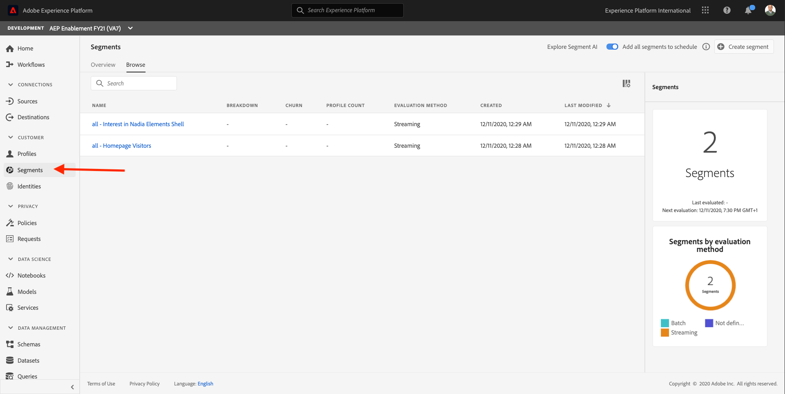

On this page, you can see an overview of all existing segments.

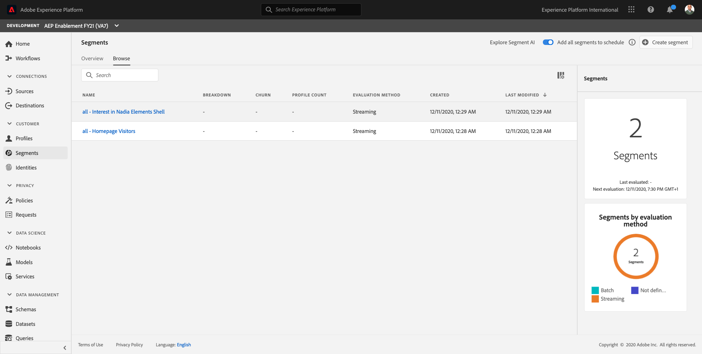

Click on the **Create segment** button to start creating a new segment.

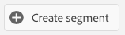

Once you're in the new segment builder, you immediately notice the **Attributes** menu option and the **XDM Individual Profile** reference.

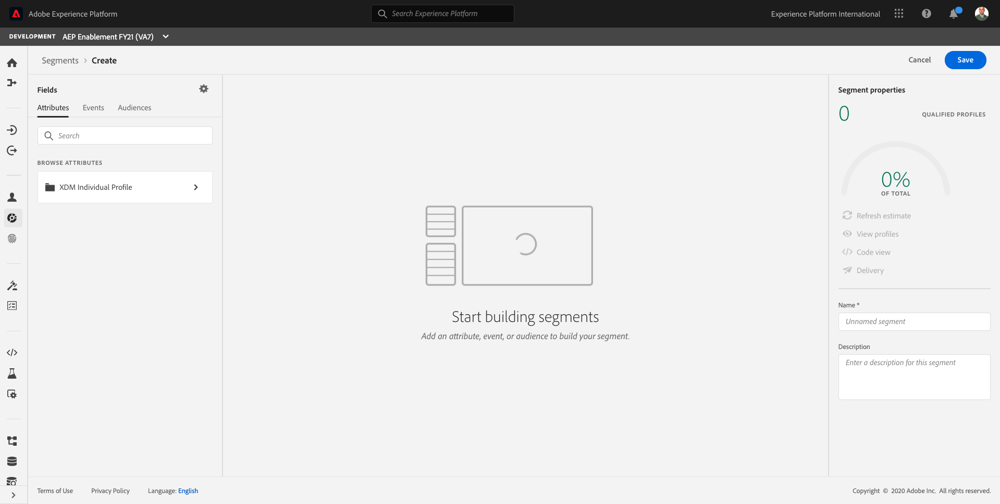

Since XDM is the language that powers the experience business, XDM is also the foundation for the segment builder. All data that is ingested in Platform should be mapped against XDM, and as such, all data becomes part of the same data model regardless of where that data comes from. This gives you a big advantage when building segments, as from this one segment builder UI, you can combine data from any origin in the same workflow. Segments built within Segment Builder can be sent to solutions like Adobe Target, Adobe Campaign and Adobe Audience Manager for activation.

Let's build a segment which includes all **male** customers.

To get to the gender attribute, you need to understand and know XDM. 

Gender is an attribute of Person, which can be found under Attributes. So to get there, you'll start by clicking on **XDM Individual Profile**. You'll then see this.

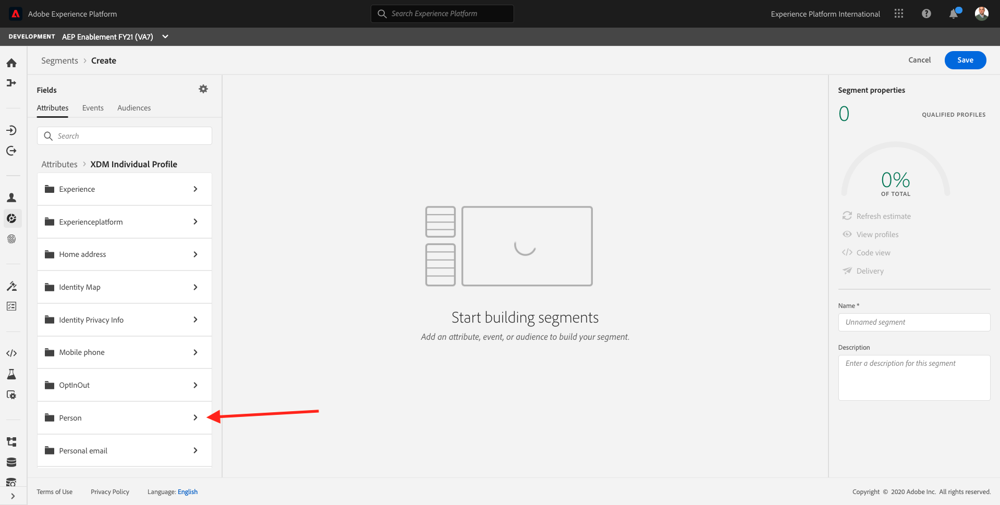

From the **XDM Individual Profile** window, select **Person**. You'll then see this.

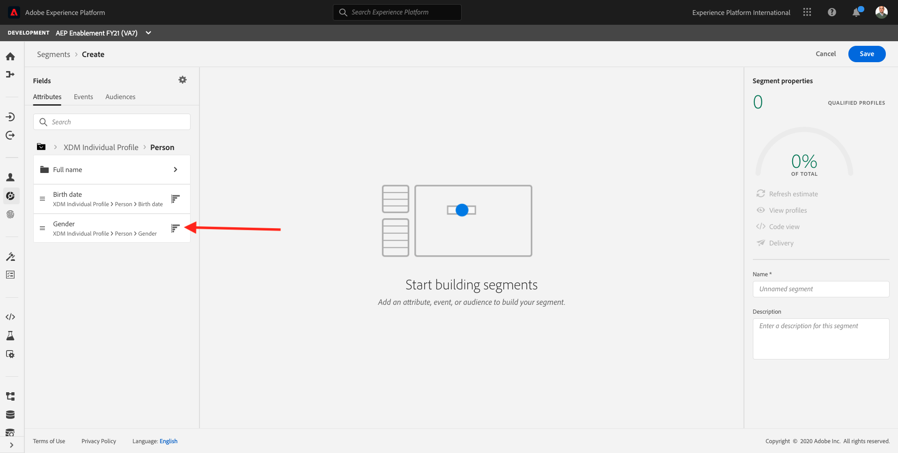

And in **Person**, you can find the **Gender** attribute. Drag the Gender attribute onto the segment builder.

Now you can choose the specific gender out of the pre-populated options. In this case, let's pick **Male**.

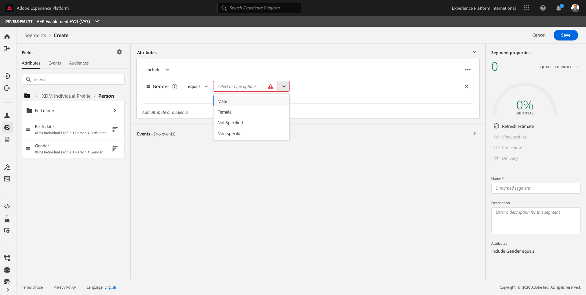

After selecting **Male**, you can get an estimation of the segment's population by pushing the **Refresh Estimate** button. This is very helpful for a business user, so that they can see the impact of certain attributes on the resulting segment size.

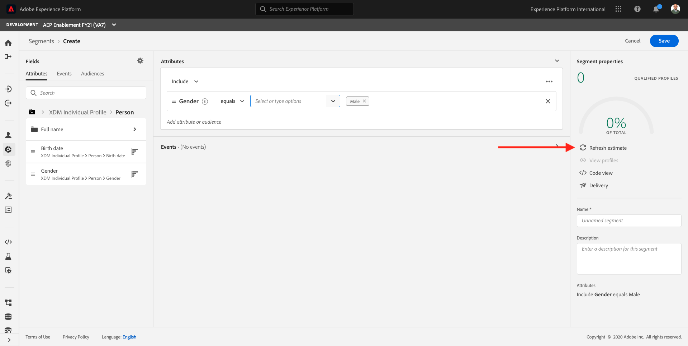

You'll then see an estimation such as the one below:

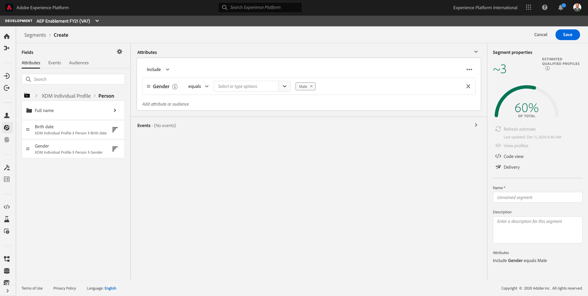

Next, you should refine your segment a bit. You need to build out a segment of all male customers that have viewed the product **Proteus Fitness Jackshirt (Orange)**.

To build out this segment, you need to add an Experience Event. You can find all Experience Events by clicking on the **Events** icon in the **Segments** menu bar.

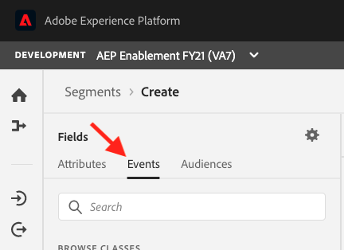

Next, you'll see the top-level, **ExperienceEvents** node. 

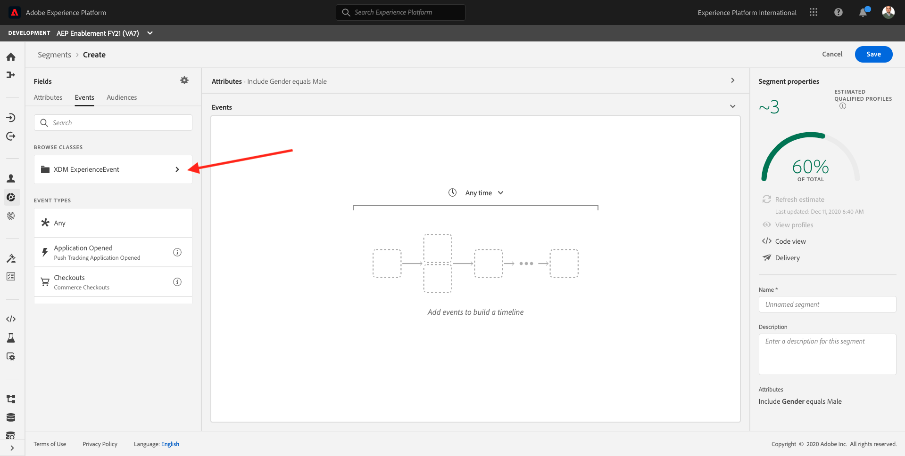

To find customers that have visited the **Proteus Fitness Jackshirt (Orange)** product, click on **XDM ExperienceEvent**. You'll then see this.

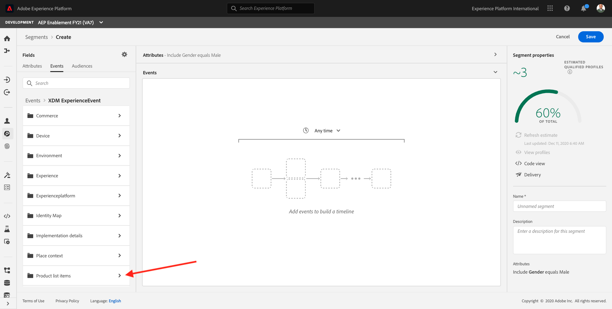

Go to **Product List Items**.

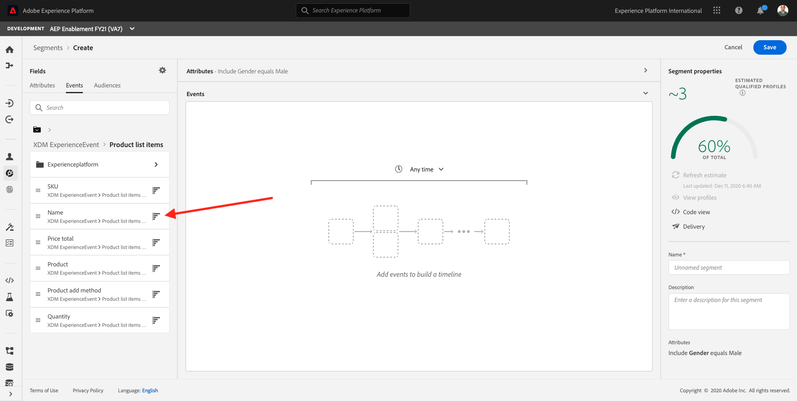

Select **Name** and drag and drop the **Name** object from the left menu onto the segment builder canvas into the **Events** section.

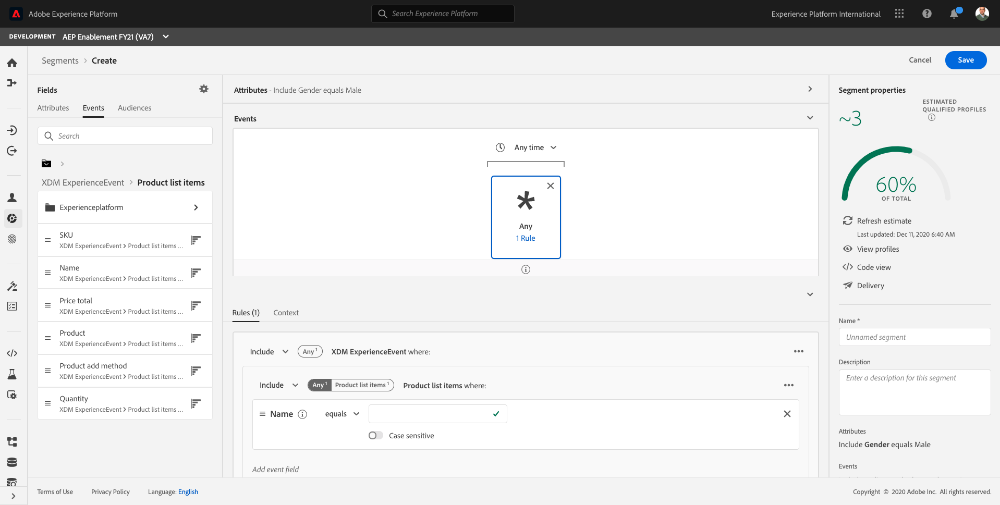

The comparison parameter should be **equals** and in the input field, enter **Proteus Fitness Jackshirt (Orange)**.

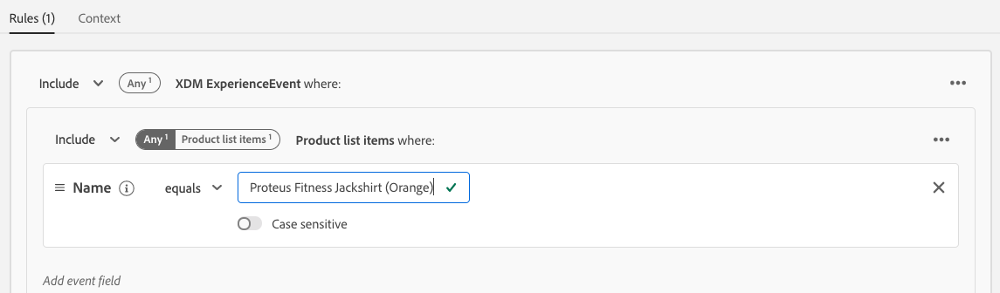

Every time you add an element to the segment builder, you can click the **Refresh Estimate** button to get a new estimate of the population in your segment.

So far, you've only used the UI to build your segment, but there's also a code-option to build a segment.

When building a segment, you're actually composing a Profile Query Language (PQL) query. To visualize the PQL code, you can click on the **Code View** switcher in the upper right corner of the segment builder.

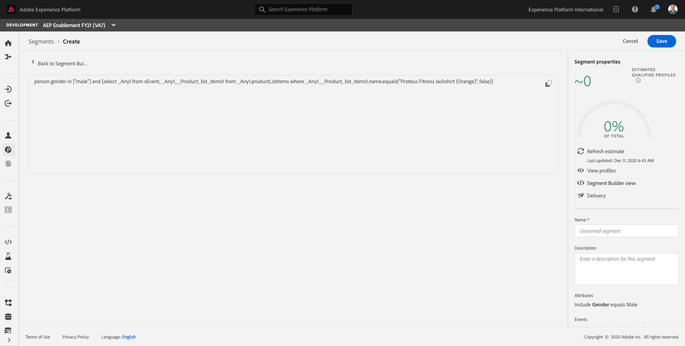

Now you can see the full PQL statement:

```sql
person.gender in ["male"] and (select _Any1 from xEvent, _Any1__Product_list_items1 from _Any1.productListItems where _Any1__Product_list_items1.name.equals("Proteus Fitness Jackshirt (Orange)", false))
```

You can also preview a sample of the customer profiles that are part of this segment, by clicking on **View Profiles**.

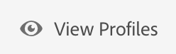

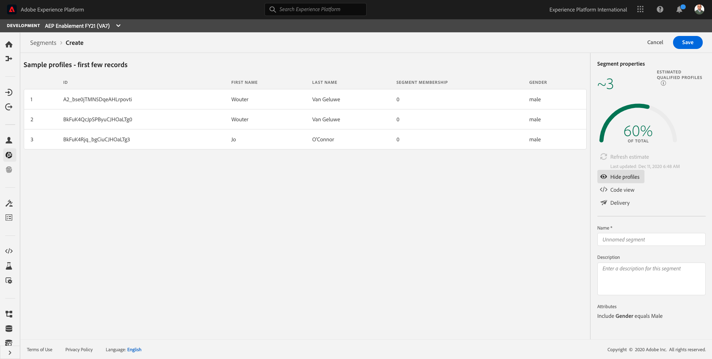

Finally, let's give your segment a name and save it.

As a naming convention, use:

* `ldap - Male customers with interest in Proteus Fitness Jackshirt (Orange) - ldap`

Please replace **ldap** with your ldap.

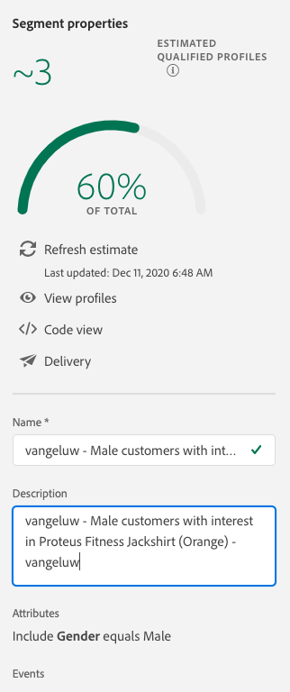

Then, click the **Save** button to save your segment, after which you'll be taken back to the Segment overview  page.

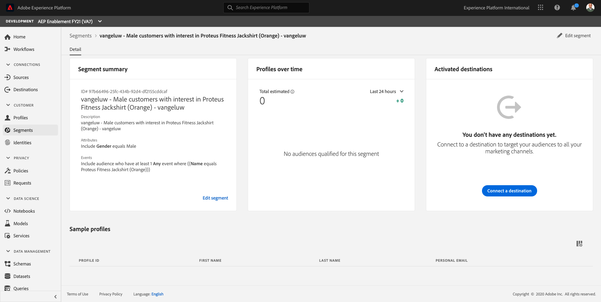

You can now continue to the next exercise and build a segment through the API.

Next Step: [3.5 Create a segment - API](./ex5.md)

[Go Back to Module 3](./real-time-customer-profile.md)

[Go Back to All Modules](../../overview.md)
