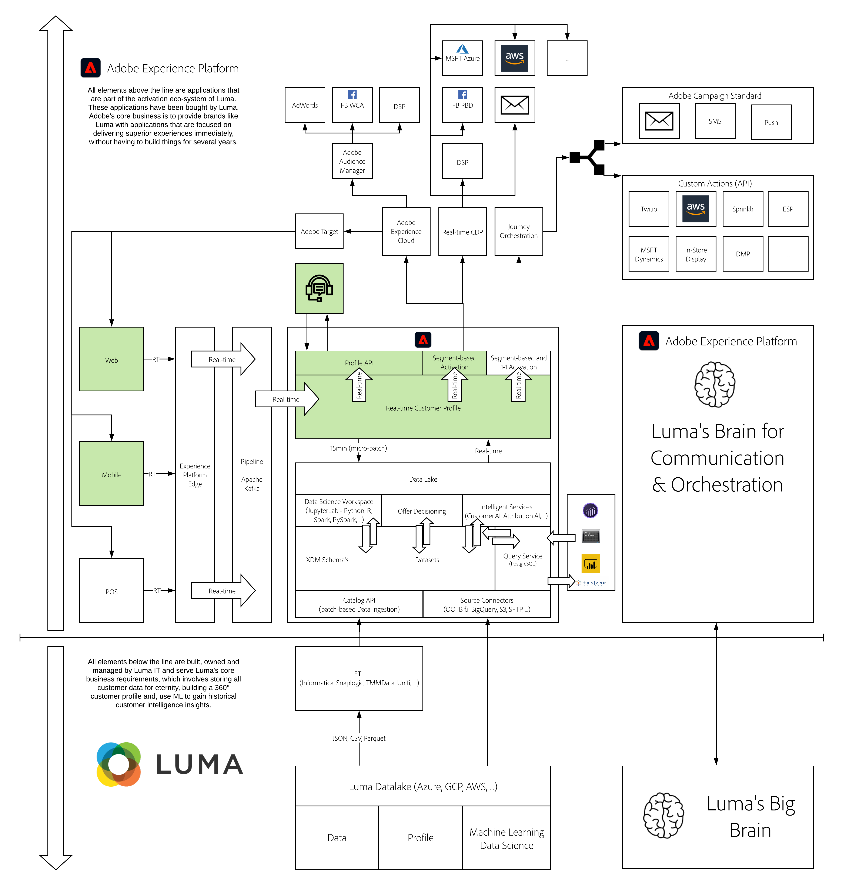

# 3. Foundation - Real-time Customer Profile

**Author: [Wouter Van Geluwe](https://www.linkedin.com/in/woutervangeluwe/)**

In this module, we'll do a deep dive into the Real-time Customer Profile and Identity capabilities of Adobe Experience Platform. You will learn how audiences can be defined, the role of Identity Service and Experience Cloud ID, and how to define segment builder queries to define your own segments.

## Learning Objectives

- Learn how to visualize a customer's Real-time Customer Profile through Adobe Experience Platform's UI
- Learn how to create a segment using Adobe Experience Platform's Segment Builder
- Learn how to create a segment and store the segment's results in a dataset using Adobe Experience Platform APIs
- Learn about the impact of having access to a full customer profile, including real-time behavior, in offline environments

## Prerequisites

- Access to [Adobe Experience Platform](https://experience.adobe.com/platform)
- Access to [https://public.aepdemo.net](https://public.aepdemo.net)
- **Download these assets**: 
  - [Postman collections](./../../assets/postman/postman_module3.zip)

>[!IMPORTANT]
>
>This tutorial was created to facilitate a particular workshop format. It uses specific systems and accounts to which you might not have access. Even without access, we think you can still learn a lot by reading through this very detailed content. If you're a participant in one of the workshops and need your access credentials, please contact your Adobe representative who will provide you with the required information.

## Architecture Overview

Have a look at the below architecture, which highlights the components that will be discussed and used in this module.

## Sandbox to use

For this module, please use this sandbox: `--aepSandboxId--`.

>[!NOTE]
>
>Don't forget to install, configure and use the Chrome Extension as referenced in [0.6 - Install the Chrome extension for the Experience League documentation](../module0/ex6.md)

## Exercises

[3.1 Visit the website](./ex1.md)

In this exercise, you'll follow a script and walk through the website.

[3.2 Visualize your own real-time customer profile - UI](./ex2.md)

In this exercise, you'll login to Adobe Experience Platform and you'll view your own Real-time Customer Profile in the UI.

[3.3 Visualize your own real-time customer profile - API](./ex3.md)

In this exercise, you'll use Postman and Adobe I/O to view your own real-time customer profile, by making use of Adobe Experience Platform's APIs.

[3.4 Create a segment - UI](./ex4.md)

In this exercise, you'll create a segment by making use of Adobe Experience Platform's Segment Builder.

[3.5 Create a segment - API](./ex5.md)

In this exercise, you'll use Postman and Adobe I/O to create a segment and store the results of that segment as a dataset, by making use of Adobe Experience Platform's APIs.

[3.6 See your Real-time Customer Profile in action in the Call Center](./ex6.md)

In this exercise, you'll impersonate a call center employee who receives a call from a customer. In order to really make an impact on this customer's experience, you'll need access to all available information in real-time.

[Summary and benefits](./summary.md)

Summary of this module and overview of the benefits.

>[!NOTE]
>
>Thank you for investing your time in learning all there is to know about Adobe Experience Platform. If you have questions, want to share general feedback of have suggestions on future content, please contact Wouter Van Geluwe directly, by sending an email to **vangeluw@adobe.com**.

[Go Back to All Modules](../../overview.md)
