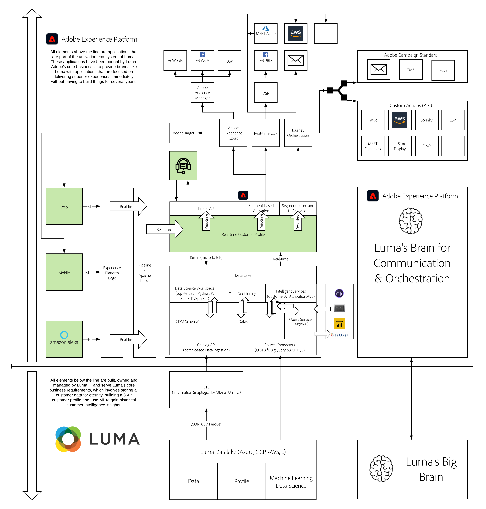

# 4. Voice Assistant - Amazon Alexa

**Authors: [Rob In der Maur](https://www.linkedin.com/in/ridmaur/), [Wouter Van Geluwe](https://www.linkedin.com/in/woutervangeluwe/)**

In this module, we will take you through the steps to demonstrate how an Internet of Things device, like an Amazon Alexa device, can send its relevant interactions to Adobe Experience Platform.

>[!NOTE]
>
>Don't worry if you're not familiar with configuring, setting up, and/or using an Amazon Alexa device. We will guide you through all the necessary steps.

## Learning Objectives

- Learn how to set up your Amazon environment
- Learn how to define and configure your Alexa skill, consisting of:
  - Creation
  - Invocation
  - Interaction Model
  - Interfaces
  - Endpoint
  - Display

## Prerequisites

- Access to [Adobe Experience Platform](https://experience.adobe.com/platform)
- Access to [https://public.aepdemo.net](https://public.aepdemo.net)
- The [Postman application](https://www.postman.com/downloads/)
- **Download these assets**: 
  - [AWS Alexa Interaction Model](./../../assets/aws-alexa/aepskillinteractionmodel.json)
  - [AWS Alexa Lambda Code](./../../assets/aws-lambda/aepskill.zip)

>[!IMPORTANT]
>
>This tutorial was created to facilitate a particular workshop format. It uses specific systems and accounts to which you might not have access. Even without access, we think you can still learn a lot by reading through this very detailed content. If you're a participant in one of the workshops and need your access credentials, please contact your Adobe representative who will provide you with the required information.

## Architecture Overview

Have a look at the below architecture, which highlights the components that will be discussed and used in this module.

## Sandbox to use

For this module, please use this sandbox: `--aepSandboxId--`.

>[!NOTE]
>
>Don't forget to install, configure and use the Chrome Extension as referenced in [0.6 - Install the Chrome extension for the Experience League documentation](../module0/ex6.md)

## Exercises

[4.1 Set up an Amazon environment](./ex1.md)

In this module, you'll have to set up an Amazon developer account. With an Amazon developer account you can build your Alexa skill and, even more important, simulate your skill, which is especially relevant in case you do not own an Alexa device like an Echo Spot or Echo Show.

[4.2 Define your Alexa skill](./ex2.md)

This module will guide you through all the necessary steps to define and configure a new Amazon Alexa skill.

[4.3 Use your Alexa skill](./ex3.md)

In this module, we'll show you the different approaches to demoing the Alexa skill.

[4.4 Walkthrough of Demo Scenario, now including Alexa](./ex4.md)

In this module, we'll show you a walkthrough and script of the updated demo talk track and steps to follow.

[Summary and benefits](./summary.md)

Summary of this module and overview of the benefits.

>[!NOTE]
>
>Thank you for investing your time in learning all there is to know about Adobe Experience Platform. If you have questions, want to share general feedback of have suggestions on future content, please contact Wouter Van Geluwe directly, by sending an email to **vangeluw@adobe.com**.

[Go Back to All Modules](../../overview.md)
