# 4.1 Set up an Alexa Developer Account

## Introduction

The objective of this module is to demonstrate how to use an internet of things device (like an Alexa device) with the Adobe Experience Platform. To that end, this module guides you through the steps to create an Amazon Alexa skill and use it as part of your demo. The ultimate result will be that relevant voice interactions with an Alexa device simulator or real Alexa device will be sent to Adobe Experience Platform and become part of the overall experience event data in Platform.

In order to demonstrate how to use such an Alexa skill, you will have to setup your skill within an Amazon developer account. With an Amazon developer account you can build your skill and, even more important, simulate your skill, which is especially relevant in case you do not own an Alexa device like an Echo Spot or Echo Show. If you do have an Alexa device with a display, it is even more fun!

You also have to sign up for an AWS account, as the skill we will use requires serverless functions deployed in a AWS Lambda environment.

## 4.1.1 Set up Amazon developer account

Go to [https://developer.amazon.com](https://developer.amazon.com).

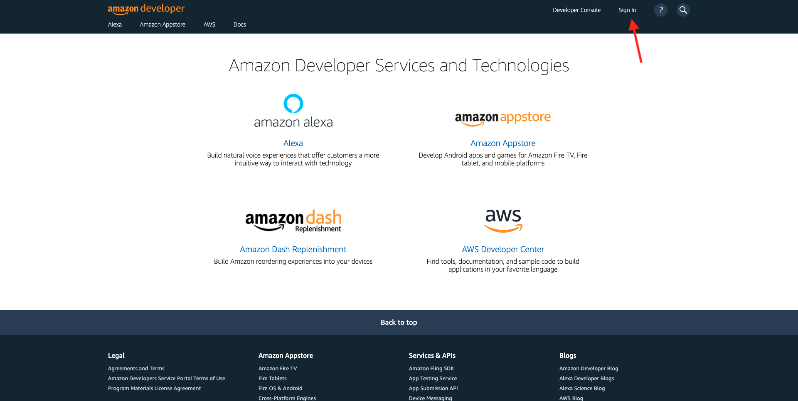

Click on **Sign In** at the top right. If you already do have an Amazon developer account, skip to exercise 4.1.2.

Click **Create your Amazon Developer account** to create a new Amazon developer account.

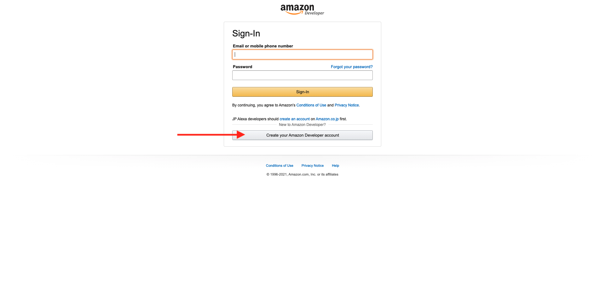

In the **Create Account** screen, provide your **Name**, **Email** and choose a **Password**. Then click **Create your Amazon Developer Account**.

>[!NOTE]
>
>Don't use a corporate email address like @adobe.com. Use your personal email address instead as this is an account for training purpose.

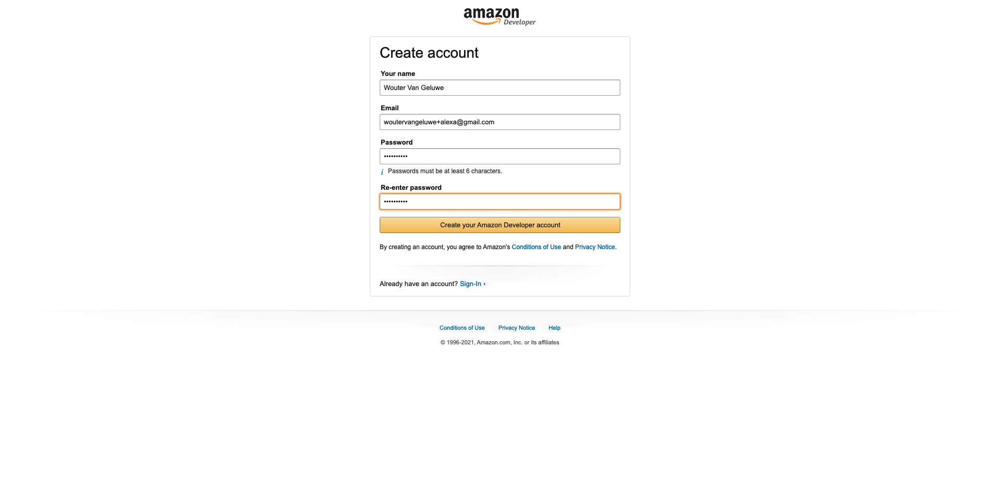

Some additional verification might be required.

You will receive a verification code on the provided email address. Use that on the **Verify email address** screen and click on **Verify**.

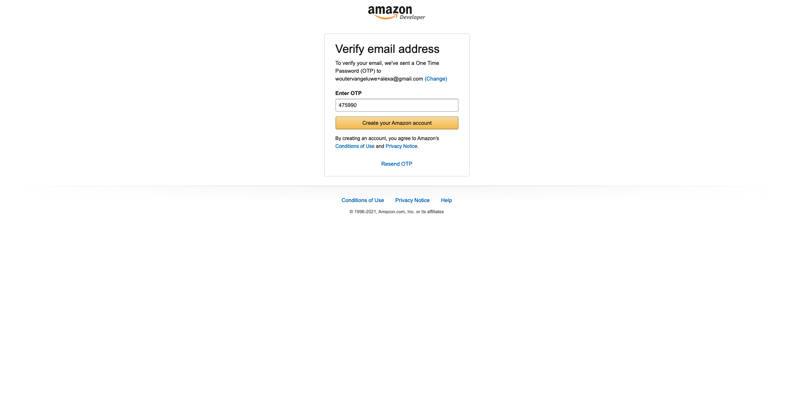

Provide all required details on the **Profile** tab the **Registration** screen, then click on **Save and Continue**.

Read all details on the **Amazon Delivery Services Agreement** tab and then click **Submit**.

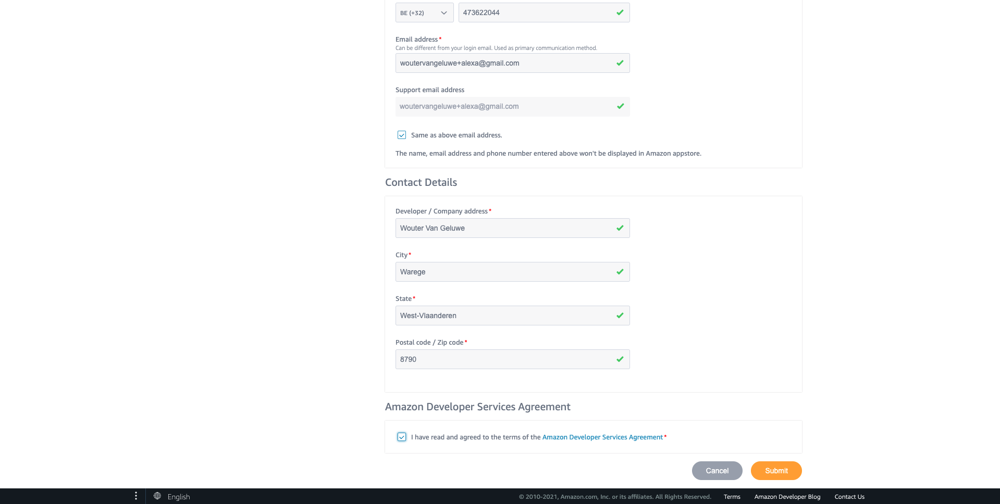

Your account is now created and you'll see the **Amazon Developer Portal**.

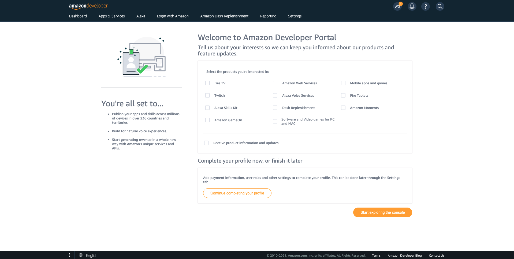

## 4.1.2 Setup an Amazon Web Services account

In a new browser window or tab, go to [https://aws.amazon.com/lambda/](https://aws.amazon.com/lambda/). If you already do have an account, skip to step 10.

Click **Create an AWS Account** orange button on the top right.

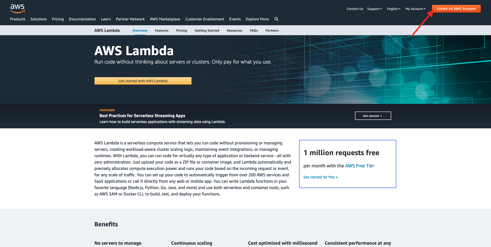

>[!NOTE]
>
>Depending on your location/geo you may see a different experience.

In the **Create an AWS account** screen, define **Email address**, **Password** and an **AWS account name**. Then click on **Continue**.

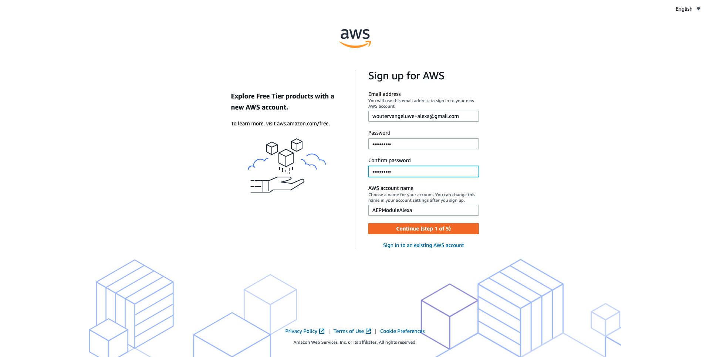

In the **Contact Information** screen:

- Select **Personal** for the **Account Type**.
- Provide required details in the **Contact Information** screen, and click **Continue**.
   
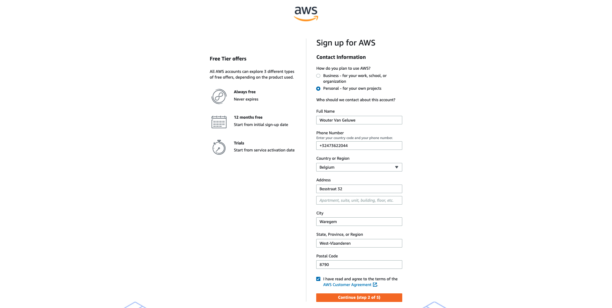

Provide your credit card details in the **Payment Information** screen and click on **Verify and Continue**.

>[!NOTE]
>
>You won't be charged unless you exceed the AWS Free Tier Limits, which is extremely unlikely using your Alexa skill for demonstration purposes. However you have to provide payment details to continue.

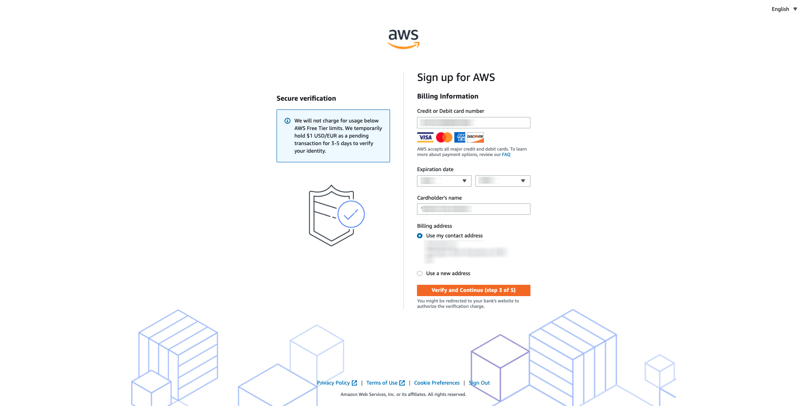

Provide details on how to confirm your identity, by selecting **Text Message (SMS)** in the **Confirm your identity** screen, and click on **Send SMS**.

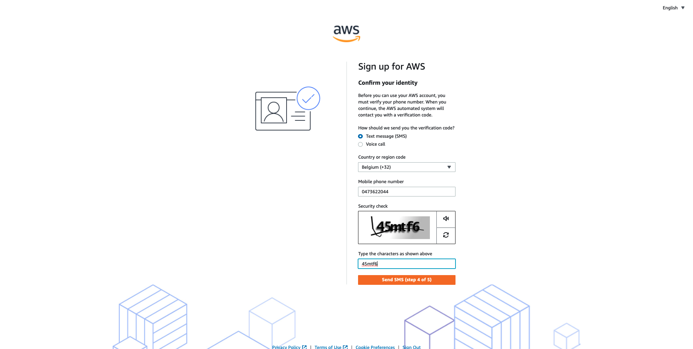

Use the verification code you will receive as an SMS in the **Enter verification code** dialog and click **Verify Code**.

Next, click on **Continue**.

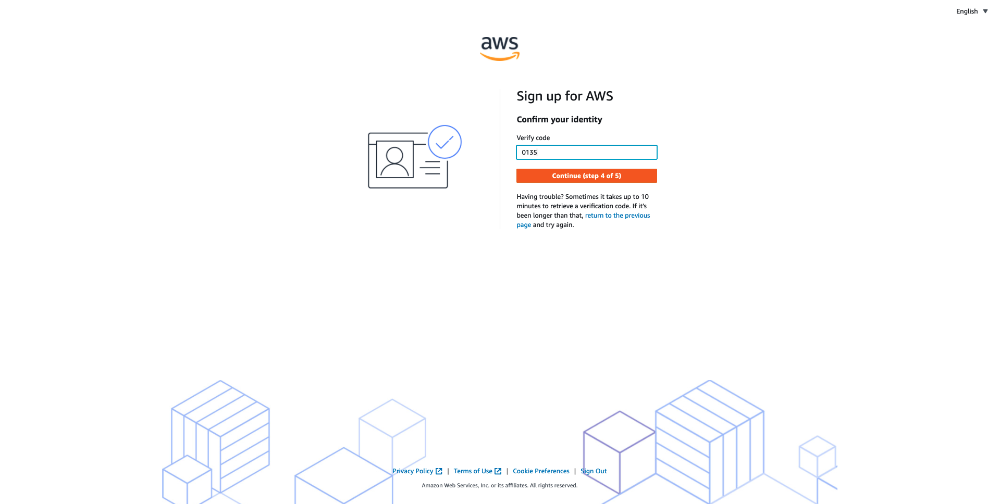

In the **Select a Support Plan**, select **Basic support - free**. Click **Complete sign up**.

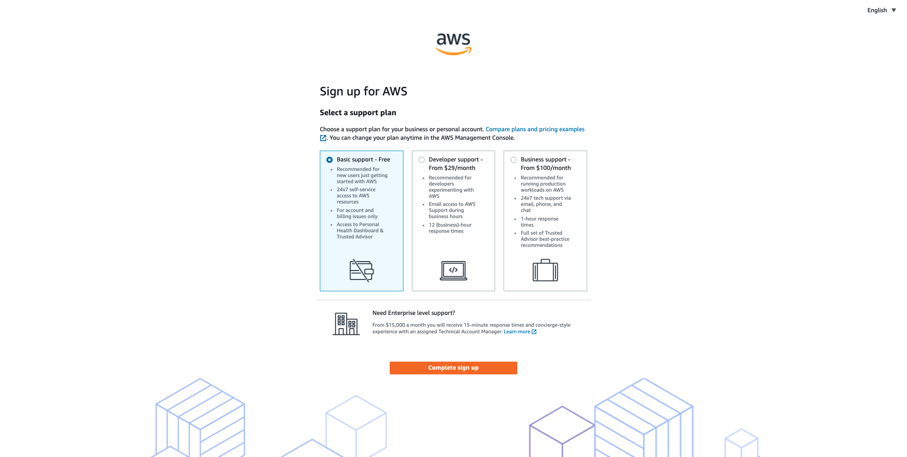

Your AWS account is now created. Click **Go to the AWS Management Console**.

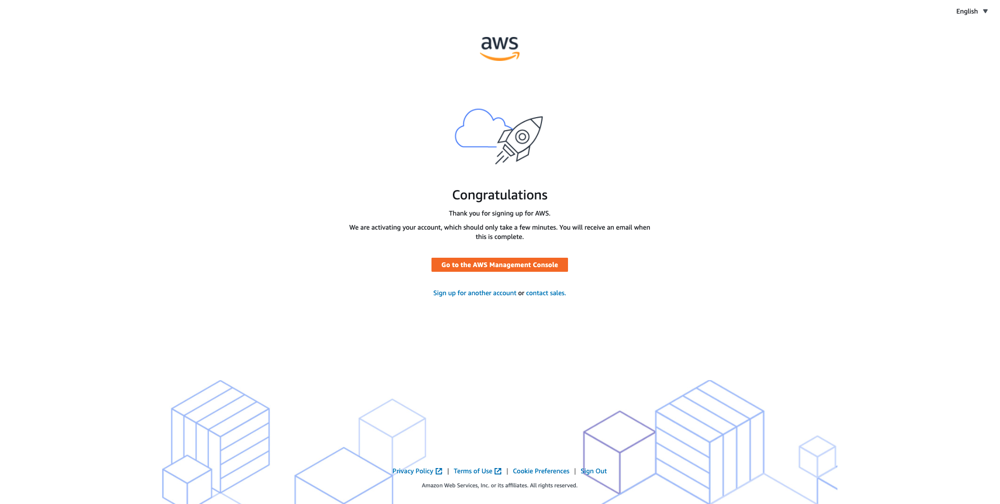

In the **Sign in** screen, select **Root User** and provide your email address to login. Click **Next**.

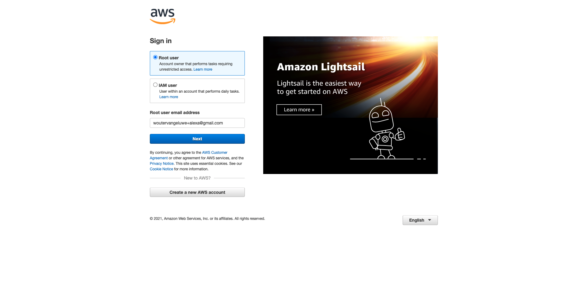

Complete the security check and click **Submit**.

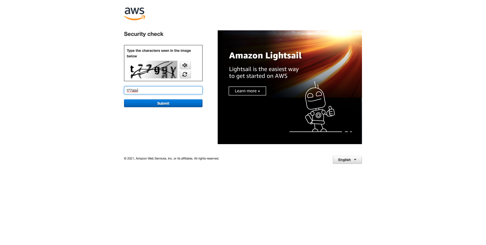

Provide your **Password** and click on **Sign in**.

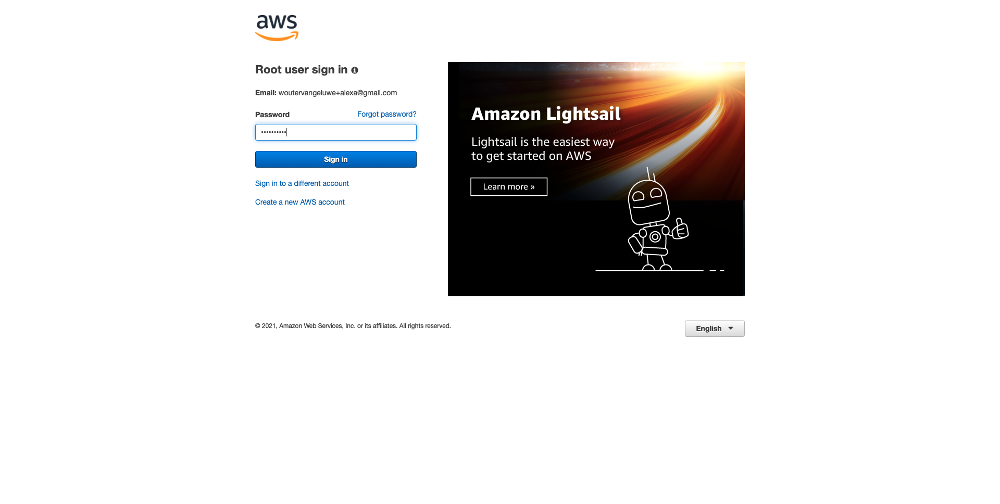

You will end up in the **AWS Management Console**.

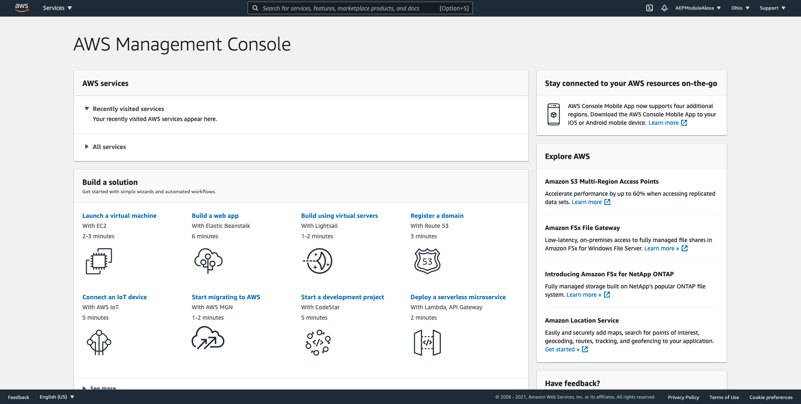

Leave the browser tab open, as you'll need it later in the module.

You have finished this exercise. 

Next Step: [4.2 Define your Alexa skill](./ex2.md)

[Go Back to Module 4](./data-ingestion-amazon-alexa.md)

[Go Back to All Modules](./../../overview.md)
