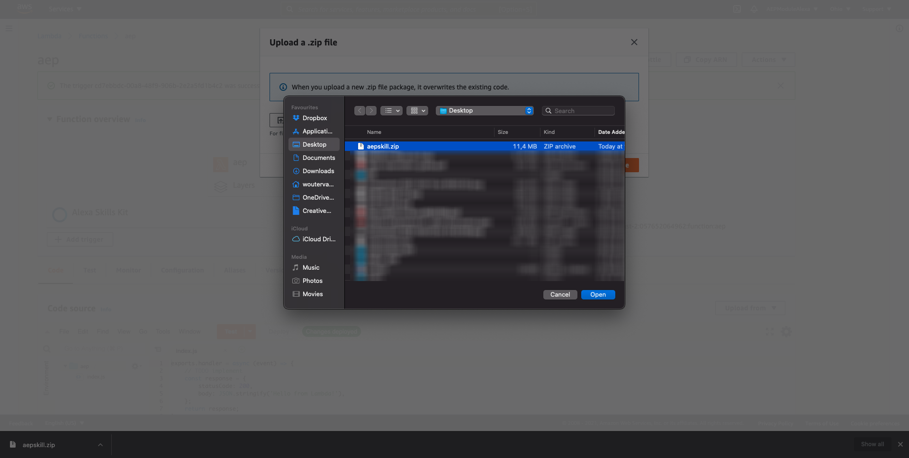

# 4.2 Define your Alexa skill

## Introduction

This exercise will guide you through all the necessary steps to define and configure a new Amazon Alexa skill.

## Prerequisites

Before you can create and configure an Amazon Alexa skill, you must:

1.  Have an Amazon developer account and be signed in
2.  Have an AWS account and be signed in
 
See [Exercise 4.1](./ex1.md) for more details.

## 4.2.1 Create an Alexa skill

To create a new skill, follow these steps:

At the **Amazon Developer Dashboard** screen ([https://developer.amazon.com/dashboard](https://developer.amazon.com/dashboard)), select **Alexa Skills Kit** from the **Alexa** menu.

In the **alexa developer console**, click the **Create Skill** button.

In the **Create a new skill** screen:

- Specify **AEP** as the **Skill name**.
- Select **English (UK)** or **English (US)** as the **Default Language**.
- Select **Custom** as the model to use in the **Choose a model to add to your skill** section.

   
Select **Provision your own** as the method to use in the **Choose a method to host your skill's backend resources** section.
   

   
Next, click **Create Skill**.

>[!NOTE]
>
>Your screen might look a bit different dependent on the **Default language** you have selected.

In the **Choose a template** screen, select **Start from scratch** as the template to use in the **Choose a template** section.

Click **Choose**.

   
Your skill is now being created, after which you'll end up in your **AEP** skill main screen, which looks like this:

## 4.2.2 Define invocation name

For your skill to be invoked, it needs an invocation name. To define this:

Click **Invocations** in the left menu and then click **Skill Invocation Name**. Change the Skill Invocation Name to **adobe experience platform**. Next, click **Save Model**.

This will update the invocation of your Alexa skill so you can say **Alexa, open adobe experience platform** when testing your skill in one of the next steps.

## 4.2.3 Define Intents, Samples and Slots

The next step is to configure the interaction with our skill. Interaction with an Alexa skill happens through so called intents, of which Amazon provides 5 built-in intents (e.g. **AMAZON.HelpIntent**, to ask for help). Each intent defines sample utterances; phrases you use to invoke the intent. And each intent can have one or more slot values; values you provide as input to the intent.

Rather than let you define step by step the various intents, utterances and slot values we do require for our skill, we will use a JSON file to set this all up in one go. To do so:

Next, click **Interaction Model** in the left menu and then click on **JSON Editor**.

Download and open the file [AWS Alexa Interaction Model](./../../assets/aws-alexa/aepskillinteractionmodel.json).
 
Select everything and then, copy everything.

   
In the **JSON Editor** panel on the right, select everything and paste the code that you copied in the previous step, by overwriting the text that was there already. This will load the interaction model.

Click **Save Model**.

Click **Intents** in the left menu, after which you'll now see the various specific intents for our skill on the left rail, e.g. **LdapIntent**, **GetProductIntent**, .... **UseEmailAddressIntent**. Some of these intents do have a slot, e.g. like **productId** for **GetProductIntent**.

## 4.2.3 Define the interfaces

We will now define the interface for the skill. Interfaces define how you interact with your skill: only through voice or will the skill also support display and touch? If we want our skill to use the display and touch events, we need to enable that interface. Also our skill's implementation will use the Amazon Presentation Language (BETA). To properly configure this:

Click **Interfaces** in the left menu.

In the **Interfaces** panel, make sure that **Alexa Presentation Language** and **Auto Delegation** are both enabled.

Scroll back up and click **Save Interfaces**.

## 4.2.4 Setup the implementation

Your skill's logic is implemented using the [NodeJS Alexa SDK v2](https://developer.amazon.com/docs/alexa-skills-kit-sdk-for-nodejs/overview.html).

You need your functionality deployed in AWS Lambda so that you can invoke it from the skill. And then you also need to tell your skill where to find that serverless functionality so that it can invoke it when so required.

Let's first set up your server-less functionality for the skill. To do so:

Ensure you are logged in to your **AWS Management Console** ([https://us-east-2.console.aws.amazon.com/console/home](https://us-east-2.console.aws.amazon.com/console/home)).

Pick a datacenter you prefer from the dropdown listbox at the top right menu. E.g. **US East (Ohio)** or **EU (Ireland)**.

In **Find Services** type **lambda** and press Enter.

You will end up at the **AWS Lambda** home screen. Click **Create a function**.

In the **Create function** screen:

- Select **Author from scratch**
- Give your skill function a **Function name**, e.g. **AEP**
- Select **Node.js 14.x** from the **Runtime** dropdown list

Click **Change default execution role**. Then select **Create a new role with basic Lambda permissions**.

Next, click **Create function**.

You'll end up in your **AEP** function definition screen, with the **Code** tab active. Click **Add trigger**.

In the dropdown list of available trigger, select **Alexa Skills Kit**. You now also need to provide the Skill ID of your Alexa skill.

   
>[!NOTE]
>
>If **Alexa Skills Kit** is not available in the **Add triggers** list, the data center you selected does not support it. Select another datacenter (e.g. **EU (Ireland)**) that provides the **Alexa Skills Kit** trigger.

Go back to your **Alexa skill**. Click on **Endpoint** in the left menu. Search for **Your Skill ID**. Click **Copy to Clipboard**.
  

Click on **Copy to Clipboard** to copy the skill.

Move back to your **AEP** function definition screen in the **AWS Lambda** home screen.

Paste the skill id in the **Skill ID** field below the **Skill ID Verification**. Ensure **Enable** is selected, which is the default and recommended setting.

Next, click **Add**.

Back in the AWS Lambda function screen, click on **Layers** bunder **aep**..

In the **Code** tab, click select **Upload from** and then select **.zip file**.

You'll then see this. Download the [AWS Alexa Lambda Code](./../../assets/aws-lambda/aepskill.zip) and save the zip file somewhere on your computer as **aepskill.zip**.

Click **Upload**.

Pick the **aepskill.zip** you saved on your computer from the file browser dialog. Click **Open**.

Click **Save**.

Next, go to the tab **Configuration** and click **Environment Variables**.

Click **Edit** and add the required variables from the table below, so your **Environment variables** panel will look like this.

### Environment variables

| Key                 | Value                 |
| ------------------- | --------------------- |
| **alexaBrandName**  | **luma**              |
| **emailAddress**    | **rmaur@adobe.com**   |
| **ldap**            | `--demoProfileLdap--` |
| **configurationId** | `--configurationID--` |
    
>[!IMPORTANT]
>
> - Define your **alexaBrandName** as the lowercase version of your brand name (e.g. Luma as **luma**),
> - If your brand name contains an **&** replace it with **and**. So as an example, H&M becomes **h and m**.

Ensure you replace **alexaBrandName**, **ldap** and **emailAddress** with your specific configuration details.

Click **Save** when you're done.

As a final step, you need to copy the Amazon Resource Name (ARN) that represents this functionality to our skill. 

Click on the copy icon right next to the **ARN - arm:aws.lambda:.....** text as indicated.

 
Go back to your **Alexa Developer Console**.

In the **Endpoint** config screen, paste the copied ARN from the previous step in the **Default Region (Required)** field.
  

  
Next, click **Save Endpoints**.

## 4.2.5 Finalizing the skill

After you've setup invocation, intents, interfaces and endpoint, the final step is to build the final version of your skill.

To do so:

- Select **Invocation** from the left enu and click **Skill Invocation Name**.
- Click **Save Model** and then click **Build Model**. This will build the skill's model. This might take a while.
    

  
Verify that on your skill's main screen all the items on the **Skill builder checklist** (except for the optional **In-skill products**) are checked. To do so:

Click on **Build**. Your **alexa developer console** should display green checkmarks for the first four items in the **Skill builder checklist**.
   

  
Your skill and its implementation are now ready to be used.

You have finished this exercise. 

Next Step: [4.3 Use your Alexa skill](./ex3.md)

[Go Back to Module 4](./data-ingestion-amazon-alexa.md)

[Go Back to All Modules](./../../overview.md)
