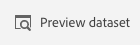

# 4.3 Use your Alexa skill

You can demonstrate your Alexa skill and its interaction with Platform, even if you do not have a real Alexa device with a display.

To do this, you'll use the Alexa Simulator.

## 4.3.1 Test your skill

Go to your **AWS Lambda** definition screen for **AEP**.

Make sure you have all of these **Environment Variables** properly configured in your Lambda-function before your demonstration, and make sure that these three reflect the proper values for your demo: **ldap**, **alexaBrandName**, **emailAddress**.
 

If needed, update and save the **Environment variables**.

Go to your **alexa developer console** and open the **AEP** skill you created as part of [Exercise 4.2](./ex2.md).

In the **AEP** skill definition screen within the **alexa developer console**, click on **Test**. 
You might be prompted if you want to allow use of the microphone. The instructions here are using text input for simulating the conversation.

Be sure to:
  
- Select **Development** from **Skill testing is enabled in:**.
- Select the **Alexa Simulator**.
- Select the language you have developed your skill in from the language dropdown list (e.g. **English (GB)**)
- Unselect **Skill I/O**, select **Device Display** and unselect **Device Log**.
- Select the type of device you want to use for your demonstration, e.g. **Small Hub** (Echo Spot) or **Medium Hub** (Echo Show) or another one from the dropdown list.

Your screen should now look like this:

Open the skill by entering **ask adobe experience platform** in the **Type or click and hold the mic**.

Your screen should look like this:

You are now all set to demonstrate the brand and product interaction using the simulator.

Type **get products** to get products.

The simulator will respond with **We got 8 products. Use a number between 1 and 8 to get more details about a product. E.g. say Alexa, get product 8**.

Your screen should look like this:

Type **get product 1** to get product 1.

The simulator will respond with **You have selected Nadia Elements Shell from the category Women with a price of 69 euro. You can add the product to your shopping cart by saying Alexa, add product to cart**.

Your screen should look like this:

Type **add product to cart** to add the product to the cart.

The simulator will respond with **We have added Nadia Elements Shell to your shopping cart. Thank you!**.

Your screen should look like this:

Type **purchase product** to purchase the product.

The simulator will respond with **You have purchased Nadia Elements Shell. Thank you so much!**.

Your screen should look like this:

## 4.3.2 Viewing the result in Adobe Experience Platform

You can view the experience events generated by your Alexa skill (either the real device or simulator). To do so:

Log in to [Adobe Experience Platform](https://experience.adobe.com/platform).

After logging in, you'll land on the homepage of Adobe Experience Platform.

Before you continue, you need to select a **sandbox**. The sandbox to select is named ``--aepSandboxId--``. You can do this by clicking the text **[!UICONTROL Production Prod]** in the blue line on top of your screen.

After selecting the appropriate sandbox, you'll see the screen change and now you're in your dedicated sandbox.

Go to **Datasets**.

Click to open the dataset **Demo System - Event Dataset for Voice Assistants (Global v1.1)**.

You'll now see an overview of all ingested data in this dataset.

Click **Preview Dataset**. (Depending on the setup of Adobe Experience Platform's Role Based Access Controls, it's possible that you don't have access to the **Preview Dataset** button. If that's the case, please skip the preview exercise and continue with the next exercise.)

You'll now see an overview of the most recent data that was ingested in this dataset.

You have finished this exercise. 

Next Step: [4.4 Walkthrough of Demo Scenario, now including Alexa](./ex4.md)

[Go Back to Module 4](./data-ingestion-amazon-alexa.md)

[Go Back to All Modules](./../../overview.md)
