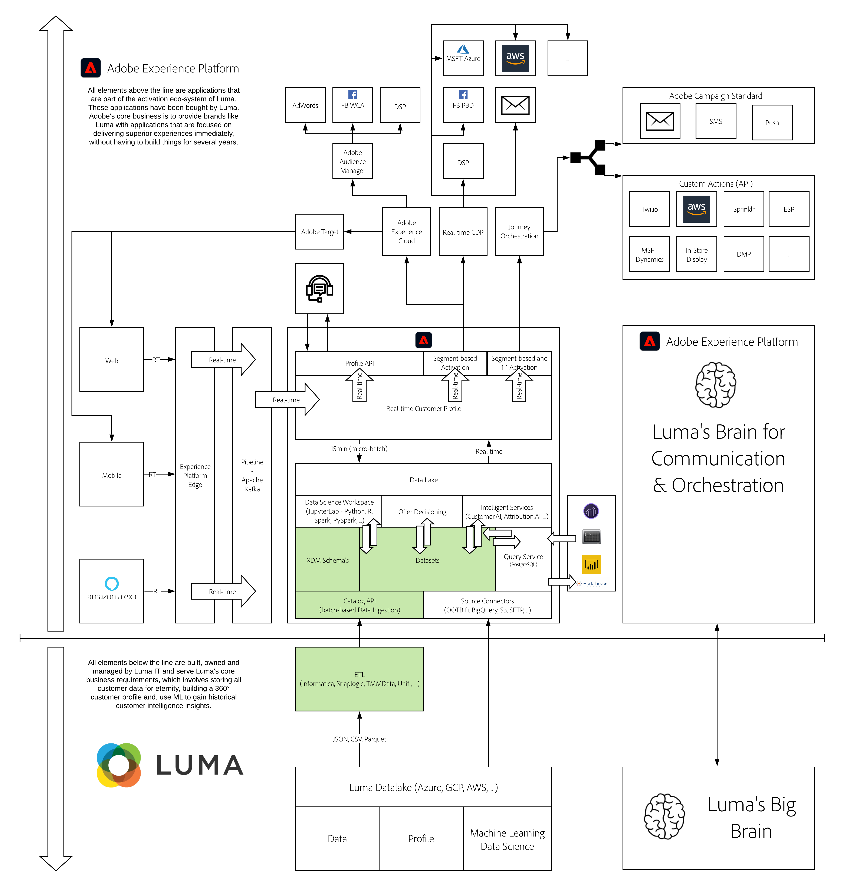

# 5. Extract, Transform, Load data using a 3rd party ETL-tool

**Authors: [Marius Shehati](https://www.linkedin.com/in/mshehati/), [Wouter Van Geluwe](https://www.linkedin.com/in/woutervangeluwe/), [Artur Rutkiewicz (diva-e)](https://www.linkedin.com/in/artur-rutkiewicz-99b14b128/)**

In this module, you'll learn about the positioning of an ETL application into an enterprise ecosystem. Any brand is using multiple applications ranging from data lakes to analytics solutions to machine learning and a number of marketing-specific applications. Each of those applications is using a different way to describe and understand data. When bringing Adobe Experience Platform into your brand's ecosystem, you'll finally have the ability of describing all that data in 1 single language through the Experience Data Model (XDM). When bringing data into Adobe Experience Platform, the source data model needs to be translated into an XDM format. There are a number of ways of doing that either natively in the Adobe Experience Platform user interface through Workflows or Source Connectors. Using an ETL application such as Informatica will also be a great help in that process, given that Informatica has already built an out-of-the-box integration whereby you can extract, transform and load your data easily into Adobe Experience Platform.

## Learning Objectives

- Learn how to setup an AWS S3 bucket
- Learn how to use Informatica ETL
- Learn how to setup a connector from Informatica to your AWS S3 bucket
- Learn how to build a mapper workflow to extract data, transform data and eventually, load that data into a dataset in Adobe Experience Platform

## Prerequisites

- Access to Adobe Experience Platform: [https://experience.adobe.com/platform](https://experience.adobe.com/platform)
- Access to Informatica ETL
- Access to AWS S3
- **Download these assets**: 
  - [CSV files](./../../assets/csv/module5/csvfiles.zip)

>[!IMPORTANT]
>
>This tutorial was created to facilitate a particular workshop format. It uses specific systems and accounts to which you might not have access. Even without access, we think you can still learn a lot by reading through this very detailed content. If you're a participant in one of the workshops and need your access credentials, please contact your Adobe representative who will provide you with the required information.

## Architecture Overview

Have a look at the below architecture, which highlights the components that will be discussed and used in this module.

## Business Context

Luma Retail is a fashion brand and in addition to its online presence, has brick and mortar stores all over the world. So far the marketing team has struggled to make use of the offline orders data to optimize their online experience. Recently, they introduced a new loyalty program that allows customers to collect points when purchasing in-store using their loyalty card. The marketing team regularly receives a flat file with all the offline orders. They also have a record of all customers who have joined the loyalty program. With the help of Informatica, we will join the two data sources, enrich the result so that it can be ingested into Adobe Experience Platform, and then hydrate the profile with the offline order events.

Luma Retail also has a partnership with Survey Corp which has agreed to share their latest survey results on people's preferences for designers, colors, and brands. Luma Retail has also decided to buy some demographics data on a marketplace from Money Corp, providing details on people's income and credit scores. By combining these two data sets, Luma Retail is aiming to target their customers with more meaningful experiences based on their preferences as well as income.

## Sandbox to use

For this module, please use this sandbox: `--aepSandboxId--`.

>[!NOTE]
>
>Don't forget to install, configure and use the Chrome Extension as referenced in [0.6 - Install the Chrome extension for the Experience League documentation](../module0/ex6.md)

## Exercises

[5.1 Create and configure your Informatica account](./ex1.md)

In this exercise, you'll create and configure Informatica trial account.

[5.2 Setup an AWS S3 bucket](./ex2.md)

In this exercise, you'll learn how to setup an AWS S3 bucket in your own AWS environment and how to upload data in that S3 bucket.

[5.3 Connect Informatica to your AWS S3 bucket](./ex3.md)

In this exercise, you'll create a connection in Informatica to read data from your AWS S3 bucket.

[5.4 Ingest Offline Order Events into Adobe Experience Platform](./ex4.md)

In this exercise, you'll learn how to import order data into Informatica, join datasets and ingest transformed data into Adobe Experience Platform as Experience Events.

[5.5 Ingest 2nd and 3rd party data into Adobe Experience Platform](./ex5.md)

In this exercise, you'll learn how to import 2nd and 3rd party data into Informatica, join datasets and ingest transformed data into Adobe Experience Platform as Experience Events.

[Summary and benefits](./summary.md)

Summary of this module and overview of the benefits.

>[!NOTE]
>
>Thank you for investing your time in learning all there is to know about Adobe Experience Platform. If you have questions, want to share general feedback of have suggestions on future content, please contact Wouter Van Geluwe directly, by sending an email to **vangeluw@adobe.com**.

[Go Back to All Modules](../../overview.md)
