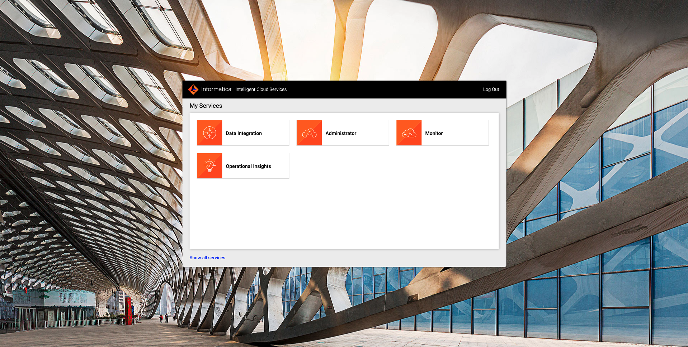
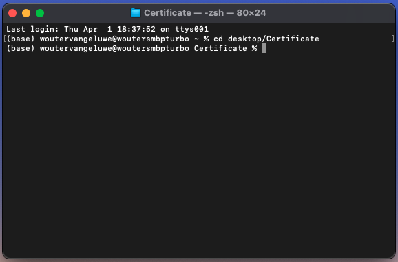

# 5.1 Create and configure your Informatica account

## 5.1.1 Create your Informatica trial account

Go to [https://www.informatica.com/trials/cloud-data-integration.html](https://www.informatica.com/trials/cloud-data-integration.html). You'll then see this.

Fill out the form using your own information. Scroll down and click **Start Your Free Trial**.

You'll then see this.

You'll also get a similar confirmation email.
Click **Confirm Account** in the email you just received.

 

You'll then see this.

 

Fill out the form and click **Log In**.

 

You'll see several information messages. Click **Continue**.

 

Click **Continue**.

 

Click **Don't show this again**.

 

You'll then see this screen, which is the starting point after logging in to Informatica.

 

## 5.1.2 Enable the connector to Adobe Experience Platform

Click **Administrator**.

 

Go to **Add-On Connectors**.

Scroll down until you see the connector for **Adobe Experience Platform** and click **Start Free Trial**.

Click **OK**.

The connector for Adobe Experience Platform is now installed in your Informatica instance.

## 5.1.3 Create your Runtime Environment

Go to **Runtime Environments**.

You'll already see the **Informatica Cloud Hosted Agent** which is already running for your Informatica property.

Click **Download Secure Agent**.

You'll then see this. Select the **Platform** (macOS isn't supported) and make sure to copy the **Install Token**. Click **Download**.

>[!NOTE]
>
> As macOS isn't supported to install the Informatica Cloud Secure Agent, we're using a Windows machine to install the Cloud Secure Agent. If you have a MacBook, you can use [BootCamp](https://support.apple.com/guide/bootcamp-assistant/welcome/mac), or you can use a solution like [VMWare Fusion](https://www.vmware.com/products/fusion.html) to run a Windows image from your MacBook.

The next steps are taking place on a Windows machine.

On your Windows machine, download the Informatica Cloud Hosted Agent installation file.

Open the installation file by double-clicking it.

Use the default folder (don't change anything) and click **Next**.

Click **Install**.

After the installation, you need to fill out the following values:

- User Name: this is your Informatica user name, which should be your email. 
- Install Token: this is the token you got when you clicked the **Download Secure Agent** button in the Informatica UI.

You'll then have this. Click **Register**.

Finally, the Informatica Cloud Secure Agent screen will be shown. Wait a couple of minutes until you see that the Secure Agent and all its services are up and running.

Next, you need to copy a specific file, **winutils.exe** to a specific folder on your Windows machine. First, copy the file [winutils.exe](../../assets/windows/winutils.exe.zip) to the desktop of your Windows machine and uncompress it.

Go to the folder `C:\Program Files\Informatica Cloud Secure Agent\jdk\bin\`.

Paste the file **winutils.exe** into this folder.

After installation of the **Cloud Secure Agent**, you'll see your runtime environment pop up in the list of available environments. Click your newly created **Runtime Environment**.

You'll then see this. Click **Edit**.

You'll then see this. Open the **Service** dropdown.

Select **Data Integration Server**.

Scroll down until you see **INFA_MEMORY** and click the edit icon.

Replace/paste this value in the inout field:

`'-Xms32m -Xmx2048m'`

Scroll down until you see **DTM JVMOption1** and click the edit icon.

Paste this value in the input field:

`-Dhadoop.home.dir="C:\\\Program Files\\\Informatica Cloud Secure Agent\\\jdk"` 

Update the values for the fields **DTM JVMOption2** and **DTM JVMOption3** with these values:

`'-XX:-UseGCOverheadLimit'`

`'-Xmx2048m'`

>[!NOTE]
>
>For more information, please consult: [https://docs.informatica.com/integration-cloud/cloud-data-integration-connectors/current-version/adobe-experience-platform-connector/introduction-to-adobe-experience-platform-connector/administration-of-adobe-experience-platform-connector.html](https://docs.informatica.com/integration-cloud/cloud-data-integration-connectors/current-version/adobe-experience-platform-connector/introduction-to-adobe-experience-platform-connector/administration-of-adobe-experience-platform-connector.html)

Click **Save** to save your changes. Click the black/white cross icon to close the edit mode.

You'll then be back here, with the Runtime Environment **Up and Running**.

If you click the Runtime Environment again, you'll see this detail. Make sure to check whether the **Data Integration Server** is **Enabled** and **Up and Running**.

>[!NOTE]
>
>If the Informatica Cloud Secure Agent is not running as expected, you can try the following steps:
>
>- Restart the Cloud Secure Agent
>- Reinstall the Cloud Secure Agent
>- Delete the new Runtime Environment and reinstall the Cloud Secure Agent

## 5.1.4 Setup the Adobe Experience Platform Connector

### 5.1.4.1 Create your Adobe I/O Certificate

Setting up the Adobe Experience Platform connector in Informatica will require you to have access to the following certificate files, which you get during the setup of your Adobe I/O integration:

- certificate_pub.crt
- private.key

If you don't have those files anymore, you can create them by following these steps.

Go to [https://console.adobe.io/projects](https://console.adobe.io/projects). Select your IMS Org, in this example **Experience Platform International**. Search for the Adobe I/O project you created as part of exercise [3.3.2 - Setup your Adobe I/O Project](../module3/ex3.md), which should be named **Platform API - ldap** and click to open your project.

Click to open **Service Account (JWT)**.

You'll then see this.

Scroll down a bit until you see this:

You'll now need to upload a file into your Adobe I/O project. In the following steps, you'll create the file you need.

>[!NOTE]
>
>If you're using Microsoft Windows, make sure to have **OpenSSL** installed on your computer before continuing. You can find [instructions to install OpenSSL here](./install-openssl.md)

Create a new folder on your desktop with the name **Certificate**.

 
Open a terminal window and navigate to the folder that contains the above certificate files: `cd desktop/Certificate`

Execute the following command: `openssl req -x509 -sha256 -nodes -days 365 -newkey rsa:2048 -keyout private.pem -out certificate_pub.crt`

Fill out the prompts as indicated in the screenshot.

If you now have a look at your **Certificate** folder, you'll see these 2 files:

- private.pem
- certificate_pub.crt

Next, execute the following command: `openssl pkcs8 -topk8 -inform PEM -outform DER -in private.pem  -nocrypt > private.der`

If you now have a look at your **Certificate** folder, you'll see these 3 files:

- private.pem
- certificate_pub.crt
- private.der

As an output of the above command, you got a new file, with the name `private.der`. You'll need this file in the next step.

Before you can continue, you still need to upload the file **certificate_pub.crt** into your Adobe I/O project. Go back to your Adobe I/O project, and click the **Add a public key** button.

In the popup that opens, navigate to your **Certificate** folder and select the file **certificate_pub.crt**. Click **Open**.

You'll then see this.

Finally, you'll be back here.

You now have everything to continue with the next step.

### 5.1.4.2 Upload the file private.der onto your Runtime Environment

The file **private.der** needs to be copied onto the Runtime Environment server you created in the previous step. Copy that file from your local desktop folder **Certificate** to your Runtime Environment into the folder **C:\Program Files\Informatica Cloud Secure Agent**

Once your certificate file **private.der** is uploaded in the above mentioned directory, you can continue with the next exercise.

### 5.1.4.3 Configure your Adobe Experience Platform Connector

Go back to your **Informatica** instance and go to **Connections**.

Click **New Connection**.

Fill out or select the following values:

- Connection Name: **ldap - AEP** (replace ldap by your own ldap)
- Type: **Adobe Experience Platform (Informatica Cloud Services)**
- Runtime Environment: **You have to select the local Runtime Environment which you created in a previous step)** (DON'T select _Informatica Cloud Hosted Agent_)
- Authentication: **Connection**

In the next fields, you need to fill out the following values:

- Environment: **prod**
- Private Key Path: **file:///Program Files/Informatica Cloud Secure Agent/private.der**
- Client Id:
- Client Secret:
- Account Id:
- IMS Org: 
- Sandbox Name: 

You can retrieve the values for **Client Id**, **Client Secret**, **Account Id**, **IMS Org** from your Adobe I/O project. Sandbox Name should be `--aepSandboxId--`.

You should now have this:

>[!NOTE]
>
>You can find more info on the Private Key Path here: [https://docs.informatica.com/integration-cloud/cloud-data-integration-connectors/current-version/adobe-experience-platform-connector/adobe-experience-platform-connections/adobe-experience-platform-connection-properties.html](https://docs.informatica.com/integration-cloud/cloud-data-integration-connectors/current-version/adobe-experience-platform-connector/adobe-experience-platform-connections/adobe-experience-platform-connection-properties.html)

Finally, click **Test Connection** to verify if all your details are correct. You should receive a notification that says **The test for this connection was successful.**

Click **Save** to save your connection setup.

You can now use the integration between Informatica and Adobe Experience Platform.

Next Step: [5.2 Setup an AWS S3 bucket](./ex2.md)

[Go Back to Module 5](./data-ingestion-informatica-etl.md)

[Go Back to All Modules](../../overview.md)
