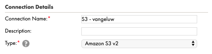
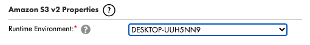

# 5.3 Connect Informatica to your AWS S3 bucket

In this exercise, you'll create a connection in Informatica to read data from your AWS S3 bucket.

## Log in to Informatica

Go to [https://apse1.dm-ap.informaticacloud.com/cloudshell/showProducts](https://apse1.dm-ap.informaticacloud.com/cloudshell/showProducts). 

Log in using your credentials for Informatica.

You'll then see the Informatica homepage, click **Administrator**.

You'll then see the Administrator landing page.

In the left menu, click **Add-On Connectors**. You'll then see this.

In the search field, enter **amazon**. You'll then have these results. Click **Start Free Trial** for the connector with the name **Amazon S3 Connector**.

You'll then see this. Click **OK**.

Your Amazon S3 connector is now installed. You can now set up the connection to the S3 bucket you created in the previous exercise.

In the left menu, click **Connections**.

You'll then see all available connections. You now have to create a new connection for your AWS S3 bucket.

Click **New Connection**.

In Connection Details, configure the fields like this:

- Connection Name: use the name **S3 - LDAP** and replace LDAP by your LDAP. In this example, the Connection Name is **S3 - vangeluw**.
- Type: select the type **Amazon S3 v2**.

In the Amazon S3 v2 Properties, select the Runtime Environment you created in one of the previous exercises (**DON'T select Informatica Cloud Hosted Agent**):

In the Connection Section, configure the fields like this:

- Access Key: this is your Access key ID for your S3 bucket, as defined in the previous exercise.
- Secret Key: this is your Secret access key for your S3 bucket, as defined in the previous exercise.
As a reminder, here's where you could find the Amazon S3 Access and Secret keys:

- Folder Path: folder path should be **aepmodule5LDAP**, replace LDAP by your LDAP. In this example, the Folder Path is **aepmodule5vangeluw**.
- Region Name: select **EU(Frankfurt)**.

After filling out these details, your screen should look like this:

Click **Save**.

Your connection is now saved and you'll see this:

Let's test your connection now, by clicking the **Test Connection** button in the upper right corner.

If your connection is set up properly, you should see a confirmation message: **The test for this connection was successful**.

If the test was successful, you can continue with the next exercise.
  
You can now continue with the next exercise.

Next Step: [5.4 Ingest Offline Order Events into Adobe Experience Platform](./ex4.md)

[Go Back to Module 5](./data-ingestion-informatica-etl.md)

[Go Back to All Modules](../../overview.md)
