# 5.4 Ingest Offline Order Events into Adobe Experience Platform

In this exercise, you'll learn how to import order data into Informatica, join datasets and ingest transformed data into Adobe Experience Platform as Experience Events.

## Learning Objectives

- Learn how to load data in Informatica
- Learn how to create a mapper workflow in Informatica. 
- Understand the process to join data sets, enrich data and ingest it in Platform.

## Lab Resources

- Informatica: [https://usw5.dm-us.informaticacloud.com/diUI/products/integrationDesign/main/home](https://usw5.dm-us.informaticacloud.com/diUI/products/integrationDesign/main/home)
- Adobe Experience Platform: [https://experience.adobe.com/platform/](https://experience.adobe.com/platform/)

## Lab Tasks

- Load CSV files from your S3 bucket into Informatica for Offline Orders and Loyalty Program Profiles
- Create a mapper workflow to join the above data sets, enrich and filter the data.
- Run the job to ingest the data into Adobe Experience Platform

## Business Context: Using Informatica to ingest offline orders events into Platform

Luma is a fashion brand and in addition to its online presence, has brick and mortar stores all over the world. So far the marketing team has struggled to make use of the offline orders data to optimize their online experience. Recently, they introduced a new loyalty program that allows customers to collect points when purchasing in-store using their loyalty card. The marketing team receives regularly a flat file with all the offline orders. They also have a record of all customers who have joined the loyalty program. With the help of Informatica, we will join the two data sources, enrich the result so that it can be ingested into Adobe Experience Platform, and then hydrate the profile with the offline order events.

## Exercise 5.3.1 - Create Sources in a Mapping Workflow

In this exercise, you'll load two CSV files from your S3 bucket into Informatica: 

- offline_orders.csv
- loyalty_data.csv

Go to [https://apse1.dm-ap.informaticacloud.com/cloudshell/showProducts](https://apse1.dm-ap.informaticacloud.com/cloudshell/showProducts). 

Login using the credentials that were sent to you by email.

You'll then see the Informatica homepage. Go to **Data Integration**.

On the Informatica homepage, click the **+ New...** button.

You'll then see this popup.

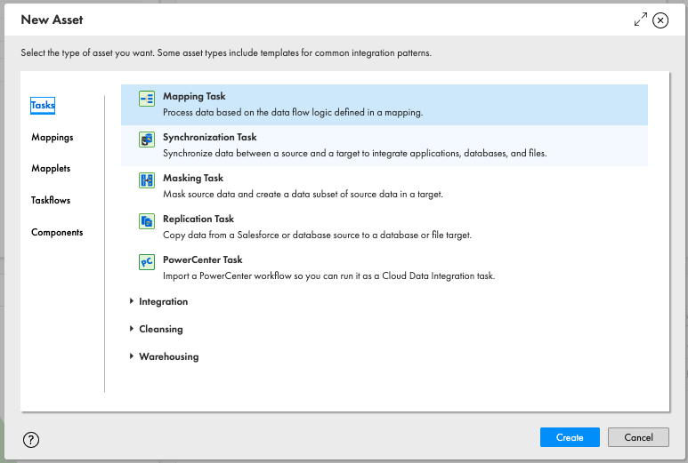

In the left menu in the popup, select **Mappings**. Next, select **Mapping**.

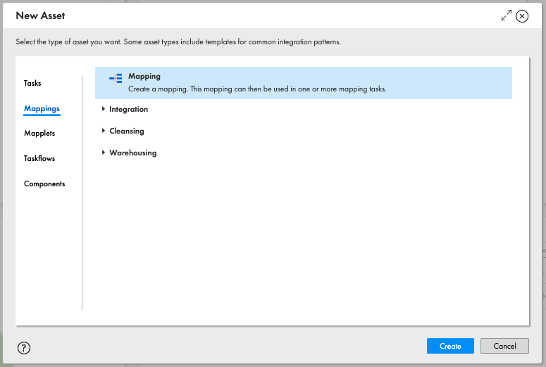

Click **Create** to start creating your mapping workflow.

You'll then see this screen:

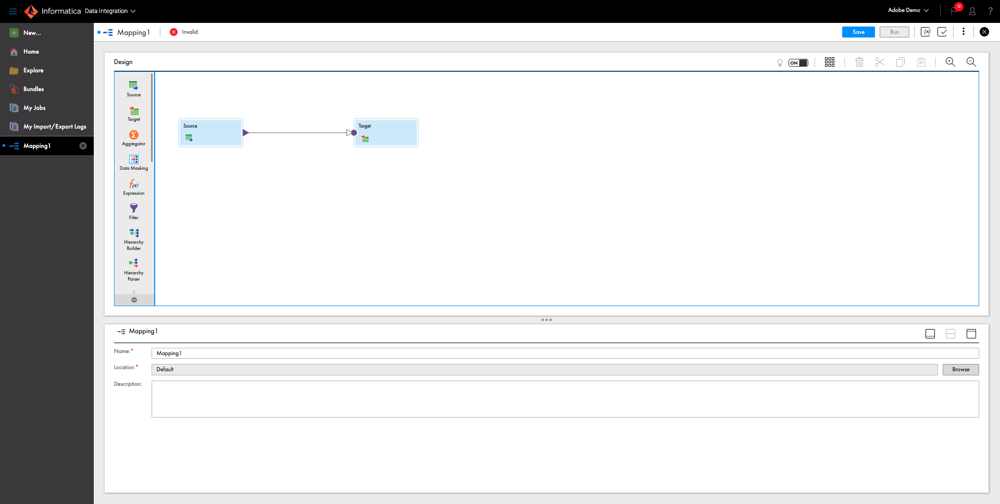

Let's start by configuring the name of your mapping. For the name of your mapping, use **LDAP - ex3**. In this example, the name is **vangeluw - ex3**.

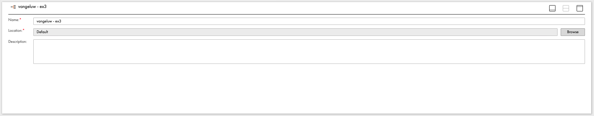 

Click **Save** in the upper right corner of the screen to save your changes.

 

Next, let's start the creation of your mapping workflow. Your workflow looks like this at the moment.

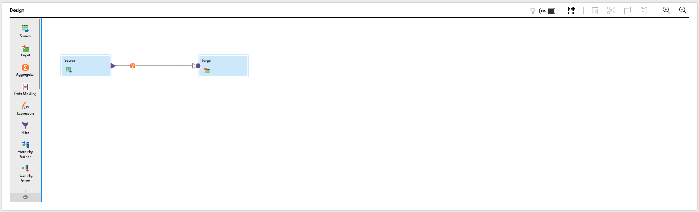 

Let's start by removing the **Target** object for the moment. Select the **Target** object and click the **Delete** icon.

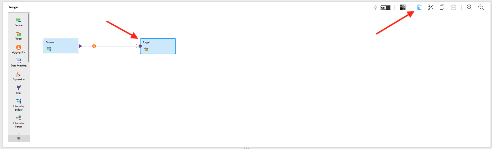 

Click **Delete** on the popup window.

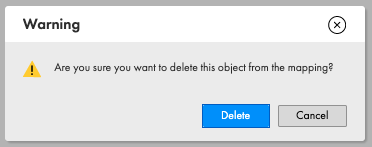

Your workflow now looks like this.

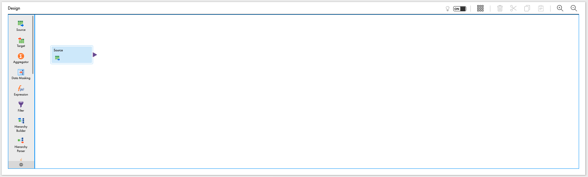

Select the **Source** object. After selecting the **Source** object, you'll see a Properties window at the bottom of your screen.

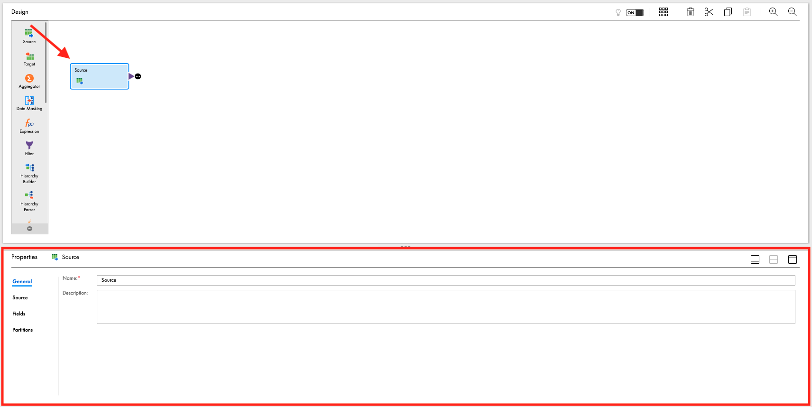

In the **Properties** window, click **Source**.

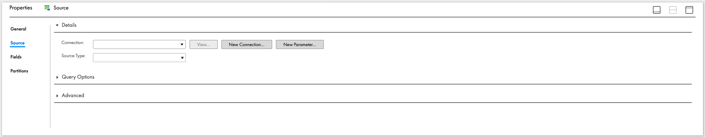

Open the **Connection** dropdown, locate your **S3 - LDAP** connection and select it.

You'll then see this.

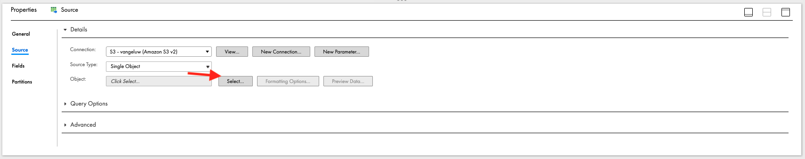

Click **Select...**.

You'll then see a popup window, which shows your S3-connection. In the **Packages** column, you'll see your bucket name. Click your bucket name to select it.

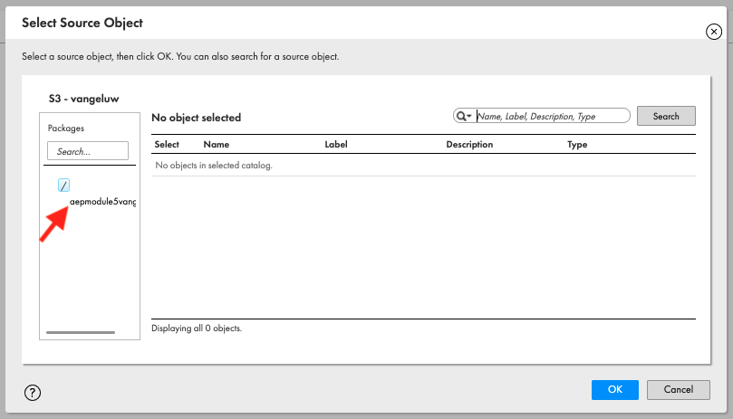

After selecting your bucket name, you'll see the four CSV files that you uploaded into your S3 bucket in Exercise 5.1. 

Select the file **offline_orders.csv** and click OK.

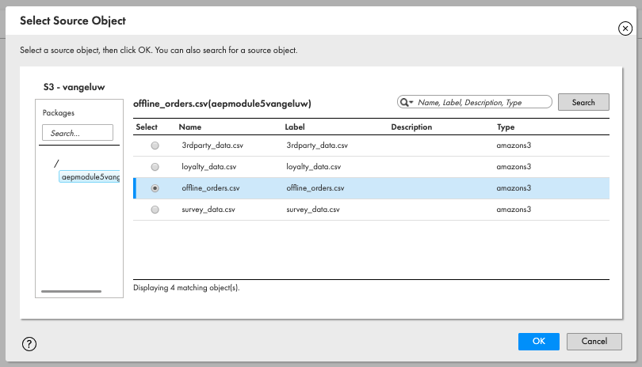

You'll then see this.

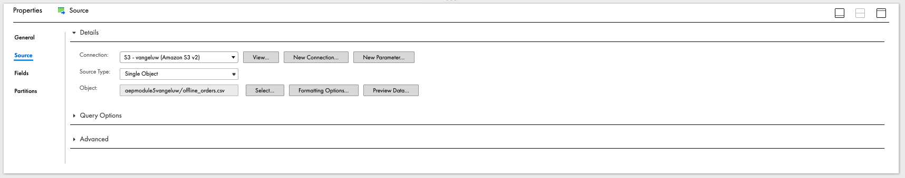

In the **Format** dropdown, change the Format Type from **None** to **Delimited**.

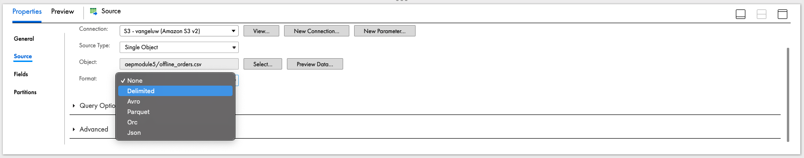

Click **Formatting Options**.

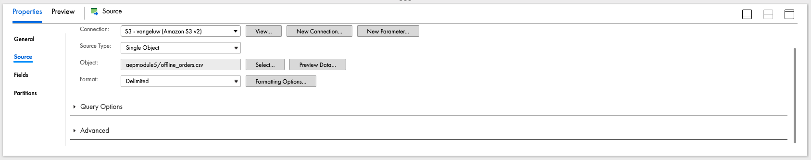

On the Properties screen, click **Data Preview**.

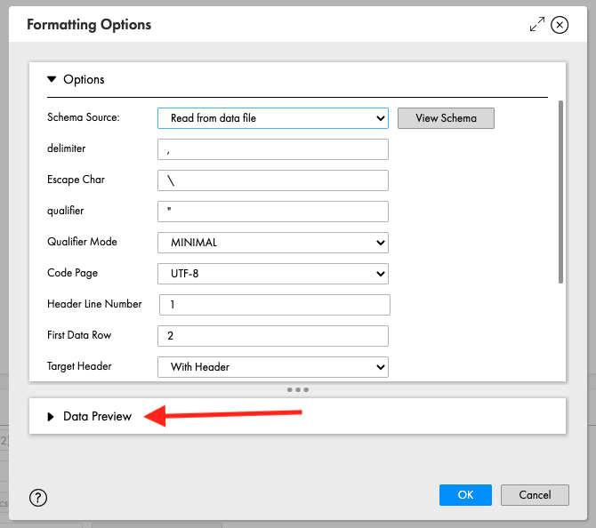

You should then see a preview just like this one. Click **Done** to close the preview window.

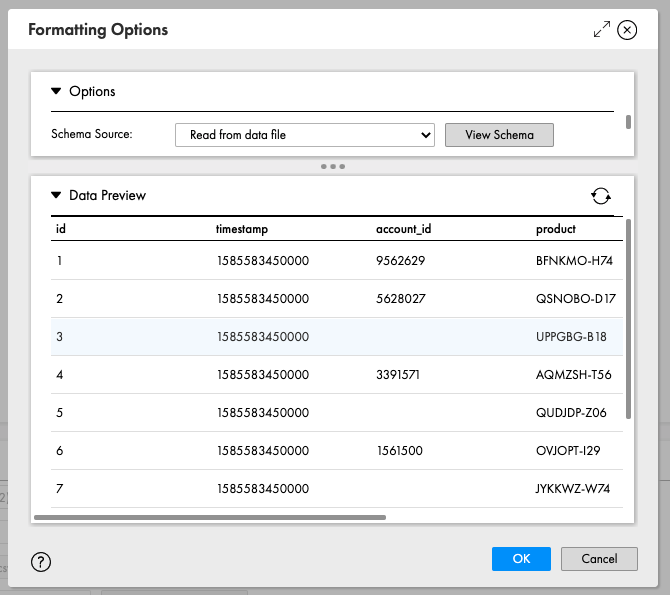

The file that you just loaded as a source, has these columns:

| Column     | Description                           |
|:----       | :--------                             |
| id         | Row number                            |
| timestamp  | Timestamp when product was purchased  |
| account_id | Loyalty program account id            |
| product    | Product SKU                           |
| price      | Product price                         |
| currency   | Currency of the product price         |

As you can see in the preview, there are several empty lines so you'll have to do some cleaning of the file before ingesting it into Adobe Experience Platform.

Next, you'll set up a second **Source** object on the mapping workflow.

Drag an drop the **Source** object from the left menu in the Design Overview onto the canvas.

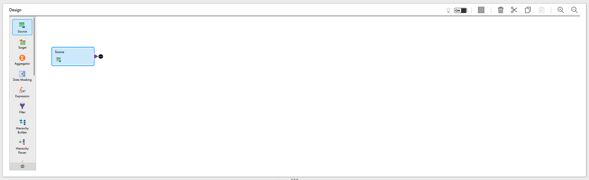

You should now have this Design:

Select the second **Source** object. After selecting the second **Source** object, you'll again see a Properties window at the bottom of your screen.

In the **Properties** window, click **Source**.

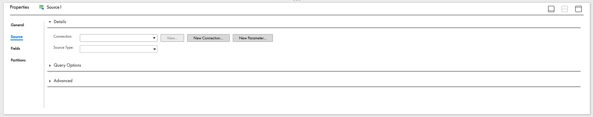

Open the **Connection** dropdown, locate your **S3 - LDAP** connection and select it.

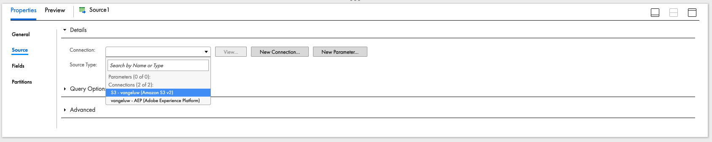 

You'll then see this.

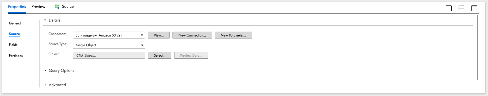

Click **Select...**.

You'll then see a popup window, which shows your S3-connection. In the **Packages** column, you'll see your bucket name. Click your bucket name to select it.

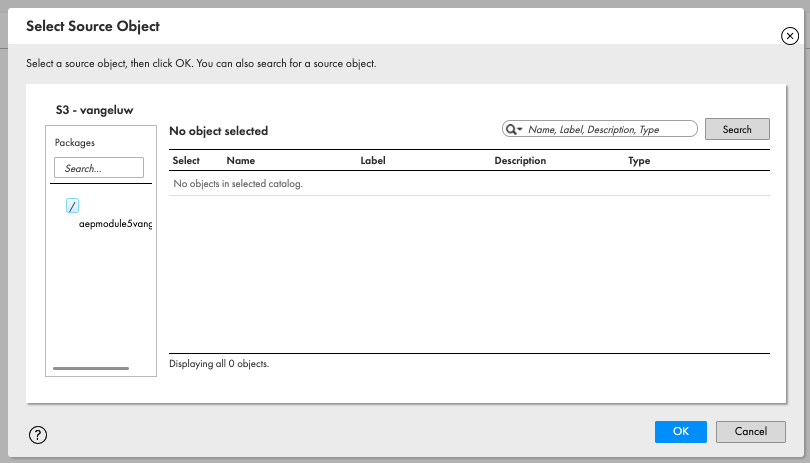

After selecting your bucket name, you'll see the four CSV files that you uploaded into your S3 bucket in exercise 1. 

Select the file **loyalty_data.csv** and click OK.

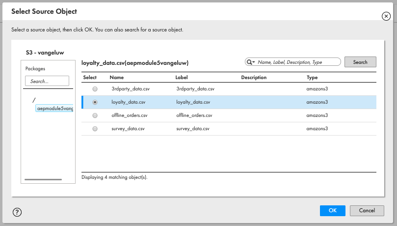

You'll then see this.

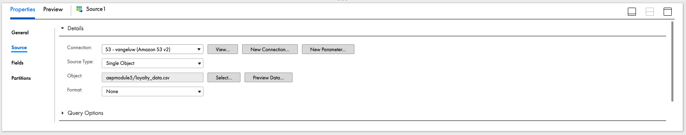

In the **Format** dropdown, change the Format Type from **None** to **Delimited**.

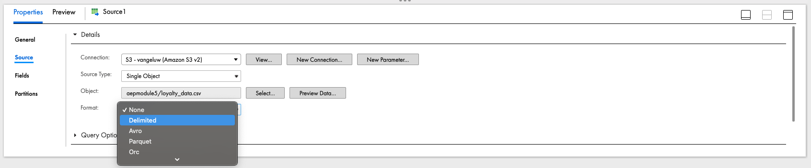

You'll then have this.

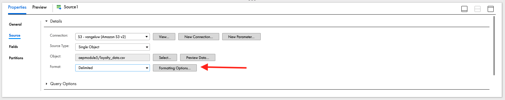

Click **Formatting Options**.

On the Properties screen, click **Data Preview**.

You should then see a preview just like this one. Click **Done** to close the preview window.

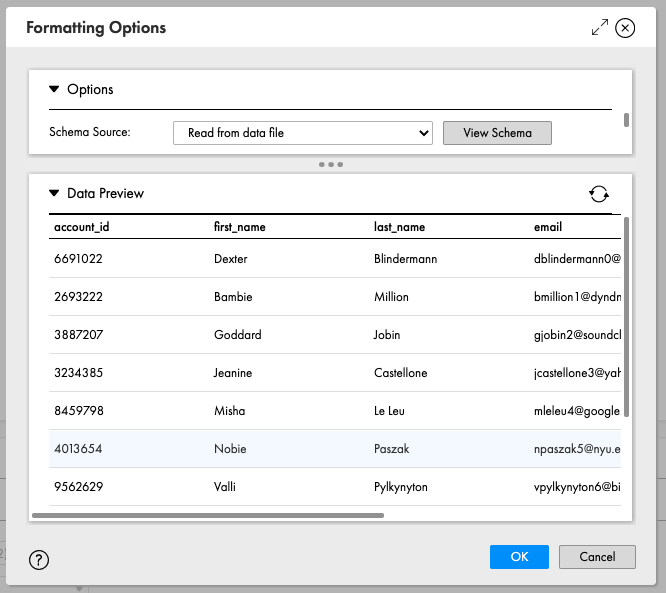

The file that you just loaded as a source, has these columns:

| Column     | Description                           |
|:----       | :--------                             |
| account_id | Loyalty program account id            |
| first_name | Customer's first name                 |
| last_name  | Customer's last name                  |
| email      | Customer's email address              |
| gender     | Customer's gender                     |
| points     | Customer's number of collected points |

You have now created the Source connectors required for this exercise!

## Exercise 5.3.2 - Join Sources

In this exercise, you'll join the above created Sources.

Your mapping workflow looks like this currently:

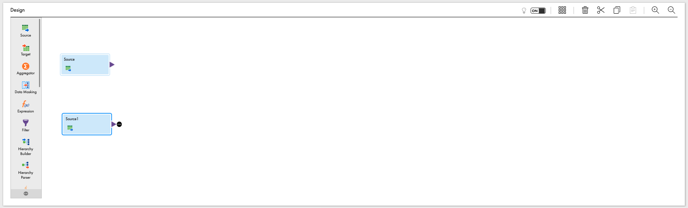

You now need to join those 2 datasets. The way to do that is using a **Joiner**. In the Design-menu, scroll down until you see the **Joiner** object. 

Drag and drop the **Joiner** object on the canvas.

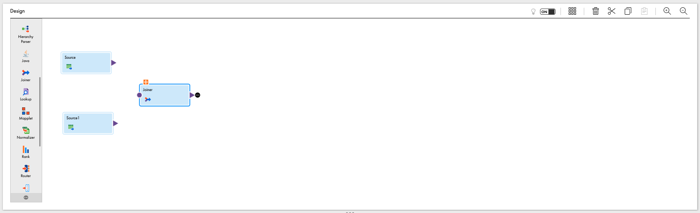

Next, you have to connect the two Sources to the Joiner.

Click the orange **+** icon on the Joiner. You'll now see a **Master** and a **Detail** node.

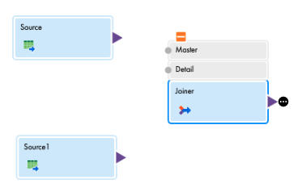

Connect Source to Master and Source 1 to detail as indicated below.

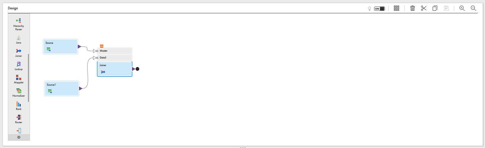

Let's define the Properties of the Joiner now.

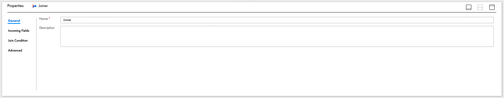

Go to the menu option **Incoming Fields**. You'll see a notification message that certain fields from the two Sources have the same name. Let's fix that first.

Click on **Resolve Field Name Conflicts**.

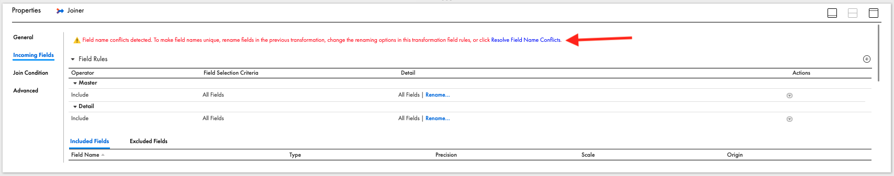

You'll see this window now.

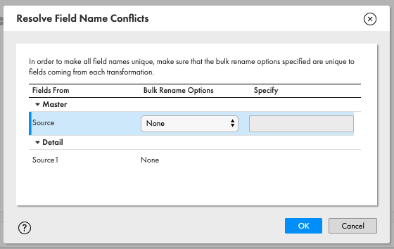

For Master > Source, open the dropdown list for **Bulk Rename Options** and select **Prefix**. 

Enter the prefix **m_**. 

Click **OK**.

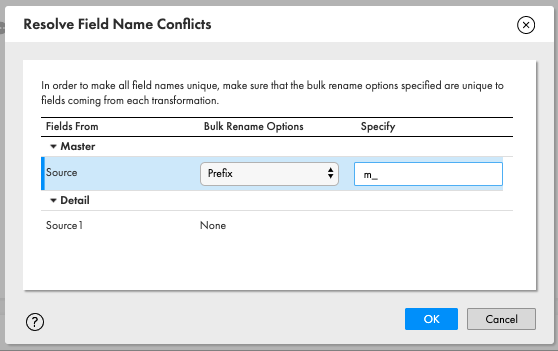

In the Incoming Fields screen, you can now scroll down and you'll see that all fields form the Master Source now have an `m_`-prefix and the error message is gone.

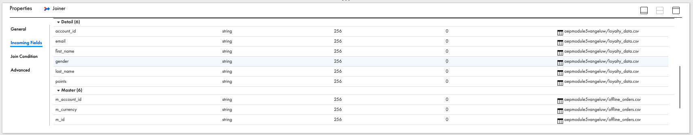

Next, you have to define the **Join Condition**. Click on **Join Condition** in the left menu.

You'll then see this.

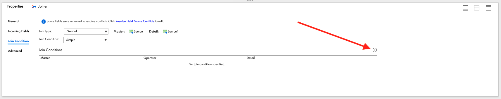

Click the little **+** icon.

You'll then see a Join Condition appear.

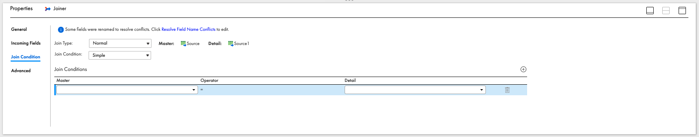

Connect these 2 fields to each other:

`m_account_id (string)` = `account_id (string)`

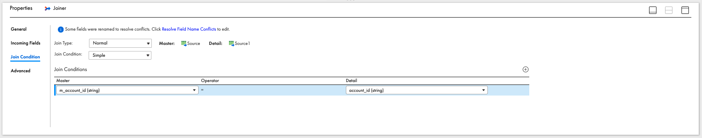

When done, click **Save**

Your two Sources are now joined with each other.

Don't forget to click **Save** to save your mapping's current state.

## Exercise 5.3.3 - Filter Data

The next step is filtering data. Specifically, you need to remove potential empty lines like in the case of having an empty account_id.

In order to filter data, you need to add a **Filter** object onto the canvas. You can find the **Filter** object in the left menu on the Design workflow.

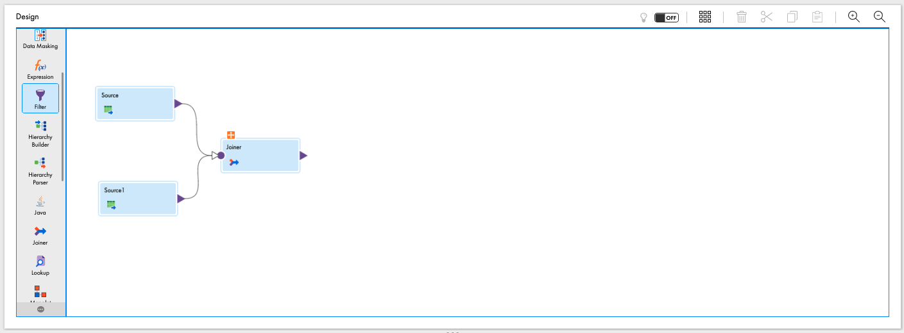

Drag and drop the **Filter** object onto the canvas.

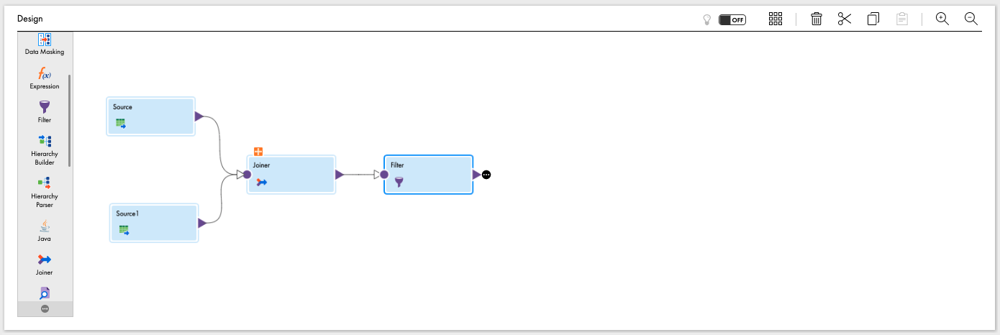

Next, have a look at the **Properties** window.

In the left menu, go to **Filter**.

Click the **+** icon on the right side to add a Filter.

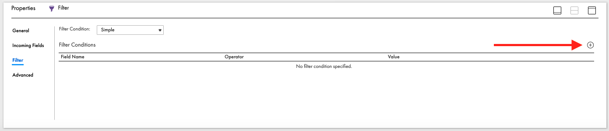

Change the **Filter Condition** to **Advanced**.

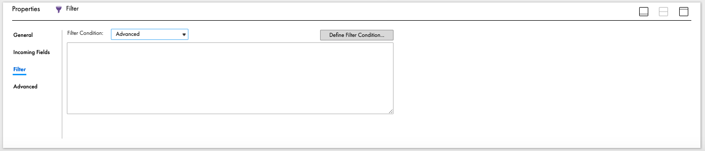

Click the **Edit Filter Condition** button.

In the **Edit Filter**-popup, paste this filter: 
`IIF(ISNULL(account_id),FALSE,TRUE)`

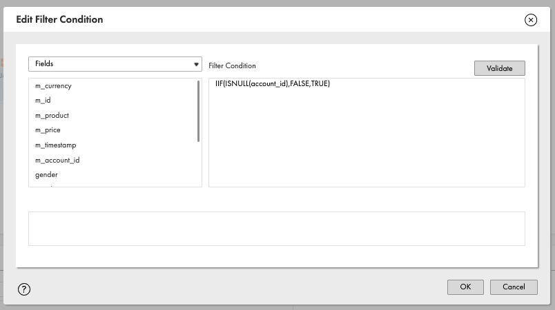

Click **OK** to save your Filter.

You've now defined your Filter, let's enrich your data.

Don't forget to click **Save** to save your mapping's current state.

## Exercise 5.3.4 - Enrich Data

In the enrichment phase, you can add additional fields to your dataset. In this example, we need to provide a unique `hitId` to Adobe Experience Platform when ingesting Experience Event-data. This `hitId` isn't part of the dataset yet, so you'll add it now using an **Expression**.

In order to enrich data, you need to add an **Expression** object onto the canvas. You can find the **Expression** object in the left menu on the Design workflow.

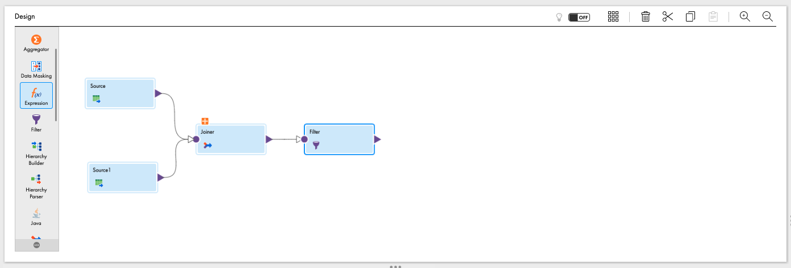

Drag and drop the **Expression** object onto the canvas.

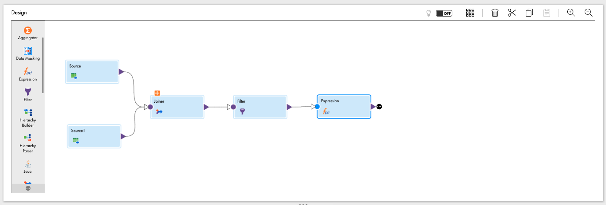

Next, have a look at the **Properties** window.

In the left menu, go to **Expression**.

Click the **+** icon on the right side to add a Field/Expression.

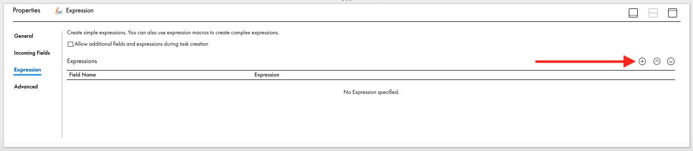

You'll then see this popup:

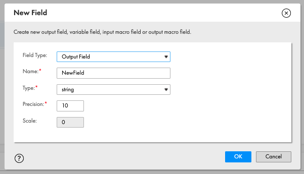

In the popup, define the field Name and Type:

- Name: `hitId`
- Type: `bigint` 

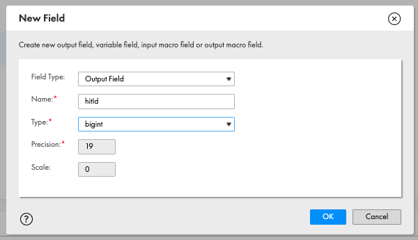

Click **OK** to save your field.

You'll then see this:

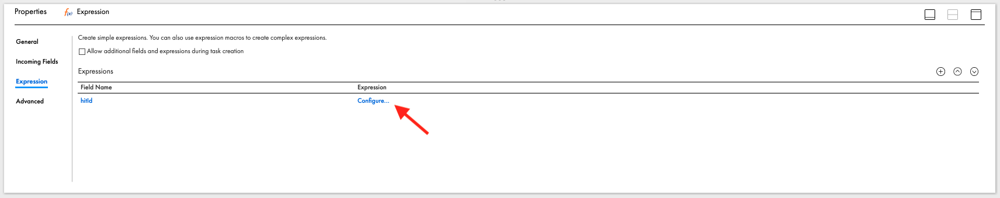

Click **Configure...**

In the **Edit Expression**-popup, paste this expression: 
`rand() * 1000000000000`

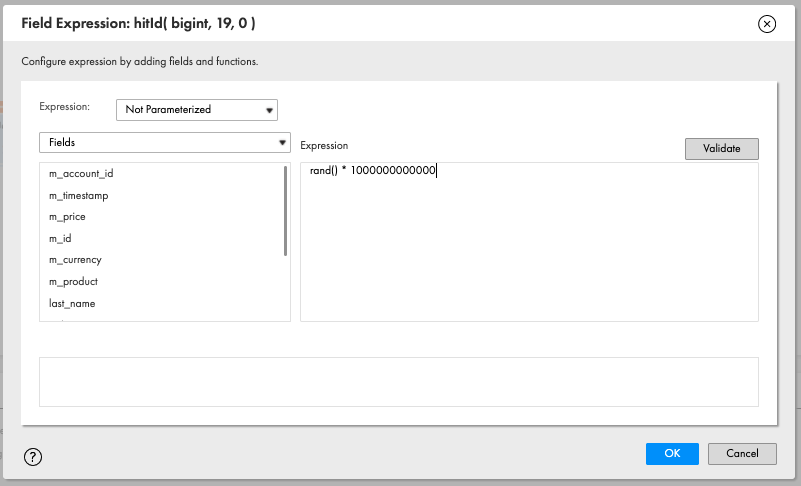

Click **OK** to save your expression.

You've now defined your Expression, let's output your data to Adobe Experience Platform.

Don't forget to click **Save** to save your mapping's current state.

## Exercise 5.3.5 - Output Data to Target

The last step is to add the **Target** object to the workflow. From the left menu, drag and drop the **Target** object onto the canvas.

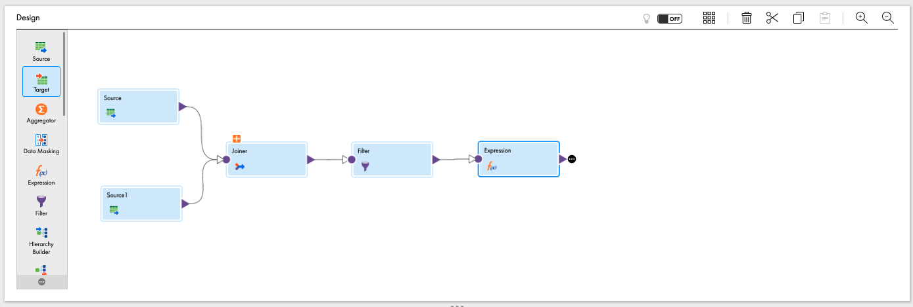

Connect the **Expression** object to the **target** object.

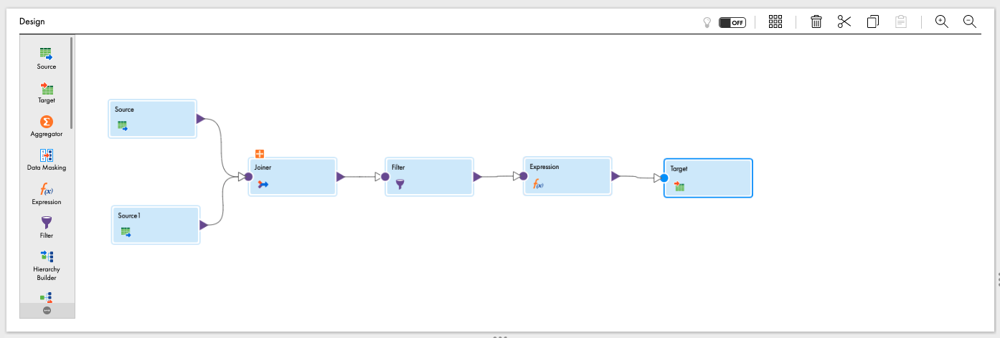

Have a look at the **Properties** windows.

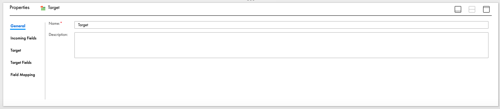

In the left menu, go to **Target**. In the Connection dropdown, select the Adobe Experience Platform connector you created previously.

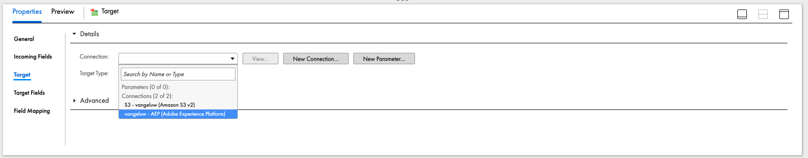

You'll then have this:

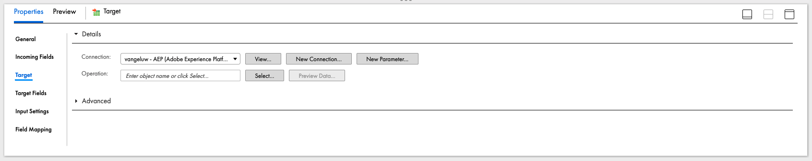

Click the **Select** button to select the Adobe Experience Platform dataset to use.

Enter the search term `ETL` and click **Search**. You'll then see these datasets being returned.

Select the dataset `Demo System - Event Dataset for ETL (Global v1.1)`.

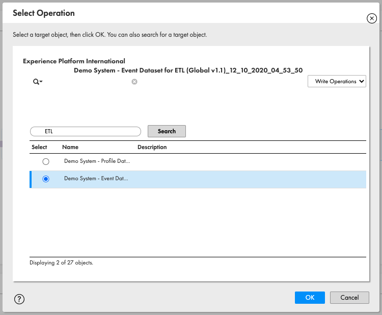

In the left menu of the Properties window, go to **Field Mapping**.

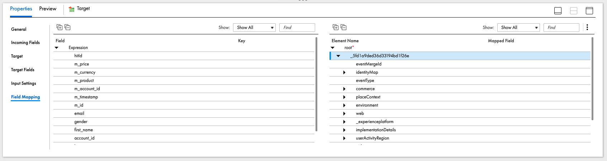

Map the Output to the Schema attributes as per below:

| Field       | Element Name |
| :---------  | :---  |
| m_timestamp | timestamp   |
| m_product   | productListItemsArray.productListItems.name   |
| m_product   | productListItemsArray.productListItems.SKU   |
| m_currency  | commerce.order.currencyCode      |
| email       | ``--aepTenantId--``.identification.core.email |
| hitID       | _id  |

Your Field Mapping should look like this (don't forget about the mapping for m_email).

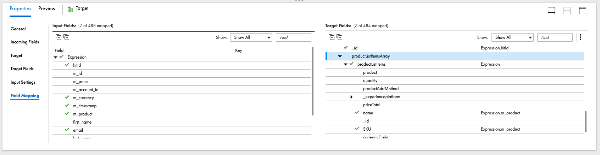

Click **Save**.

You now have a finished workflow which can be **Run**.

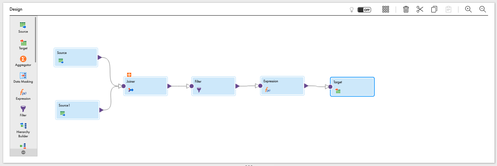

Click the **Run** button in the top right corner of the screen.

After 30 seconds, you'll then see this popup. (Note: it can take a long time, please just wait)

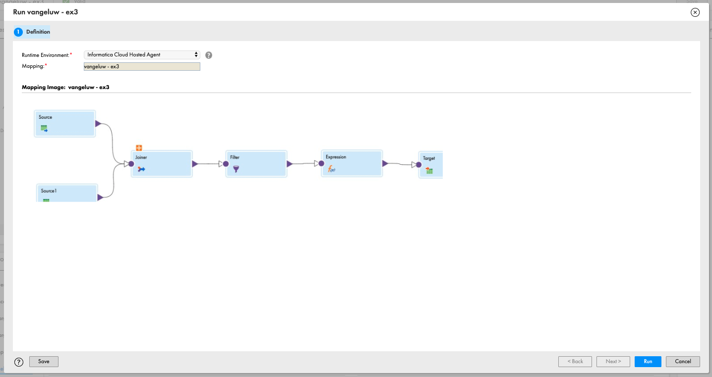

You need to change the **Runtime Environment** to the Runtime Environment you created in the previous exercise, just like in the screenshot. (If you don't select the correct Runtime Environment, your job won't run successfully)

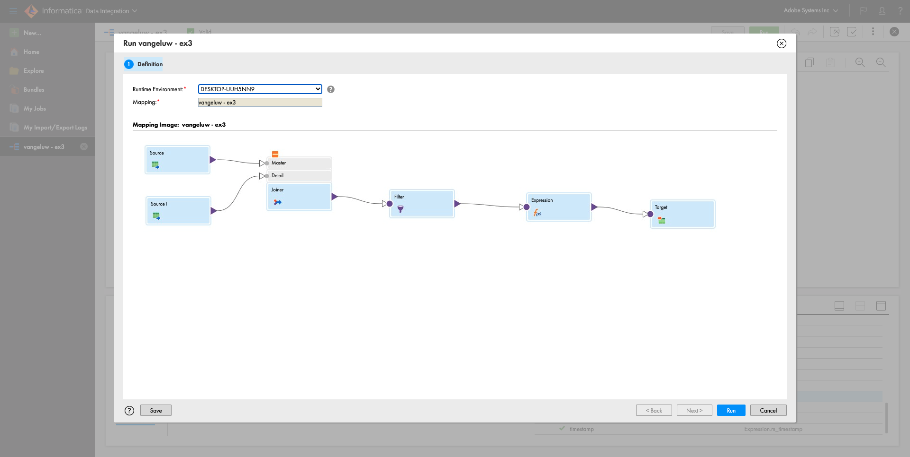

Click **Run**.

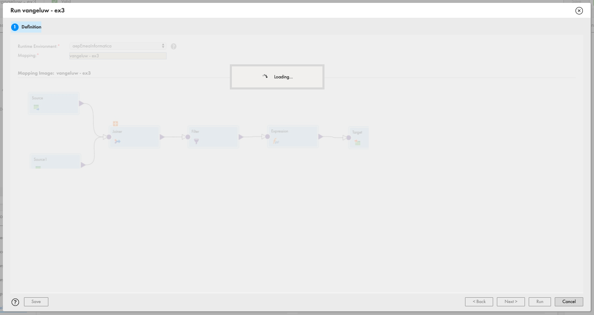

After 20-30 seconds, your Job will be executing.

You can review the status of your Job by going to the left menu option **My Jobs**.

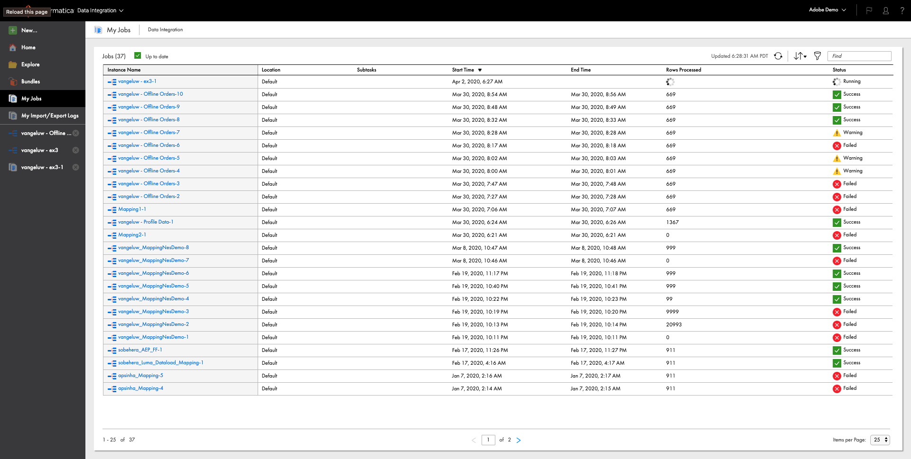

Locate your Job in the list and click it to open it.

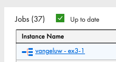

You'll then see something like this:

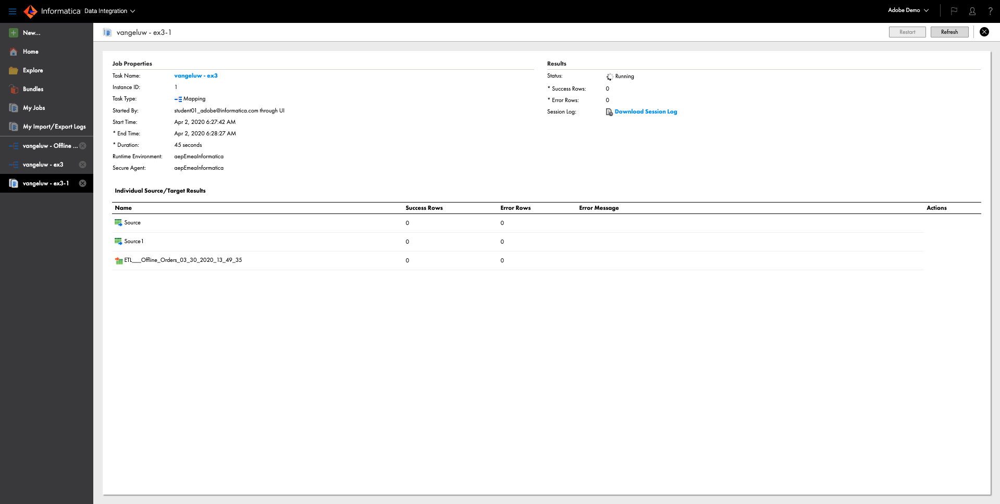

Click the **Refresh** button to see updates.

Once your job has finished successfully, your data will be ingested in Adobe Experience Platform.

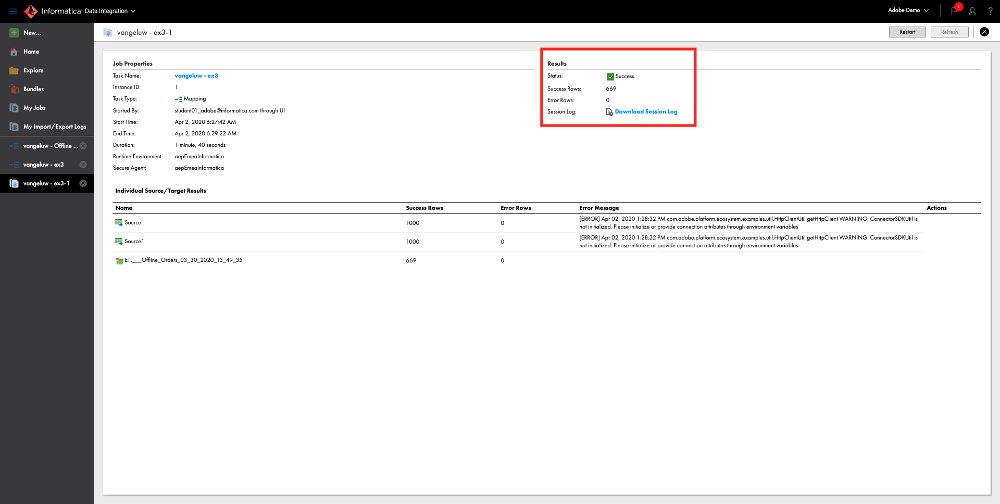

Log in to [Adobe Experience Platform](https://experience.adobe.com/platform).

After logging in, you'll land on the homepage of Adobe Experience Platform.

Before you continue, you need to select a **sandbox**. The sandbox to select is named ``--aepSandboxId--``. You can do this by clicking the text **[!UICONTROL Production Prod]** in the blue line on top of your screen.

After selecting the appropriate sandbox, you'll see the screen change and now you're in your dedicated sandbox.

Go to Datasets and enter the search term `ETL`. You'll then see these datasets:

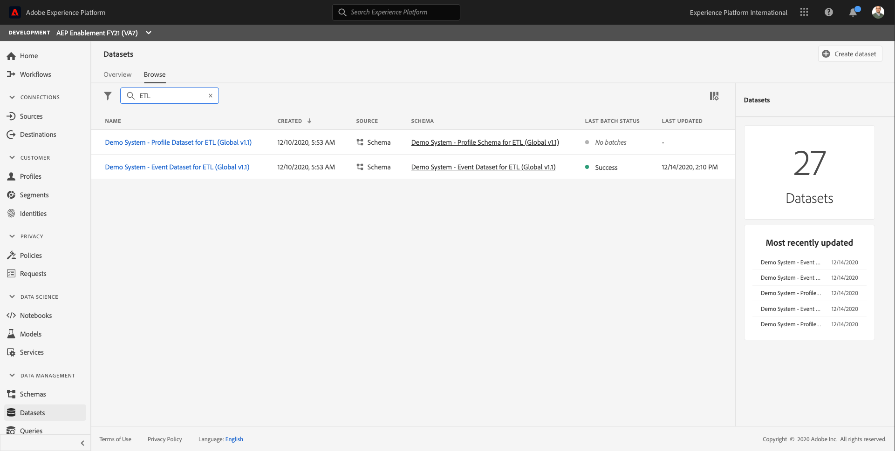

Open the dataset `Demo System - Event Dataset for ETL (Global v1.1)`. Scroll down until you see the Batch IDs and locate your specific batch. 

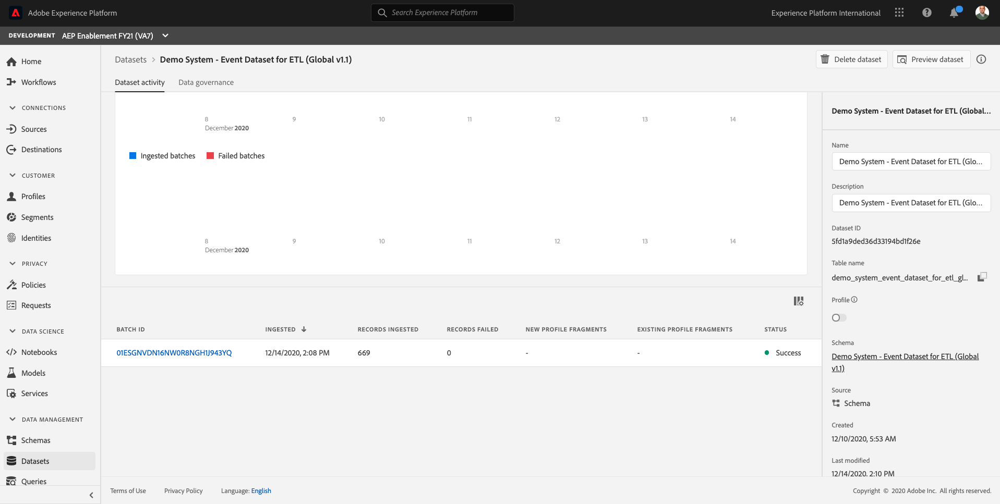

You can now continue with the next exercise.

Next Step: [5.5 Ingest 2nd and 3rd party data into Adobe Experience Platform](./ex5.md)

[Go Back to Module 5](./data-ingestion-informatica-etl.md)

[Go Back to All Modules](../../overview.md)
