# 6.3 Create your journey

In this exercise, you'll configure the journey that needs to be triggered when someone creates an account on the demo website.

Login to Adobe Journey Optimizer by going to [Adobe Experience Cloud](https://experience.adobe.com). Click **Journey Optimizer**.

You'll be redirected to the **Home**  view in Journey Optimizer.

First, make sure you're using the correct sandbox. The sandbox to use is called `--aepSandboxId--`. To change from one sandbox to another, click on **PRODUCTION Prod (VA7)** and select the sandbox from the list. In this example, the sandbox is named **AEP Enablement FY21**.

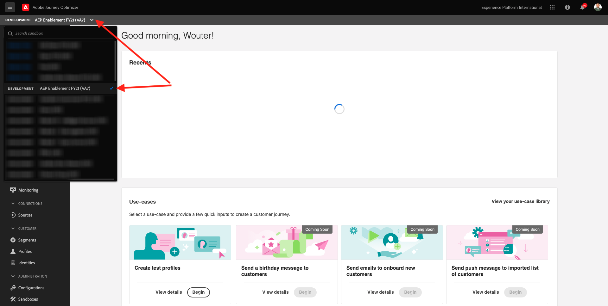

You'll then be in the **Home** view of your sandbox `--aepSandboxId--`.

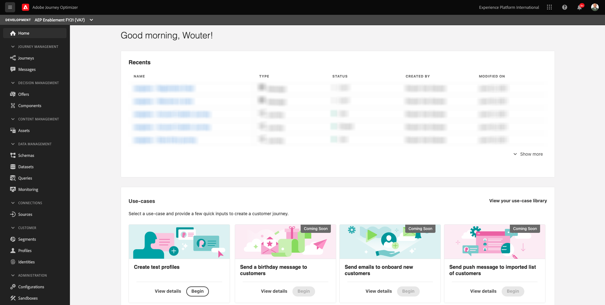

In the left menu, click **Journeys**. Next, click **Create Journey** to create a new journey.

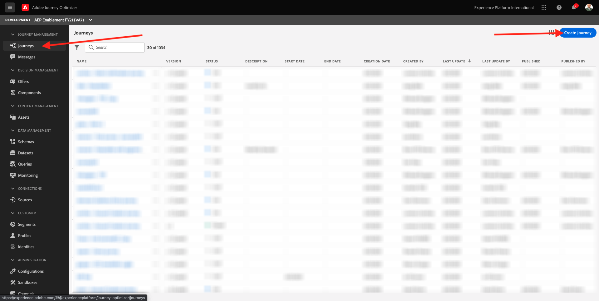

You'll then see an empty Journey screen.

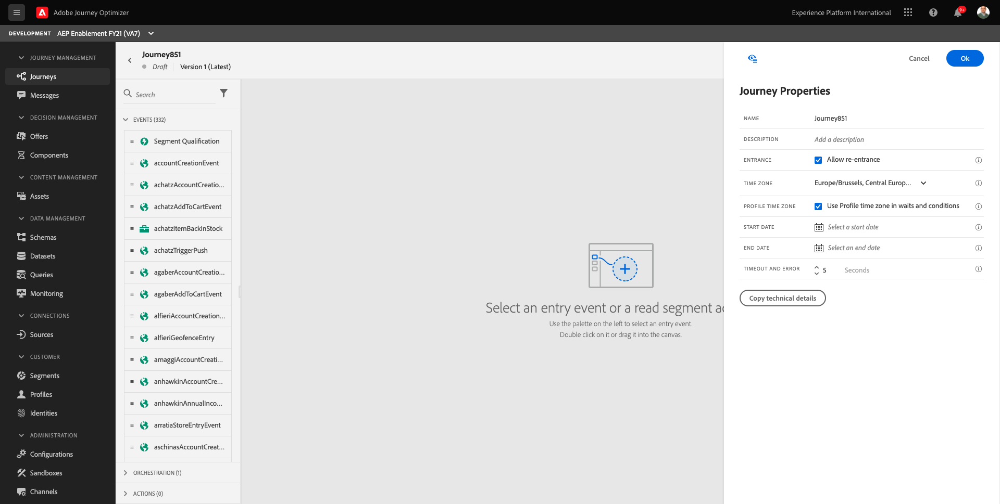

In the previous exercise, you created a new **Event**. You named it like this `ldapAccountCreationEvent` and replaced `ldap` with your ldap. This was the result of the Event creation:

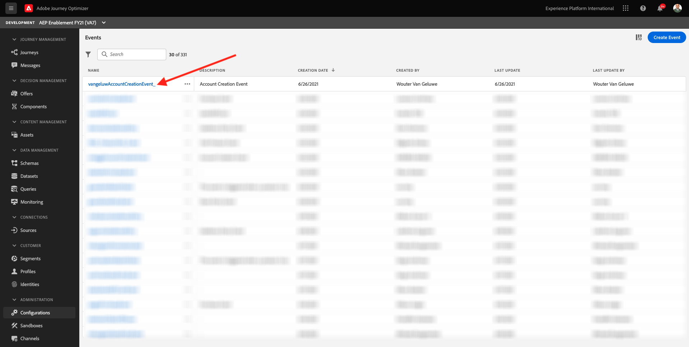

You now need to take this event as the start of this Journey. You can do this by going to the left side of your screen and searching for your event in the list of events.

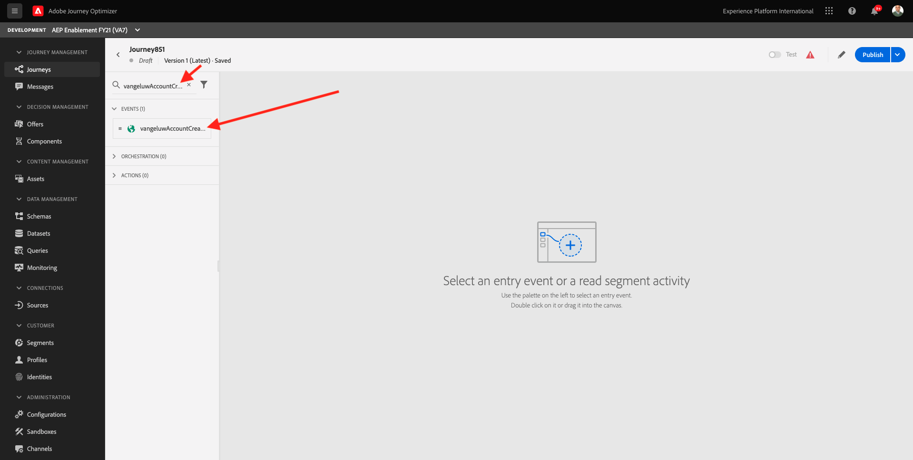

Select your event, drag and drop it on the Journey canvas. Your Journey now looks like this:

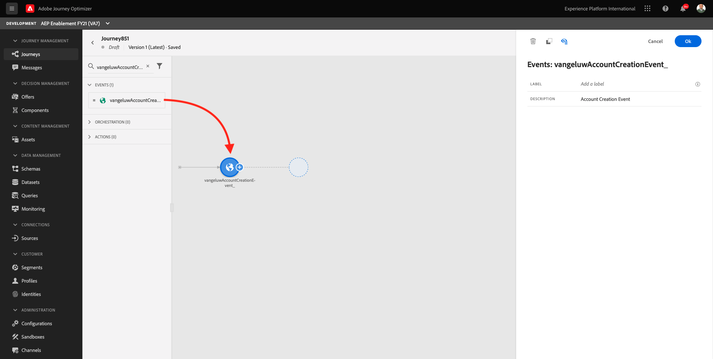

As the second step in the journey, you need to add a short **Wait** step. Go to the left side of your screen to the **Orchestration** section to find this. You'll be using profile attributes and need to make sure they are populated into the Real-time Customer Profile.

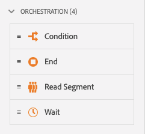

Your journey now looks like this. On the right side of the screen you need to configure the wait time. Set it to 20 seconds. This will give plenty of time for the profile attributes to be available after the event fires.

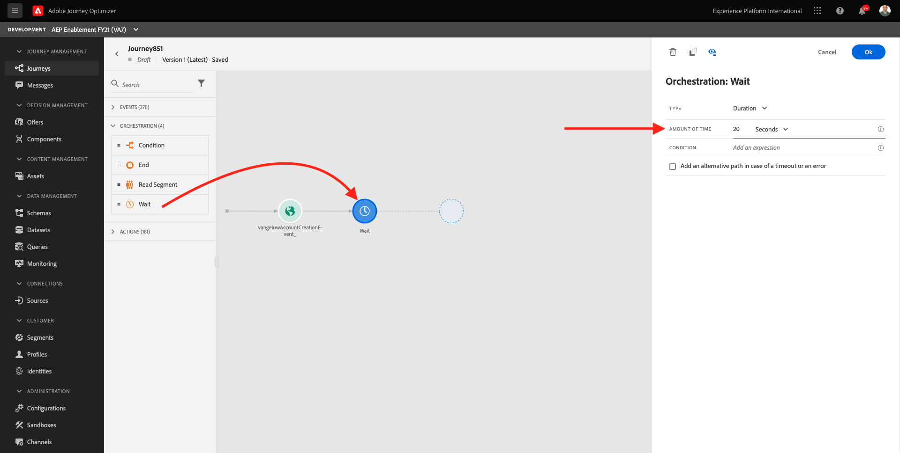

Click **Ok** to save your changes.

As the third step in the journey, you need to add a **Message** action. Go to the left side of your screen to **Actions**, select the **Message** action, then drag and drop it on the second node in your journey.

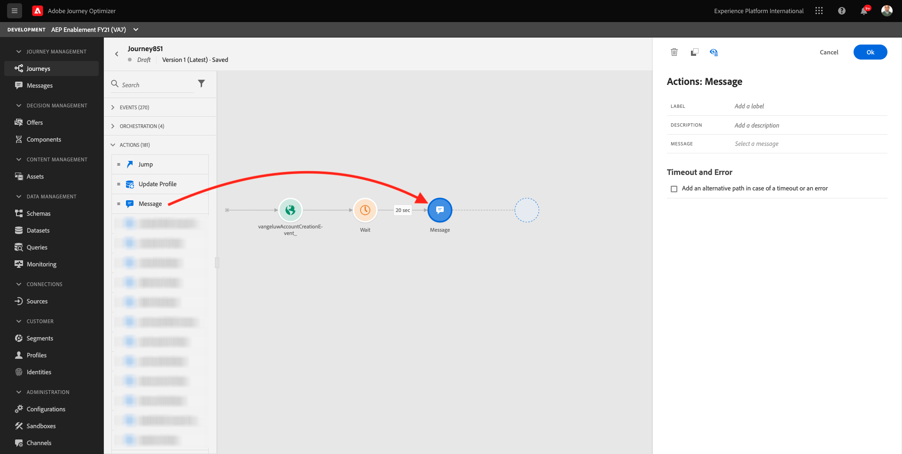

On the right side of your screen, you now need to configure the email. Click the **Edit** icon.

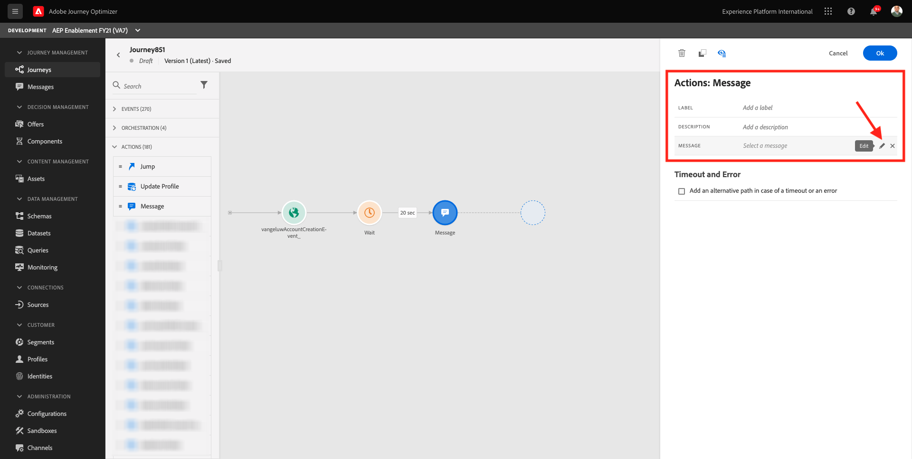

You'll then see the **Select a message** popup. In that list, you need to select the template with the name **ldap - Registration Email**.

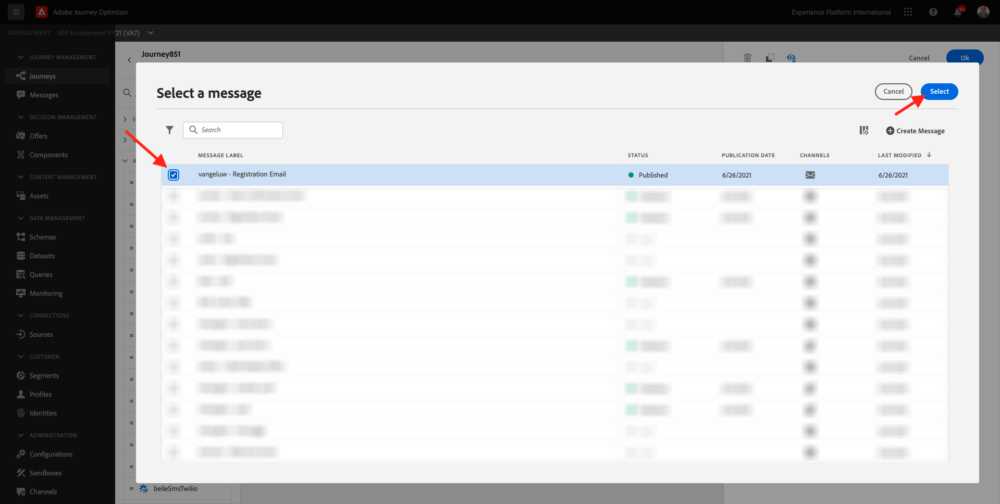

You'll then see this. Click **OK**.

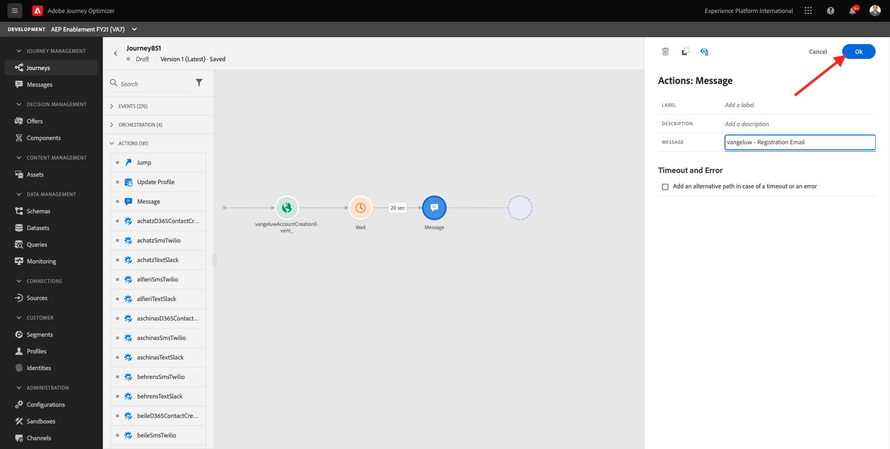

For this exercise, our Journey is fine like it is now.

Let's add an Orchestration Event to **End** the Journey. In the left side of the screen, go to **Orchestration** and select **End**. Drag and Drop this onto the 3rd step of the Journey.

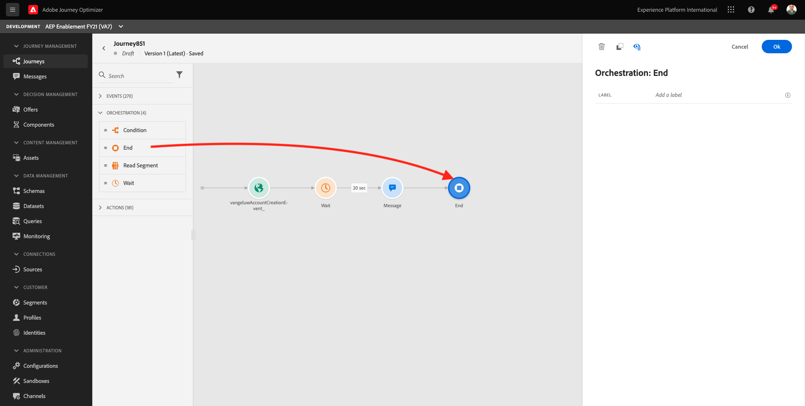

You still need to give your Journey a Name. You can do that by clicking the **Properties** icon in the top right side of your screen.

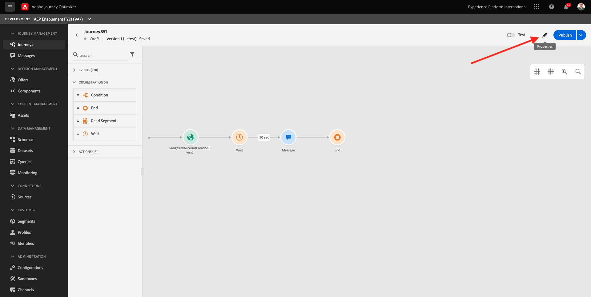

You can then enter the Journey's name here. Please use `ldap - Account Creation Journey` as a naming convention and replace `ldap` with your LDAP.
  
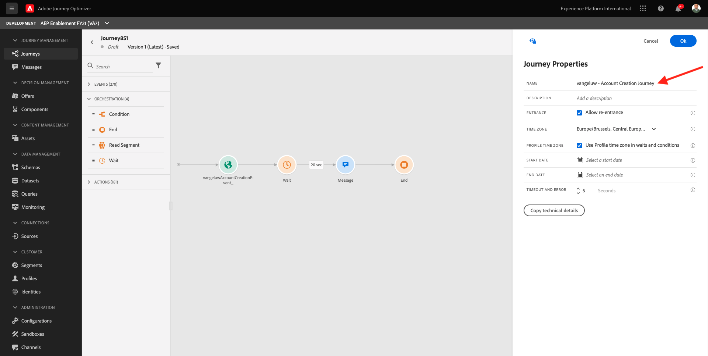

Click **OK** to save your changes.

You can now publish your journey by clicking **Publish**.

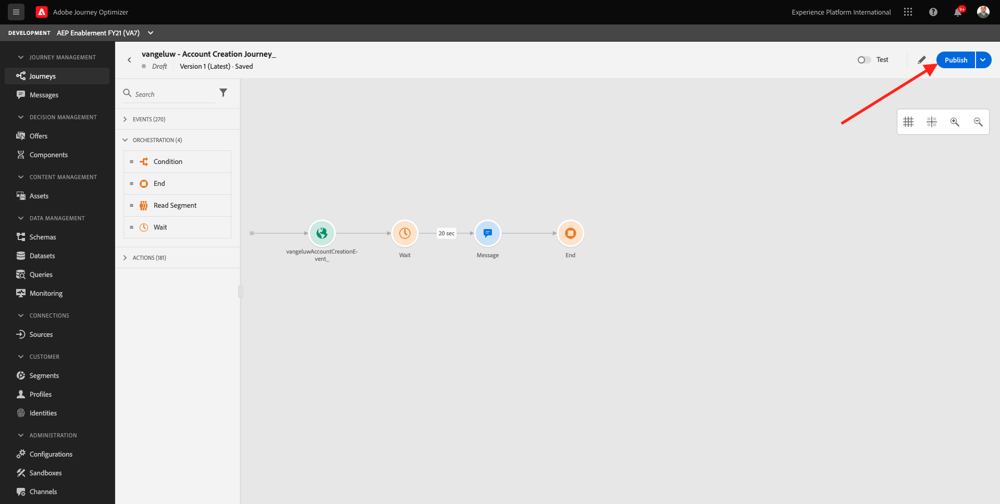

Click **Publish** again.

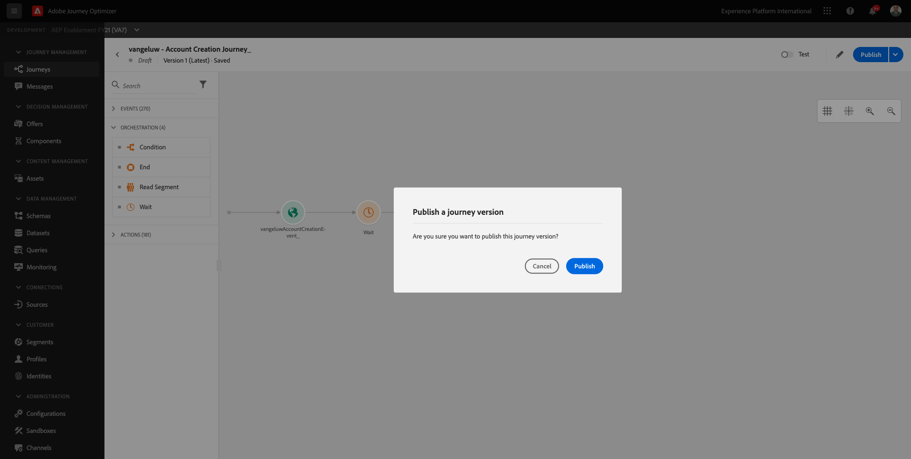

You'll then see a green confirmation bar saying that your Journey is now Published.

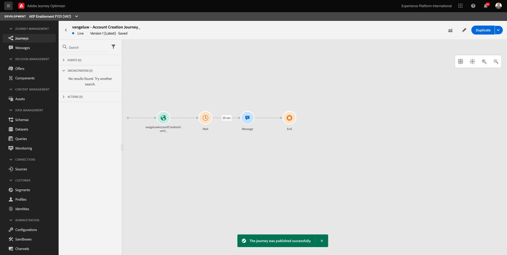

You've now finished this exercise.

Next Step: [6.4 Update your Configuration ID and Test your Journey](./ex4.md)

[Go Back to Module 6](./journey-orchestration-create-account.md)

[Go Back to All Modules](../../overview.md)
