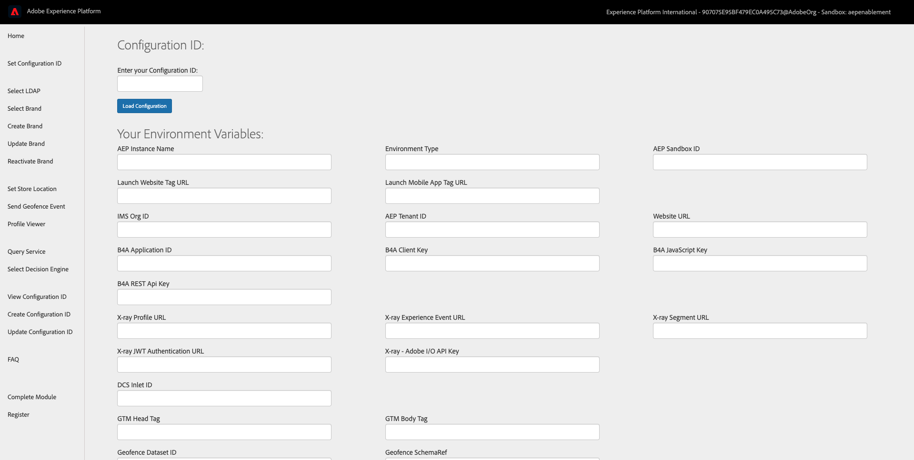
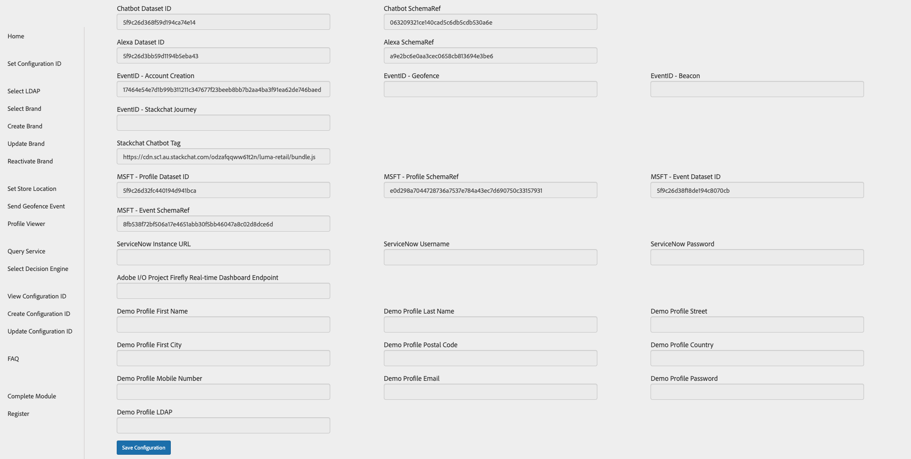

# 6.4 Update your Configuration ID and Test your Journey

## 6.4.1 Update your Configuration ID

Before you can test your journey, you'll need to update your Configuration ID settings and enter the EventID of the **ldapAccountCreationEvent** event on the **Update Configuration ID** page of the demo website Admin pages.

Open a clean, fresh incognito browser window and go to [https://public.aepdemo.net/admin\_configuration\_update.html](https://public.aepdemo.net/admin_configuration_update.html).

You'll then see this.

Enter your Configuration ID and click **Load Configuration**.

 After clicking **Load Configuration**, scroll down until you see the fields **EventID - Account Creation**.

In exercise 6.1, you created your event and collected the EventID. You can find it here:

In this example, the `eventID` is `801dccf3d3ce2afbed286b4fbd15ae8120758dcd7b0d487128342285b3732121`.

Go back to the **Update Configuration ID** screen and paste the code that you copied in the field **EventID - Account Creation**.

Next, scroll down and click **Update Configuration ID**.

After this change, your Configuration ID is ready for testing!

## 6.4.2 Test your Journey

Open a clean, fresh incognito browser window and go to [https://public.aepdemo.net](https://public.aepdemo.net).

You'll be redirected to this page:

Enter the Configuration ID you created in the previous step. Click **Load Configuration**.

You'll then see this:

Scroll down so you can see the **Save Configuration** button. Click **Save Configuration**.

After a couple of seconds you'll be redirected to the Admin homepage and you'll see this:

Go to **Select LDAP** in the left side menu, select your LDAP in the list and click **Save**.

Go to **Select Brand** in the left side menu, select a brand of choice and click **Save**.

You'll now see a similar Admin homepage. Click the brand logo to go to the demo website.

You'll then be redirected to the **Luma Retail** homepage.

Go to the **Login/Register** page. Fill out your registration details and click **CREATE ACCOUNT**.
  
>[!IMPORTANT]
>
> Please use the following naming convention for your Mobile Phone Number:
> If your number is 0473622044, you have to enter **+32473622044+DDMMYYYY-XX** as a number, otherwise the sending of SMSs doesn't work. For instance, **+32473622044+26052020-1**
  

You'll then be redirected to the Homepage of the website. Open the X-ray panel, go to Real-time Customer Profile. On the X-ray panel, you should see all of your personal data displayed.

When you clicked the **CREATE ACCOUNT** button, your **ldapAccountCreationEvent** has been triggered. In your Launch property, there's a Launch rule named **Create Account**. This rule is triggered when you click the **CREATE ACCOUNT** button.

The **AEP Web SDK** - **Send Event** action is then sending the payload to Adobe Experience Platform.

The **AEP Web SDK** - **Send Event** action is referring to the data element **ruleCreateAccount**, which is configured like this:

Specifically, the data element **ruleCreateAccount** refers to another data element **eventIdAccountCreation** which picks up the orchestration ID you configured in your Configuration ID. This is how the journey is eventually triggered.

As a result, you should now have received an email:

If you'd like to test the unsubscribe process, right-click the **Unsubscribe** link in the email and select **Copy Link Address**.

With the link copied, go back to the browser window where you've loaded the demo website. Open a new window and paste the link.

You'll then see the unsubscribe page being loaded. Select your unsubscribe reason and click **Unsubscribe**.

If you would like to see the impact of clicking that **Unsubscribe** button, go to Adobe Experience Platform and open your profile. Go to **Attributes**.

Now search for the attribute **val** which referes to the path **consents.marketing.email.val**.

Next Step: [Summary and benefits](./summary.md)

[Go Back to Module 6](./journey-orchestration-create-account.md)

[Go Back to All Modules](../../overview.md)
