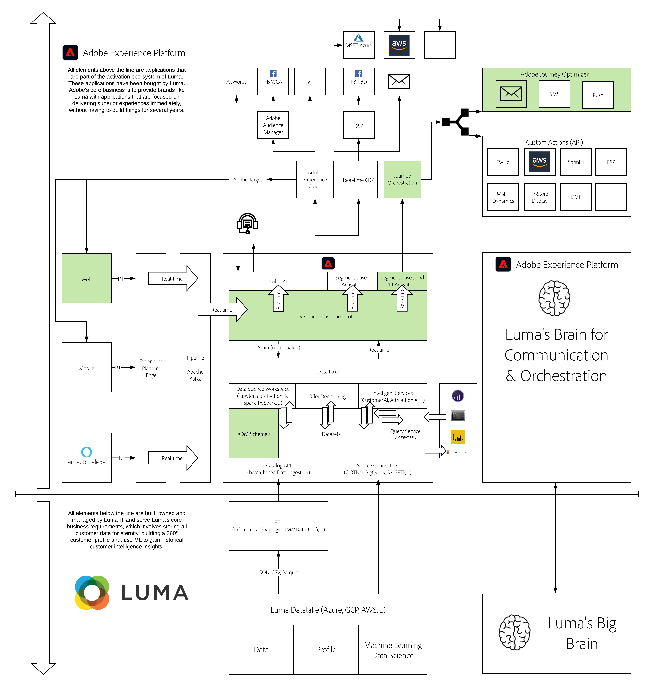

# 6. Adobe Journey Optimizer: Orchestration

**Authors: [Rob In der Maur](https://www.linkedin.com/in/ridmaur/), [Wouter Van Geluwe](https://www.linkedin.com/in/woutervangeluwe/)**

In this module, we will take you through the steps to use Adobe Journey Optimizer. You'll get access to Adobe Journey Optimizer and will be able to configure Events and Journeys that start based on a trigger from an experience event sent to Platform.

## Learning Objectives

- Learn how to configure Adobe Journey Optimizer events, journeys and actions
- Learn how to create your own email message using Adobe Journey Optimizer

## Prerequisites

- Access to [Adobe Experience Platform](https://experience.adobe.com/platform)
- Access to Adobe Journey Optimizer

>[!IMPORTANT]
>
>This tutorial was created to facilitate a particular workshop format. It uses specific systems and accounts to which you might not have access. Even without access, we think you can still learn a lot by reading through this very detailed content. If you're a participant in one of the workshops and need your access credentials, please contact your Adobe representative who will provide you with the required information.

## Architecture Overview

Have a look at the below architecture, which highlights the components that will be discussed and used in this module.

## Sandbox to use

For this module, please use this sandbox: `--aepSandboxId--`.

>[!NOTE]
>
>Don't forget to install, configure and use the Chrome Extension as referenced in [0.5 - Install the Chrome extension for the Experience League documentation](../module0/ex5.md)

## Exercises

[6.1 Create your event](./ex1.md)

In this exercise, you'll learn how to configure an event.

[6.2 Create your email message](./ex2.md)

In this exercise, you'll learn how to configure an email message.

[6.3 Create your journey](./ex3.md)

In this exercise, you'll learn how to configure a journey and how to link your event and message to that journey.

[6.4 Update your Configuration ID and Test your Journey](./ex4.md)

This will guide you through the configuration of Launch to trigger your event and provide the right payload and finally, you'll be able to send yourself an email.

[Summary and benefits](./summary.md)

Summary of this module and overview of the benefits.

>[!NOTE]
>
>Thank you for investing your time in learning all there is to know about Adobe Experience Platform. If you have questions, want to share general feedback of have suggestions on future content, please contact Wouter Van Geluwe directly, by sending an email to **vangeluw@adobe.com**.

[Go Back to All Modules](../../overview.md)
