# 7.1 Getting Started

## Objectives

- Log in to Adobe Experience Platform
- Browse datasets
- Introduction to Query Service
- Connect PSQL client to Query Service

## 7.1.1 - Getting familiar with the Adobe Experience Platform UI

Log in to Adobe Experience Platform by going to this URL: [https://experience.adobe.com/platform](https://experience.adobe.com/platform).

After logging in, you'll land on the homepage of Adobe Experience Platform.

Before you continue, you need to select a **sandbox**. The sandbox you need to select is named ``--module7sandbox--``. You can do this by clicking the text **[!UICONTROL Production Prod]** in the blue line on top of your screen.

After selecting the appropriate sandbox, you'll see the screen change and now you're in your dedicated sandbox.

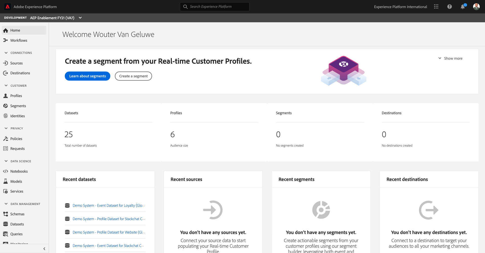

## 7.1.2 - Explore data on the platform

Bringing data from different channels is a tough task for any brand. And in this exercise, Citi Signal customers are engaging with Citi Signal on its website, on its mobile app, purchase data is collected by Citi Signal’s Point of Sale system, and they have CRM and Loyalty data. Citi Signal is using Adobe Analytics and Adobe Launch to capture data across its website, mobile app as well as POS system, so this data is already flowing into Adobe Experience Platform. Let's begin with exploring all the data for Citi Signal that already exists in Adobe Experience Platform.

In the left menu, go to **Datasets**.

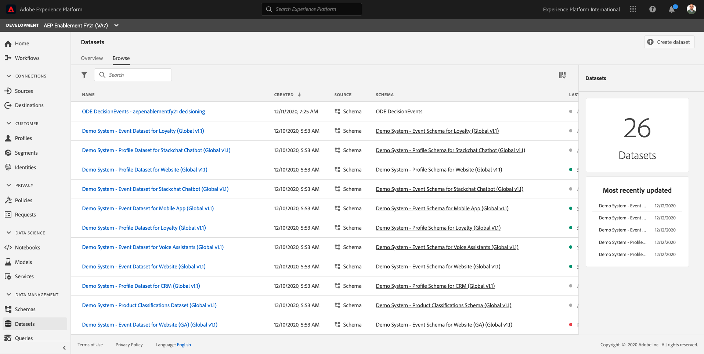

Citi Signal is streaming data into Adobe Experience Platform and this data is available in the `Demo System - Event Dataset for Website (Global v1.1)` dataset. Search for `Demo System - Event Dataset for Website`.

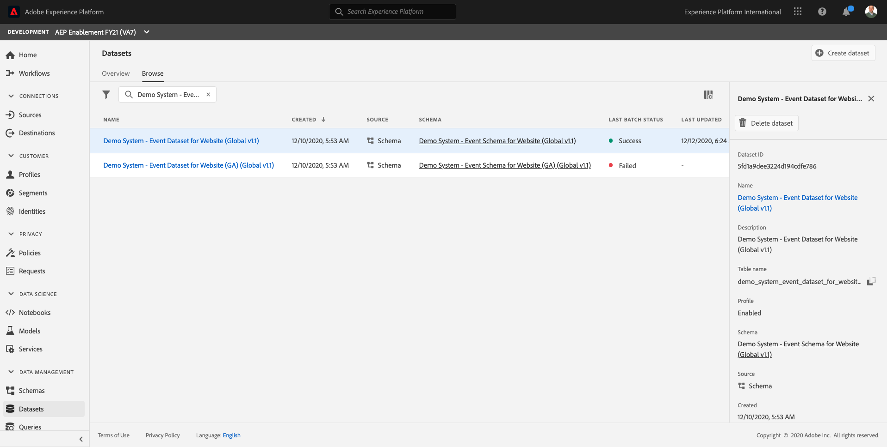

Citi Signal's Callcenter Interaction data is captured in the `Demo System - Event Dataset for Call Center (Global v1.1)` dataset. Search for `Demo System - Event Dataset for Call Center` data in search box. Click on the dataset's name to open it.

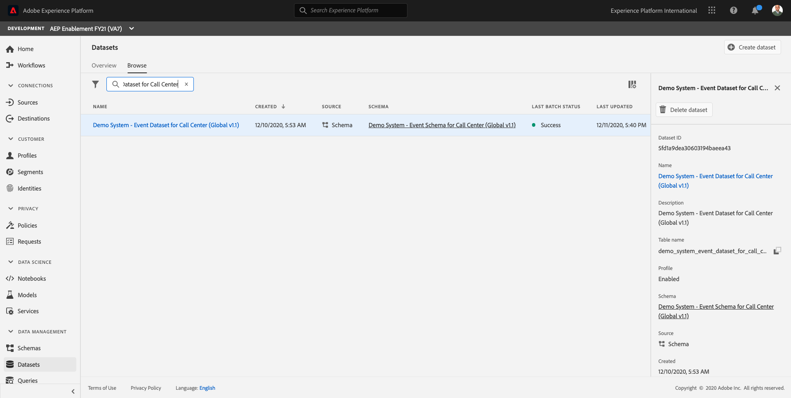

After clicking the dataset, you will get an overview of the dataset activity such as ingested and failed batches.

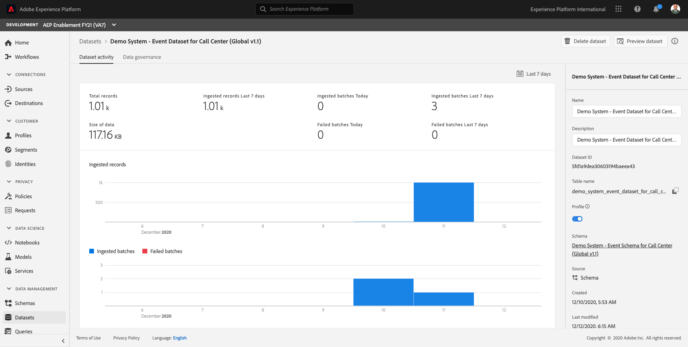

Click on **Preview Dataset** to see a sample of the data stored in `Demo System - Event Dataset for Call Center (Global v1.1)` dataset. The left panel shows schema structure for this dataset.

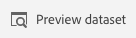

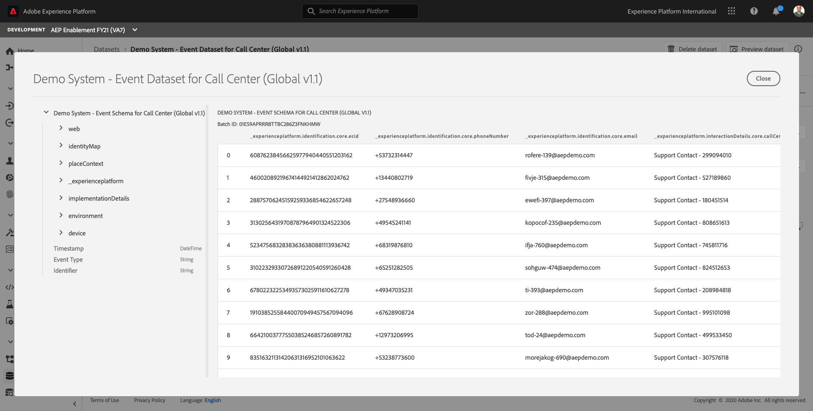

Click the **Close** button to close the **Preview Dataset** window.

## 7.1.3 - Introduction to Query Service

Adobe Experience Platform Query Service is accessed by clicking on **Queries** in the left menu.

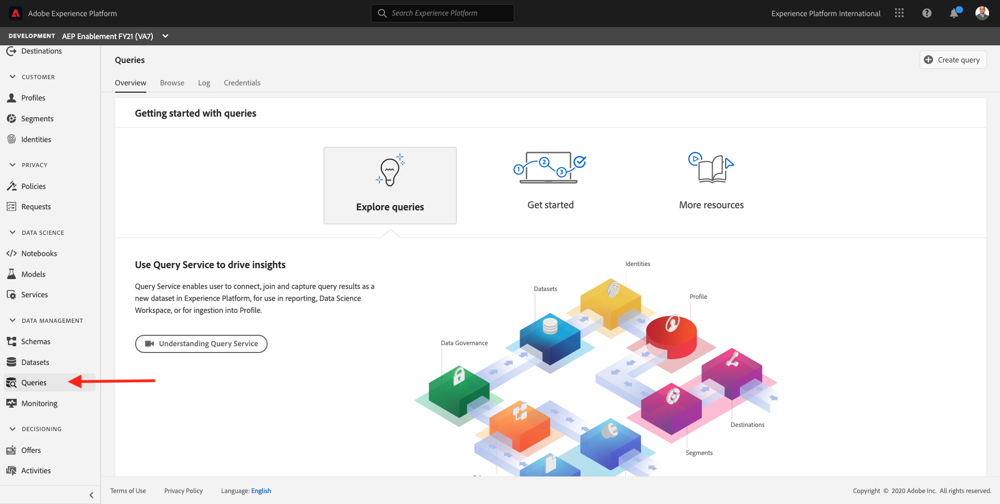

By going to **Log** you'll see the Query List page, which provides you a list of all the queries that have run in this organization, with the latest at the top.

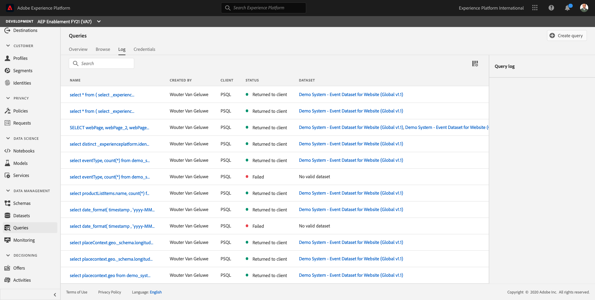

Click on any SQL query from the list and observe the details provided in the right rail.

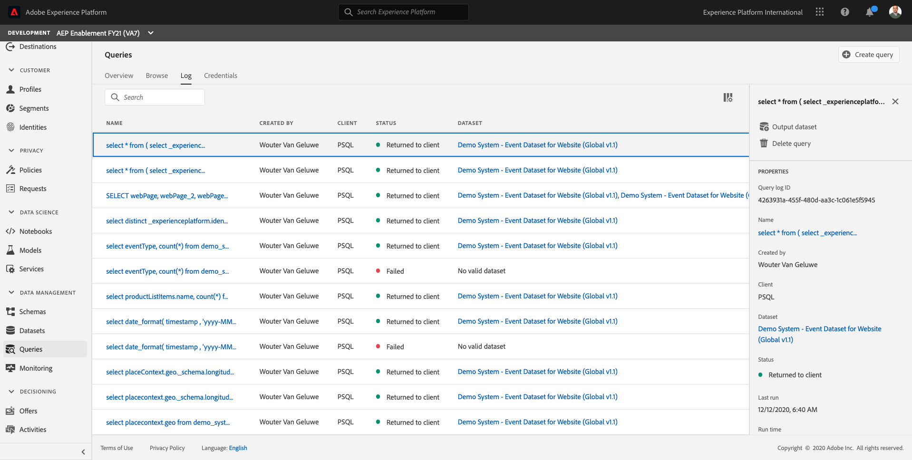

You can scroll the window to see the entire query, or you can click on the icon highlighted below to copy the entire query to your notepad. You do not have to copy the query at this time.

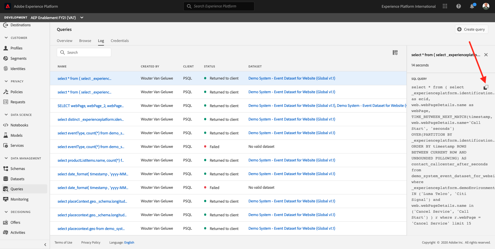

You can't just see the queries that have been executed, this User Interface lets you create new datasets from queries. These datasets can be linked to Adobe Experience Platform's Real-time Customer Profile or can be used as input for Adobe Experience Platform Data Science Workspace.

## 7.1.4 - Connect PSQL Client to Query Service

Query Service supports clients with a driver for PostgreSQL. In this we'll be using PSQL, a command-line interface, and Power BI or Tableau. Let's connect to PSQL.

Click on **Credentials**.

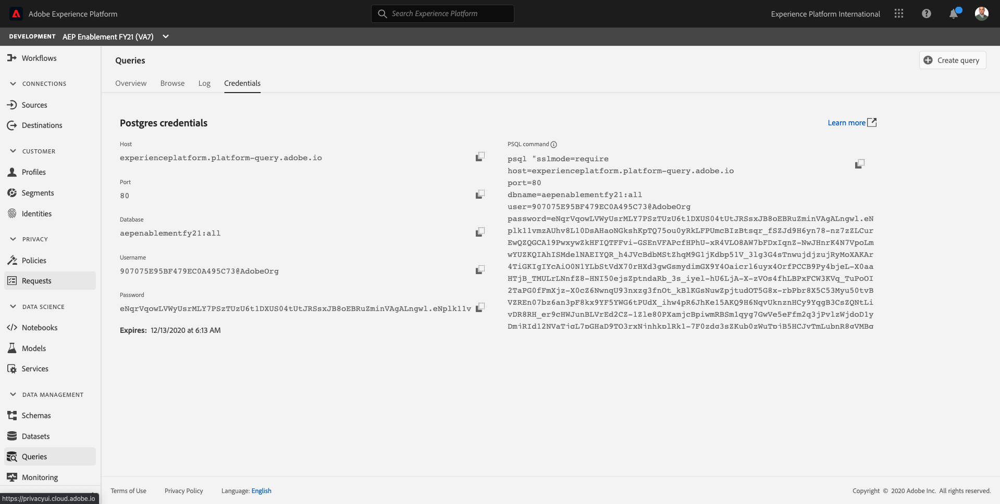

You will see the screen below. The Configuration screen provides server information and credentials for authenticating to Query Service. For now, we will focus on the right side of the screen which contains a connect command for PSQL. Click on the Copy button to copy the command to your clipboard.

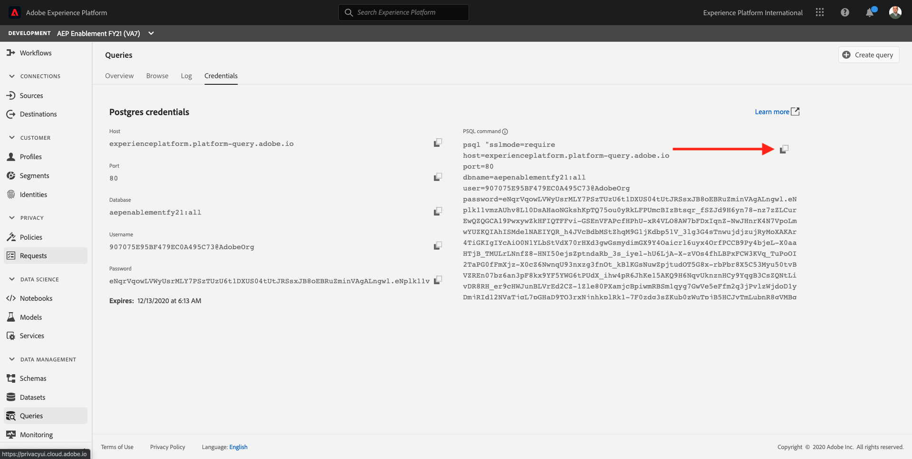

For Windows: Open the command line by hitting the windows key and typing cmd  and then clicking on the Command Prompt result.

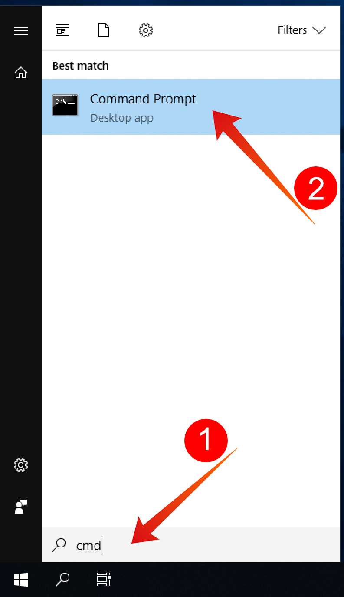

For macOS: Open the terminal.app via spotlight search:

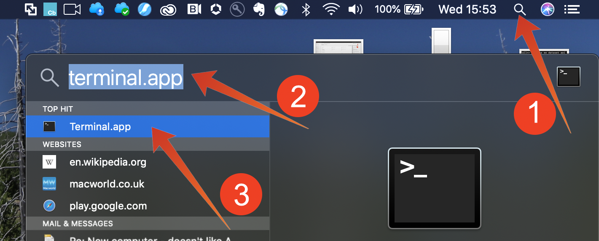

Paste the connect command that you have copied from the Query Service UI and hit enter in the command prompt window:

Windows:

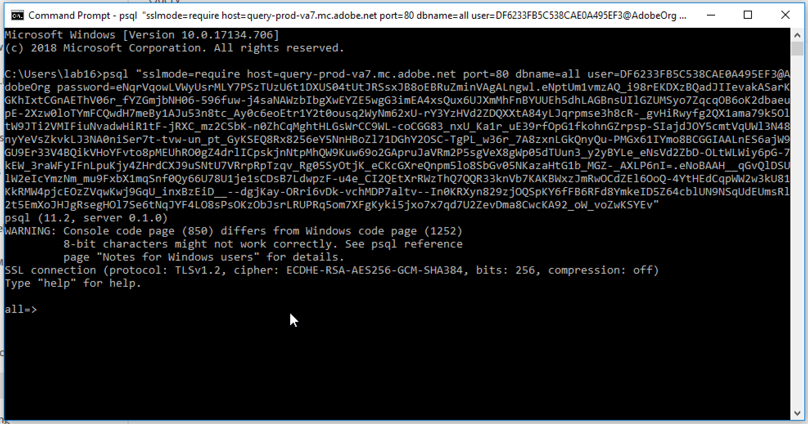

MacOS:

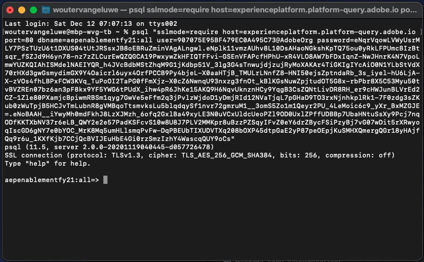

You are now connected to Query Service using PSQL.

In the next exercises, there will be quite some interaction with this window. We will refer to it as your **PSQL command-line interface**.

Now you are ready to start submitting queries!

Next Step: [7.2 - Using the Query Service](./ex2.md)

[Go Back to Module 7](./query-service.md)

[Go Back to All Modules](../../overview.md)
